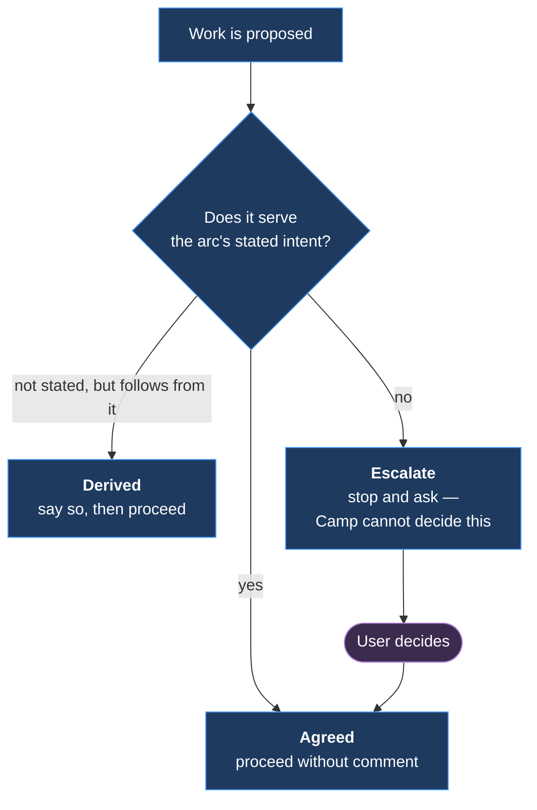

> **Copy — do not edit.** The source is [`skills/arc-intent/SKILL.md`](../../../skills/arc-intent/SKILL.md),
> which is what the plugin ships. This copy exists only so the skill is live in this repo
> before Arc is installed here. **Edit the source, then re-run `tools/sync-local-skills.sh`.**


# Holding the arc's intent

> **Camp's obligation 0.** It fixes the arc's stated destination and tests proposed work
> against it **before** the work is done.

The failure is **development drift**: work that diverges from an arc's intent while each
individual step appears reasonable. By the time it is visible it has been paid for.

| | |
|---|---|
| **Is** | Holding the destination, and evaluating proposed work against it |
| **Is not** | Reading history to locate past errors — the retrospective's job. It never reads the event log |
| **Is not** | Judging whether work is correct, well scoped or well built. Only whether it is *this arc's* work |

**One level above [`relief-valve`](../relief-valve/SKILL.md).** That catches a conversation
gone too deep; this catches work going somewhere the arc did not agree to go.

---

## The intent lives in the `arc-log`

**No new artifact.** Read `docs/arc-log/<current-arc>.md`, and only these two sections:

| Section | Gives |
|---|---|
| **Why this arc exists** | The stated intent — the destination itself |
| **Load-bearing decisions** | What was settled once and applies throughout |

**Read them at the moment the question is asked.** A remembered intent is a second copy, and
the second copy is what drifts.

**If there is no current arc, or it has no `arc-log`, say so and do not classify.** An answer
with no stated intent behind it is the improvisation this obligation exists to prevent —
record `intent-located` as skipped and let the work proceed. Discovery outside an arc is
[m46](../../docs/product-architecture/mechanisms/m46-work-navigation.md)'s, not this.

---

## The ladder



| Level | | Sounds like |
|---|---|---|
| **Agreed** | Serves the stated intent. Proceed without comment | *(nothing)* |
| **Derived** | Off the stated intent, but a reasonable consequence of it. Say so in one line, then proceed | *"Not in the arc's stated scope, but it follows from the close sequence being invariant. Doing it."* |
| **Escalate** | Genuinely outside. Stop and ask | *"This is tracker mechanics and the arc is scoped to Camp. File it and schedule it later, or do it now?"* |

**Three levels, because a binary block gets routed around.** Most real work is a consequence
of the intent rather than a restatement of it, and a two-level ladder calls all of it drift.

### Deciding which — the one test

> **Would *why this arc exists*, as written, have covered this if its author had thought of
> it?**

| | |
|---|---|
| **It is already covered** | **Agreed** |
| **Not written, but admitting it changes nothing in that section** | **Derived** |
| **Admitting it means editing that section** | **Escalate** — and only the user edits it |

**The test is about the written intent, not about whether the work is worth doing.** Good work
that needs the destination moved is still an *escalate*; that is the whole point.

**If the call is genuinely unclear, it is an *escalate*.** An unclear case resolved downward
is silent drift, and this mechanism has exactly one job. Escalating costs one question.

### Escalate never blocks

> **It states the observation and asks. It does not refuse.**

A drift flag raised against a deliberate change of direction is worse than silence, and this
mechanism cannot tell the two apart on its own.

**The user's answer ends it.** Once they say proceed, proceed — no second raising, no
restating the concern in the next message, no re-classifying the same work at the next firing
moment. A flag that survives its own answer is one the proposer learns to route around.

### An override is written down, or it does not survive

**A decision held only in the conversation is re-raised by the next session** — it re-reads
the same `arc-log` and reaches the same *escalate*. The window-bound failure Camp escapes.

> **The override is recorded against the work it admitted**, not as a decision of its own.
> The arc-log row for that issue carries the classification and that the user said proceed.

**Not the load-bearing decisions.** Those are for what constrains *every* issue in the arc —
[`record-route`](../record-route/SKILL.md)'s test — and an override admits one piece of work
without constraining anything. The arc-log's own entry for [#31](https://github.com/Calyx-Engineering/arc/issues/31)–[#35](https://github.com/Calyx-Engineering/arc/issues/35) is the shape:
*classified escalate, and correct to do.*

Routing is `record-route`'s; this skill only says the row is due.

### The intent is user-owned

**Camp cannot revise an arc's intent; only the user can** — which is what makes this a
delegate rather than an observer. The flag cannot be argued away by the thing that proposed
the work.

**An override does not move the destination.** It records that one piece of work was admitted
despite being outside it. Moving the destination is a separate act: the user amends *why this
arc exists*, in a diff.

---

## When it fires

| Moment | Fired by | The question |
|---|---|---|
| **An issue is spawned** | [`decompose`](../decompose/SKILL.md) | Does this belong in the arc, or outside it |
| **An issue closes · a PR opens** | [`issue-write`](../issue-write/SKILL.md), inside [close-sequence](../../docs/product-architecture/close-sequence.md) step 5 | Is what this delivers the work the arc asked for |
| **The user asks** | [`camp`](../camp/SKILL.md) | Always available |
| **The relief valve fires on depth** | [`relief-valve`](../relief-valve/SKILL.md) | Direction and depth, asked together |

**The relief-valve pairing shares one trigger.** Excessive depth is commonly a symptom of
drift — questioning escalates because the direction has stopped being clear. One precondition
serves both, so there is no second over-firing budget to tune.

There, the classification **tunes the nudge rather than gating it**, and
[`relief-valve`](../relief-valve/SKILL.md) owns what each strength sounds like. **A fired
precondition always produces a nudge** — an *escalate* makes it strong, never silent, and
never a stop.

---

## The report

Every classification is reported, **including *agreed*** — an obligation that only speaks on
escalate is indistinguishable from one that never ran. Format:
[`camp-reports.md`](../../docs/product-architecture/camp-reports.md).

```text
**Camp here —** #56 spawned.
  Checked: arc intent, load-bearing decisions — derived
  Reason: the agreement is Camp's artifact; stripping it serves the arc's stated intent
```

At `quiet` only an *escalate* surfaces, and every level still reaches the event log.

---

## Worked case

[#31](https://github.com/Calyx-Engineering/arc/issues/31) · [#32](https://github.com/Calyx-Engineering/arc/issues/32) · [#33](https://github.com/Calyx-Engineering/arc/issues/33) · [#34](https://github.com/Calyx-Engineering/arc/issues/34) · [#35](https://github.com/Calyx-Engineering/arc/issues/35) — five issues about how issues and chat responses are written,
filed during an arc scoped to Camp. **Escalate**; the user said proceed; they were scheduled
as wave 5 and never raised again.

**A blocking mechanism would have produced the wrong outcome here**, and that is the whole
argument for asking rather than refusing.

---

## What this cannot do

> **A skill the agent invokes is self-detection, and work that has drifted is work the agent
> already believes is reasonable.**

Three of the four call sites fire from a mechanical moment rather than from self-awareness,
which limits this without removing it. The independent observer that would remove it is
deferred at the same cost as [`relief-valve`](../relief-valve/SKILL.md)'s.

---

## Related

- [m43 §3.1](../../docs/product-architecture/mechanisms/m43-camp-assistant.md) — the specification
- [`camp`](../camp/SKILL.md) — the persona and the entry point
- [`relief-valve`](../relief-valve/SKILL.md) — the precondition this shares
- [m41](../../docs/product-architecture/mechanisms/m41-relief-valve.md) — the conversational drift one level below this
