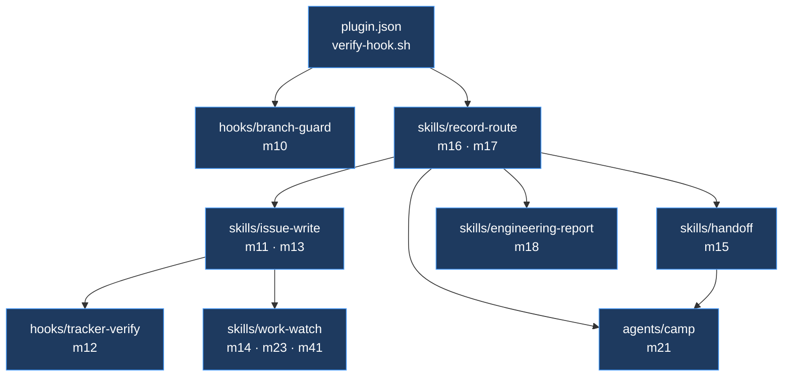
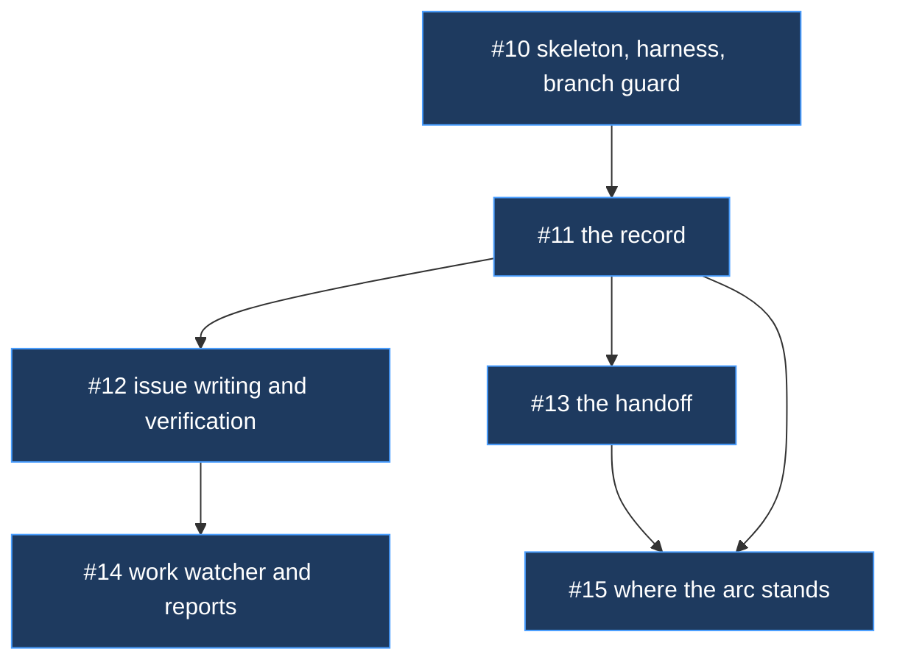

# Arc: the working foundation

> **Arc log**, not a spec. The spine above the per-issue [dev-logs](../dev-log/) — it holds
> what spans issues. Each issue keeps its own dev-log for its own *why*; this file is the
> shared north star and the live map.

**Milestone:** [Foundation — pass 1](https://github.com/Calyx-Engineering/arc/milestone/3)  ·  **Branch:** `arc/02-foundation`  ·  **Started:** 2026-08-17

## Why this arc exists

Arc 01 defined the product — six pieces, 29 mechanisms, 24 artifacts, a roadmap, and a spec
for nearly every mechanism. **Nothing functional existed.** No `plugin.json`, no hooks, no
skills.

This arc builds the parts that make Arc usable on real hardware work: `git clone`, install
the plugin, start an arc, work an issue, and have the branch guard stop a wrong-branch edit,
the issue skill verify a tracker write actually landed, and the record survive a cold start.

**That bar is the gate for real use.** Everything after it is improvement on a working base.

## Target architecture



## Load-bearing decisions

**The order is dependency, not value.** `record-route` precedes everything downstream
because everything downstream writes to K1.

**One check, not three.** The branch guard ships the branch check only. Worktree identity
and base freshness have no precedent and are follow-ups — one working check beats three
half-finished.

**A hook is written from the template, verified by script, one per commit.** The design goal
is that a mistake is survivable, not that mistakes are prevented by review skill. Full
reasoning in [m10](../product-architecture/mechanisms/m10-branch-guard.md#safe-hook-development).

**A closing keyword does not bind on a PR into an arc branch.** Isolated during this arc —
see Related analysis. Issue PRs into `arc/02-foundation` report success and link nothing;
the issues close when the arc PR into `main` merges.

**Guided is pass 1's only mode.** The autonomy switch matters when both modes exist.

**Self-improvement is pass 2** — same milestone, after pass 1 is usable.

## The tree

Planned issues only so far. Nothing has been spawned by the work yet.



## Status

| Issue | Dev-log | Status |
| :--- | :--- | :--- |
| [#10](https://github.com/Calyx-Engineering/arc/issues/10) skeleton, harness, branch guard | [issue-10-skeleton](../dev-log/issue-10-skeleton.md) | merged to arc — [PR #20](https://github.com/Calyx-Engineering/arc/pull/20) |
| [#11](https://github.com/Calyx-Engineering/arc/issues/11) the record | [issue-11-record](../dev-log/issue-11-record.md) | merged to arc — [PR #21](https://github.com/Calyx-Engineering/arc/pull/21) |
| [#12](https://github.com/Calyx-Engineering/arc/issues/12) issue writing and verification | [issue-12-issue-write](../dev-log/issue-12-issue-write.md) | merged to arc — [PR #22](https://github.com/Calyx-Engineering/arc/pull/22) |
| [#13](https://github.com/Calyx-Engineering/arc/issues/13) the handoff | [issue-13-handoff](../dev-log/issue-13-handoff.md) | merged to arc — [PR #23](https://github.com/Calyx-Engineering/arc/pull/23) |
| [#14](https://github.com/Calyx-Engineering/arc/issues/14) work watcher and reports | [issue-14-work-watch](../dev-log/issue-14-work-watch.md) | merged to arc — [PR #24](https://github.com/Calyx-Engineering/arc/pull/24) |
| [#15](https://github.com/Calyx-Engineering/arc/issues/15) where the arc stands | — | **closed, superseded by [#27](https://github.com/Calyx-Engineering/arc/issues/27)** |

**Order is discovered, not planned** — but this arc is the exception that proves it. Pass 1
is dependency-ordered up front because the artifacts genuinely block each other, and that
ordering is recorded above as a load-bearing decision rather than as waves.

## Related analysis

- [closing keywords and the base branch](../arc-work/02-foundation/closing-keywords-and-base-branch.md) — why `Closes #NN` binds on a PR into `main` and not into an arc branch

## What the arc PR must do

**Five issues are still open.** Every issue PR here carried a `Closes` line that could not
bind, per the decision above. The arc PR into `main` is the only place they close, and it
needs a line for each:

```text
Closes #10
Closes #11
Closes #12
Closes #13
Closes #14
```

Verify with `gh pr view <N> --json closingIssuesReferences` after opening it. On that PR an
empty array is a real bug — it is the one base where the keyword can bind.

## Future capabilities — designed for, not in scope

**Pass 2 — self-improvement.** Session preservation, transcript mining, the improver agent.
Same milestone, after pass 1 is usable. The seam that keeps it cheap: every artifact here
carries its mechanism number in its own header, so the miner can route a finding to an owner
without a central registry.

**Worktree and base-freshness checks.** `hooks/branch-guard` is written so a second and
third check are added branches in one `case`, not a second hook.

## What this arc learned

**A closing keyword cannot bind on a PR into an arc branch.** Isolated here by direct
comparison, after being raised repeatedly and dismissed. Three workarounds were tested and
ruled out; the fix is [m42](../product-architecture/mechanisms/m42-default-branch-flip.md),
which was written during this arc rather than after it.

**The record loop closed inside one arc.** The base-branch finding was written to K2 during
#11 and changed #12's design before it was built. First evidence the ladder does what it
claims.

**Two cold starts proved the handoff and found a real gap** — the reading order pointed at a
dev-log that does not exist until work starts. Fixed and re-tested during the same issue.

**#15's scope was wrong, and reconvening caught it.** *Something to ask where the arc stands*
turned out to be a delivery-lead personality with five obligations and an operating
agreement. Superseded by [#27](https://github.com/Calyx-Engineering/arc/issues/27) and
[m43](../product-architecture/mechanisms/m43-camp-assistant.md).

**Nothing spawned.** Six issues, planned up front, executed in order — which is itself a
result about how this arc ran, per m21's execution axis.

## At arc close

- [ ] Status table reflects reality
- [ ] Tree regenerated
- [ ] K2 and K3 swept — durable product facts graduated to the wiki
- [ ] Soak line appended for every plugin change made during this arc
