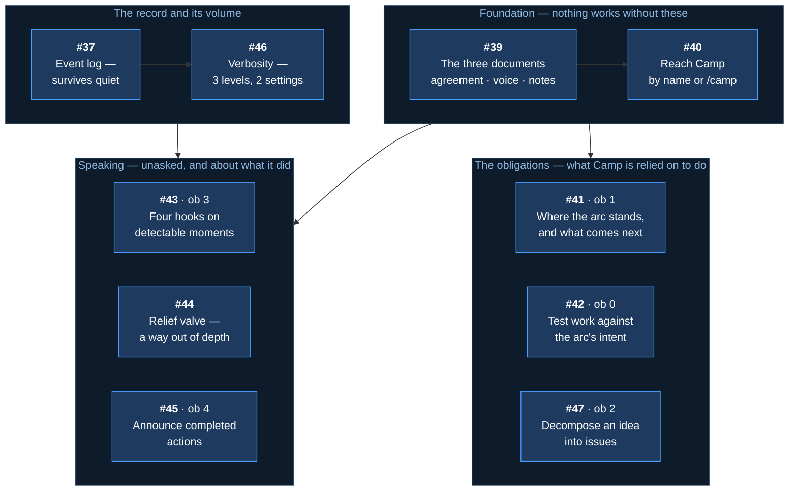
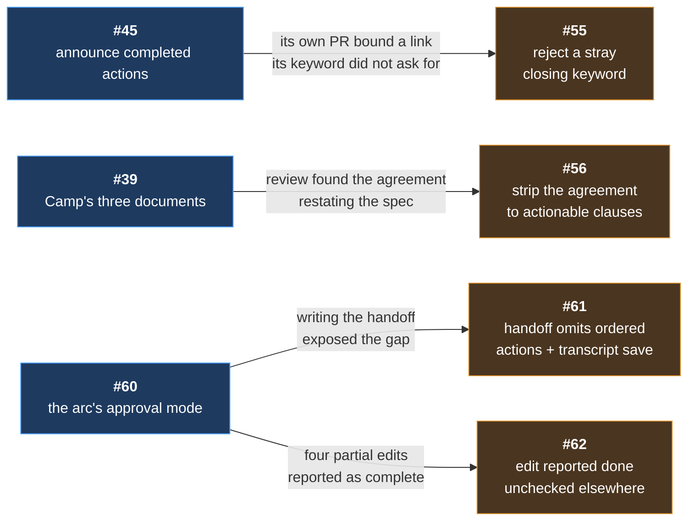
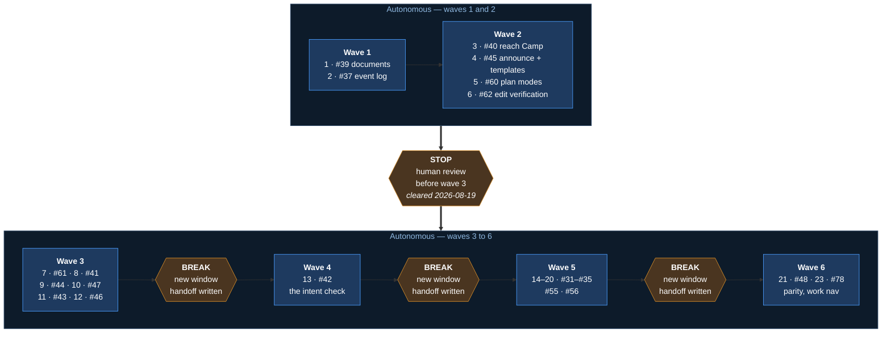
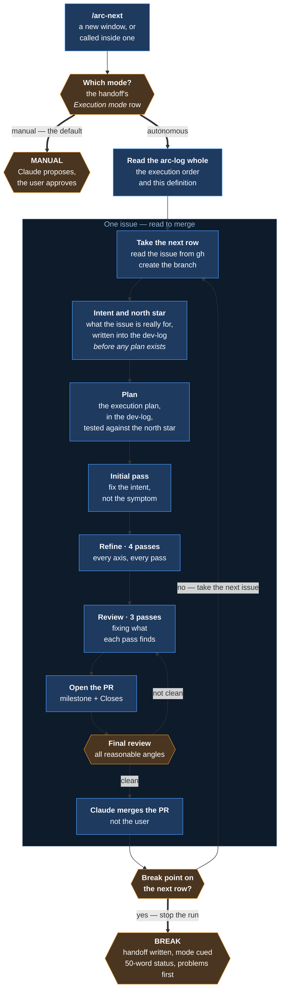

# Arc: Camp, and the tracker fixes

> **Arc log** — the spine above the per-issue [dev-logs](../dev-log/). It holds what spans
> issues: why this arc exists, what was decided once and applies throughout, and where the
> work stands.

**Milestone:** [Arc 03 — Camp and the linking fix](https://github.com/Calyx-Engineering/arc/milestone/4) · **Branch:** `arc/03-camp` · **Started:** 2026-08-18

---

## 1 In one minute

**Camp is the spine window made portable** — the role that holds an arc's plan and tracks
which issue is active, backed by committed documents instead of a VS Code window that has to
stay open.

| | |
|---|---|
| **New issues** | [#39](https://github.com/Calyx-Engineering/arc/issues/39)–[#47](https://github.com/Calyx-Engineering/arc/issues/47), nine of them, plus [#48](https://github.com/Calyx-Engineering/arc/issues/48) last. Four more spawned during execution — see the tree |
| **Already filed** | [#37](https://github.com/Calyx-Engineering/arc/issues/37) the event log · [#31](https://github.com/Calyx-Engineering/arc/issues/31)–[#35](https://github.com/Calyx-Engineering/arc/issues/35) tracker mechanics · [#55](https://github.com/Calyx-Engineering/arc/issues/55) · [#56](https://github.com/Calyx-Engineering/arc/issues/56) spawned mid-arc |
| **Build order** | See §10 *Status — execution order*. Numbered 1–25. **22 was vacant while [#73](https://github.com/Calyx-Engineering/arc/issues/73) was out of the arc; it returned and reclaimed the slot** |
| **Autonomous** | Every wave. The modes are defined in §6 and assigned in §10.1. **Breaks at wave boundaries are context, not approval.** Step 10 needs `.claude/settings.json` — §6.1.1 |
| **Waves 1–5** | **Done and merged.** Wave 6 is [#48](https://github.com/Calyx-Engineering/arc/issues/48) · [#73](https://github.com/Calyx-Engineering/arc/issues/73) · [#78](https://github.com/Calyx-Engineering/arc/issues/78) · [#119](https://github.com/Calyx-Engineering/arc/issues/119) · [#120](https://github.com/Calyx-Engineering/arc/issues/120) — **the last two are review and release, not build** |
| **After wave 5** | Four no-issue PRs — [PR #107](https://github.com/Calyx-Engineering/arc/pull/107) [PR #108](https://github.com/Calyx-Engineering/arc/pull/108) [PR #110](https://github.com/Calyx-Engineering/arc/pull/110) [PR #113](https://github.com/Calyx-Engineering/arc/pull/113) — and [#105](https://github.com/Calyx-Engineering/arc/issues/105) · [#106](https://github.com/Calyx-Engineering/arc/issues/106) filed **out of** the arc. See §12.2 |
| **Friction with Arc itself** | Goes in [`docs/arc-work/03-camp/friction-log.md`](../arc-work/03-camp/friction-log.md), **as it happens**. Read in by the retrospective at the end; it does not replace one. Governed by a switch in Camp's operating agreement, **on in this repository and off everywhere else** — [#98](https://github.com/Calyx-Engineering/arc/issues/98) |
| **Not in this arc** | The monitoring agent · onboarding · mined thresholds |

**The one thing to check:** the spec-to-issue table below. Every section of m43 appears
exactly once, so a gap there is a feature nobody is building.

---

## 2 Why this arc exists

Arc's workflow depends on one VS Code window holding the plan and tracking which issue is
active. That window is fragile — close it, switch branches, or move to another repo and the
orchestration is gone.

**Camp is that role, made portable.** The same job, held by an addressable persona backed by
committed documents instead of by a window that has to stay open.

Two failures follow from having no such role:

| | |
|---|---|
| **Work drifts from the arc's intent** | Every step looks reasonable; nothing holds the destination and tests proposed work against it |
| **Arc's operation is invisible** | A tool that cannot be observed cannot be evaluated — and produces no improvement signal |

**The bar:** Camp is what turns using Arc on real hardware work into an evaluation rather than
just use.

---

## 3 What the decomposition produced

Nine new issues, plus one already filed and five carried in from the tracker work spawned
during scoping.

---

## 4 Every spec section, and the issue that delivers it

**Read this table to check nothing was dropped.** Every numbered section of
[m43](../product-architecture/mechanisms/m43-camp-assistant.md) appears exactly once.

| m43 § | What it defines | Issue |
|---|---|---|
| §2 · §6 | The persona, its voice, how it is reached | [#40](https://github.com/Calyx-Engineering/arc/issues/40) |
| §3.1 | **The intent check** — hold the arc's intent, the authority ladder | [#42](https://github.com/Calyx-Engineering/arc/issues/42) |
| §3.2 | **Status and flow** — status, and the close/start sequence run the same way every time | [#41](https://github.com/Calyx-Engineering/arc/issues/41) |
| §3.3 | **Decomposition** — decomposition | [#47](https://github.com/Calyx-Engineering/arc/issues/47) |
| §3.4 | **The nudge** — the event half, four hooks | [#43](https://github.com/Calyx-Engineering/arc/issues/43) |
| §3.5 | **The report** — announcing completed actions, and the templates that make future artifacts do the same | [#45](https://github.com/Calyx-Engineering/arc/issues/45) |
| §3.6 | The relief valve — the conversational half | [#44](https://github.com/Calyx-Engineering/arc/issues/44) |
| §5 | The three documents and their ownership | [#39](https://github.com/Calyx-Engineering/arc/issues/39) |
| §7 | Verbosity — three levels, two settings | [#46](https://github.com/Calyx-Engineering/arc/issues/46) |
| §8 · [m44](../product-architecture/mechanisms/m44-event-log.md) | The event log, independent of verbosity | [#37](https://github.com/Calyx-Engineering/arc/issues/37) |
| §11 | Onboarding | **Backlogged** — not this arc |
| §12 | Named gaps | **Open by design** — see below |
| — | Repo hygiene: shipping skills match their local copies | [#48](https://github.com/Calyx-Engineering/arc/issues/48) · [#68](https://github.com/Calyx-Engineering/arc/issues/68) |

### 4.1 Carried in from scoping

Five issues spawned by friction observed while writing the spec. Tracker mechanics, not Camp —
classified *escalate* under the intent check's own ladder, and correct to do. **Scheduled as wave
5**, issues 11 through 15.

Two more were spawned later, by the work itself — see below.

| Issue | |
|---|---|
| [#31](https://github.com/Calyx-Engineering/arc/issues/31) | Say what a branch or setting **is** when naming it |
| [#32](https://github.com/Calyx-Engineering/arc/issues/32) | Size an issue title to what merging delivers |
| [#33](https://github.com/Calyx-Engineering/arc/issues/33) | A repeatable loop for scoping an involved piece of work |
| [#34](https://github.com/Calyx-Engineering/arc/issues/34) | Numbered questions in a multi-topic reply |
| [#35](https://github.com/Calyx-Engineering/arc/issues/35) | Keep the issue checklist current as working state |

**What each of these traces to is §9**, beside the execution order.

### 4.2 Spawned during execution

**Found by building the arc, not by planning it.** Each names the issue whose work exposed it.
[#55](https://github.com/Calyx-Engineering/arc/issues/55) and [#56](https://github.com/Calyx-Engineering/arc/issues/56)
are tracker and document mechanics, so they join wave 5. The three below block work in progress
and are scheduled where they are needed.

| Issue | | Spawned by | Why it exists |
|---|---|---|---|
| [#55](https://github.com/Calyx-Engineering/arc/issues/55) | Reject a closing keyword written anywhere but a body's last line | [#45](https://github.com/Calyx-Engineering/arc/issues/45) | Its PR heading bound a link the body's `Refs` did not ask for. The trap is documented in `skills/issue-write`; no check derives from it |
| [#56](https://github.com/Calyx-Engineering/arc/issues/56) | Strip the operating agreement to clauses a user can act on | [#39](https://github.com/Calyx-Engineering/arc/issues/39) | Sections 1, 2 and 6 restated m43 — rationale a user cannot act on, in a document that exists to record deviation |
| [#60](https://github.com/Calyx-Engineering/arc/issues/60) | State the arc's approval mode and where a window breaks | The stop review | The plan named no mode the arc actually ran in, and said nothing about surviving one context window. **Wave 2.3** |
| [#61](https://github.com/Calyx-Engineering/arc/issues/61) | The handoff omits the next session's ordered actions and the transcript save | [#60](https://github.com/Calyx-Engineering/arc/issues/60) | `skills/handoff` says nothing about the prompt that starts the next chat, so the prompt duplicated the handoff. **Wave 3.1** |
| [#62](https://github.com/Calyx-Engineering/arc/issues/62) | An edit is reported done without checking everywhere the claim appears | [#60](https://github.com/Calyx-Engineering/arc/issues/60) | One claim lives in a table, a diagram label and a summary row. Editing one and reporting done left the others contradicting it, four times consecutively. **Wave 2.4** |
| [#98](https://github.com/Calyx-Engineering/arc/issues/98) | A friction log for the arc, and the switch that enables it | [#32](https://github.com/Calyx-Engineering/arc/issues/32) | The autonomous loop's merge step was blocked on two consecutive issues and the wrong cause was recorded both times. Nothing in the ladder held *friction with the tooling*, so it was on its way to being lost until a retrospective mined it back |
| [PR #100](https://github.com/Calyx-Engineering/arc/pull/100) | The autonomy switch's missing half — the permission allow-list, and the failure path for step 10 | [#98](https://github.com/Calyx-Engineering/arc/issues/98) | Writing the friction log found the cause of its own first entry: autonomous mode was declared in a document the harness never reads. **No issue** — branch to PR directly |
| [PR #107](https://github.com/Calyx-Engineering/arc/pull/107) | A spec names the artifacts that implement it | [#105](https://github.com/Calyx-Engineering/arc/issues/105) | Four mechanisms pointed at nothing from the skill implementing them, each found only when something edited the pair together. **No issue** |
| [PR #108](https://github.com/Calyx-Engineering/arc/pull/108) | A no-issue branch carries its PR number | The user | Three no-issue branches in one session, none with a number. m46 §9 required one and nothing routed anyone to it. **No issue** |
| [PR #110](https://github.com/Calyx-Engineering/arc/pull/110) | The branch-naming flow, drawn and corrected | [PR #108](https://github.com/Calyx-Engineering/arc/pull/108) | Drawing the flow exposed that [PR #108](https://github.com/Calyx-Engineering/arc/pull/108) had not followed the process it wrote. **No issue** |

---

## 5 Build order

Dependency, not value. **The most valuable issue is frequently the one that cannot start.**

**Why the intent check is late despite being the priority.** It cannot evaluate direction without
knowing where work stands ([#41](https://github.com/Calyx-Engineering/arc/issues/41)), and its
fourth firing moment is the relief valve
([#44](https://github.com/Calyx-Engineering/arc/issues/44)). Building it first would mean
building it twice.

---

## 6 How this arc is executed

**Not only what gets built — how.** An arc run autonomously and an arc run beside a human are
different plans, and the difference belongs here rather than in a chat message.

**Three modes, and the difference is who reviews the wave's work.**

| Mode | Who reviews, and when |
|---|---|
| **Per step** | The user approves after each issue. They start it, Claude runs one issue, they review it |
| **Per wave** | The user approves at the end of the wave. They start it, Claude runs the wave, they review it in detail |
| **Autonomous** | Claude does not wait for approval. It runs the wave, and performs the review at the end of it |

**Which mode each wave runs in is recorded once, in §10.1** — beside the description of what
that wave is. It is not repeated here, because two tables of wave modes drift.

**Why this arc runs autonomously throughout.** The spec exists and the foundation was proven
at the stop, so execution does not need step-by-step approval.

**The stop is the point.** Sixteen issues run unattended ends in either a good arc or sixteen
PRs on a wrong foundation, and the second is not visible until it is expensive. The numbered
table under §10 *Status — execution order* marks where it is.

### 6.1 Autonomous mode — what it actually means

> **Manual is the default.** Autonomous is entered only by an explicit instruction from the
> user, or by the handoff naming it. Absent either, Claude proposes and waits for the user.

**In autonomous mode, Claude reads this arc-log whole** — not the section that looks relevant. The
§10 *Status — execution order* table is the work queue, and it is followed top to bottom.

**And the spec of the mechanism the issue traces to.** Every piece of work in this repo traces
back to a mechanism, and a fair number of those have a written spec. An issue's intent is not
recoverable from its own body when the body assumes that spec.

| | |
|---|---|
| **Where the mapping is** | §9 *What each issue traces to* — every issue in the arc, ordered by number |
| **Where the spec is** | [`docs/product-architecture/README.md`](../product-architecture/README.md)'s registry — the mechanism's row carries its spec link, or a dash where none exists |
| **When** | Once, when the issue is picked up. Not once per window, and not m43 by default |
| **A dash is not a gap to fill** | Read the artifacts the issue names instead |

**m43 is read whole only when the issue traces to it.** Wave 5 is what proves the point: eight
of its nine issues trace to m11, m12, m13, m38 or m45, and reading m43 for them costs a
thousand lines and returns nothing.

#### 6.1.1 One issue, start to merge

| | |
|---|---|
| 1 | **Read the issue from `gh`** — the one the execution order names, not the one that seems next |
| 2 | **Create the branch** — `arc/<nn>-<slug>-issue-<NN>-<slug>`. **Work with no issue takes the other form**, `-pr<NN>-`, and `tools/new-direct-pr.sh` does it in one command ([m46 §9](../product-architecture/mechanisms/m46-work-navigation.md)) |
| 3 | **Establish the issue's intent and its north star, in the dev-log — before any plan exists.** Two passes, below. A plan written first steers by the issue's wording instead |
| 4 | **Write the execution plan in the dev-log**, tested against the north star above |
| 5 | **Implement the initial pass** — fix the intent, not the symptom it happens to describe |
| 6 | **Refine four times** — the axes are below |
| 7 | **Final review, iterated three times**, fixing what each pass finds |
| 8 | **Open the PR** — the north star from step 3 goes in the body **verbatim**, so step 9 tests the diff against it rather than re-deriving it |
| 9 | **One more review, from every reasonable angle** — and against the north star in the body. If the diff does not reach it, the issue is not done |
| 10 | **Claude merges the PR** — not the user. Only when satisfied, everything resolved, everything clean. **If the merge is denied, retry once, then hand it over and say what was tried** — see the prerequisite below |
| 11 | **Continue to the next row, or stop** — whichever the execution order says |

**Autonomous mode has a prerequisite this arc-log cannot satisfy by declaring it.** Merging a
PR is an outward-facing, hard-to-reverse action, and the standing rule is to confirm first
*unless durably authorized*. **A markdown file is not authorization** — the harness never
reads it. Step 10 was reached three times and executed zero times before
`.claude/settings.json` carried a `permissions.allow` list for `gh pr merge`, `gh pr create`
and `git push`.

| | |
|---|---|
| **The user writes that file, not Claude** | `CLAUDE.md` says `settings.json` outside the hooks block is never edited autonomously, and an agent that can widen its own permissions has no switch at all |
| **Where the evidence is** | [`arc-work/03-camp/friction-log.md`](../arc-work/03-camp/friction-log.md) entries 1 and 2 |
| **Where the durable version goes** | m40, via [#73](https://github.com/Calyx-Engineering/arc/issues/73). *The agent cannot install its own switch* is a design constraint m40 does not yet state |

#### 6.1.2 Establishing the intent — two passes

**One pass produces a paraphrase of the title.** The second is where the intent appears.

| Pass | Reads | Writes into the dev-log |
|---|---|---|
| **1** | The issue body alone, and any verbatim quote it carries | The problem in one sentence, and a first north star |
| **2** | Every issue it links to, the spec of the mechanism it traces to, and every artifact it names | **What changed from pass 1** — and if nothing changed, that it did not |

**Not every mechanism has a spec.** The registry's *Spec* column carries a dash where none is written — m40 is the example. Pass 2 then reads the artifacts the issue names instead. An absent spec is not a gap to hunt for.

**The verbatim quote is the intent.** Where an issue carries one — most of this arc's do — the
north star is tested against the quote, never against the title.

**Fire `skills/arc-intent` here.** It classifies proposed work Agreed, Derived or Escalate
against the arc's stated intent, and this is its call site in the loop. An *escalate* is not a
stop; it is a thing to say plainly in the dev-log and in the PR body.

| The north star must | |
|---|---|
| **Say something the title does not** | A restatement means the issue was read, not understood |
| **Name what makes the fix durable** | What it has to survive — a reworded heading, a fresh session, a different repository |
| **Name what is out of scope** | Four refining passes will otherwise grow the work into whatever looks adjacent |

#### 6.1.3 A spec you touch names the artifacts that implement it

**The skill-to-spec direction gets written; the reverse does not.** m41, m15, m13 and m46 each
pointed at nothing from the mechanism their skill carries, and each was found only when
something happened to edit the pair together.

| | |
|---|---|
| **Touching a spec means fixing its `Related`** | Name the skill, hook or tool that implements it — not only the neighbouring mechanisms |
| **Top or bottom, never the middle** | m21's sits mid-document with a section after it, which reads as the end |
| **Do not sweep specs outside the issue's scope** | A spec you are not otherwise editing is [#105](https://github.com/Calyx-Engineering/arc/issues/105)'s work, not this issue's. Naming the gap is enough |

[`spec-interview`](../../skills/spec-interview/SKILL.md) carries the same rule for a spec being
written from scratch.

#### 6.1.4 The refining axes

**Read the dev-log before each pass** — the north star and the plan, as written, never as remembered. An axis answered from memory drifts with the work it is meant to check.

| |
|---|
| Does this reach the north star recorded in the dev-log? |
| Does this make skills or other artifacts larger than they should be? |
| Can it be trimmed without sacrificing performance? |
| Is there anything new that needs inventing to make this work better? |
| Have references to every modified file been checked? |
| Is it consistent with every file in the repo? |
| Are there other files that should be touched to make this work better? |
| Am I on topic? |
| Are there tests that need writing to evaluate this? |
| Have all evaluating tests been run? |

#### 6.1.5 Commit cadence

**Over-committing bloats the log and the tree.** Commit at least once for the plan, once for
the initial implementation, and once per refinement and review loop.

#### 6.1.6 At a break point

A break marked in the execution order **stops autonomous execution.** In order:

| | |
|---|---|
| 1 | Write the updated handoff |
| 2 | **Re-evaluate it** — it must cue the next `/arc-next` into **the mode §10.1 assigns the next wave**, not whatever mode this window happened to run in, and initialise enough state for the next window to continue from §10 |
| 3 | A status update of **50 words or less** on issues and merges, **leading with any problem** |

### 6.2 What is least certain, and why

| | |
|---|---|
| **Skills cannot be executed here** | Nothing in this repo runs a skill. A session writes one, checks it against the spec diagram, and marks it done — with no evidence it *behaves* right. True of every skill Arc has shipped |
| **The intent check is judgement** | *"Does this serve the arc's intent"* has no mechanical test. It will build; whether it fires usefully is unknown until used. §6.1.2 makes the autonomous loop fire it on every issue, which is the first real exercise it gets |
| **The relief valve's thresholds are estimates** | 8 turns, 3 questions, 45 minutes. Placed so the mechanism is buildable, corrected by [#36](https://github.com/Calyx-Engineering/arc/issues/36) |
| **The close sequence is unproven** | [#41](https://github.com/Calyx-Engineering/arc/issues/41)'s nine steps were written from informal practice. Executing it will find gaps the spec side could not see |
| **Degradation is observed, not forecast** | A session at this point lost the ability to follow direction: it went autonomous against instruction and reported an issue number that was never created. Recovery was the user escaping out. **Hand off at a wave boundary before the middle of a wave, not after** |

**Autonomy is per-arc, not per-repo** — [m40](../product-architecture/mechanisms/m40-autonomy-switch.md).
The mode above is this arc's, decided from how specified the work is.

**m40 is now specified, and it supersedes §6.1.** [#73](https://github.com/Calyx-Engineering/arc/issues/73)
returned to this arc and delivered the spec and
[`skills/autonomy-set`](../../skills/autonomy-set/SKILL.md). **Read m40 first from here on**;
§6.1 stays only because this arc's issues were executed under it and the record must say what
they ran on.

**What changed, and it is not cosmetic.** §6.1 has two states; m40 has three. The third —
**autonomous, suspended** — is what an exchange looks like when the user is talking rather than
the plan executing: the mode stays set, nothing is committed, pushed or merged as a side effect
of answering, and it resumes when the user points back at the work. §6.1 could not express
that, so a conversation during an autonomous run either got ignored or ended the run.

**And the mode is state, not memory.** It lives in `HANDOFF.md`'s *Execution mode* row and is
re-read before a commit, a push or a merge — never recalled. §6.1 declared the mode in this
file, which the harness never reads and a session forgets.

---

## 7 Load-bearing decisions

Settled during scoping. **These apply across every issue in the arc.**

| | |
|---|---|
| **Camp is documents, skills and hooks — not an agent** | Continuous conversation reading is the one form Arc cannot afford. Only the nudge's conversational half needs it, and that half ships as a skill |
| **Camp owns no arc state** | m15 owns the handoff, m17 the logs, m21 the tree. Camp reads them and fires them; it authors none of them |
| **Obligations and memory never merge** | The agreement is what Camp must do (user-owned). Notes are what Camp learned (Camp's own). Merging them lets learning silently rewrite obligations |
| **The goal is user-owned** | Camp evaluates work against the arc's intent and cannot revise that intent |
| **Camp proposes; it never executes** | It names what is required. The main thread acts, after the user approves |
| **A fired precondition always nudges** | Direction sets the nudge's strength, never whether it speaks |
| **Verbosity governs display, never retention** | Everything reaches the event log regardless of setting |
| **Two mechanisms ship knowingly partial** | Decomposition, and the nudge's conversational half. Both state their limits where they are specified |
| **The obligations are named, not numbered** | *The intent check · status and flow · decomposition · the nudge · the report.* The numbers were m43 §3's insertion order — which is why the one that ranks first was called *obligation 0* — and a sixth numeric token competing with issue, mechanism and wave numbers helped nobody. The names are not new: `operating-agreement.md` already shipped three of them. Sections are still cited by number |

---

## 8 What is deliberately not in this arc

| | Why |
|---|---|
| **The monitoring agent** | Continuous conversation reading — the one unaffordable form. The relief valve degrades to a skill instead |
| **Onboarding** | Camp configuring itself at install. The intent check ships without it |
| **Mined relief-valve thresholds** | [#36](https://github.com/Calyx-Engineering/arc/issues/36), pass 2 — needs the transcript miner |
| **How fine an issue should be** | An operating-agreement clause once first use produces examples |

---

## 9 What each issue traces to

**Every issue in this repo traces back to a mechanism.** This table is what a session reads
before starting one — the spec to read is that mechanism's, and it is **m43's only when the
*Traces to* column says m43.** Wave 5 is what makes that worth stating: eight of its nine
issues trace elsewhere, and reading m43 for them costs a thousand lines and returns nothing.

**Ordered by issue number**, not by build order — the table below it is the build order. The
registry in [`docs/product-architecture/README.md`](../product-architecture/README.md) is the
authority for every mechanism's spec link.

**For a merged issue the last column is a record, not an instruction.** It says what that work
traced to, which is how a later session finds the reasoning behind an artifact it did not
write.

| Issue | Delivers | Traces to | Where the spec is |
|---|---|---|---|
| [#27](https://github.com/Calyx-Engineering/arc/issues/27) | This spec and the decomposition | **m43** · **m44** | [m43](../product-architecture/mechanisms/m43-camp-assistant.md) whole — this issue produced it |
| [#31](https://github.com/Calyx-Engineering/arc/issues/31) | Say what a branch, file or setting is when naming it | **m38** `chat-response` · **m42** | [`skills/chat-response`](../../skills/chat-response/SKILL.md) · [m42](../product-architecture/mechanisms/m42-default-branch-flip.md) |
| [#32](https://github.com/Calyx-Engineering/arc/issues/32) | Size an issue title to what merging delivers | **m11** `issue-writing` | [`skills/issue-write`](../../skills/issue-write/SKILL.md) — the skill is its own spec. **Not the ROADZ copy**, which is a frozen client-project reference the registry pointed at until this issue |
| [#33](https://github.com/Calyx-Engineering/arc/issues/33) | A repeatable loop for scoping involved work | **m45** `spec-interview` | [`skills/spec-interview`](../../skills/spec-interview/SKILL.md) — the skill is its own spec |
| [#34](https://github.com/Calyx-Engineering/arc/issues/34) | Numbered questions in a multi-topic reply | **m38** `chat-response` | [`skills/chat-response`](../../skills/chat-response/SKILL.md) — the skill is its own spec |
| [#35](https://github.com/Calyx-Engineering/arc/issues/35) | Keep the issue checklist current as working state | **m13** issue write-back | [m13](../product-architecture/mechanisms/m13-issue-write-back.md) |
| [#37](https://github.com/Calyx-Engineering/arc/issues/37) | The event log | **m44** event log | [m44](../product-architecture/mechanisms/m44-event-log.md) · m43 §8 |
| [#39](https://github.com/Calyx-Engineering/arc/issues/39) | Camp's three documents | **m43** | m43 §5 |
| [#40](https://github.com/Calyx-Engineering/arc/issues/40) | Reaching Camp by name or `/camp` | **m43** | m43 §2 · §6 |
| [#41](https://github.com/Calyx-Engineering/arc/issues/41) | Status and flow — status and the close sequence | **m43** | m43 §3.2 |
| [#42](https://github.com/Calyx-Engineering/arc/issues/42) | The intent check — holding the arc's intent | **m43** | m43 §3.1 |
| [#43](https://github.com/Calyx-Engineering/arc/issues/43) | The nudge — four hooks | **m43** | m43 §3.4 |
| [#44](https://github.com/Calyx-Engineering/arc/issues/44) | The relief valve skill | **m41** relief valve · **m43** | [m41](../product-architecture/mechanisms/m41-relief-valve.md) · m43 §3.6 |
| [#45](https://github.com/Calyx-Engineering/arc/issues/45) | The report — announcing actions, and the templates | **m43** | m43 §3.5 |
| [#46](https://github.com/Calyx-Engineering/arc/issues/46) | Verbosity — three levels, two settings | **m43** | m43 §7 |
| [#47](https://github.com/Calyx-Engineering/arc/issues/47) | Decomposition | **m43** · **m20** | m43 §3.3 · [m20](../product-architecture/mechanisms/m20-arc-decomposition.md) |
| [#48](https://github.com/Calyx-Engineering/arc/issues/48) | Shipping skills match their local copies | **None** | Pre-release repo hygiene. The local-copy arrangement is deleted at first release |
| [#55](https://github.com/Calyx-Engineering/arc/issues/55) | Reject a closing keyword written anywhere but a body's last line | **m12** issue linking | [m12](../product-architecture/mechanisms/m12-issue-linking.md) |
| [#68](https://github.com/Calyx-Engineering/arc/issues/68) | A new skill is invisible to the parity check until someone edits the script | **None** | Pre-release repo hygiene, like [#48](https://github.com/Calyx-Engineering/arc/issues/48) — whose fourth requirement cannot be met durably without it |
| [#56](https://github.com/Calyx-Engineering/arc/issues/56) | Strip the operating agreement to actionable clauses | **m43** | m43 §5.1 — the only wave 5 issue that reads m43 |
| [#60](https://github.com/Calyx-Engineering/arc/issues/60) | The arc's approval mode, and where a window breaks | **m40** autonomy switch · **m15** | m40 had no spec when this ran, so it wrote §6 *How this arc is executed* instead. [#73](https://github.com/Calyx-Engineering/arc/issues/73) has since written [m40](../product-architecture/mechanisms/m40-autonomy-switch.md), which supersedes it · [m15](../product-architecture/mechanisms/m15-handoff-spine.md) |
| [#61](https://github.com/Calyx-Engineering/arc/issues/61) | The handoff's ordered actions and transcript save | **m15** context ladder / handoff | [m15](../product-architecture/mechanisms/m15-handoff-spine.md) |
| [#62](https://github.com/Calyx-Engineering/arc/issues/62) | Edits reported done without checking everywhere the claim appears | **m13** issue write-back | [m13](../product-architecture/mechanisms/m13-issue-write-back.md), via [`skills/work-watch`](../../skills/work-watch/SKILL.md) |
| [#73](https://github.com/Calyx-Engineering/arc/issues/73) | The autonomy switch — specified and built | **m40** autonomy switch | [m40](../product-architecture/mechanisms/m40-autonomy-switch.md) — **this issue produced it**, with [`skills/autonomy-set`](../../skills/autonomy-set/SKILL.md) and `tools/verify-autonomy.sh`. It returned from *Onboarding — m47*; retitled from `spec:` because the scope became spec-and-build |
| [#76](https://github.com/Calyx-Engineering/arc/issues/76) | Specify work navigation | **m46** work navigation | [m46](../product-architecture/mechanisms/m46-work-navigation.md) — this issue produced it |
| [#78](https://github.com/Calyx-Engineering/arc/issues/78) | Build the six artifacts that carry work navigation | **m46** work navigation | [m46](../product-architecture/mechanisms/m46-work-navigation.md) |
| [#98](https://github.com/Calyx-Engineering/arc/issues/98) | The arc friction log, its switch, and the onboarding question | **m17** the record ladder · **m47** onboarding | [`skills/record-route`](../../skills/record-route/SKILL.md) — the skill routes it · [m47](../product-architecture/mechanisms/m47-onboarding.md) §3 carries the switch's question |
| [#119](https://github.com/Calyx-Engineering/arc/issues/119) | Every shipping artifact reviewed against what it claims | **None** | Pre-release, like [#48](https://github.com/Calyx-Engineering/arc/issues/48) and [#68](https://github.com/Calyx-Engineering/arc/issues/68). It reads the artifacts themselves; there is no spec above it, and its own output — `docs/release/pre-release-review.md` — becomes the spec for the second review |
| [#120](https://github.com/Calyx-Engineering/arc/issues/120) | Release `v0.1.0` | **None** | Pre-release. The release bar is [ROADMAP.md](../../ROADMAP.md)'s and `CLAUDE.md`'s, not a mechanism's |

| | |
|---|---|
| **A skill can be its own spec** | m11, m38 and m45 have no `mechanisms/` file. `CLAUDE.md` states the exception: a capability that is already a single skill is specified by that skill |
| **m40 is specified now** | [#60](https://github.com/Calyx-Engineering/arc/issues/60) and [#73](https://github.com/Calyx-Engineering/arc/issues/73) both trace to it. §6.1 was this arc's interim stand-in and [m40](../product-architecture/mechanisms/m40-autonomy-switch.md) supersedes it — read m40 first |
| **Four issues trace to nothing** | [#48](https://github.com/Calyx-Engineering/arc/issues/48) · [#68](https://github.com/Calyx-Engineering/arc/issues/68) · [#119](https://github.com/Calyx-Engineering/arc/issues/119) · [#120](https://github.com/Calyx-Engineering/arc/issues/120) are pre-release work, not mechanisms. [#119](https://github.com/Calyx-Engineering/arc/issues/119) and [#120](https://github.com/Calyx-Engineering/arc/issues/120) are **the arc's last two steps**. The local-copy arrangement [#48](https://github.com/Calyx-Engineering/arc/issues/48) checks survives the release — `CLAUDE.md` ties its deletion to *this repo installing the plugin*, which is the user's act and not [#120](https://github.com/Calyx-Engineering/arc/issues/120)'s |

---

## 10 Status — execution order

**Work top to bottom, in this order.**

**Name a step by its wave** — *wave 2.2* is the second issue of wave 2. Never "issue 4": a bare
number collides with `#4`. The `#` column is the global order and is for sequencing, not naming.

| # | Step | Issue | Delivers | State |
| :--- | :--- | :--- | :--- | :--- |
| — | — | [#27](https://github.com/Calyx-Engineering/arc/issues/27) | This spec and the decomposition | **Closed** — produced m43, m44 and this plan |
| 1 | 1.1 | [#39](https://github.com/Calyx-Engineering/arc/issues/39) | Camp's three documents | **Merged** — [PR #51](https://github.com/Calyx-Engineering/arc/pull/51) |
| 2 | 1.2 | [#37](https://github.com/Calyx-Engineering/arc/issues/37) | The event log | **Merged** — [PR #52](https://github.com/Calyx-Engineering/arc/pull/52) |
| 3 | 2.1 | [#40](https://github.com/Calyx-Engineering/arc/issues/40) | Reaching Camp by name or `/camp` | **Merged** — [PR #53](https://github.com/Calyx-Engineering/arc/pull/53) |
| 4 | 2.2 | [#45](https://github.com/Calyx-Engineering/arc/issues/45) | The report — announcing actions, and the templates | **Merged** — [PR #54](https://github.com/Calyx-Engineering/arc/pull/54) |
| | | | **■ STOP — cleared 2026-08-19 ■** | |
| — | — | [PR #75](https://github.com/Calyx-Engineering/arc/pull/75) | A PR does not need an issue, and the arc tree must still hold it | **Merged** 08-20 15:41. Spawned [#76](https://github.com/Calyx-Engineering/arc/issues/76) |
| — | — | [#76](https://github.com/Calyx-Engineering/arc/issues/76) | Specify work navigation | **Spec written** — produced [m46](../product-architecture/mechanisms/m46-work-navigation.md), spawned by [PR #75](https://github.com/Calyx-Engineering/arc/pull/75) |
| 5 | 2.3 | [#60](https://github.com/Calyx-Engineering/arc/issues/60) | The arc's approval mode, and where a window breaks | **Merged** — [PR #63](https://github.com/Calyx-Engineering/arc/pull/63) |
| 6 | 2.4 | [#62](https://github.com/Calyx-Engineering/arc/issues/62) | Edits reported done without checking everywhere the claim appears | **Merged** — [PR #64](https://github.com/Calyx-Engineering/arc/pull/64) |
| 7 | 3.1 | [#61](https://github.com/Calyx-Engineering/arc/issues/61) | The handoff's missing ordered actions and transcript save | **Merged** — [PR #65](https://github.com/Calyx-Engineering/arc/pull/65) |
| 8 | 3.2 | [#41](https://github.com/Calyx-Engineering/arc/issues/41) | Status and flow — status and the close sequence | **Merged** — [PR #66](https://github.com/Calyx-Engineering/arc/pull/66) |
| 9 | 3.3 | [#44](https://github.com/Calyx-Engineering/arc/issues/44) | The relief valve skill | **Merged** — [PR #67](https://github.com/Calyx-Engineering/arc/pull/67) |
| 10 | 3.4 | [#47](https://github.com/Calyx-Engineering/arc/issues/47) | Decomposition — decomposition | **Merged** — [PR #69](https://github.com/Calyx-Engineering/arc/pull/69) |
| 11 | 3.5 | [#43](https://github.com/Calyx-Engineering/arc/issues/43) | The nudge — four hooks | **Merged** — [PR #70](https://github.com/Calyx-Engineering/arc/pull/70) |
| 12 | 3.6 | [#46](https://github.com/Calyx-Engineering/arc/issues/46) | Verbosity | **Merged** — [PR #71](https://github.com/Calyx-Engineering/arc/pull/71) |
| | | | **▬ BREAK — new window. Handoff written and confirmed before it closes ▬** | |
| 13 | 4.1 | [#42](https://github.com/Calyx-Engineering/arc/issues/42) | The intent check — holding the intent | **Merged** — [PR #95](https://github.com/Calyx-Engineering/arc/pull/95). Ships `skills/arc-intent`, fired from four call sites, and renamed the five obligations across the artifacts [#41](https://github.com/Calyx-Engineering/arc/issues/41) [#43](https://github.com/Calyx-Engineering/arc/issues/43) [#44](https://github.com/Calyx-Engineering/arc/issues/44) [#45](https://github.com/Calyx-Engineering/arc/issues/45) [#47](https://github.com/Calyx-Engineering/arc/issues/47) delivered |
| | | | **▬ BREAK — new window. Handoff written and confirmed before it closes ▬** | |
| 14 | 5.1 | [#31](https://github.com/Calyx-Engineering/arc/issues/31) | Say what a branch or setting is when naming it | **Merged** — [PR #96](https://github.com/Calyx-Engineering/arc/pull/96). The rule landed in `skills/chat-response`, in [m42](../product-architecture/mechanisms/m42-default-branch-flip.md), and in the strings `tools/arc-default-branch.sh` prints. **Also carries this arc-log's autonomous-mode definition**, and it is the first run of that loop |
| 15 | 5.2 | [#32](https://github.com/Calyx-Engineering/arc/issues/32) | Size an issue title to what merging delivers | **Merged** — [PR #97](https://github.com/Calyx-Engineering/arc/pull/97). Ships `tools/verify-tracker-body.sh title` and `issue-write`'s Titles section |
| — | — | [#98](https://github.com/Calyx-Engineering/arc/issues/98) | The arc friction log, its switch, and the onboarding question | **Merged** 08-21 12:39 — [PR #99](https://github.com/Calyx-Engineering/arc/pull/99). Spawned by [#32](https://github.com/Calyx-Engineering/arc/issues/32) and run immediately, out of the wave order |
| — | — | [PR #100](https://github.com/Calyx-Engineering/arc/pull/100) | The autonomy switch's missing half — the permission allow-list | **Merged** 08-21 12:46. Spawned by [#98](https://github.com/Calyx-Engineering/arc/issues/98). **Step 10 executed for the first time on this PR** |
| 16 | 5.3 | [#33](https://github.com/Calyx-Engineering/arc/issues/33) | A repeatable loop for scoping involved work | **Merged** — [PR #101](https://github.com/Calyx-Engineering/arc/pull/101). Extended `spec-interview` rather than creating `skills/scope-work`; the deviation is in the dev-log |
| 17 | 5.4 | [#34](https://github.com/Calyx-Engineering/arc/issues/34) | Numbered questions in a multi-topic reply | **Merged** — [PR #102](https://github.com/Calyx-Engineering/arc/pull/102). Reconciled the unit `chat-response` and `spec-interview` disagreed on |
| 18 | 5.5 | [#35](https://github.com/Calyx-Engineering/arc/issues/35) | Keep the issue checklist current as working state | **Merged** — [PR #103](https://github.com/Calyx-Engineering/arc/pull/103). `work-watch` check 5; the friction check renumbered to 6 |
| — | — | [PR #104](https://github.com/Calyx-Engineering/arc/pull/104) | Wave 5 review, soak lines, and the status table | **Merged** 08-21 13:03. **No dev-log** — m46 §6.1 requires one of every merged unit |
| — | — | [PR #107](https://github.com/Calyx-Engineering/arc/pull/107) | A spec names the artifacts that implement it | **Merged** 08-21 14:51. Adds §6.1.3 to this file. **Wrote the rule and repaired no actual spec** — found by [PR #115](https://github.com/Calyx-Engineering/arc/pull/115) |
| — | — | [PR #108](https://github.com/Calyx-Engineering/arc/pull/108) | A no-issue branch carries its PR number | **Merged** 08-21 15:08. m46 §9.1, and `hooks/camp-branch-check` learns the second form |
| — | — | [PR #110](https://github.com/Calyx-Engineering/arc/pull/110) | The branch-naming flow, drawn and corrected | **Merged** 08-21 15:46. Ships `tools/new-direct-pr.sh` |
| — | — | [PR #113](https://github.com/Calyx-Engineering/arc/pull/113) | Wave 5 close-out, and the branch-naming stretch recorded | **Merged** 08-21 15:48 |
| 19 | 5.6 | [#55](https://github.com/Calyx-Engineering/arc/issues/55) | Reject a closing keyword written anywhere but a body's last line | **Merged** — [PR #88](https://github.com/Calyx-Engineering/arc/pull/88). Pulled forward out of order |
| 20 | 5.7 | [#56](https://github.com/Calyx-Engineering/arc/issues/56) | Strip the operating agreement to clauses a user can act on | **Merged** — [PR #57](https://github.com/Calyx-Engineering/arc/pull/57) |
| | | | **▬ BREAK — new window. Handoff written and confirmed before it closes ▬** | |
| 21 | 6.1 | [#48](https://github.com/Calyx-Engineering/arc/issues/48) | Shipping skills match their local copies | **Merged** — [PR #114](https://github.com/Calyx-Engineering/arc/pull/114). Also delivers [#68](https://github.com/Calyx-Engineering/arc/issues/68), which the PR could not bind — `tools/verify-tracker-body.sh body` allows one closing keyword, so it was closed by hand. Ships `tools/verify-sync-parity.sh` |
| — | — | [PR #115](https://github.com/Calyx-Engineering/arc/pull/115) | The staleness check compares transcripts by mtime | **Merged** 08-21 18:34. Also gave [m15](../product-architecture/mechanisms/m15-handoff-spine.md) the checks it never specified, and its three missing sections |
| 22 | 6.2 | [#73](https://github.com/Calyx-Engineering/arc/issues/73) | The autonomy switch — specified and built | **Merged** — [PR #116](https://github.com/Calyx-Engineering/arc/pull/116). Left for *Onboarding — m47* and **returned 2026-08-21** after three to five failed surface fixes; it reclaims its own slot, so nothing renumbers. Ships [m40](../product-architecture/mechanisms/m40-autonomy-switch.md), `skills/autonomy-set` and `tools/verify-autonomy.sh` |
| — | — | [PR #118](https://github.com/Calyx-Engineering/arc/pull/118) | One command runs every gate | **Merged** 08-21 20:02. `tools/verify-all.sh` — 8 gates, 112 cases at [#78](https://github.com/Calyx-Engineering/arc/issues/78). Prerequisite for [#117](https://github.com/Calyx-Engineering/arc/issues/117) |
| 23 | 6.3 | [#78](https://github.com/Calyx-Engineering/arc/issues/78) | Build the six artifacts that carry work navigation | **Merged** — [PR #121](https://github.com/Calyx-Engineering/arc/pull/121). Spawned by [#76](https://github.com/Calyx-Engineering/arc/issues/76). Last **build** row. Also fixed four artifacts outside the six that contradicted the new rule, and carried this file's three owed items. **The first merge performed with no per-PR ask** — see *Soak* |
| 24 | 6.4 | [#119](https://github.com/Calyx-Engineering/arc/issues/119) | Review every shipping artifact before the first release | **Six findings, one blocking, none fixed in place** — [#122](https://github.com/Calyx-Engineering/arc/issues/122)–[#126](https://github.com/Calyx-Engineering/arc/issues/126). Ships [`docs/release/pre-release-review.md`](../release/pre-release-review.md): four ordered passes behind a runner gate, and §7.1's run |
| — | — | [#122](https://github.com/Calyx-Engineering/arc/issues/122) | Template links break where the template lands | **Blocking the release.** 18 links across five templates, eleven of them in the operating agreement. Found by [#119](https://github.com/Calyx-Engineering/arc/issues/119); runs before [#120](https://github.com/Calyx-Engineering/arc/issues/120) |
| 25 | 6.5 | [#120](https://github.com/Calyx-Engineering/arc/issues/120) | Release `v0.1.0` | **Gated by [#119](https://github.com/Calyx-Engineering/arc/issues/119), and now by [#122](https://github.com/Calyx-Engineering/arc/issues/122)** — a release cut over a known blocking finding is the review not happening. `docs/release/release-process.md`, install instructions for **both** marketplace and local, and the cut. **Installing it is the user's**, and it is what finally exercises the hooks |

**Steps 19 and 20 sit at their plan position, not their merge time.** [PR #88](https://github.com/Calyx-Engineering/arc/pull/88)
and [PR #57](https://github.com/Calyx-Engineering/arc/pull/57) were pulled forward; the numbered column is the plan and does not
move. **Everything else is in the order it ran.**

**A `—` in the first two columns means work with no step number** — a direct PR, or an issue
run outside the wave order. **The Issue column then carries the PR itself**, so the row links
to what was done and says in the same glyph that no issue existed. These never renumber the
plan.

### 10.1 What each wave is

**The modes are defined in §6.** This table is the assignment — the only place a wave's mode
is stated.

| Wave | | Mode |
|---|---|---|
| **1** | The two artifacts nothing else can be built without | **Autonomous** |
| **2** | The entry point, and artifacts declaring what they report | **Autonomous** |
| **3** | The obligations that need only the entry point | **Autonomous** |
| **4** | The intent check, which needs status and the relief valve | **Autonomous** |
| **5** | Tracker and chat mechanics — touches `skills/`, not Camp | **Autonomous** |
| **6** | The parity check, the autonomy switch, work navigation — then the pre-release review and the release. **The last two need every other artifact to be finished**, which is what puts them here | **Autonomous** |

**Wave 5 is last of the substantive work, not optional.** It was spawned during scoping and is
scheduled here because it depends on nothing in Camp — but it ships in this arc.

### 10.2 Where a window breaks

**A break is context, not approval.** Ten issues do not fit one window. The mode says who
reviews the work; the break says where the window ends — and the two are independent, so
**breaks happen in every mode.**

Break at a wave boundary — a boundary is a dependency edge, and it is where a fresh session
needs least explanation. **Never mid-wave.**

| Break after | Carries | Why there |
|---|---|---|
| **Wave 3** | [#61](https://github.com/Calyx-Engineering/arc/issues/61) · [#41](https://github.com/Calyx-Engineering/arc/issues/41) · [#44](https://github.com/Calyx-Engineering/arc/issues/44) · [#47](https://github.com/Calyx-Engineering/arc/issues/47) · [#43](https://github.com/Calyx-Engineering/arc/issues/43) · [#46](https://github.com/Calyx-Engineering/arc/issues/46) | Six issues, all obligations, all specified. The expected limit of one window |
| **Wave 4** | [#42](https://github.com/Calyx-Engineering/arc/issues/42) alone | Only if wave 3 ran light. The intent check is the judgement-heaviest issue in the arc |
| **Wave 5** | [#31](https://github.com/Calyx-Engineering/arc/issues/31)–[#35](https://github.com/Calyx-Engineering/arc/issues/35) · [#55](https://github.com/Calyx-Engineering/arc/issues/55) | Six issues, no spec. Judgement plus no spec is the most expensive combination here — its own window regardless |

**A break is not optional and not a checkpoint to pass through.** The window ends there.

| At a break | |
|---|---|
| 1 | Write the handoff |
| 2 | Say it was written |
| 3 | Give the prompt for the next chat |

A new chat starts from that prompt and picks up where the last one stopped.

**Stopping to hand off is not stopping for approval** — it is what makes a long arc survive
its own context. Write a fresh handoff and stop whenever the context degrades, boundary or not.

### 10.3 The stop — cleared 2026-08-19

Waves 1 and 2 merged and were reviewed together. **Wave 3 may start.**

| | |
|---|---|
| **Why here** | Waves 1 and 2 are the foundation. Everything after depends on the documents, the entry point and the log being right |
| **If the foundation had been wrong** | Four PRs to redo. Discovered at wave 6, it is eighteen |

Waves 1 and 2 ran in one session. A session cannot clear its own context, so the wave boundary
was dependency rather than a fresh start.

#### 10.3.1 What the review found

Three defects, all in artifacts whose verification had passed. **The pattern is that structural
checks passed while the artifact itself was wrong** — worth carrying into how later positions
are checked.

| Defect | Shipped in | Caught by |
|---|---|---|
| A closing keyword in a PR heading bound a link the body's `Refs` did not ask for | [#45](https://github.com/Calyx-Engineering/arc/issues/45)'s PR | Reading the rendered PR. Filed as [#55](https://github.com/Calyx-Engineering/arc/issues/55) |
| An unquoted colon made `skills/camp`'s frontmatter fail to parse | [#40](https://github.com/Calyx-Engineering/arc/issues/40) | Adding a field that forced the frontmatter to be parsed rather than read |
| Ten template links one directory too shallow, and one truncated line | [#39](https://github.com/Calyx-Engineering/arc/issues/39) | Checking link resolution on the template, which #39 never did |

**Since fixed:** `tools/sync-local-skills.sh --check` false-positived on Windows — line endings
made every copy compare unequal on a clean tree. The sync writes LF and `.gitattributes` had no
`.md` rule, so a synced copy came back CRLF-dirty with no content change. `*.md text eol=lf` plus
a renormalize took a repeat sync from `4 copied` to `0 copied, 9 checked`. Fixed while doing
[#55](https://github.com/Calyx-Engineering/arc/issues/55); noted on
[#68](https://github.com/Calyx-Engineering/arc/issues/68) and
[#48](https://github.com/Calyx-Engineering/arc/issues/48).

**Still unexercised.** Nothing in this repository runs a skill or fires a hook, so no
acceptance criterion written as runtime behaviour has been tested. The event log has three
hand-written entries and no producer.

## 11 Wave 3 review — 2026-08-19

**Six issues, eight PRs open, none merged.** The review at a wave's end is the reviewer's, per
the autonomous mode. Findings below are mine, on my own work.

| | |
|---|---|
| **Every PR binds its issue** | Checked with `gh pr view --json closingIssuesReferences`, not by reading the keyword — the check [#41](https://github.com/Calyx-Engineering/arc/issues/41) specifies, run against the eight PRs. All eight bound |
| **Three merge conflicts are unavoidable** | [#62](https://github.com/Calyx-Engineering/arc/issues/62)+[#44](https://github.com/Calyx-Engineering/arc/issues/44) both edit `work-watch`'s mechanism list, the README and ROADMAP · [#47](https://github.com/Calyx-Engineering/arc/issues/47)+[#41](https://github.com/Calyx-Engineering/arc/issues/41) both edit `skills/camp` · [#43](https://github.com/Calyx-Engineering/arc/issues/43) edits the README rows again. **No merge order avoids them** — tested both directions |
| **Two defects found by tests, not review** | A truncated payload made `camp-session-start` speak on input that was not a hook call; the `field` helper's comma split erased the very signal the issue-title check reads. Both in [#43](https://github.com/Calyx-Engineering/arc/issues/43) |
| **A hardcoded list hid a new skill** | `tools/sync-local-skills.sh` reported success while copying nothing. Filed as [#68](https://github.com/Calyx-Engineering/arc/issues/68) |
| **[#43](https://github.com/Calyx-Engineering/arc/issues/43) built three artifacts, not four hooks** | Two of the four moments are already `tracker-verify`'s. Flagged in the PR rather than reconciled silently |

**The conflicts are the finding worth carrying.** Six issues in one wave touching four shared
surfaces — README, ROADMAP, `skills/camp`, `work-watch` — means parallel branches collide by
construction. Either the wave's issues are partitioned by file, which is
[m27](../product-architecture/mechanisms/m27-worktree-waves.md)'s disjointness test, or they
are merged in sequence and each rebased on the last. **Nothing in the plan made that choice.**

**Still unexercised.** Nothing here has run. The hooks are the exception — they were executed
against real fixtures by `tools/verify-hook.sh`, which is the first acceptance criterion in
this arc tested rather than asserted.

## 12 Wave 5 review — 2026-08-21

**Seven issues, seven PRs, all merged.** [#31](https://github.com/Calyx-Engineering/arc/issues/31) [#32](https://github.com/Calyx-Engineering/arc/issues/32) [#33](https://github.com/Calyx-Engineering/arc/issues/33) [#34](https://github.com/Calyx-Engineering/arc/issues/34) [#35](https://github.com/Calyx-Engineering/arc/issues/35), plus [#98](https://github.com/Calyx-Engineering/arc/issues/98) and the no-issue [PR #100](https://github.com/Calyx-Engineering/arc/pull/100) spawned during it. No merge conflicts — unlike wave 3, these issues partition by file almost cleanly.

| | |
|---|---|
| **Four of five issues were repairs, not additions** | [#32](https://github.com/Calyx-Engineering/arc/issues/32) [#33](https://github.com/Calyx-Engineering/arc/issues/33) [#34](https://github.com/Calyx-Engineering/arc/issues/34) [#35](https://github.com/Calyx-Engineering/arc/issues/35) each named an artifact that already existed and already carried part of the capability. **The issues were written before the skills shipped**, and nothing re-read them afterwards |
| **A shipped rule's own examples were the defect, twice** | [#32](https://github.com/Calyx-Engineering/arc/issues/32) found `issue-write`'s *Instead* column breaking the rule above it; [#34](https://github.com/Calyx-Engineering/arc/issues/34) found the block example carrying one question under a rule requiring two or three. **A rule contradicted by the example under it teaches the example** |
| **Two shipping skills contradicted each other** | `chat-response`'s *one decision per question* against `spec-interview`'s *two or three questions per set*. Both right about different units; neither named its unit. Found by [#34](https://github.com/Calyx-Engineering/arc/issues/34), fixed by naming three levels |
| **Nothing back-references** | m41, m15, m13 and m46 all pointed at nothing from the mechanisms whose friction their skills bound. Four instances across two waves. **The spec-to-skill direction gets written; the reverse does not** |
| **A diagnosis was committed to three documents before one `grep` disproved it** | The merge blocker. See the friction log |

### 12.1 The merge step, and what it cost

**§6.1.1 step 10 had never executed.** Autonomous mode was declared in this file; the harness never reads it, and merging is an outward-facing action that needs durable authorization. [#31](https://github.com/Calyx-Engineering/arc/issues/31) and [#32](https://github.com/Calyx-Engineering/arc/issues/32) both handed the merge to the user and both recorded the wrong cause.

The user identified it: *"you dont get it when i ask you because then i'm explicitly asking."*

**[PR #100](https://github.com/Calyx-Engineering/arc/pull/100) added `.claude/settings.json`, and every PR after it merged.** Five of the wave's seven — **but not unattended.** [PR #114](https://github.com/Calyx-Engineering/arc/pull/114) was denied twice autonomously with that file unchanged, and merged on the first attempt after the user asked. The allow-list is necessary and not sufficient; the variable is still who initiated, exactly as entry 1 of the friction log established. Its entry 4 carries the three attempts.

### 12.2 The stretch after the wave — four no-issue PRs

**Wave 5 closed, and the work continued as direct PRs.** [PR #107](https://github.com/Calyx-Engineering/arc/pull/107) [PR #108](https://github.com/Calyx-Engineering/arc/pull/108) [PR #110](https://github.com/Calyx-Engineering/arc/pull/110), plus
[#105](https://github.com/Calyx-Engineering/arc/issues/105) and [#106](https://github.com/Calyx-Engineering/arc/issues/106) filed out of the arc. All merged.

| | |
|---|---|
| **The trigger was a repeated correction** | *"we've talked about naming the branches for a direct pr before. its still failing on you — so we have to change the rule because you're not doing it."* Three no-issue branches in one session, none carrying a number |
| **The rule existed and was unreachable** | m46 §9 gives both forms. It is read when an issue traces to m46, and every one of these was a no-issue PR. Six artifacts declared the issue form; one declared both |
| **It was also not followable** | The PR number is issued when the PR opens. §9 required a number that does not exist at branch time and said nothing about how to get one |
| **Drawing the fix exposed a second defect** | The corrected §9.1 said *open the PR immediately, the window is seconds*. [PR #108](https://github.com/Calyx-Engineering/arc/pull/108) branched, built everything and opened it an hour later. **Prose can say *immediately* and be read past; an arrow cannot** |
| **The claim then forced a tool** | `tools/new-direct-pr.sh` collapses predict-branch-stub-push-open into one command, which is what makes *seconds* true rather than aspirational |

**Three probes, three numbers burned, and two beliefs disproved.**

| Probe | |
|---|---|
| [PR #109](https://github.com/Calyx-Engineering/arc/pull/109) | **Renaming an open PR's branch closes the PR.** `OPEN` → `CLOSED`, head still naming a branch that no longer exists. It was about to be documented as the preferred correction |
| [PR #111](https://github.com/Calyx-Engineering/arc/pull/111) | **A PR's `head` cannot be changed.** The PATCH returned 200 and ignored the field; a second PR from the same head was rejected outright. The shared-`temp/`-branch idea fails twice |
| [PR #112](https://github.com/Calyx-Engineering/arc/pull/112) | The script's live path, end to end. Five composed steps that had only ever been dry-run |

> **Two of the three probes disproved something already written down as true.** Both claims came
> from documentation rather than from a run. That is the pattern worth carrying out of this
> stretch, and it is the same one entry 1 of the friction log records.

### 12.3 What this wave did not fix

| | |
|---|---|
| **Six places outside `work-watch` assert its check count** | Moved four → five → six in one day. Swept clean both times, and never de-duplicated |
| **Issues are not re-read against the tree before being picked up** | Four of five needed their scope re-derived at pass 2. The loop's pass 2 catches it, at the cost of a plan written and then rewritten |
| **Almost nothing here has run** | `hooks/hooks.json` resolves `${CLAUDE_PLUGIN_ROOT}`, so no hook fires and no skill is invoked. **`tools/` is the exception** — `new-direct-pr.sh`, `verify-hook.sh`, `verify-tracker-body.sh` and `sync-local-skills.sh` all run here for real, which is why the only genuinely soaked change in this arc is a script |

## 13 Soak

**Per `CLAUDE.md`: a plugin change runs against real work before it leaves the machine.**
Committed is not exercised. Unsoaked means a commit here with no soak line from any repo.

| Change | Soaked on | Result |
|---|---|---|
| `skills/arc-intent` — the ladder, the test, the override rule ([#42](https://github.com/Calyx-Engineering/arc/issues/42)) | The rest of [#42](https://github.com/Calyx-Engineering/arc/issues/42), by hand — the obligation rename was classified through the ladder before it was done | **Fired correctly.** *Derived* for the one artifact, *escalate* for all five, put as a question rather than a refusal; the user chose all five and it was not raised again. Found a case the skill does not name: the two readings differed only by scope, so the honest output was two options, not one flag |
| `tools/verify-tracker-body.sh title` — the four title checks ([#32](https://github.com/Calyx-Engineering/arc/issues/32)) | Every PR title and issue title written in the rest of wave 5 — six of them | **Fired correctly, and silently.** Every title it passed was one a human would defend; the two it would have flagged were caught at draft. Also run over all 25 open issues, which is what set the thresholds |
| `skills/issue-write` — the Titles section ([#32](https://github.com/Calyx-Engineering/arc/issues/32)) | Writing [#98](https://github.com/Calyx-Engineering/arc/issues/98)'s title and body | **Fired correctly.** `feat: an arc friction log` was chosen over three longer candidates by running them through the check |
| `.claude/settings.json` — the permission allow-list ([PR #100](https://github.com/Calyx-Engineering/arc/pull/100)) | Five subsequent merges, then [PR #114](https://github.com/Calyx-Engineering/arc/pull/114) | **Necessary, not sufficient.** §6.1.1 step 10 executed for the first time — and [PR #114](https://github.com/Calyx-Engineering/arc/pull/114) was still denied twice with the file unchanged, then merged once the user asked. The five it was credited with were also in a session where the user had asked. **Step 10 has never run without an explicit ask** |
| `skills/spec-interview` — the question inventory ([#33](https://github.com/Calyx-Engineering/arc/issues/33)) | — | **Unsoaked.** No scoping interview has run since it merged |
| `skills/work-watch` — checks 5 and 6 ([#35](https://github.com/Calyx-Engineering/arc/issues/35), [#98](https://github.com/Calyx-Engineering/arc/issues/98)) | — | **Unsoaked.** Nothing in this repository runs a skill |
| `hooks/camp-branch-check` — the `pr<NN>` form ([PR #108](https://github.com/Calyx-Engineering/arc/pull/108)) | `tools/verify-hook.sh`, 13 cases | **Fired correctly.** A `pr<NN>` branch passes, a slug-only branch reports. Not soaked in a live session — no hook runs here |
| `tools/new-direct-pr.sh` ([PR #110](https://github.com/Calyx-Engineering/arc/pull/110)) | [PR #112](https://github.com/Calyx-Engineering/arc/pull/112) end to end, then [PR #113](https://github.com/Calyx-Engineering/arc/pull/113) in real use | **Fired correctly, twice.** Prediction held both times; draft, base and title prefix all correct. **This is the only wave-5-era change soaked by using it rather than by hand** |
| m46 §9.1 · `skills/issue-write` — the branch rule ([PR #108](https://github.com/Calyx-Engineering/arc/pull/108), [PR #110](https://github.com/Calyx-Engineering/arc/pull/110)) | [PR #113](https://github.com/Calyx-Engineering/arc/pull/113), this close-out | **Fired correctly.** The branch was named by the rule, by the script, before the work started |
| `commands/arc-next.md` — the staleness check ([PR #115](https://github.com/Calyx-Engineering/arc/pull/115)) | — | **Unsoaked.** It lands after the run that found it. The next `/arc-next` is its first exercise, and the check it replaced was itself only ever exercised once |
| `tools/sync-local-skills.sh` — the derived lists, both directions, the link re-basing ([#48](https://github.com/Calyx-Engineering/arc/issues/48), [#68](https://github.com/Calyx-Engineering/arc/issues/68)) | Its own tree, at the moment it was rewritten | **Found two real defects the old check reported clean.** `skills/engineering-report` had no copy, and 28 links across 11 copies pointed at `.claude/docs/`. Nine fixture cases in `tools/verify-sync-parity.sh`, and four mutations of the script each failed the case meant to catch them |
| m40 · `skills/autonomy-set` · the four auto arms ([#73](https://github.com/Calyx-Engineering/arc/issues/73)) | **Two autonomous runs, 2026-08-21** — the stretch that merged [PR #118](https://github.com/Calyx-Engineering/arc/pull/118), and wave 6.3 | **Fired correctly, and it is the one that matters.** Entered explicitly with a named boundary, the loop ran unattended, the boundary ended it and the handoff was written with the mode row set back to manual. The second run read that row rather than the conversation, and rewrote it on entry — **the state half works.** **And the merge step ran without a per-PR ask for the first time.** [PR #121](https://github.com/Calyx-Engineering/arc/pull/121) merged on the first attempt, no denial, ~50 minutes after the user's *"stay autonomous and do your own merges — you have my confident approval"* and with no merge mentioned in between. Every earlier success followed an ask about **that** merge. **A standing grant held across the whole issue, which no previous data point tested.** One observation, in one session — entry 1 of the friction log is what two wrong diagnoses from one session cost, so it is recorded and not explained. Still not established: nothing here executes a skill, so the mode itself is the mechanism followed by hand |
| `tools/sync-local-skills.sh` — the parity check ([#48](https://github.com/Calyx-Engineering/arc/issues/48), [#68](https://github.com/Calyx-Engineering/arc/issues/68)) | [#73](https://github.com/Calyx-Engineering/arc/issues/73), by adding a skill | **Fired correctly, unprompted.** `autonomy-set` could not ship half-installed — the check demanded both the local copy and a registry row with a mechanism number, and failed until it had them |
| `tools/verify-all.sh` — the gate runner ([PR #118](https://github.com/Calyx-Engineering/arc/pull/118)) | [#78](https://github.com/Calyx-Engineering/arc/issues/78), the first PR opened after it merged | **Ran clean — 8 gates, 112 cases, one command.** It replaced four invocations from memory, which is the whole claim; it caught nothing here, because the re-sync had already been run by hand before it. **`--list` is the half worth keeping** — it prints what the runner *cannot* cover, so a green run stops reading as a claim about hooks firing or skills behaving |

> **The first four of these are the first soak lines in this repository, across three arcs.**
> `arc-02` and everything in `arc-03` before [#42](https://github.com/Calyx-Engineering/arc/issues/42)
> shipped plugin changes with the box unticked and nothing written. The rule was stated and
> never once executed. **Wave 5 is the first stretch where soaking was the default rather than
> the exception** — and two of its six changes are still unsoaked, both because nothing in this
> repository runs a skill.

**What a soak cannot cover here.** Nothing Arc ships actually *runs* in this repo, so a soak
line records the mechanism being followed by hand against real work. That is weaker than
execution and is worth exactly what it says.

## 14 At arc close

**The release is the last thing in this arc, and it is what the close waits on.**
[#119](https://github.com/Calyx-Engineering/arc/issues/119) reviews every shipping artifact and
[#120](https://github.com/Calyx-Engineering/arc/issues/120) cuts `v0.1.0`; the checklist below
runs after both merge, not beside them.

- [ ] [#119](https://github.com/Calyx-Engineering/arc/issues/119) merged — every skill, hook, command, template and the manifest read against what it claims, findings **filed rather than fixed in place**
- [ ] [#120](https://github.com/Calyx-Engineering/arc/issues/120) merged — `v0.1.0` cut, with install instructions for **both** marketplace and local
- [ ] Status table reflects reality
- [ ] Default branch restored — `tools/arc-default-branch.sh restore`
- [ ] Arc PR into `main` carries a `Closes` line for every issue
- [ ] Soak line appended for every plugin change made during this arc — **wave 5 and the direct-PR stretch done**, see *Soak* above. Waves 1–4 are still unsoaked
- [ ] `docs/arc-work/03-camp/friction-log.md` swept — findings that outlive the arc graduated to specs or issues, per its own header
- [ ] [#105](https://github.com/Calyx-Engineering/arc/issues/105) and [#106](https://github.com/Calyx-Engineering/arc/issues/106) confirmed still open on *Self-improvement* — they are this arc's output, filed deliberately outside it
- [ ] K2 swept — durable product facts graduated

**Why nothing has run, and what closes it.** `hooks/hooks.json` registers all four hooks
correctly, through `${CLAUDE_PLUGIN_ROOT}` — a path that resolves only for an installed plugin.
The skills half of this has a stopgap in `tools/sync-local-skills.sh`; the hooks half has none
and gets none, because a hook copied into `.claude/settings.json` would be tested against a
version of itself.

**Installing the released plugin is what closes it, and installing is the user's.**
[#120](https://github.com/Calyx-Engineering/arc/issues/120) cuts the release — that part *is*
arc work now — but a cut plugin that nobody has installed still fires no hook. Until it is
installed here, every hook-carried check is written and not running: `hooks/tracker-verify`
already holds the milestone check that [PR #91](https://github.com/Calyx-Engineering/arc/pull/91)
in this arc still missed.

---

## 15 Related

- [m43](../product-architecture/mechanisms/m43-camp-assistant.md) — the Camp spec
- [m44](../product-architecture/mechanisms/m44-event-log.md) — the event log
- [m41](../product-architecture/mechanisms/m41-relief-valve.md) — the relief valve's precondition and thresholds
- [m42](../product-architecture/mechanisms/m42-default-branch-flip.md) — why the default branch is pointed at this arc
- [m46](../product-architecture/mechanisms/m46-work-navigation.md) — where a discovery goes and how the work gets back out, spawned mid-arc by [#75](https://github.com/Calyx-Engineering/arc/pull/75)
- [`arc-work/03-camp/friction-log.md`](../arc-work/03-camp/friction-log.md) — friction with Arc itself, appended while this arc runs
