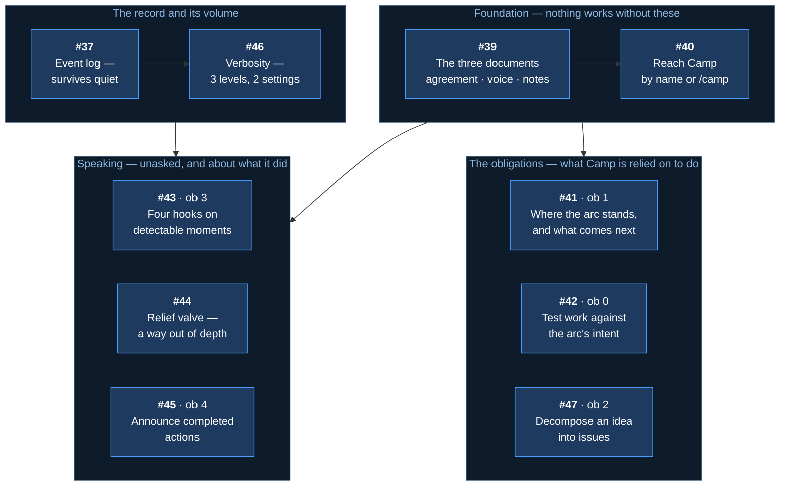
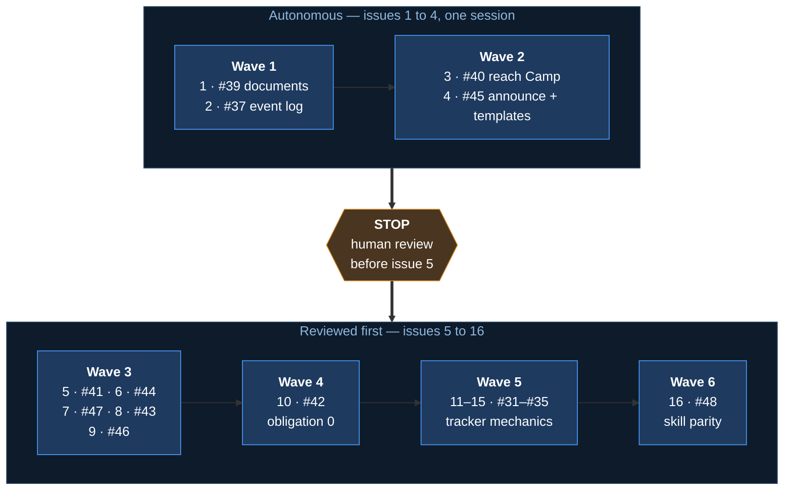

# Arc: Camp, and the tracker fixes

> **Arc log** — the spine above the per-issue [dev-logs](../dev-log/). It holds what spans
> issues: why this arc exists, what was decided once and applies throughout, and where the
> work stands.

**Milestone:** [Arc 03 — Camp and the linking fix](https://github.com/Calyx-Engineering/arc/milestone/4) · **Branch:** `arc/03-camp` · **Started:** 2026-08-18

---

## In one minute

**Camp is the spine window made portable** — the role that holds an arc's plan and tracks
which issue is active, backed by committed documents instead of a VS Code window that has to
stay open.

| | |
|---|---|
| **New issues** | [#39](https://github.com/Calyx-Engineering/arc/issues/39)–[#47](https://github.com/Calyx-Engineering/arc/issues/47), nine of them, plus [#48](https://github.com/Calyx-Engineering/arc/issues/48) last |
| **Already filed** | [#37](https://github.com/Calyx-Engineering/arc/issues/37) the event log · [#31](https://github.com/Calyx-Engineering/arc/issues/31)–[#35](https://github.com/Calyx-Engineering/arc/issues/35) tracker mechanics |
| **Build order** | See *Status — execution order*. It is numbered 1–11 and marks where to stop |
| **Autonomous** | Issues 1–4 only, one session. **Stop before issue 5** |
| **Not in this arc** | The monitoring agent · onboarding · mined thresholds |

**The one thing to check:** the spec-to-issue table below. Every section of m43 appears
exactly once, so a gap there is a feature nobody is building.

---

## Why this arc exists

Arc's workflow depends on one VS Code window holding the plan and tracking which issue is
active. That window is fragile — close it, switch branches, or move to another repo and the
orchestration is gone.

**Camp is that role, made portable.** The same job, held by an addressable persona backed by
committed documents instead of by a window that has to stay open.

Two failures follow from having no such role:

| | |
|---|---|
| **Work drifts from the arc's intent** | Every step looks reasonable; nothing holds the destination and tests proposed work against it |
| **Arc's operation is invisible** | A tool that cannot be observed cannot be evaluated — and produces no improvement signal |

**The bar:** Camp is what turns using Arc on real hardware work into an evaluation rather than
just use.

---

## What the decomposition produced

Nine new issues, plus one already filed and five carried in from the tracker work spawned
during scoping.

---

## Every spec section, and the issue that delivers it

**Read this table to check nothing was dropped.** Every numbered section of
[m43](../product-architecture/mechanisms/m43-camp-assistant.md) appears exactly once.

| Spec | What it defines | Issue |
|---|---|---|
| §2 · §6 | The persona, its voice, how it is reached | [#40](https://github.com/Calyx-Engineering/arc/issues/40) |
| §3.1 | **Obligation 0** — hold the arc's intent, the authority ladder | [#42](https://github.com/Calyx-Engineering/arc/issues/42) |
| §3.2 | **Obligation 1** — status, and the close/start sequence run the same way every time | [#41](https://github.com/Calyx-Engineering/arc/issues/41) |
| §3.3 | **Obligation 2** — decomposition | [#47](https://github.com/Calyx-Engineering/arc/issues/47) |
| §3.4 | **Obligation 3** — the event half, four hooks | [#43](https://github.com/Calyx-Engineering/arc/issues/43) |
| §3.5 | **Obligation 4** — announcing completed actions, and the templates that make future artifacts do the same | [#45](https://github.com/Calyx-Engineering/arc/issues/45) |
| §3.6 | The relief valve — the conversational half | [#44](https://github.com/Calyx-Engineering/arc/issues/44) |
| §5 | The three documents and their ownership | [#39](https://github.com/Calyx-Engineering/arc/issues/39) |
| §7 | Verbosity — three levels, two settings | [#46](https://github.com/Calyx-Engineering/arc/issues/46) |
| §8 · [m44](../product-architecture/mechanisms/m44-event-log.md) | The event log, independent of verbosity | [#37](https://github.com/Calyx-Engineering/arc/issues/37) |
| §11 | Onboarding | **Backlogged** — not this arc |
| §12 | Named gaps | **Open by design** — see below |
| — | Repo hygiene: shipping skills match their local copies | [#48](https://github.com/Calyx-Engineering/arc/issues/48) |

### Carried in from scoping

Five issues spawned by friction observed while writing the spec. Tracker mechanics, not Camp —
classified *escalate* under obligation 0's own ladder, and correct to do. **Scheduled as wave
5**, issues 11 through 15.

| Issue | |
|---|---|
| [#31](https://github.com/Calyx-Engineering/arc/issues/31) | Say what a branch or setting **is** when naming it |
| [#32](https://github.com/Calyx-Engineering/arc/issues/32) | Size an issue title to what merging delivers |
| [#33](https://github.com/Calyx-Engineering/arc/issues/33) | A repeatable loop for scoping an involved piece of work |
| [#34](https://github.com/Calyx-Engineering/arc/issues/34) | Numbered questions in a multi-topic reply |
| [#35](https://github.com/Calyx-Engineering/arc/issues/35) | Keep the issue checklist current as working state |

---

## Build order

Dependency, not value. **The most valuable issue is frequently the one that cannot start.**

**Why obligation 0 is late despite being the priority.** It cannot evaluate direction without
knowing where work stands ([#41](https://github.com/Calyx-Engineering/arc/issues/41)), and its
fourth firing moment is the relief valve
([#44](https://github.com/Calyx-Engineering/arc/issues/44)). Building it first would mean
building it twice.

---

## How this arc is executed

**Not only what gets built — how.** An arc run autonomously and an arc run beside a human are
different plans, and the difference belongs here rather than in a chat message.

| Wave | Mode | Why |
|---|---|---|
| **1–2** — [#39](https://github.com/Calyx-Engineering/arc/issues/39) · [#37](https://github.com/Calyx-Engineering/arc/issues/37) · [#40](https://github.com/Calyx-Engineering/arc/issues/40) · [#45](https://github.com/Calyx-Engineering/arc/issues/45) | **Autonomous, then stop** | The foundation. Most specified, no judgement calls, and everything downstream depends on them |
| **3–6** — issues 5 through 16 | **Reviewed first** | Held until issues 1–4 land clean |

**The stop is the point.** Sixteen issues run unattended ends in either a good arc or sixteen
PRs on a wrong foundation, and the second is not visible until it is expensive. The numbered
table under *Status* marks where it is.

**One session, no reset between issues.** A session cannot clear its own context, so waves 1–2
are four issues in one continuous run — the wave boundary is dependency, not a fresh start.

### What is least certain, and why

| | |
|---|---|
| **Skills cannot be executed here** | Nothing in this repo runs a skill. A session writes one, checks it against the spec diagram, and marks it done — with no evidence it *behaves* right. True of every skill Arc has shipped |
| **Obligation 0 is judgement** | *"Does this serve the arc's intent"* has no mechanical test. It will build; whether it fires usefully is unknown until used |
| **The relief valve's thresholds are estimates** | 8 turns, 3 questions, 45 minutes. Placed so the mechanism is buildable, corrected by [#36](https://github.com/Calyx-Engineering/arc/issues/36) |
| **The close sequence is unproven** | [#41](https://github.com/Calyx-Engineering/arc/issues/41)'s nine steps were written from informal practice. Executing it will find gaps the spec side could not see |
| **Context depth** | Arc 02 ran five pre-specified issues autonomously and held. This is ten, several with judgement. Expect degradation around the middle |

**Autonomy is per-arc, not per-repo** — [m40](../product-architecture/mechanisms/m40-autonomy-switch.md).
The mode above is this arc's, decided from how specified the work is.

---

## Load-bearing decisions

Settled during scoping. **These apply across every issue in the arc.**

| | |
|---|---|
| **Camp is documents, skills and hooks — not an agent** | Continuous conversation reading is the one form Arc cannot afford. Only obligation 3's conversational half needs it, and that half ships as a skill |
| **Camp owns no arc state** | m15 owns the handoff, m17 the logs, m21 the tree. Camp reads them and fires them; it authors none of them |
| **Obligations and memory never merge** | The agreement is what Camp must do (user-owned). Notes are what Camp learned (Camp's own). Merging them lets learning silently rewrite obligations |
| **The goal is user-owned** | Camp evaluates work against the arc's intent and cannot revise that intent |
| **Camp proposes; it never executes** | It names what is required. The main thread acts, after the user approves |
| **A fired precondition always nudges** | Direction sets the nudge's strength, never whether it speaks |
| **Verbosity governs display, never retention** | Everything reaches the event log regardless of setting |
| **Two mechanisms ship knowingly partial** | Obligations 2 and 3's conversational half. Both state their limits where they are specified |

---

## What is deliberately not in this arc

| | Why |
|---|---|
| **The monitoring agent** | Continuous conversation reading — the one unaffordable form. The relief valve degrades to a skill instead |
| **Onboarding** | Camp configuring itself at install. Obligation 0 ships without it |
| **Mined relief-valve thresholds** | [#36](https://github.com/Calyx-Engineering/arc/issues/36), pass 2 — needs the transcript miner |
| **How fine an issue should be** | An operating-agreement clause once first use produces examples |

---

## Status — execution order

**Work top to bottom, in this order. Every issue has a number and a wave.**

| # | Issue | Delivers | Wave | State |
| :--- | :--- | :--- | :--- | :--- |
| 1 | [#39](https://github.com/Calyx-Engineering/arc/issues/39) | Camp's three documents | 1 | Not started |
| 2 | [#37](https://github.com/Calyx-Engineering/arc/issues/37) | The event log | 1 | Not started |
| 3 | [#40](https://github.com/Calyx-Engineering/arc/issues/40) | Reaching Camp by name or `/camp` | 2 | Not started |
| 4 | [#45](https://github.com/Calyx-Engineering/arc/issues/45) | Obligation 4 — announcing actions, and the templates | 2 | Not started |
| | | **■ STOP — human review before issue 5 ■** | | |
| 5 | [#41](https://github.com/Calyx-Engineering/arc/issues/41) | Obligation 1 — status and the close sequence | 3 | Blocked on review |
| 6 | [#44](https://github.com/Calyx-Engineering/arc/issues/44) | The relief valve skill | 3 | Blocked on review |
| 7 | [#47](https://github.com/Calyx-Engineering/arc/issues/47) | Obligation 2 — decomposition | 3 | Blocked on review |
| 8 | [#43](https://github.com/Calyx-Engineering/arc/issues/43) | Obligation 3 — four hooks | 3 | Blocked on review |
| 9 | [#46](https://github.com/Calyx-Engineering/arc/issues/46) | Verbosity | 3 | Blocked on review |
| 10 | [#42](https://github.com/Calyx-Engineering/arc/issues/42) | Obligation 0 — holding the intent | 4 | Blocked on review |
| 11 | [#31](https://github.com/Calyx-Engineering/arc/issues/31) | Say what a branch or setting is when naming it | 5 | Blocked on review |
| 12 | [#32](https://github.com/Calyx-Engineering/arc/issues/32) | Size an issue title to what merging delivers | 5 | Blocked on review |
| 13 | [#33](https://github.com/Calyx-Engineering/arc/issues/33) | A repeatable loop for scoping involved work | 5 | Blocked on review |
| 14 | [#34](https://github.com/Calyx-Engineering/arc/issues/34) | Numbered questions in a multi-topic reply | 5 | Blocked on review |
| 15 | [#35](https://github.com/Calyx-Engineering/arc/issues/35) | Keep the issue checklist current as working state | 5 | Blocked on review |
| 16 | [#48](https://github.com/Calyx-Engineering/arc/issues/48) | Shipping skills match their local copies | 6 | Blocked on review |
| — | [#27](https://github.com/Calyx-Engineering/arc/issues/27) | This spec and decomposition | — | **In progress** — closes at arc PR |

### What each wave is

| Wave | | Mode |
|---|---|---|
| **1** | The two artifacts nothing else can be built without | **Autonomous** |
| **2** | The entry point, and artifacts declaring what they report | **Autonomous** |
| **3** | The obligations that need only the entry point | Reviewed first |
| **4** | Obligation 0, which needs status and the relief valve | Reviewed first |
| **5** | Tracker and chat mechanics — touches `skills/`, not Camp | Reviewed first |
| **6** | The parity check, which needs every skill to exist | Reviewed first |

**Wave 5 is last of the substantive work, not optional.** It was spawned during scoping and is
scheduled here because it depends on nothing in Camp — but it ships in this arc.

### The stop is mandatory

**After issue 4 merges, stop and wait. Do not begin issue 5.**

| | |
|---|---|
| **Why here** | Issues 1–4 are the foundation. Everything after depends on the documents, the entry point and the log being right |
| **What is checked** | That the four merged PRs did what their spec sections say — and that a skill written from `hooks/TEMPLATE` reports without its author knowing the convention exists |
| **If the foundation is wrong** | Four PRs to redo. Discovered at issue 16, it is sixteen |

**Issues 1–4 run in one session.** A session cannot clear its own context, so the wave boundary
is dependency rather than a fresh start. Degradation is likeliest at issue 4, which is where
the diagram check before the PR matters most.

## At arc close

- [ ] Status table reflects reality
- [ ] Default branch restored — `tools/arc-default-branch.sh restore`
- [ ] Arc PR into `main` carries a `Closes` line for every issue
- [ ] Soak line appended for every plugin change made during this arc
- [ ] K2 swept — durable product facts graduated

---

## Related

- [m43](../product-architecture/mechanisms/m43-camp-assistant.md) — the Camp spec
- [m44](../product-architecture/mechanisms/m44-event-log.md) — the event log
- [m41](../product-architecture/mechanisms/m41-relief-valve.md) — the relief valve's precondition and thresholds
- [m42](../product-architecture/mechanisms/m42-default-branch-flip.md) — why the default branch is pointed at this arc
