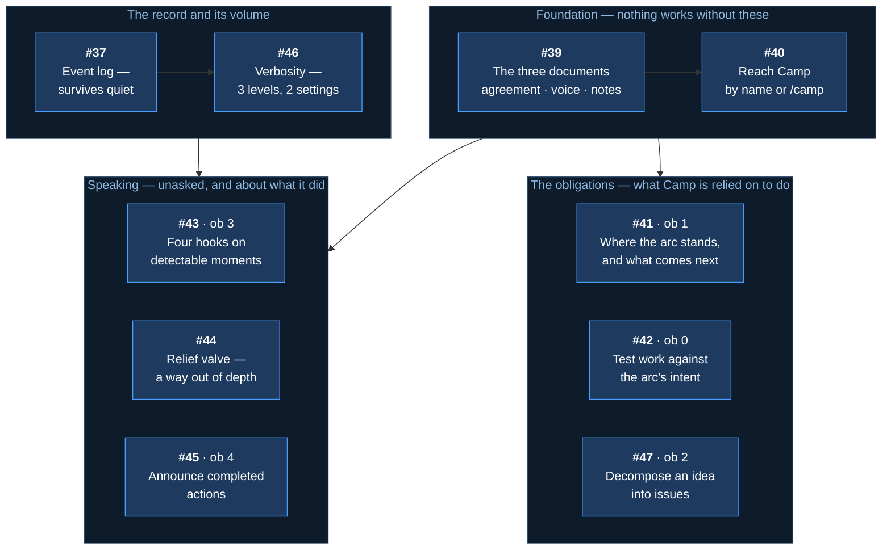

# Arc: Camp, and the tracker fixes

> **Arc log** — the spine above the per-issue [dev-logs](../dev-log/). It holds what spans
> issues: why this arc exists, what was decided once and applies throughout, and where the
> work stands.

**Milestone:** [Arc 03 — Camp and the linking fix](https://github.com/Calyx-Engineering/arc/milestone/4) · **Branch:** `arc/03-camp` · **Started:** 2026-08-18

---

## In one minute

**Camp is the spine window made portable** — the role that holds an arc's plan and tracks
which issue is active, backed by committed documents instead of a VS Code window that has to
stay open.

| | |
|---|---|
| **New issues** | [#39](https://github.com/Calyx-Engineering/arc/issues/39)–[#47](https://github.com/Calyx-Engineering/arc/issues/47), nine of them, plus [#48](https://github.com/Calyx-Engineering/arc/issues/48) last |
| **Already filed** | [#37](https://github.com/Calyx-Engineering/arc/issues/37) the event log · [#31](https://github.com/Calyx-Engineering/arc/issues/31)–[#35](https://github.com/Calyx-Engineering/arc/issues/35) tracker mechanics |
| **Build order** | Documents → entry point → obligations → hooks and verbosity |
| **Not in this arc** | The monitoring agent · onboarding · mined thresholds |

**The one thing to check:** the spec-to-issue table below. Every section of m43 appears
exactly once, so a gap there is a feature nobody is building.

---

## Why this arc exists

Arc's workflow depends on one VS Code window holding the plan and tracking which issue is
active. That window is fragile — close it, switch branches, or move to another repo and the
orchestration is gone.

**Camp is that role, made portable.** The same job, held by an addressable persona backed by
committed documents instead of by a window that has to stay open.

Two failures follow from having no such role:

| | |
|---|---|
| **Work drifts from the arc's intent** | Every step looks reasonable; nothing holds the destination and tests proposed work against it |
| **Arc's operation is invisible** | A tool that cannot be observed cannot be evaluated — and produces no improvement signal |

**The bar:** Camp is what turns using Arc on real hardware work into an evaluation rather than
just use.

---

## What the decomposition produced

Nine new issues, plus one already filed and five carried in from the tracker work spawned
during scoping.

---

## Every spec section, and the issue that delivers it

**Read this table to check nothing was dropped.** Every numbered section of
[m43](../product-architecture/mechanisms/m43-camp-assistant.md) appears exactly once.

| Spec | What it defines | Issue |
|---|---|---|
| §2 · §6 | The persona, its voice, how it is reached | [#40](https://github.com/Calyx-Engineering/arc/issues/40) |
| §3.1 | **Obligation 0** — hold the arc's intent, the authority ladder | [#42](https://github.com/Calyx-Engineering/arc/issues/42) |
| §3.2 | **Obligation 1** — status, and the close/start sequence run the same way every time | [#41](https://github.com/Calyx-Engineering/arc/issues/41) |
| §3.3 | **Obligation 2** — decomposition | [#47](https://github.com/Calyx-Engineering/arc/issues/47) |
| §3.4 | **Obligation 3** — the event half, four hooks | [#43](https://github.com/Calyx-Engineering/arc/issues/43) |
| §3.5 | **Obligation 4** — announcing completed actions, and the templates that make future artifacts do the same | [#45](https://github.com/Calyx-Engineering/arc/issues/45) |
| §3.6 | The relief valve — the conversational half | [#44](https://github.com/Calyx-Engineering/arc/issues/44) |
| §5 | The three documents and their ownership | [#39](https://github.com/Calyx-Engineering/arc/issues/39) |
| §7 | Verbosity — three levels, two settings | [#46](https://github.com/Calyx-Engineering/arc/issues/46) |
| §8 · [m44](../product-architecture/mechanisms/m44-event-log.md) | The event log, independent of verbosity | [#37](https://github.com/Calyx-Engineering/arc/issues/37) |
| §11 | Onboarding | **Backlogged** — not this arc |
| §12 | Named gaps | **Open by design** — see below |
| — | Repo hygiene: shipping skills match their local copies | [#48](https://github.com/Calyx-Engineering/arc/issues/48) |

### Carried in from scoping

Five issues spawned by friction observed while writing the spec. Tracker mechanics, not Camp —
classified *escalate* under obligation 0's own ladder, and correct to do.

| Issue | |
|---|---|
| [#31](https://github.com/Calyx-Engineering/arc/issues/31) | Say what a branch or setting **is** when naming it |
| [#32](https://github.com/Calyx-Engineering/arc/issues/32) | Size an issue title to what merging delivers |
| [#33](https://github.com/Calyx-Engineering/arc/issues/33) | A repeatable loop for scoping an involved piece of work |
| [#34](https://github.com/Calyx-Engineering/arc/issues/34) | Numbered questions in a multi-topic reply |
| [#35](https://github.com/Calyx-Engineering/arc/issues/35) | Keep the issue checklist current as working state |

---

## Build order

Dependency, not value. **The most valuable issue is frequently the one that cannot start.**

```mermaid
flowchart LR
    subgraph W1[" No dependencies — start here "]
        direction TB
        A1["<b>#39</b><br/>documents"]
        A2["<b>#37</b><br/>event log"]
    end
    subgraph W2[" Needs the documents "]
        direction TB
        B1["<b>#40</b><br/>reach Camp"]
        B2["<b>#45</b> · ob 4<br/>announce actions<br/>+ templates"]
    end
    subgraph W3[" Needs the entry point "]
        direction TB
        C1["<b>#41</b> · ob 1<br/>status + the<br/>close sequence"]
        C2["<b>#44</b><br/>relief valve"]
        C3["<b>#47</b> · ob 2<br/>decomposition"]
        C4["<b>#43</b> · ob 3<br/>four hooks"]
        C5["<b>#46</b><br/>verbosity"]
    end
    subgraph W4[" Needs status and the valve "]
        direction TB
        D1["<b>#42</b> · ob 0<br/>hold the intent"]
    end
    subgraph W5[" Last — once every skill exists "]
        direction TB
        E1["<b>#48</b><br/>shipping skills match<br/>their local copies"]
    end
    W1 --> W2 --> W3 --> W4 --> W5
    classDef n fill:#1e3a5f,stroke:#4a9eff,color:#fff
    class A1,A2,B1,B2,C1,C2,C3,C4,C5,D1,E1 n
    style W1 fill:#0d1b2a,stroke:#2c4a6b,color:#8fb8e0
    style W2 fill:#0d1b2a,stroke:#2c4a6b,color:#8fb8e0
    style W3 fill:#0d1b2a,stroke:#2c4a6b,color:#8fb8e0
    style W4 fill:#0d1b2a,stroke:#2c4a6b,color:#8fb8e0
    style W5 fill:#0d1b2a,stroke:#2c4a6b,color:#8fb8e0
```

**Why obligation 0 is last despite being the priority.** It cannot evaluate direction without
knowing where work stands ([#41](https://github.com/Calyx-Engineering/arc/issues/41)), and its
fourth firing moment is the relief valve
([#44](https://github.com/Calyx-Engineering/arc/issues/44)). Building it first would mean
building it twice.

---

## Load-bearing decisions

Settled during scoping. **These apply across every issue in the arc.**

| | |
|---|---|
| **Camp is documents, skills and hooks — not an agent** | Continuous conversation reading is the one form Arc cannot afford. Only obligation 3's conversational half needs it, and that half ships as a skill |
| **Camp owns no arc state** | m15 owns the handoff, m17 the logs, m21 the tree. Camp reads them and fires them; it authors none of them |
| **Obligations and memory never merge** | The agreement is what Camp must do (user-owned). Notes are what Camp learned (Camp's own). Merging them lets learning silently rewrite obligations |
| **The goal is user-owned** | Camp evaluates work against the arc's intent and cannot revise that intent |
| **Camp proposes; it never executes** | It names what is required. The main thread acts, after the user approves |
| **A fired precondition always nudges** | Direction sets the nudge's strength, never whether it speaks |
| **Verbosity governs display, never retention** | Everything reaches the event log regardless of setting |
| **Two mechanisms ship knowingly partial** | Obligations 2 and 3's conversational half. Both state their limits where they are specified |

---

## What is deliberately not in this arc

| | Why |
|---|---|
| **The monitoring agent** | Continuous conversation reading — the one unaffordable form. The relief valve degrades to a skill instead |
| **Onboarding** | Camp configuring itself at install. Obligation 0 ships without it |
| **Mined relief-valve thresholds** | [#36](https://github.com/Calyx-Engineering/arc/issues/36), pass 2 — needs the transcript miner |
| **How fine an issue should be** | An operating-agreement clause once first use produces examples |

---

## Status

| Issue | Delivers | State |
| :--- | :--- | :--- |
| [#27](https://github.com/Calyx-Engineering/arc/issues/27) | The spec, and this decomposition | **In progress** |
| [#39](https://github.com/Calyx-Engineering/arc/issues/39) | The three documents | Not started |
| [#40](https://github.com/Calyx-Engineering/arc/issues/40) | Reach Camp by name or `/camp` | Not started |
| [#41](https://github.com/Calyx-Engineering/arc/issues/41) | Obligation 1 — status and flow | Not started |
| [#42](https://github.com/Calyx-Engineering/arc/issues/42) | Obligation 0 — hold the intent | Not started |
| [#43](https://github.com/Calyx-Engineering/arc/issues/43) | Obligation 3 — four hooks | Not started |
| [#44](https://github.com/Calyx-Engineering/arc/issues/44) | The relief valve skill | Not started |
| [#45](https://github.com/Calyx-Engineering/arc/issues/45) | Obligation 4 — announcing actions | Not started |
| [#46](https://github.com/Calyx-Engineering/arc/issues/46) | Verbosity | Not started |
| [#47](https://github.com/Calyx-Engineering/arc/issues/47) | Obligation 2 — decomposition | Not started |
| [#48](https://github.com/Calyx-Engineering/arc/issues/48) | Shipping skills match their local copies | Not started — **runs last** |
| [#37](https://github.com/Calyx-Engineering/arc/issues/37) | The event log | Not started |
| [#31](https://github.com/Calyx-Engineering/arc/issues/31)–[#35](https://github.com/Calyx-Engineering/arc/issues/35) | Tracker mechanics, from scoping | Not started |

---

## At arc close

- [ ] Status table reflects reality
- [ ] Default branch restored — `tools/arc-default-branch.sh restore`
- [ ] Arc PR into `main` carries a `Closes` line for every issue
- [ ] Soak line appended for every plugin change made during this arc
- [ ] K2 swept — durable product facts graduated

---

## Related

- [m43](../product-architecture/mechanisms/m43-camp-assistant.md) — the Camp spec
- [m44](../product-architecture/mechanisms/m44-event-log.md) — the event log
- [m41](../product-architecture/mechanisms/m41-relief-valve.md) — the relief valve's precondition and thresholds
- [m42](../product-architecture/mechanisms/m42-default-branch-flip.md) — why the default branch is pointed at this arc
