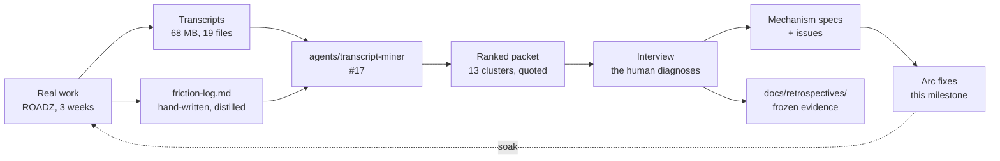
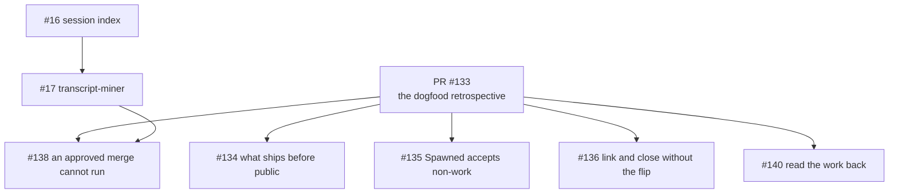
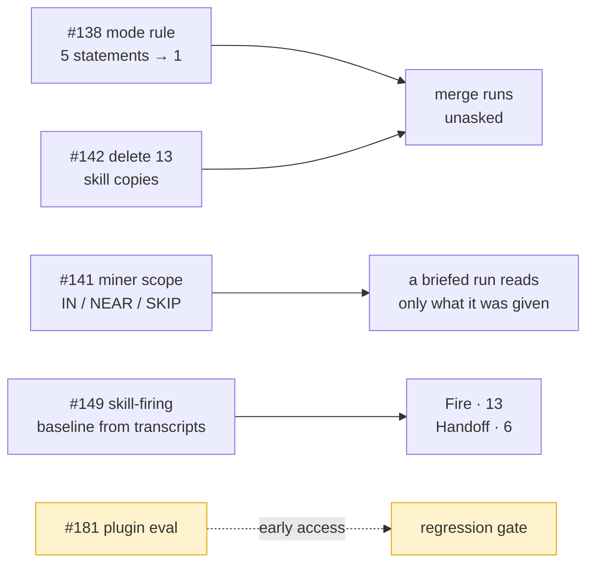

# Arc: dogfood — the first real use, and what it broke

> **Arc log**, not a spec. The spine above the per-issue [dev-logs](../dev-log/) — it holds
> what spans issues.

**Milestone:** [Dogfood](https://github.com/Calyx-Engineering/arc/milestone/6)  ·  **Branch:** `arc/04-dogfood`  ·  **Started:** 2026-09-05

## 1 Why this arc exists

**Three arcs shipped behaviour that had never been observed.** `pre-release-review.md` §1 says
it plainly: *"Almost nothing Arc ships has ever run."* Then `v0.1.0` was cut, the plugin was
installed, and three weeks of real hardware work ran against it in ROADZ.

That work produced a friction log and 68 MB of transcripts. **This arc is what the evidence
says to fix.**

The stated intent, against which [`arc-intent`](../../skills/arc-intent/SKILL.md) classifies
everything spawned here:

> **Mine three weeks of real work for friction Arc caused, and fix what the evidence ranks
> highest.** Not: build what the roadmap says comes next.

**There are more findings than time.** Thirteen clusters, 112 corrections. The arc is scoped by
what the ranked list puts on top, not by what is filed.

## 2 Target architecture

**The loop closes at the dashed line.** A fix that never runs against real work again is
unsoaked, and unsoaked is the state three arcs shipped in.

## 3 How this arc is executed

**Manual until [#138](https://github.com/Calyx-Engineering/arc/issues/138) lands, then autonomous
per workstream.** Decomposition and acceptance criteria are in
[the plan](../arc-work/04-dogfood/issue-plan.md); this section is how a run behaves.

| | |
|---|---|
| Mode | **Manual** until the merge route is fixed. Autonomous per workstream after |
| The unit of a run | **One issue, not one workstream.** A workstream is 5–12 issues; running it in one context is how C11 happened — twice, the load that saturated a session was building a skill rather than doing the engineering |
| Where it stops | At a workstream boundary. Handoff also stops once, at Handoff-1's scores |
| What a run reads | **[`run-instructions.md`](../arc-work/04-dogfood/run-instructions.md), then the issue, and only what the issue names.** Not the plan — that is the human's forest view, and making it an execution input puts it back in the sync-drift path |
| Sub-agents | **Read and return only.** For large reads that collapse to a small answer — Fire-1's baseline, Handoff-1's scoring. A sub-agent that edits files and reports *done* is the failure this arc exists to fix |

### 3.1 How a run knows which issue is next

**The driver is a shell script — `tools/arc-loop.sh`, not yet written.** It picks the next issue,
starts a fresh `claude -p` session with
[`run-instructions.md`](../arc-work/04-dogfood/run-instructions.md) and that issue's body, and
repeats when the session exits. **It is the only thing that survives between runs** — every session
is cold, and the script holds the position in the queue. Not the orchestrator: a session that picks
and dispatches accumulates the whole workstream in its context, which is the failure this avoids.

**The driver picks; the run never does.** A run that selects its own work has read the whole
milestone to do it, which is the context blow-up this loop exists to avoid.

**The queue is GitHub sub-issues.** One parent issue per workstream, labelled `workstream`, its
issues attached as ordered children. One label, not five — it is a structural type every arc reuses,
and it is how the driver finds the parents without hardcoding numbers. Verified on this repo: `addSubIssue`, `removeSubIssue` and **`reprioritizeSubIssue`** all
exist, so order is native and no label, project board or queue file is needed.

| | |
|---|---|
| **Finding the parents** | `gh issue list --label workstream --milestone <name>` |
| **Next issue** | First open sub-issue of the current workstream's parent |
| **Order** | The sub-issue list order — `reprioritizeSubIssue` sets it |
| **Blocked** | An issue whose `Blocked by #NN` issues are still open is skipped, not started |
| **Workstream done** | No open children left. The driver dispatches a report run, then stops |
| **Where the report lands** | A comment on the parent, and [§6](#6-status) |
| **Scope of one invocation** | **One workstream.** `tools/arc-loop.sh <parent-issue>` runs its children, dispatches the report run, exits. The next workstream is a second invocation, after the user has read the report — the stop is mechanical, not remembered |
| **The driver holds no state** | Position is *which sub-issues are still open*, which lives in GitHub. Kill it mid-workstream and restarting resumes at the first open child with nothing lost |

**Labels were rejected** — five arc-scoped labels pollute a space the user reads, for something that
expires with the arc. **Projects was rejected** for this arc — a board that outlives the arc is a
larger decision and is not needed to run the loop.

### 3.2 The inside of an iteration

**`CLAUDE.md` says how to branch, commit, soak and edit hooks safely. It does not say how to do the
work well.** That sequence was missing when [#17](https://github.com/Calyx-Engineering/arc/issues/17)
shipped missing two of its five requirements, and it is what the user has been supplying by hand by
asking for another look.

**It lives in [`run-instructions.md`](../arc-work/04-dogfood/run-instructions.md)** — the file a
loop iteration reads ahead of its issue. Restating it here would give it two sources, and the one
nobody executes is the one that drifts.

**If it survives the arc it graduates to a mechanism.** It is arc-scoped for now because it is
unproven.

### 3.3 The report at a workstream boundary

**200 words maximum**, written into [§6](#6-status) as a block under that workstream. Durable there
in a way a PR comment is not. Sections in
[`run-instructions.md` §6](../arc-work/04-dogfood/run-instructions.md#6-what-you-write).

### 3.4 What is least certain, and why

| | |
|---|---|
| **Whether one cause explains six clusters** | Response length, narrative prose, `Spawned` misuse, wrong branch, skills-not-loaded and dropped numbering are all *a rule that exists in a skill and did not fire* — 21 of 47 post-install corrections. Fire-1 tests it. If it is one cause, five issues stop being separate work |
| **Whether the handoff can be fixed at all** | The user's position is that it has never worked once. A populated, correct, freshly-read north star did not bind — a worse defect than a missing field |
| **Whether skill firing can be scored at all** | Everything autonomous rests on `claude plugin eval` producing a usable number. Untested here |

## 4 Load-bearing decisions

| | |
|---|---|
| **Findings are frozen; fixes are not** | The friction log and the miner's packet are evidence and are dated. Unbuilt findings are backlog, not loss. This is what makes the time-box safe |
| **Priorities are set after the ranked list, not before** | The user named handoff and skill-triggering up front and explicitly held them open pending the full ranking |
| **The interview is not skippable** | `plugin-retrospective` step 4. Three of the reference run's diagnoses were wrong and only review caught them. Where the time-box bites, it bites on interview *breadth* — top clusters interviewed, the tail recorded unreviewed |
| **m12 and m42 are both options, neither is retired** | The default-branch flip is the convenience where its preconditions pass; manual linking is what works multi-user and without admin rights. m12 §5's *retire the switch* is wrong and is corrected in [#136](https://github.com/Calyx-Engineering/arc/issues/136) |
| **The default branch was flipped to `arc/04-dogfood` mid-arc** | Started on `main` deliberately, which tested the manual route and proved it — [#132](https://github.com/Calyx-Engineering/arc/issues/132) and [#17](https://github.com/Calyx-Engineering/arc/issues/17) were closed and linked by hand. Flipped at T+107 so later PRs bind natively. **Not retroactive:** [PR #137](https://github.com/Calyx-Engineering/arc/pull/137) and [PR #139](https://github.com/Calyx-Engineering/arc/pull/139) stay unlinked forever, which is why the manual links were necessary. All four m42 preconditions passed |
| **A merge runs only on an explicit request** | **Superseded 2026-09-07.** Held for four denials. After [#138](https://github.com/Calyx-Engineering/arc/issues/138) reduced the mode rule from five statements to one, [PR #172](https://github.com/Calyx-Engineering/arc/pull/172) merged unasked with no denial. One observation — statement count is the leading explanation, not proof |
| **Branches are created through `createLinkedBranch`** | `git checkout -b` produces no branch↔issue link, and the mutation cannot link a branch that already exists. Proven both ways on [#132](https://github.com/Calyx-Engineering/arc/issues/132) and [#17](https://github.com/Calyx-Engineering/arc/issues/17) |
| **A working handoff is defined by behaviour, not by content** | Settled by interview 2026-09-06. First action correct with no correction, **and** the session can state *why* the current approach was chosen without being told. Not re-proposing ruled-out work is wanted, not required. Every previous attempt changed the document instead, with no way to tell whether it helped |
| **Rationale is not narrative** | Leading hypothesis for why a correct handoff produces the opposite conclusion: *"we tried X then Y"* is cut as development narrative and the constraint that produced the decision goes with it. In hardware the constraint is what makes the next decision correct. Unproven — Handoff-1 tests it |
| **The manual process the handoff replaced worked** | A cold start that began by reading the previous session's transcript produced good results, and inspired the handoff. The document is a distillation of that transcript — **distillation is where the rationale is lost**, which is the same finding as the row above, arrived at from the other direction |
| **No standing merge grant has ever existed here** | Since Arc was installed, no merge has run without an explicit per-merge request. [#138](https://github.com/Calyx-Engineering/arc/issues/138) is building a route, not recovering a lost one |
| **Issue writing is in scope** | The user's call: *"good issue writing and naming has become a critical core to the development workflow."* Six issues carry it |

## 5 The tree

Classified by cause. [PR #133](https://github.com/Calyx-Engineering/arc/pull/133) is the
retrospective itself, so everything the evidence produced hangs off it.

**[#138](https://github.com/Calyx-Engineering/arc/issues/138) is blocked on
[#17](https://github.com/Calyx-Engineering/arc/issues/17)** — the fix that worked in ROADZ left
no artifact and exists only in transcripts.

**[#16](https://github.com/Calyx-Engineering/arc/issues/16) carries one of
[#17](https://github.com/Calyx-Engineering/arc/issues/17)'s requirements**, moved rather than
left unticked: the miner reads the index instead of globbing.

## 6 Status

**The only status surface.** [The plan](../arc-work/04-dogfood/issue-plan.md) holds decomposition
and acceptance criteria and carries no status — one fact, one place.

Each workstream's 200-word boundary report lands here when it closes.

| Workstream | Parent | Issues | Status |
|---|---|---|---|
| **Loop** | [#144](https://github.com/Calyx-Engineering/arc/issues/144) | 4 | **Closed, 4 of 4.** Report below |
| **Fire** | [#145](https://github.com/Calyx-Engineering/arc/issues/145) | 13 | Not started. **Unblocked** — the baseline exists |
| **Handoff** | [#146](https://github.com/Calyx-Engineering/arc/issues/146) | 6 | Not started. **Unblocked** |
| **Tracker** | [#147](https://github.com/Calyx-Engineering/arc/issues/147) | 7 | Not started |
| **Upkeep** | [#148](https://github.com/Calyx-Engineering/arc/issues/148) | 7 | Not started |

### 6.1 Closed before the workstreams existed

| Issue | Dev-log | |
|---|---|---|
| [#132](https://github.com/Calyx-Engineering/arc/issues/132) local edits never reach the installed plugin | [issue-132-plugin-reload](../dev-log/issue-132-plugin-reload.md) | **Merged** — [PR #137](https://github.com/Calyx-Engineering/arc/pull/137). Closed and linked by hand |
| [#17](https://github.com/Calyx-Engineering/arc/issues/17) transcript-miner, friction mode | [issue-17-transcript-miner](../dev-log/issue-17-transcript-miner.md) | **Merged** — [PR #139](https://github.com/Calyx-Engineering/arc/pull/139). Closed and linked by hand |
| — the retrospective and the plan | [pr-133-dogfood-retrospective](../dev-log/pr-133-dogfood-retrospective.md) | **Open** — [PR #133](https://github.com/Calyx-Engineering/arc/pull/133), draft |

**All 36 are filed**, plus five workstream parents and three held out of the milestone. The
planning session collapsed to two subjects and both were settled in conversation — the merge
route, and what a working handoff is.

---

### 6.2 Loop — boundary report

**Workstream:** Loop · **Closed:** 2026-09-07 · **176 words**, diagram excluded

**1 Delivered.** A merge that runs without the user asking for it, and a number for how often each skill fires. Both were preconditions for every other workstream and neither existed.

**2 Spawned.** [#173](https://github.com/Calyx-Engineering/arc/issues/173) onboarding collision detector · [#174](https://github.com/Calyx-Engineering/arc/issues/174) response verbosity setting · [#175](https://github.com/Calyx-Engineering/arc/issues/175) cold-start reading path · [#177](https://github.com/Calyx-Engineering/arc/issues/177) command copies · [#181](https://github.com/Calyx-Engineering/arc/issues/181) `plugin eval` regression gate · [#183](https://github.com/Calyx-Engineering/arc/issues/183) `tracker-verify` false positive · [#185](https://github.com/Calyx-Engineering/arc/issues/185) report budget check.

**3 Unexpected.** [#149](https://github.com/Calyx-Engineering/arc/issues/149) was designed around `claude plugin eval` and **the command had never been run** — it is gated behind early access, and 18 issues rested on it. The measurement already existed in the transcripts. Separately, `tracker-verify` called a conforming PR base wrong four times out of four.

**4 Unplanned but needed.** `CLAUDE.md` 231 → 141 lines — the duplication *was* the defect. `verify-autonomy.sh` inverted, because it enforced the thing being removed. Three new tools: `verify-skill-registry`, `miner-scope`, `skill-firing`.

**5 Evidence.** 10 gates, exit 0. Four PRs merged unasked. Baseline: `handoff` 0/11 at an opening, `work-watch` 1 fire in 11, `chat-response` 4/11 — every skill fired at least once, so the defect is frequency.

**6 Not done.** `plugin eval` regression testing — [#181](https://github.com/Calyx-Engineering/arc/issues/181), out of the milestone. Nothing waits on it.

*End of Loop's boundary report.*

---

## 7 Related analysis

- [`friction-log.md`](https://github.com/Lantern-Systems/roadz-sound-system/blob/main/docs/arc-work/interface-pcba-rev-b/friction-log.md) — ROADZ's hand-written log, 296 lines, the higher-signal half of the evidence
- `docs/retrospectives/2026-09-dogfood/` — **owed.** The frozen friction log for this run, written at interview time

## 8 Future capabilities — designed for, not in scope

| | |
|---|---|
| **The knowledge filter** | m30's other half. The miner ships friction mode only; m30 stays `partial`. Its open question — whether both filters can share extraction — is untouched |
| **`agents/improver`, `hooks/mining-trigger`** | m31 and m19. The miner is built to be called by them; neither exists |
| **Two-agent split** | m30 suggests mid-tier for extraction, top for clustering. One agent for now — splitting adds a handoff before there is evidence the cost matters |

## 9 At arc close

- [ ] Status table reflects reality
- [ ] Tree regenerated
- [ ] The retrospective's friction log written and **frozen** under `docs/retrospectives/2026-09-dogfood/`
- [ ] Cluster counts recorded, so the next run can measure which mechanisms repaid
- [ ] Unbuilt clusters filed as issues outside this milestone, not lost with the session
- [ ] K2 and K3 swept
- [ ] **Milestone closed by hand.** GitHub does not close it when its last issue closes
- [ ] **Default branch restored** — `tools/arc-default-branch.sh restore`. **It was flipped to `arc/04-dogfood` on 2026-09-05 and must be pointed back at `main`.** A crashed session leaves it on a branch that may later be deleted, and nothing about that state is visible in ordinary work

## 10 Soak

**Per `CLAUDE.md`: a plugin change runs against real work before it leaves the machine.**
Committed is not exercised. Unsoaked means a commit here with no soak line from any repo.

| Change | Soaked on | Result |
|---|---|---|
| `tools/plugin-reload.sh` ([#132](https://github.com/Calyx-Engineering/arc/issues/132)) | Its own test, then nothing since | **Partially soaked.** The uninstall-plus-reinstall pair was verified by marker on a real skill and reverted. **The claim it exists to serve — that a plugin fix can be exercised in the repo that hit the friction — is untested**, because no fix has been reloaded into ROADZ yet |
| `agents/transcript-miner` ([#17](https://github.com/Calyx-Engineering/arc/issues/17)) | **This arc's own extraction**, 68 MB, 19 files, before it was registered | **Fired correctly, and the soak paid for itself.** Three defects surfaced from the run and were fixed before merge: curated transcript saves were not read at all, intensity markers were invisible to the filter, and quotes carried no locator. **None was visible from reading the agent** |
| `agents/transcript-miner` — the ranked table and `Proposed mechanism` column | — | **Unsoaked.** Added after the run, in response to a re-read of [#17](https://github.com/Calyx-Engineering/arc/issues/17)'s checklist. The next mining run is its first exercise |
| `agents/transcript-miner` — pass B, intensity markers | — | **Unsoaked, and marked so in the file.** Reasoned from the corpus, not measured. The agent reports pass A and pass B counts separately so the next run produces the evidence to keep, tune or drop it |
| `hooks/camp-branch-check` · `hooks/tracker-verify` | **A live session, for the first time in three arcs** | **Both fired.** `camp-branch-check` on `arc/04-dogfood`'s creation, `tracker-verify` on every `gh pr create`. This closes `pre-release-review.md` §2.2's *a hook fires* row, which no gate here could establish. **One false report each:** `tracker-verify` asked for an explanation the PR body already carried, and fired on `verify-tracker-body.sh`, which is not a tracker write |
| `skills/issue-write` — titles, bodies, spawn edges | Six issues written this arc | **Fired correctly where it was run, and did not fire on its own.** Every title passed `verify-tracker-body.sh title`. **The spawn edge was missed on [#134](https://github.com/Calyx-Engineering/arc/issues/134) until the user caught it** — which is [#83](https://github.com/Calyx-Engineering/arc/issues/83), unbuilt, and evidence for it |
| `docs/product-architecture/close-sequence.md` — the nine steps | Two issues closed this arc | **Two steps were missed on both units.** Step 3, the arc-log status row — this file did not exist until [#17](https://github.com/Calyx-Engineering/arc/issues/17) had already merged. Step 7, the soak line — same. **A sequence nothing fires is a sequence that gets skipped**, which is C7's shape applied to the close sequence itself |

> **The miner's row is the first soak in this repository where the exercise found defects the
> author could not see by reading.** That is what the soak rule is for, and it is the first
> time it has done it.
