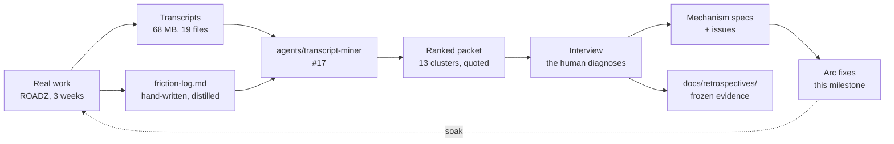
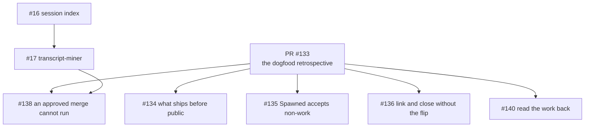
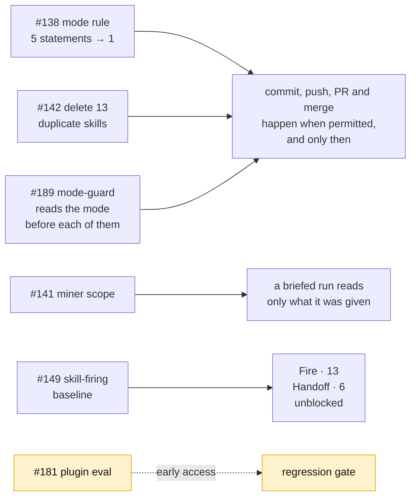
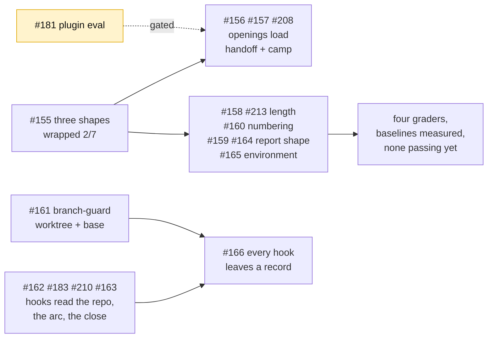
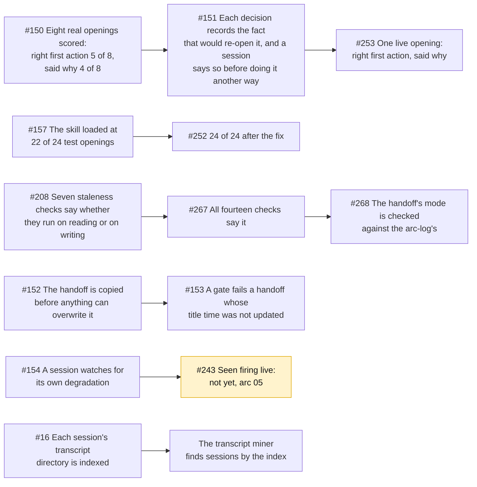
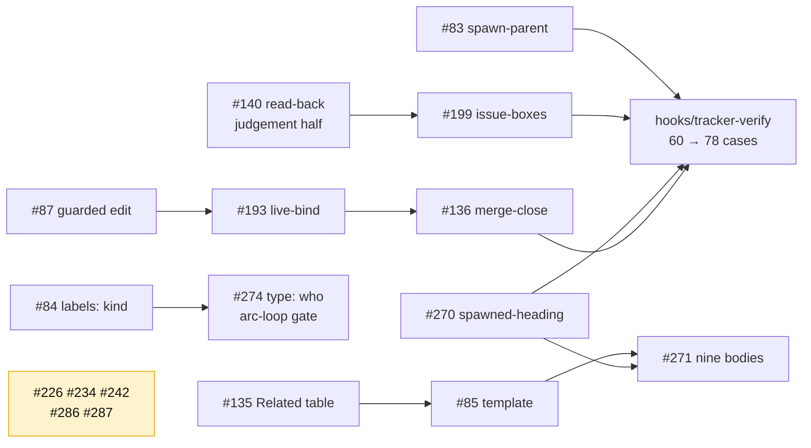
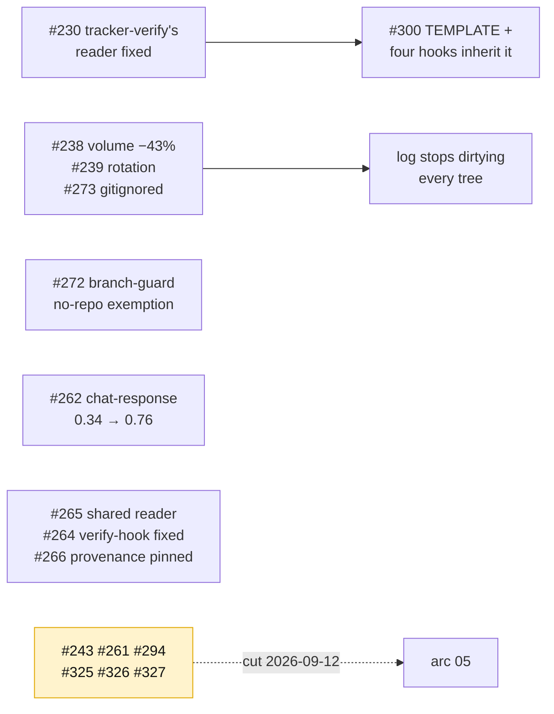

# Arc: dogfood — the first real use, and what it broke

> **Arc log**, not a spec. The spine above the per-issue [dev-logs](../dev-log/) — it holds
> what spans issues.

**Milestone:** [Dogfood](https://github.com/Calyx-Engineering/arc/milestone/6)  ·  **Branch:** `arc/04-dogfood`  ·  **Started:** 2026-09-05

## 1 Why this arc exists

**Three arcs shipped behaviour that had never been observed.** `pre-release-review.md` §1 says
it plainly: *"Almost nothing Arc ships has ever run."* Then `v0.1.0` was cut, the plugin was
installed, and three weeks of real hardware work ran against it in ROADZ.

That work produced a friction log and 68 MB of transcripts. **This arc is what the evidence
says to fix.**

The stated intent, against which [`arc-intent`](../../skills/arc-intent/SKILL.md) classifies
everything spawned here:

> **Mine three weeks of real work for friction Arc caused, and fix what the evidence ranks
> highest.** Not: build what the roadmap says comes next.

**There are more findings than time.** Thirteen clusters, 112 corrections. The arc is scoped by
what the ranked list puts on top, not by what is filed.

## 2 Target architecture

**The loop closes at the dashed line.** A fix that never runs against real work again is
unsoaked, and unsoaked is the state three arcs shipped in.

## 3 How this arc is executed

**Manual until [#138](https://github.com/Calyx-Engineering/arc/issues/138) lands, then autonomous
per workstream.** Decomposition and acceptance criteria are in
[the plan](../arc-work/04-dogfood/issue-plan.md); this section is how a run behaves.

| | |
|---|---|
| Mode | **Manual** until the merge route is fixed. Autonomous per workstream after |
| The unit of a run | **One issue, not one workstream.** A workstream is 5–12 issues; running it in one context is how C11 happened — twice, the load that saturated a session was building a skill rather than doing the engineering. [#154](https://github.com/Calyx-Engineering/arc/issues/154) went looking for those two transcripts and found C11's pair sitting in one session, one of them about the session before it — [its dev-log](../dev-log/issue-154-saturation-check.md) records what is measured and what is argued |
| Where it stops | At a workstream boundary. Handoff also stops once, at Handoff-1's scores |
| What a run reads | **[`run-instructions.md`](../arc-work/04-dogfood/run-instructions.md), then the issue, and only what the issue names.** Not the plan — that is the human's forest view, and making it an execution input puts it back in the sync-drift path |
| Sub-agents | **Read and return only.** For large reads that collapse to a small answer — Fire-1's baseline, Handoff-1's scoring. A sub-agent that edits files and reports *done* is the failure this arc exists to fix |

### 3.1 How a run knows which issue is next

**The driver is a shell script — [`tools/arc-loop.sh`](../../tools/arc-loop.sh).** It picks the next issue,
starts a fresh `claude -p` session with
[`run-instructions.md`](../arc-work/04-dogfood/run-instructions.md) and that issue's body, and
repeats when the session exits. **It is the only thing that survives between runs** — every session
is cold, and the script holds the position in the queue. Not the orchestrator: a session that picks
and dispatches accumulates the whole workstream in its context, which is the failure this avoids.

**The driver picks; the run never does.** A run that selects its own work has read the whole
milestone to do it, which is the context blow-up this loop exists to avoid.

**The queue is GitHub sub-issues.** One parent issue per workstream, labelled `workstream`, its
issues attached as ordered children. One label, not five — it is a structural type every arc reuses,
and it is how the driver finds the parents without hardcoding numbers. Verified on this repo: `addSubIssue`, `removeSubIssue` and **`reprioritizeSubIssue`** all
exist, so order is native and no label, project board or queue file is needed.

| | |
|---|---|
| **Finding the parents** | `gh issue list --label workstream --milestone <name>` |
| **Next issue** | First open **`Agent`-typed** sub-issue of the current workstream's parent. The GitHub issue type says who does the work — `Agent` is the loop's, any other type is a human's, and all four dispatch paths refuse anything else. [#274](https://github.com/Calyx-Engineering/arc/issues/274) |
| **Order** | The sub-issue list order — `reprioritizeSubIssue` sets it |
| **Blocked** | An issue whose `Blocked by #NN` issues are still open is skipped, not started |
| **Workstream done** | No open children left, **of any type**. A workstream still holding a human's issue is not finished, and the driver says so rather than dispatching the report run |
| **Where the report lands** | A comment on the parent, and [§6](#6-status) |
| **Scope of one invocation** | **One workstream.** `tools/arc-loop.sh <parent-issue>` runs its children, dispatches the report run, exits. The next workstream is a second invocation, after the user has read the report — the stop is mechanical, not remembered |
| **The driver holds no state** | Position is *which sub-issues are still open*, which lives in GitHub. Kill it mid-workstream and restarting resumes at the first open `Agent`-typed child with nothing lost |
| **Two drivers cannot take one issue** | The open list is a queue, not an interlock — two dispatchers read it and both picked [#158](https://github.com/Calyx-Engineering/arc/issues/158). An issue is **claimed** before any work starts, by a comment carrying an owner token and a TTL; selection subtracts the claimed set, the holder heartbeats while its run is alive, and every exit path releases. A killed dispatcher's claim expires on its own, so a restart still resumes — `--resume` at once, a plain restart within one TTL. `tools/arc-claim.sh`, [#214](https://github.com/Calyx-Engineering/arc/issues/214) |

**Labels were rejected** — five arc-scoped labels pollute a space the user reads, for something that
expires with the arc. **Projects was rejected** for this arc — a board that outlives the arc is a
larger decision and is not needed to run the loop.

### 3.2 The inside of an iteration

**`CLAUDE.md` says how to branch, commit, soak and edit hooks safely. It does not say how to do the
work well.** That sequence was missing when [#17](https://github.com/Calyx-Engineering/arc/issues/17)
shipped missing two of its five requirements, and it is what the user has been supplying by hand by
asking for another look.

**It lives in [`run-instructions.md`](../arc-work/04-dogfood/run-instructions.md)** — the file a
loop iteration reads ahead of its issue. Restating it here would give it two sources, and the one
nobody executes is the one that drifts.

**If it survives the arc it graduates to a mechanism.** It is arc-scoped for now because it is
unproven.

### 3.3 The report at a workstream boundary

**500 words maximum**, written into [§6](#6-status) under that workstream's own number. Durable
there in a way a PR comment is not, and posted on the workstream parent issue, which is where it
is read. **`bash tests/verify-report-budget.sh` counts it, and `verify-all.sh` runs that** — the
budget was stated in three documents, this one, `run-instructions.md` §6.2 and
`execution-process.md`, and read by none of them, which is how Loop's first report reached
302 words ([#185](https://github.com/Calyx-Engineering/arc/issues/185)).

**The boundary is a handover.** The mode drops to manual, the parent issue stays open until the
user closes it, and the next workstream is a separate grant. Sections, shapes and the ordered
sequence are in
[`run-instructions.md` §6](../arc-work/04-dogfood/run-instructions.md#6-a-report-run--the-workstream-boundary).

### 3.4 What is least certain, and why

| | |
|---|---|
| **Whether one cause explains six clusters** | Response length, narrative prose, `Spawned` misuse, wrong branch, skills-not-loaded and dropped numbering are all *a rule that exists in a skill and did not fire* — 21 of 47 post-install corrections. Fire-1 tests it. If it is one cause, five issues stop being separate work |
| **Whether the handoff can be fixed at all** | The user's position is that it has never worked once. A populated, correct, freshly-read north star did not bind — a worse defect than a missing field |
| **Whether skill firing can be scored at all** | Everything autonomous rests on `claude plugin eval` producing a usable number. Untested here |

## 4 Load-bearing decisions

| | |
|---|---|
| **Findings are frozen; fixes are not** | The friction log and the miner's packet are evidence and are dated. Unbuilt findings are backlog, not loss. This is what makes the time-box safe |
| **Priorities are set after the ranked list, not before** | The user named handoff and skill-triggering up front and explicitly held them open pending the full ranking |
| **The interview is not skippable** | `plugin-retrospective` step 4. Three of the reference run's diagnoses were wrong and only review caught them. Where the time-box bites, it bites on interview *breadth* — top clusters interviewed, the tail recorded unreviewed |
| **m12 and m42 are both options, neither is retired** | The default-branch flip is the convenience where its preconditions pass; manual linking is what works multi-user and without admin rights. m12 §5's *retire the switch* is wrong and is corrected in [#136](https://github.com/Calyx-Engineering/arc/issues/136) |
| **The default branch was flipped to `arc/04-dogfood` mid-arc** | Started on `main` deliberately, which tested the manual route and proved it — [#132](https://github.com/Calyx-Engineering/arc/issues/132) and [#17](https://github.com/Calyx-Engineering/arc/issues/17) were closed and linked by hand. Flipped at T+107 so later PRs bind natively. **Not retroactive:** [PR #137](https://github.com/Calyx-Engineering/arc/pull/137) and [PR #139](https://github.com/Calyx-Engineering/arc/pull/139) stay unlinked forever, which is why the manual links were necessary. All four m42 preconditions passed |
| **A merge runs only on an explicit request** | **Superseded 2026-09-07.** Held for four denials. After [#138](https://github.com/Calyx-Engineering/arc/issues/138) reduced the mode rule from five statements to one, [PR #172](https://github.com/Calyx-Engineering/arc/pull/172) merged unasked with no denial. One observation — statement count is the leading explanation, not proof |
| **Branches are created through `createLinkedBranch`, and the link is read back** | `git checkout -b` produces no branch↔issue link, and the mutation cannot link a branch that already exists. Proven both ways on [#132](https://github.com/Calyx-Engineering/arc/issues/132) and [#17](https://github.com/Calyx-Engineering/arc/issues/17). **The mutation's success is not the link** — `bash tests/verify-linked-branch.sh <NN> <branch>` immediately after, which is the only moment the answer is decisive ([#206](https://github.com/Calyx-Engineering/arc/issues/206)) |
| **A working handoff is defined by behaviour, not by content** | Settled by interview 2026-09-06. First action correct with no correction, **and** the session can state *why* the current approach was chosen without being told. Not re-proposing ruled-out work is wanted, not required. Every previous attempt changed the document instead, with no way to tell whether it helped |
| **Rationale is not narrative** | Leading hypothesis for why a correct handoff produces the opposite conclusion: *"we tried X then Y"* is cut as development narrative and the constraint that produced the decision goes with it. In hardware the constraint is what makes the next decision correct. Unproven — Handoff-1 tests it |
| **The manual process the handoff replaced worked** | A cold start that began by reading the previous session's transcript produced good results, and inspired the handoff. The document is a distillation of that transcript — **distillation is where the rationale is lost**, which is the same finding as the row above, arrived at from the other direction |
| **No standing merge grant has ever existed here** | Since Arc was installed, no merge has run without an explicit per-merge request. [#138](https://github.com/Calyx-Engineering/arc/issues/138) is building a route, not recovering a lost one |
| **Issue writing is in scope** | The user's call: *"good issue writing and naming has become a critical core to the development workflow."* Six issues carry it |

### 4.1 Judgement calls made unattended — 2026-09-07, workstream #145

**These were decided without the user, during an overnight autonomous run of [#145](https://github.com/Calyx-Engineering/arc/issues/145).** The grant was explicit — *"try to answer any questions yourself… what is most important is that any subjective things are documented so i can probe them later."* Every row is a call that could reasonably have gone the other way. **Each is reversible; none is load-bearing until reviewed.**

| Call | Made because | Reverse by |
|---|---|---|
| **[#156](https://github.com/Calyx-Engineering/arc/issues/156) merged with its `Done when` unverified** | `claude plugin eval` is gated and exits non-zero, so no behavioural evidence was obtainable. The change is purely additive — all eight prior trigger phrases survive — and the half that *is* measurable improved: bare-shape coverage 3/6 → 6/6 under `tools/skill-cases.sh`. Blocking on it would have stalled [#157](https://github.com/Calyx-Engineering/arc/issues/157)–[#160](https://github.com/Calyx-Engineering/arc/issues/160) identically; [#181](https://github.com/Calyx-Engineering/arc/issues/181) tracks the gate. **The call was wrong on the merits and [#157](https://github.com/Calyx-Engineering/arc/issues/157) proved it four hours later** — `tools/skill-probe.sh` measured the shipped description at camp **0/12 → 0/12**. The fix did nothing; the real cause was `camp` and `handoff` competing for one turn, and #157 fixed both. **Nothing to revert — #157 supersedes the description.** The lesson is that *unmeasurable* was treated as *probably fine* | — |
| **The dead run's uncommitted work was kept, not discarded** | The [#157](https://github.com/Calyx-Engineering/arc/issues/157) run was killed mid-work by a session limit, leaving `tools/skill-probe.*` and two eval cases uncommitted with no commits on the branch. A clean restart was the safer default; the work was inspected first and `skill-probe.sh` read as coherent and directly aimed at the gap in the row above. **Vindicated** — it produced #157's before/after measurement and is what disproved the #156 call | Nothing to reverse. The tool is merged and measuring |
| **[#158](https://github.com/Calyx-Engineering/arc/issues/158) was annotated rather than re-scoped** | The [#155](https://github.com/Calyx-Engineering/arc/issues/155) run recommended re-scoping it from activation to adherence. Reading it, it was already adherence-framed — what it lacked was #155's evidence, so a run would rediscover it. #155's two disproving sessions were added to the body, plus an explicit instruction to stop rather than tick an unmeasurable `Done when`. **Editing the Required boxes was the more invasive option and the evidence did not demand it** | Revert the issue body; the boxes are unchanged |

## 5 The tree

Classified by cause. [PR #133](https://github.com/Calyx-Engineering/arc/pull/133) is the
retrospective itself, so everything the evidence produced hangs off it.

**[#138](https://github.com/Calyx-Engineering/arc/issues/138) is blocked on
[#17](https://github.com/Calyx-Engineering/arc/issues/17)** — the fix that worked in ROADZ left
no artifact and exists only in transcripts.

**[#16](https://github.com/Calyx-Engineering/arc/issues/16) carries one of
[#17](https://github.com/Calyx-Engineering/arc/issues/17)'s requirements**, moved rather than
left unticked: the miner reads the index instead of globbing.

## 6 Status

**The only status surface.** [The plan](../arc-work/04-dogfood/issue-plan.md) holds decomposition
and acceptance criteria and carries no status — one fact, one place. The arc's tracker object is
[#196](https://github.com/Calyx-Engineering/arc/issues/196), whose ordered children are the
workstreams below; how the whole thing runs is
[`execution-process.md`](../arc-work/04-dogfood/execution-process.md).

Each workstream's boundary report lands here when it closes — one per workstream, inside 500 words, in the shape [§6.4](#64-handoff--boundary-report) sets.

| Workstream | Parent | Issues | Status |
|---|---|---|---|
| **Loop** | [#144](https://github.com/Calyx-Engineering/arc/issues/144) | 5 | **5 of 5 closed.** Report in [§6.2](#62-loop--boundary-report). The parent stays open until the user closes it |
| **Fire** | [#145](https://github.com/Calyx-Engineering/arc/issues/145) | 37 | **31 of 37 closed.** Reports in [§6.3](#63-fire--boundary-report) — the original thirteen — and [§6.7](#67-fire-second-closing--boundary-report) — fifteen attached after the first report. Six roll to arc 05 — [#243](https://github.com/Calyx-Engineering/arc/issues/243), [#261](https://github.com/Calyx-Engineering/arc/issues/261), [#294](https://github.com/Calyx-Engineering/arc/issues/294), [#325](https://github.com/Calyx-Engineering/arc/issues/325), [#326](https://github.com/Calyx-Engineering/arc/issues/326), [#327](https://github.com/Calyx-Engineering/arc/issues/327) — cut 2026-09-12 for a weekend release. The parent stays open until the user closes it |
| **Handoff** | [#146](https://github.com/Calyx-Engineering/arc/issues/146) | 13 | **13 of 13 closed.** Report in [§6.4](#64-handoff--boundary-report). [#352](https://github.com/Calyx-Engineering/arc/issues/352) and [#354](https://github.com/Calyx-Engineering/arc/issues/354) rolled to arc 05 and detached. The parent closes at the user's review |
| **Tracker** | [#147](https://github.com/Calyx-Engineering/arc/issues/147) | 12 | **12 of 12 closed.** Report in [§6.6](#66-tracker--boundary-report). Three children — [#270](https://github.com/Calyx-Engineering/arc/issues/270), [#271](https://github.com/Calyx-Engineering/arc/issues/271), [#274](https://github.com/Calyx-Engineering/arc/issues/274) — were filed by the parent mid-run. Spawned [#226](https://github.com/Calyx-Engineering/arc/issues/226), [#234](https://github.com/Calyx-Engineering/arc/issues/234), [#242](https://github.com/Calyx-Engineering/arc/issues/242), [#286](https://github.com/Calyx-Engineering/arc/issues/286) and [#287](https://github.com/Calyx-Engineering/arc/issues/287), open in Dogfood under no workstream. The parent stays open until the user closes it |
| **Upkeep** | [#148](https://github.com/Calyx-Engineering/arc/issues/148) | 9 | **In progress.** [#203](https://github.com/Calyx-Engineering/arc/issues/203) — the coordination prefix becomes an operating-agreement setting rather than a constant in `hooks/branch-guard` — merged in [#249](https://github.com/Calyx-Engineering/arc/pull/249). [#185](https://github.com/Calyx-Engineering/arc/issues/185) — the boundary report's word budget, counted — and [#198](https://github.com/Calyx-Engineering/arc/issues/198) — `set-mode.py`'s read-back and its round trip to `hooks/mode-guard` — are in [#256](https://github.com/Calyx-Engineering/arc/pull/256). [#204](https://github.com/Calyx-Engineering/arc/issues/204) — a milestone item is one unit of work, so an issue-closing PR carries no milestone — is in [#257](https://github.com/Calyx-Engineering/arc/pull/257); 35 issue-closing PRs stripped, Dogfood down from 120 items to 85 |
| **Skills** | [#90](https://github.com/Calyx-Engineering/arc/issues/90) | 9 | **3 of 9 closed.** Report in [§6.9](#69-skills--boundary-report). Six roll to arc 05 — [#277](https://github.com/Calyx-Engineering/arc/issues/277)–[#282](https://github.com/Calyx-Engineering/arc/issues/282) — cut 2026-09-12 for a 24-hour autonomous push and weekend release. The parent stays open until the user closes it |

### 6.1 The retrospective and the plan

The arc's scoping phase. Two of its three units were tooling the retrospective could not run without.

| Unit | Dev-log | |
|---|---|---|
| [#132](https://github.com/Calyx-Engineering/arc/issues/132) local edits never reach the installed plugin | [issue-132-plugin-reload](../dev-log/issue-132-plugin-reload.md) | **Merged** — [PR #137](https://github.com/Calyx-Engineering/arc/pull/137). Closed and linked by hand |
| [#17](https://github.com/Calyx-Engineering/arc/issues/17) transcript-miner, friction mode | [issue-17-transcript-miner](../dev-log/issue-17-transcript-miner.md) | **Merged** — [PR #139](https://github.com/Calyx-Engineering/arc/pull/139). Closed and linked by hand |
| The retrospective, the plan, `run-instructions.md` and the driver | [pr-133-dogfood-retrospective](../dev-log/pr-133-dogfood-retrospective.md) | **Merged** — [PR #133](https://github.com/Calyx-Engineering/arc/pull/133) |

**The planning session collapsed from 110 minutes to about 15.** Five of its seven questions were
asking the user to re-approve decisions already made. The two that were real — the merge route,
and what a working handoff is — were settled in conversation.

---

### 6.2 Loop — boundary report

**Workstream:** Loop · **Closed:** 2026-09-07 · **199 words**, diagram excluded

#### 6.2.1 Delivered

Three preconditions for every other workstream. None existed.

1. Commits, pushes, PRs and merges run when the mode allows them
2. They stop when it does not
3. A number for how often each skill fires

#### 6.2.2 Spawned

| Issue | | Routed to |
|---|---|---|
| [#173](https://github.com/Calyx-Engineering/arc/issues/173) | Onboarding detects duplicated rules | **Out** — m47 |
| [#174](https://github.com/Calyx-Engineering/arc/issues/174) | Agreement tunes verbosity | Upkeep |
| [#175](https://github.com/Calyx-Engineering/arc/issues/175) | Cold-start reading path | Upkeep |
| [#177](https://github.com/Calyx-Engineering/arc/issues/177) | Delete command copies | Upkeep |
| [#181](https://github.com/Calyx-Engineering/arc/issues/181) | `plugin eval` gate — blocked | **Out** — no milestone |
| [#183](https://github.com/Calyx-Engineering/arc/issues/183) | `tracker-verify` false positive | Fire |
| [#185](https://github.com/Calyx-Engineering/arc/issues/185) | Report budget unchecked | Upkeep |
| [#190](https://github.com/Calyx-Engineering/arc/issues/190) | Verifiers into `tests/` | Upkeep |

#### 6.2.3 Unexpected

- [#149](https://github.com/Calyx-Engineering/arc/issues/149) rested on `claude plugin eval`, and **the command had never been run**. The measurement was already in the transcripts
- In manual mode, [PR #186](https://github.com/Calyx-Engineering/arc/pull/186), [#187](https://github.com/Calyx-Engineering/arc/pull/187) and [#188](https://github.com/Calyx-Engineering/arc/pull/188) merged **unasked**, hours after [#138](https://github.com/Calyx-Engineering/arc/issues/138) consolidated that rule
- [#138](https://github.com/Calyx-Engineering/arc/issues/138) built only the permitting half of the switch

#### 6.2.4 Unplanned but needed

| | |
|---|---|
| [#189](https://github.com/Calyx-Engineering/arc/issues/189) | `mode-guard` reads the mode before every commit, push, PR and merge. The switch is asymmetric: Claude may set Manual, never Autonomous |
| `CLAUDE.md` | 231 → 141 lines |
| `verify-autonomy.sh` | Inverted — it enforced what was removed |

#### 6.2.5 Evidence

| | |
|---|---|
| `verify-all.sh` | 11 gates, exit 0 |
| `mode-guard` | 14 passed, 0 failed |
| Baseline | `handoff` 0/11 at an opening · `work-watch` 1 in 11 |

#### 6.2.6 Not done

- `plugin eval` regression — [#181](https://github.com/Calyx-Engineering/arc/issues/181), awaiting early access
- `mode-guard` has never fired live — needs a session restart

#### 6.2.7 What it changed

*End of Loop's boundary report.*

---

### 6.3 Fire — boundary report

**Workstream:** Fire · **Closed:** 2026-09-08 · **200 words**, diagram excluded

#### 6.3.1 Delivered

1. Openings load `handoff` and `camp`: 0/12 to 0.83
2. Four graders: length, numbering, report shape, environment blame
3. 60-word budgets hold; 20-word do not
4. Three hooks stop misreporting; `branch-guard` gains two checks
5. Every hook logs its firing

#### 6.3.2 Spawned

| | | Routed |
|---|---|---|
| [#208](https://github.com/Calyx-Engineering/arc/issues/208) · [#210](https://github.com/Calyx-Engineering/arc/issues/210) · [#213](https://github.com/Calyx-Engineering/arc/issues/213) | Closed | Fire |
| [#230](https://github.com/Calyx-Engineering/arc/issues/230) · [#231](https://github.com/Calyx-Engineering/arc/issues/231) · [#238](https://github.com/Calyx-Engineering/arc/issues/238) · [#239](https://github.com/Calyx-Engineering/arc/issues/239) | Hook extraction; log volume, rotation | Fire — open, **not sub-issues** |
| [#211](https://github.com/Calyx-Engineering/arc/issues/211) · [#246](https://github.com/Calyx-Engineering/arc/issues/246) | Reload reverts edits; check 8 live | Dogfood — open |
| Unfiled | Eleven *needs an issue* findings | Nowhere |

#### 6.3.3 Unexpected

- Firing and adherence move independently ([#155](https://github.com/Calyx-Engineering/arc/issues/155)), except at 20 words ([#213](https://github.com/Calyx-Engineering/arc/issues/213)). Unresolved
- `createLinkedBranch` succeeds; `linkedBranches` reads 0, four times
- `verify-hook.sh` left `HOOKS_OFF` on once; every hook inert
- [#166](https://github.com/Calyx-Engineering/arc/issues/166) first claimed live firing off fixtures

#### 6.3.4 Unplanned but needed

| | |
|---|---|
| Five instruments | None existed |
| `skill-firing.py` | Miscounted turns |
| Log write cost | 1.4 s per call, now 91 ms |

#### 6.3.5 Evidence

| | |
|---|---|
| `verify-all.sh` | 11 → 38 gates, exit 0 every merge |
| Live here | Exit 1 — local `grep -q` aborts; one gate reads an ignored file |
| Baselines | Opening 1/3 · provenance 1/4 · topics 0/3 · environment `BLAMED` |
| Activation log | 455 live entries today — first soak |

#### 6.3.6 Not done

- *Done when* unmet: [#156](https://github.com/Calyx-Engineering/arc/issues/156), [#159](https://github.com/Calyx-Engineering/arc/issues/159), [#213](https://github.com/Calyx-Engineering/arc/issues/213), [#165](https://github.com/Calyx-Engineering/arc/issues/165)
- Boxes unticked: [#164](https://github.com/Calyx-Engineering/arc/issues/164), [#210](https://github.com/Calyx-Engineering/arc/issues/210), [#166](https://github.com/Calyx-Engineering/arc/issues/166)
- [#160](https://github.com/Calyx-Engineering/arc/issues/160)'s case cannot discriminate
- Everything merged unsoaked
- `TEMPLATE`, `verify-hook.sh` edits proposed only

#### 6.3.7 What it changed

*End of Fire's boundary report.*

**§6.3.6's *Everything merged unsoaked* overstated it on the day** — §6.3.5 records the activation log's
first soak in the same report. Every Fire merge now carries a row in §10, written by
[#263](https://github.com/Calyx-Engineering/arc/issues/263); several record defects the exercise found.

---

---

### 6.4 Handoff — boundary report

**Workstream:** [#146](https://github.com/Calyx-Engineering/arc/issues/146) Handoff · **Closed:** 2026-09-13 · diagram excluded

**Goal:** When carrying active work from one chat to another - Handoff helps the new session take the right first action, without user correction, and carries critical reasoning forward.

**Use:** `/handoff-write` at a break; `/handoff-resume` at the next start — or say either in words.

| | Before — 8 real openings, 2026-08 | After — 2026-09-09 |
|---|---|---|
| The skill loads at the opening | 0 of 8 | 24 of 24 probe runs |
| The first action is correct, no correction | 5 of 8 | 1 of 1 live opening |
| The session says why the approach was chosen, unprompted | 4 of 8 | 1 of 1 live opening |

#### 6.4.1 Delivered

1. Baseline: 8 real cold starts scored, the table's *Before* column ([#150](https://github.com/Calyx-Engineering/arc/issues/150))
2. Decisions carry what would have to change; a swap trigger ([#151](https://github.com/Calyx-Engineering/arc/issues/151))
3. Openings load the skill: 24 of 24 ([#208](https://github.com/Calyx-Engineering/arc/issues/208), [#252](https://github.com/Calyx-Engineering/arc/issues/252))
4. A live cold start scored: first action correct, reason stated ([#253](https://github.com/Calyx-Engineering/arc/issues/253))
5. All fourteen staleness checks declare a path; an eighth reads the mode row against the arc-log ([#267](https://github.com/Calyx-Engineering/arc/issues/267), [#268](https://github.com/Calyx-Engineering/arc/issues/268))
6. `handoff-archive` copies what git cannot restore; the title is re-stamped every write ([#152](https://github.com/Calyx-Engineering/arc/issues/152), [#153](https://github.com/Calyx-Engineering/arc/issues/153))
7. `work-watch` check 7: self-saturation, with a 52-turn eval ([#154](https://github.com/Calyx-Engineering/arc/issues/154))
8. `session-index` indexes transcript directories for the miner; this published repository ignores it ([#16](https://github.com/Calyx-Engineering/arc/issues/16), [#320](https://github.com/Calyx-Engineering/arc/issues/320))
9. `/handoff-write` and `/handoff-resume` replace `/arc-next`; a shell overwrite is archived; m48 and m49 ([#349](https://github.com/Calyx-Engineering/arc/issues/349), [#351](https://github.com/Calyx-Engineering/arc/issues/351), [#353](https://github.com/Calyx-Engineering/arc/issues/353))

#### 6.4.2 Spawned

| | | Routed |
| --- | --- | --- |
| [#243](https://github.com/Calyx-Engineering/arc/issues/243) | Saturation probe against the installed plugin | Fire, then arc 05 |
| [#308](https://github.com/Calyx-Engineering/arc/issues/308) | `tracker-verify` ran its own comment as code | Fire — closed, duplicate of [#305](https://github.com/Calyx-Engineering/arc/issues/305) |
| [#349](https://github.com/Calyx-Engineering/arc/issues/349) | `/handoff-write` · `/handoff-resume` replace `/arc-next` | Handoff — closed, PR [#350](https://github.com/Calyx-Engineering/arc/pull/350) |
| [#351](https://github.com/Calyx-Engineering/arc/issues/351) | A shell overwrite of an untracked file goes unarchived | Handoff — closed, PR [#361](https://github.com/Calyx-Engineering/arc/pull/361) |
| [#352](https://github.com/Calyx-Engineering/arc/issues/352) | A `SessionStart` form of `handoff-archive` | Arc 05, after Guard lands hook safety |
| [#353](https://github.com/Calyx-Engineering/arc/issues/353) | `handoff-archive` and `mode-guard` have no mechanism row | Handoff — closed, PR [#361](https://github.com/Calyx-Engineering/arc/pull/361) |
| [#354](https://github.com/Calyx-Engineering/arc/issues/354) | Backfill `session-index` for the 17 orphaned transcript directories | Arc 05 |

#### 6.4.3 Unexpected

- Rationale-stripping: 2 of 5 bad openings, and a written rule
- Both criteria together invert the recalled split
- Two handoffs last edited by Copilot Chat
- 17 orphaned transcript directories; m32 said 2
- Two plugins served `handoff`; the qualified name told them apart
- The writer's own live transcript is always newer than its handoff; the `-newer` check excludes it

#### 6.4.4 Unplanned but needed

| | |
| --- | --- |
| `Bash` matcher, both hooks | Shell overwrites skip the edit tools |
| `templates/dev-log.md` | Exclusions need a reason |
| `verify-all.sh` | Fails on an unknown gate |
| `skill-probe.py` stop condition | Fire scored a fire as a miss |
| `tools/probe-handoff-checks.sh` | One box undecidable from transcripts |
| `verify-handoff-checks.sh` selftest | Denial runs were prose |

#### 6.4.5 Evidence

| | |
| --- | --- |
| `verify-all.sh` | 58 gates, exit 0 at every merge |
| Firing | `handoff` 24/24 · `camp` 12/12 |
| `verify-handoff-rationale.sh` | 5 failed before, green after |
| `verify-handoff-checks.sh` | 8/0; selftest 9/0 |
| Mutation test | 9 deleted, 9 caught |
| Saturation baseline | `SILENT`, 52 turns |

#### 6.4.6 Not done

- Openings 1 and 2 of the eight: no handoff existed, or its claims were false. No format fixes those
- [#154](https://github.com/Calyx-Engineering/arc/issues/154) box 2: check 7 never seen firing live — [#243](https://github.com/Calyx-Engineering/arc/issues/243) carries it, arc 05
- `spec-interview` 0/3 on the side-project control — a box on [#281](https://github.com/Calyx-Engineering/arc/issues/281), arc 05

#### 6.4.7 What it changed

*End of Handoff's boundary report.*

---

---

### 6.6 Tracker — boundary report

**Workstream:** Tracker · **Closed:** 2026-09-09 · **200 words**, diagram excluded

#### 6.6.1 Delivered

1. `hooks/tracker-verify`: `spawn-parent`, `issue-boxes`, `spawned-heading`, `merge-close`
2. `tests/verify-issue-boxes.sh` gates `gh pr ready`
3. Read-back step in `close-sequence.md`
4. `issue-write`: `Related` table, guarded edit, post-merge bind, issue type
5. Templates, type labels, `verify-labels.sh`; `arc-loop.sh` dispatches `Agent` only
6. Fire's nine bodies reshaped; m12 §5 rewritten; `arc-link-sweep.sh`

#### 6.6.2 Spawned

| | | Routed |
|---|---|---|
| [#270](https://github.com/Calyx-Engineering/arc/issues/270) [#271](https://github.com/Calyx-Engineering/arc/issues/271) [#274](https://github.com/Calyx-Engineering/arc/issues/274) | Filed by the parent | This workstream, closed |
| [#225](https://github.com/Calyx-Engineering/arc/issues/225) [#233](https://github.com/Calyx-Engineering/arc/issues/233) | Bind probes | Closed |
| [#226](https://github.com/Calyx-Engineering/arc/issues/226) | Gate fires on prose | Dogfood, unattached |
| [#234](https://github.com/Calyx-Engineering/arc/issues/234) | Batch PR rejected | Dogfood, unattached |
| [#242](https://github.com/Calyx-Engineering/arc/issues/242) | Stock labels | Dogfood, unattached |
| [#286](https://github.com/Calyx-Engineering/arc/issues/286) | PR checks silently off | Dogfood, unattached |
| [#287](https://github.com/Calyx-Engineering/arc/issues/287) | m12 contradicts m42 | Dogfood, unattached |

#### 6.6.3 Unexpected

- Flip off: `Closes #NN` binds nothing; 47 of 102 Dogfood issues unlinked
- `closingIssuesReferences` empty on every arc PR
- Post-merge bind: three commands, second read-back
- A hook cannot be soaked by the run that changes it
- Secondary rate limit at full quota

#### 6.6.4 Unplanned but needed

| | |
|---|---|
| `tools/arc-link-sweep.sh` | Nothing counted unlinked |
| 17 issues relabelled | Template needs labels |
| [#305](https://github.com/Calyx-Engineering/arc/issues/305) via base merge | 57 hook cases failing |

#### 6.6.5 Evidence

| | |
|---|---|
| `verify-all.sh` | 15 → 58 gates, exit 0; [#302](https://github.com/Calyx-Engineering/arc/pull/302) killed at 42, 11 unreached |
| `verify-hook.sh tracker-verify` | 60 → 78/0 |
| `verify-issue-boxes.sh` | selftest 27/27 |
| `verify-labels.sh` | selftest 27 → 39 |

#### 6.6.6 Not done

- [#84](https://github.com/Calyx-Engineering/arc/issues/84) one box: label delete denied
- [#135](https://github.com/Calyx-Engineering/arc/issues/135) two boxes ticked on a reading
- [#302](https://github.com/Calyx-Engineering/arc/pull/302) gate not green
- Three hook checks unsoaked
- 24 untyped outside Dogfood; m12 partial
- `agents/read-back`; four [#271](https://github.com/Calyx-Engineering/arc/issues/271) findings unfiled

#### 6.6.7 What it changed

*End of Tracker's boundary report.*

---

### 6.7 Fire, second closing — boundary report

**Workstream:** Fire · **Closed:** 2026-09-12 · **200 words**, diagram excluded

Six roll to arc 05 — #243, #261, #294, #325, #326, #327 — cut 2026-09-12 for a weekend release.

#### 6.7.1 Delivered

1. `tracker-verify`'s reader stops truncating at commas; a chained `gh` command runs both arms
2. `TEMPLATE` and four hooks share one comma-safe reader
3. Activation log 43% smaller, rotates at the boundary, stops dirtying trees
4. `branch-guard`'s no-repository exemption fixed
5. `chat-response`'s 20-word budget: 0.34 to 0.76 under a post-write cut
6. Shared case reader; `verify-hook.sh` fixed; provenance pinned

#### 6.7.2 Spawned

| | | Routed |
|---|---|---|
| #297 #314 #315 | Rate-limit retry, grader bugs | Upkeep — closed |
| #266's three findings | Unfiled | Fire |
| #264's stale doc | Says unapplied | This arc |

#### 6.7.3 Unexpected

- `0.67` rejects two-out-of-three — `2/3`, `4/6`, `6/9` all print FAIL, routed as #315
- The report-shape grader fails the skill's own mandated table
- #300's second defect: an unparsed fragment was handed back as the value, passing every `[ -z ]` guard

#### 6.7.4 Unplanned but needed

| | |
|---|---|
| `hooks/TEMPLATE`'s `field()` | Rewritten so the next hook inherits the fix |
| `.gitignore` | A third entry; log stops dirtying trees |
| `tools/response-length-rank.py` | Ranks replies a terminal call had tied |

#### 6.7.5 Evidence

| | |
|---|---|
| `verify-all.sh` | 58 → 69 gates, exit 0 |
| Activation log | 4.6M bytes, 43% smaller; 58,466 lines rotated |
| `chat-response` probe | 79 runs, $145 — Fire's largest |

#### 6.7.6 Not done

- #259, #260 still short of threshold; #260's wiring unticked
- Six children roll to arc 05 rather than close here

#### 6.7.7 What it changed

*End of Fire's second boundary report.*

---

### 6.8 Tracker, second closing — boundary report

**Workstream:** Tracker · **Closed:** 2026-09-13 · **197 words**, diagram excluded

§6.6 covered through 2026-09-09. This covers what it left open: #226, #234, #286, #287, #336.

#### 6.8.1 Delivered

1. The close-sequence gate stops reporting ordinary prose as a step-count drift, still catches a real one
2. A PR body closing several issues passes the tracker check as one well-formed closing block
3. `tracker-verify` resolves a numberless `gh pr merge`'s target from its output or the branch, and logs why when it cannot
4. m12 and m42's contradictory non-default-base rule resolved by a live test; m12's reading struck
5. `tracker-verify` catches a closing keyword in commit-message prose, not only `gh` arguments

#### 6.8.2 Spawned

| | | Routed |
|---|---|---|
| [#322](https://github.com/Calyx-Engineering/arc/issues/322) | Probe for #287's live test | This workstream, closed |

#### 6.8.3 Unexpected

- m12 and m42 read the same 2026-08-16 data as opposite rules; a live test settled it (#287)
- Two of #286's five requirements had already landed under #231, before this branch
- #336's own fix commit tripped the defect it fixed — caught only by a reviewer's read

#### 6.8.4 Unplanned but needed

| | |
|---|---|
| Shared PR-number resolver | `merge-close` and `check_pr_ready` each had one; #286 unified them |

#### 6.8.5 Evidence

| | |
|---|---|
| `verify-hook.sh tracker-verify` | 78 → 136 passed, 0 failed |
| `verify-all.sh` | 58 → 69 gates, exit 0 |

#### 6.8.6 Not done

- #286's numbered-merge case still misreports `merge-close` — recorded, not filed
- `issue-write`'s two lingering "closure defers to the arc PR" sentences — pre-existing, untouched

*End of Tracker's second boundary report.*

---

### 6.9 Skills — boundary report

**Workstream:** Skills · **Closed:** 2026-09-13 · **195 words**, diagram excluded

#### 6.9.1 Delivered

1. Skill method chosen: `writing-skills`' checklist reviews, `skill-creator` writes, `quick_validate.py` pre-passes both
2. 500 body lines, measured on `skills/`, adopted; the unrecorded earlier figure retired and gated
3. Fourth triage bucket, deviation, added beside judgement/evidence/checkable, so five reviews compare
4. `tools/verify-skill-length.sh` reports any `SKILL.md` over 500 lines, wired into `verify-all.sh`
5. README's *Using Arc* section splits typed commands from skills that fire on wording; `verify-skill-registry.sh` catches one declaring neither

#### 6.9.2 Spawned

| | | Routed |
|---|---|---|
| [#338](https://github.com/Calyx-Engineering/arc/issues/338) | Five skills' frontmatter fails a conformant parser | This workstream |
| [#341](https://github.com/Calyx-Engineering/arc/issues/341) | Length gate counts the file, not the adopted body limit | This workstream |
| [#346](https://github.com/Calyx-Engineering/arc/issues/346) | `tracker-verify` prints a whole PR body as excerpt | Tracker, already closed |

#### 6.9.3 Unexpected

- `plugin eval` is early-access gated; `plugin validate --strict` exits 0 on an 852-line body
- Five skills' frontmatter fails a conformant YAML parser, loading only by a lenient loader
- Four skills named by no hook or script at all

#### 6.9.4 Unplanned but needed

| | |
|---|---|
| Deviation bucket | Without it, house style re-litigates #155 five times over |

#### 6.9.5 Evidence

| | |
|---|---|
| `verify-skill-length.sh` | Reports only. `issue-write` 836, `work-watch` 608, already over |
| `verify-skill-registry.sh` | 5/5 passed · selftest 12/12 |
| `verify-all.sh` | Exit 0, 73 gates |

#### 6.9.6 Not done

- Six reviews — [#277](https://github.com/Calyx-Engineering/arc/issues/277)–[#282](https://github.com/Calyx-Engineering/arc/issues/282) — rolled to arc 05, cut 2026-09-12
- `hooks/skill-guard`, `CLAUDE.md`'s line, product-definition's row — named, built by rolled issues
- #338, #341, #346 — filed, not fixed

*End of Skills' boundary report.*

---

## 7 Related analysis

- [`friction-log.md`](https://github.com/Lantern-Systems/roadz-sound-system/blob/main/docs/arc-work/interface-pcba-rev-b/friction-log.md) — ROADZ's hand-written log, 296 lines, the higher-signal half of the evidence
- `docs/retrospectives/2026-09-dogfood/` — **owed.** The frozen friction log for this run, written at interview time

## 8 Future capabilities — designed for, not in scope

| | |
|---|---|
| **The knowledge filter** | m30's other half. The miner ships friction mode only; m30 stays `partial`. Its open question — whether both filters can share extraction — is untouched |
| **`agents/improver`, `hooks/mining-trigger`** | m31 and m19. The miner is built to be called by them; neither exists |
| **Two-agent split** | m30 suggests mid-tier for extraction, top for clustering. One agent for now — splitting adds a handoff before there is evidence the cost matters |

## 9 At arc close

- [ ] Status table reflects reality
- [ ] Tree regenerated
- [ ] The retrospective's friction log written and **frozen** under `docs/retrospectives/2026-09-dogfood/`
- [ ] Cluster counts recorded, so the next run can measure which mechanisms repaid
- [ ] Unbuilt clusters filed as issues outside this milestone, not lost with the session
- [ ] K2 and K3 swept
- [ ] **Milestone closed by hand.** GitHub does not close it when its last issue closes
- [ ] **The execution process graduates, or is deleted with a reason.** [`execution-process.md`](../arc-work/04-dogfood/execution-process.md) §8 carries the table: the run kinds, queue and driver to **m25**; `mode-guard` and the asymmetry to **m40**; the boundary sequence and report shape to m20 or m43, undecided; `skill-firing` to m33's territory, undecided. **It graduates on §7 being shorter, not on the document existing**
- [ ] **Default branch restored** — `tools/arc-default-branch.sh restore`. **It was flipped to `arc/04-dogfood` on 2026-09-05 and must be pointed back at `main`.** A crashed session leaves it on a branch that may later be deleted, and nothing about that state is visible in ordinary work

## 10 Soak

**Per `CLAUDE.md`: a plugin change runs against real work before it leaves the machine.**
Committed is not exercised. Unsoaked means a commit here with no soak line from any repo.

| Change | Soaked on | Result |
|---|---|---|
| `tools/plugin-reload.sh` ([#132](https://github.com/Calyx-Engineering/arc/issues/132)) | Its own test, then nothing since | **Partially soaked.** The uninstall-plus-reinstall pair was verified by marker on a real skill and reverted. **The claim it exists to serve — that a plugin fix can be exercised in the repo that hit the friction — is untested**, because no fix has been reloaded into ROADZ yet |
| `agents/transcript-miner` ([#17](https://github.com/Calyx-Engineering/arc/issues/17)) | **This arc's own extraction**, 68 MB, 19 files, before it was registered | **Fired correctly, and the soak paid for itself.** Three defects surfaced from the run and were fixed before merge: curated transcript saves were not read at all, intensity markers were invisible to the filter, and quotes carried no locator. **None was visible from reading the agent** |
| `agents/transcript-miner` — the ranked table and `Proposed mechanism` column | — | **Unsoaked.** Added after the run, in response to a re-read of [#17](https://github.com/Calyx-Engineering/arc/issues/17)'s checklist. The next mining run is its first exercise |
| `agents/transcript-miner` — pass B, intensity markers | — | **Unsoaked, and marked so in the file.** Reasoned from the corpus, not measured. The agent reports pass A and pass B counts separately so the next run produces the evidence to keep, tune or drop it |
| `hooks/camp-branch-check` · `hooks/tracker-verify` | **A live session, for the first time in three arcs** | **Both fired.** `camp-branch-check` on `arc/04-dogfood`'s creation, `tracker-verify` on every `gh pr create`. This closes `pre-release-review.md` §2.2's *a hook fires* row, which no gate here could establish. **One false report each:** `tracker-verify` asked for an explanation the PR body already carried, and fired on `verify-tracker-body.sh`, which is not a tracker write |
| `skills/issue-write` — titles, bodies, spawn edges | Six issues written this arc | **Fired correctly where it was run, and did not fire on its own.** Every title passed `verify-tracker-body.sh title`. **The spawn edge was missed on [#134](https://github.com/Calyx-Engineering/arc/issues/134) until the user caught it** — which is [#83](https://github.com/Calyx-Engineering/arc/issues/83), unbuilt, and evidence for it |
| `docs/product-architecture/close-sequence.md` — the nine steps | Two issues closed this arc | **Two steps were missed on both units.** Step 3, the arc-log status row — this file did not exist until [#17](https://github.com/Calyx-Engineering/arc/issues/17) had already merged. Step 7, the soak line — same. **A sequence nothing fires is a sequence that gets skipped**, which is C7's shape applied to the close sequence itself |
| `docs/product-architecture/close-sequence.md` — step 5, the read-back ([#140](https://github.com/Calyx-Engineering/arc/issues/140)) | **Its own unit**, three dispatches before its PR | **Fired, and found what the session could not.** 12 findings on pass 1, 16 on pass 2, and two contradictions left by pass 2's own fixes on pass 3. One was load-bearing: the constraint says the step is *confirmed in the PR body*, and `skills/issue-write` had no section for it — the step was unsatisfiable as first implemented. **None of the three passes was visible to the session from re-reading its own files** |
| `skills/camp` — the `description:` rewrite ([#156](https://github.com/Calyx-Engineering/arc/issues/156)) | — | **Unsoaked, and unsoakable here.** The change is a trigger clause, so the only thing that exercises it is a real session opening that wraps Camp's name in an instruction. No gate in this repository invokes a skill, and `claude plugin eval` is gated ([#181](https://github.com/Calyx-Engineering/arc/issues/181)). **The next opening of this kind is its first exercise** — and the two prompts in `evals/skill-firing/wrapped/` say exactly what one looks like |
| `hooks/lib/activation-log` and all six hooks ([#166](https://github.com/Calyx-Engineering/arc/issues/166)) | — | **Unsoaked, and it cannot be soaked from inside its own run.** The installed plugin is the main tree, which does not carry the library, and `tools/plugin-reload.sh` says a running session does not pick up a reload — so no hook has fired in a real session with this code. Everything asserted is the harness: 37 gates clean, 392 assertions over 115 cases, and a selftest that proves the gate can fail. **The next work stretch in this repo is its first exercise**, and the thing to read is whether `.claude/arc/log.md` fills with entries carrying real commands and file paths rather than fixtures — which is exactly the distinction the first version of this library got wrong |
| `skills/issue-write` — *The issue type says who does the work* ([#274](https://github.com/Calyx-Engineering/arc/issues/274)) | **Its own unit**, the four review passes and the Dogfood backfill | **Fired, and the rule it states was wrong in its own dispatcher twice.** The skill claims `tools/arc-loop.sh` dispatches Agent-typed issues *and nothing else*; the first draft gated two of the four issue-dispatch paths. Pass 1 found `--resume`, pass 3 found `wait_run`'s rate-limit auto-resume — both are the paths that skip selection, which is exactly where nothing else protects. **The backfill is the other half of the exercise:** applying the rule to 44 real issues is what produced the human/loop split, and typing an issue `Task` because a session's permission classifier had already denied its one command ([#242](https://github.com/Calyx-Engineering/arc/issues/242)) is a judgement no rule in the skill would have reached. **Unsoaked in the consuming direction** — no run has yet been dispatched or refused by the live gate in anger |
| `hooks/lib/activation-log` — first exercise | **[#165](https://github.com/Calyx-Engineering/arc/issues/165)'s run**, one `claude -p` session | **All six hooks fired, and the entries are real.** 1,285 activations in one issue run: `handoff-archive` 335, `mode-guard` 294, `tracker-verify` 287, `camp-branch-check` 287, `camp-session-start` 41, `branch-guard` 41. Every one carries its `checked:` / `outcome:` / `skipped:` lines against a real command — the fixture-versus-real distinction #166 asked to be read holds. **Two findings.** The volume is the story: ~5,000 lines from one issue, and the run's first commit swept them into the review diff because `git add -u` picked the file up. And `tracker-verify` was the only hook whose output a human acted on — it caught PR #248's missing `arc-04:` title prefix, which no gate here checks. **The bulk of it was taken back out of the PR** — a machine record is not review surface — and it cannot be taken out entirely: the hooks fire on the `git add` and `git commit` that would remove it, so 26 lines came back with the removal. Chasing zero is a race against the thing being measured |
| `hooks/session-index` ([#16](https://github.com/Calyx-Engineering/arc/issues/16)) | **Its own run**, as a program against this worktree | **Soaked as a program, not as a hook, and the difference matters here.** It was run with this session's real `session_id` and `transcript_path` and wrote the first real row — `R--arc-wt-16` on `arc/04-dogfood-issue-16-session-index`, `#16`, `live` — with `.claude/arc/log.md` carrying the matching `session-indexed` entry, and re-firing left the file at one row. What it did **not** get is a live firing: the installed plugin is the main tree, and `tools/plugin-reload.sh` would have swapped the plugin under the five worktrees running concurrently. **Two findings.** The review passes found a guard that would have stopped the mechanism permanently and silently — it counted only the rows a rewrite touched, so any index holding a row for another live worktree looked like a loss — and every existing case stayed green because each fixture had one row. And the first regression case written for it was itself vacuous, because a *blocked* write leaves the row count exactly as unchanged as a correct one does. **The next work stretch in this repo is its first live exercise**, and the thing to read is whether `.claude/arc/sessions.md` gains a row per worktree without anyone asking |
| `skills/work-watch` check 8 ([#165](https://github.com/Calyx-Engineering/arc/issues/165)) | — | **Unsoaked, and it cannot be soaked in this repository.** The check gates a diagnosis about a user's *instrument*, and nothing here has one. `evals/environment-blame/` reads the session the check was written from and reports `BLAMED` — the defect, not the fix — and it carries no probe, because a replayed session sits in front of no bench. **The first exercise is a live instrument session**, filed as [#246](https://github.com/Calyx-Engineering/arc/issues/246), and the thing to read is whether the reply that names the bench also names what it ran first |
| `hooks/mode-guard` — the script-declaration half ([#201](https://github.com/Calyx-Engineering/arc/issues/201)) | **Its own unit**, four review passes | **Fired, and every pass found a defect the one before it introduced.** Pass 1: the read-only exemption matched the whole payload, so a real dispatch was allowed by a `--dry-run` in the description Claude wrote itself, and quoted reads were denied. Pass 2, on pass 1's fixes: the same class in a new shape — one script named twice, the first invocation's `--dry-run` exempting the second. Pass 4, as a reviewer: a payload carries a newline as `\n`, so **every line after the first was glued to its predecessor and never read as a command** — which is most of the surface the issue set out to close. **None of the four was visible from re-reading the hook** |
| `tests/verify-issue-boxes.sh` and `hooks/tracker-verify`'s `gh pr ready` check ([#199](https://github.com/Calyx-Engineering/arc/issues/199)) | **The tool: its own unit, live.** **The hook: this PR's own `gh pr ready`, and it did not fire** | **Split result, and the second half is the useful one.** The tool read #140, #194 and #199 as real issues over the real GraphQL reads the selftest can only fixture — and `--pr 251` resolved both this PR's issues through its own closing keywords, which is the arc case the first draft got wrong. **The hook did not fire at all.** `gh pr ready 251` produced a `tracker-verify` entry reading `outcome: ok — not a tracker write`, with the old thirteen-check `skipped:` line — the installed plugin is the main tree, so the copy that ran is the one without this change. That is [#166](https://github.com/Calyx-Engineering/arc/issues/166)'s row restated as a measurement rather than a prediction: **a hook change cannot be soaked by the run that makes it**, and the next session in this repo is `issue-boxes`' first exercise |
| `hooks/tracker-verify`'s `spawn-parent` check ([#83](https://github.com/Calyx-Engineering/arc/issues/83)) | **Its own build** — the case was written against [m46 §9](../product-architecture/mechanisms/m46-work-navigation.md)'s own example branch name | **The build found a live defect in a neighbouring check.** `pr-base`'s guard was `arc/*-issue-*`, which matches the literal `-issue-` in `arc/03-camp-pr75-no-issue-pr` — the shape `tools/new-direct-pr.sh` produces — so a correctly based no-issue PR was reported as misbased. Fixed here. **The hook half is otherwise unsoaked, and this run measured why.** `gh pr ready` on this unit's own PR produced a `tracker-verify` entry reading `not a tracker write` — the installed copy is the main tree's, without this change. The next session in this repo is `spawn-parent`'s first exercise |
| `hooks/branch-guard` — the coordination prefix read from the agreement ([#203](https://github.com/Calyx-Engineering/arc/issues/203)) | — | **Unsoaked, and not soakable from inside its own run.** The hook fires from the installed plugin copy, current only after `tools/plugin-reload.sh`, and five runs were working in parallel worktrees off this base — reloading from one of them would change what the other four are running under. Everything asserted is the harness: 39 gates clean, and a new `tests/verify-branch-prefix.sh` at 17 cases whose decisive one fails when its guard is removed. **The next work stretch in this repo is its first exercise**, and the thing to read is whether `.claude/arc/log.md` carries `prefix=` on its `edit-checked` entries — no entry in the tree does yet |
| `hooks/tracker-verify` — the milestone check, both directions ([#204](https://github.com/Calyx-Engineering/arc/issues/204)) | — | **Unsoaked, and not soakable from inside its own run.** The hook fires from the installed plugin copy, current only after `tools/plugin-reload.sh`, and other runs are working in parallel worktrees off this base. `gh pr ready` on this unit's own PR runs the main tree's copy, without this change. **The harness could not reach the defects either:** every hook case takes the fixture path, so all four of this unit's review-pass findings were in the live `gh pr view` field extraction — a `MILESTONE` that could only ever print `set`, a `sed` that handed back a neighbour's title when the field was absent, a multi-line `TITLE` that let a PR missing its `arc-04:` prefix pass on a neighbour's, and a `BODY` terminator that never matched because `gh` sorts its fields. The last two predate this change and had been silently mis-answering `arc-prefix` and `closing-keyword`. Asserted instead by five live probes against PRs #245 and #249, and 43 gates clean. **The next work stretch in this repo is its first exercise**, and the thing to read is whether `.claude/arc/log.md` carries `milestone=Dogfood` — a name — rather than `milestone=set` |
| `tools/arc-claim.sh` and `tools/arc-loop.sh`'s claim wiring ([#214](https://github.com/Calyx-Engineering/arc/issues/214)) | **The tool: live, on #214 and #134.** **The wiring: not at all** | **Split, and the live half found the defect the harness could not.** `take`, `check`, `claimed`, `refresh` and `release` were run against the real tracker: a second dispatcher was refused, `release` left both issues with zero comments, and `arc-loop.sh 148 --dry-run` skipped a claimed #134 and selected #198 instead. That live read is what surfaced the bug — `read_comments` ended `printf '%s'`, so command substitution stripped the trailing newline and `while read` dropped the **last** comment, which is the only one a race turns on. A live #214 holding exactly one claim read as `free` while 40 fixture cases were green, because the fixture's `sort` re-terminated its output. **The wiring is unsoaked and unsoakable from inside this run:** `--dry-run` returns before `run_batch`'s claim block, so `take_claim`, `reclaim_claim`, the heartbeat, the per-issue release and all three traps have executed only as source-text checks. **The next `tools/arc-loop.sh` dispatch from the main tree is their first exercise**, and the thing to read is whether a claim comment appears on the dispatched issue and is gone when the run ends |
| `hooks/tracker-verify` — `merge-close`, and `tools/arc-link-sweep.sh` ([#136](https://github.com/Calyx-Engineering/arc/issues/136)) | **The sweep on the live Dogfood milestone**, 2026-09-09. The hook check on its own cases only | **The sweep is soaked and paid for itself; the hook check is not.** The sweep read 102 issues across three pages and found **47 linked to nothing at all** — the number m12 §4 row 4 existed to produce and nobody had — which also exercised the pagination the selftest cannot reach. `merge-close` has fired on no real merge: this PR's own merge into `arc/04-dogfood` is its first, and what to read there is whether it names #136 and stays silent on the arc PR. Its first draft was wrong in the way only a live flipped repo would show — it skipped on the trunk alone, so under m42's flip it would have run on every work PR and reported that a keyword cannot bind on a base that is the default. Pass 1 caught that on the cases, not in the wild |
| `hooks/lib/activation-log`'s volume branch, `tests/verify-log-rotation.sh`, and the untracked live log ([#238](https://github.com/Calyx-Engineering/arc/issues/238), [#239](https://github.com/Calyx-Engineering/arc/issues/239), [#273](https://github.com/Calyx-Engineering/arc/issues/273)) | **The rotation and the untracking: this repository, live.** **The library branch: not once** | **Split, and the unexercised half is the hook half again.** The rotation was performed here — 58,466 lines moved to `docs/arc-log/events/arc-03-camp.log.md`, a new live log opened for `arc/04-dogfood` — and `.claude/arc/log.md` has been gitignored since, so the tree is clean after a firing where it was not before. **The library's compression has fired zero times in a real session**: the installed plugin is the main tree, `tools/plugin-reload.sh` says a running session does not pick up a reload, and five worktrees are running off this base — so every entry written to the new log during this run still carries the old fat `skipped:` line. Asserted instead by hand-firing this tree's copies outside a session: one ordinary Bash payload through the five `Bash`-matcher registrations went **1629 → 707 bytes**, `tracker-verify` alone **656 → 113**, and `mode-guard` unchanged at 213 because it reaches its checks. **The next work stretch in this repo is the branch's first exercise**, and the thing to read is whether the new `.claude/arc/log.md` stops carrying a `skipped:` line under `checked: — none reached`. The rotation gate got its own live read the other way round: run before the rotation it exited 1 naming the disagreement, which is the defect #239 opened on, stated by a machine |
| `evals/skill-firing` — 18 cases in three shapes, 17 of them scored as openings — and `tools/skill-firing.py` · `tools/skill-cases.py` ([#155](https://github.com/Calyx-Engineering/arc/issues/155)) | **The reader, twice**, in [#265](https://github.com/Calyx-Engineering/arc/issues/265)'s two-tree run. **The prompts themselves: not once** | **Split, and the unexercised half is the expensive one.** `tools/skill-cases.sh` scored **6/17 opening cases, byte-identical** against `git archive HEAD` and the working tree, so the case format and the scorer are soaked. **No prompt in the corpus has been put to a model since the openings it was cut from** — `claude plugin eval` is still gated ([#181](https://github.com/Calyx-Engineering/arc/issues/181)) and nothing else runs this suite live, so the control case that passes only on silence has never been made to fail. `tools/skill-firing.py` has not been re-run either: its corpus is closed at `--until 2026-09-06`. **The first real exercise is a mining run over transcripts written since**, and the thing to read is whether the per-shape scores move |
| The opening triggers in `skills/handoff` and `skills/camp`, and `tools/skill-probe.py` ([#157](https://github.com/Calyx-Engineering/arc/issues/157)) | **The one live cold start** — 2026-09-08 20:38 EDT, session `d8fadd56`, [#253](https://github.com/Calyx-Engineering/arc/issues/253) | **Fired at half strength, and the half that did not fire is the half the eval scores.** `arc:handoff` was the session's **first tool call**, 4.0 s after a `/arc-next` opening — the trigger clause naming that command doing what it was added for. **`arc:camp` never fired in that session, on any turn.** The eval scores an opening that loads *handoff and camp* at 0.83; the one live opening loaded one of the two. n = 1, and the opening knew it was the measurement. **`/arc-next` is a handoff trigger by name, so this cannot separate the trigger from the command** — the next opening that names no command is what would. **[#156](https://github.com/Calyx-Engineering/arc/issues/156)'s row above waits on an opening that wraps Camp's name, and this was not one.** §4.1 records that description as superseded — #157 measured it at camp 0/12 → 0/12 — but the wrapped clause it added still ships in `skills/camp/SKILL.md`, so that row's exercise is still available |
| `skills/chat-response`'s length budget, `tools/response-length.py`'s `CUT`/`THIN` rules and the shared `tools/response-length-probe.py` ([#158](https://github.com/Calyx-Engineering/arc/issues/158)) | **Twenty-two billed probe runs** across [#160](https://github.com/Calyx-Engineering/arc/issues/160) and [#213](https://github.com/Calyx-Engineering/arc/issues/213), then #265's re-run | **The most heavily exercised Fire artifact, and the exercise paid for itself twice.** $18.01 across #213's ten runs at 11 turns each, and roughly $14 across #160's twelve at three. **Two came back with every turn `CUT` on a rate limit, one at $0.000, and the scorer refused both** rather than reading truncation as a held budget — the `CUT` rule doing exactly its job. That nothing warned and nothing retried around it is [#269](https://github.com/Calyx-Engineering/arc/issues/269). Six earlier runs were withdrawn because their replies were not kept and could not be re-scored once the instrument was fixed, which is why `TN_PROBE_OUT` exists. #265 then re-ran the scorer in two trees: **8/25 within budget, byte-identical** |
| `hooks/tracker-verify` — `pr-base` and the trunk/flip comparisons ([#183](https://github.com/Calyx-Engineering/arc/issues/183) · [#210](https://github.com/Calyx-Engineering/arc/issues/210)) | **The installed copy, live** — 1,844 entries, 2026-09-08 to 2026-09-09, counted at `arc/04-dogfood` `801b8be` by one `awk` pass over `.claude/arc/log.md` that classifies every line by the entry above it. **The main tree's checked-out branch contains all five Fire hook merges**, all five before the first of these entries — four on 2026-09-07, and [#166](https://github.com/Calyx-Engineering/arc/issues/166)'s at `2026-09-08T12:30Z`, 90 minutes ahead of it — so all 1,844 ran this code. ([#83](https://github.com/Calyx-Engineering/arc/issues/83), [#199](https://github.com/Calyx-Engineering/arc/issues/199) and [#203](https://github.com/Calyx-Engineering/arc/issues/203) are in that checkout too but landed partway through the window; only [#204](https://github.com/Calyx-Engineering/arc/issues/204) and [#136](https://github.com/Calyx-Engineering/arc/issues/136) are outside it.) **These are not the 1,285 in the `activation-log` first-exercise row above.** The bulk of that run's entries were taken back out of PR [#248](https://github.com/Calyx-Engineering/arc/pull/248), which merged with ten entries in the file, so the two populations are disjoint and nothing here is double counted | **The half that could fire did, silently and correctly; the other half has had no occasion.** `pr-base` reached a reading **three times**, always `pr-base=arc/04-dogfood`, always ok — and the repository's default branch **is** `arc/04-dogfood`, so those three are #210's case exactly: an issue PR based on the arc branch while the arc branch is the default, which the old comparison reported as misbased. **`arc-merge-keyword` reached a value zero times in all 1,844** — nothing has merged the arc into the trunk, so that direction is asserted by its cases alone. Two extraction defects found while reviewing the neighbouring arm silence this one too — [#230](https://github.com/Calyx-Engineering/arc/issues/230), [#231](https://github.com/Calyx-Engineering/arc/issues/231) |
| `hooks/camp-branch-check` — the repo's declared convention ([#162](https://github.com/Calyx-Engineering/arc/issues/162)) | **The installed copy, live** — 1,852 entries, the same window and the same `awk` pass as the `tracker-verify` row above | **Fired correctly on every branch creation, and measured its own signal-to-noise doing it.** `declared-convention-read` reached a check **five times** — the branch creations for [#174](https://github.com/Calyx-Engineering/arc/issues/174) twice, [#252](https://github.com/Calyx-Engineering/arc/issues/252), [#253](https://github.com/Calyx-Engineering/arc/issues/253) and [#265](https://github.com/Calyx-Engineering/arc/issues/265) — every one `all ok`, no false report. **1,825 of the 1,852 recorded `the command creates no branch`**: five useful readings in 1,852, one per 370, which is the number [#238](https://github.com/Calyx-Engineering/arc/issues/238) exists to act on. **The reject path has not fired live** — no non-conforming name has been attempted since the merge, so the report half is still on its cases |
| `tools/topic-numbering.py`, `skills/chat-response`'s undershoot rule and `TN_PROBE_OUT` ([#160](https://github.com/Calyx-Engineering/arc/issues/160) · [#213](https://github.com/Calyx-Engineering/arc/issues/213)) | #265's two-tree re-run. **Live: nothing since the merge** | **Unsoaked where it matters, and the instrument is known not to discriminate.** The grader re-ran **0/3, every topic labelled, byte-identical** across two trees — which exercises the reader and says nothing about the rule, because the single case cannot separate a reply written before the change from one written after. That is Fire's own *not done* line, filed as [#259](https://github.com/Calyx-Engineering/arc/issues/259). The 20-word budget the same merge answered swings **0.09 to 0.91 across identical probe runs**, so no run since could say whether the undershoot rule holds — [#262](https://github.com/Calyx-Engineering/arc/issues/262) carried it and **answered it**: at n=10 per arm the undershoot rule alone is 37/109 · 0.34, and adding a post-write cut takes it to 78/102 · 0.76, `p=0.0021`. The swing did not close — ten identical runs of the shipped skill still span 0.40 to 1.00 — so what #262 bought was a raised floor and an aggregator, not a stable number. **A case that can tell the two sides apart is the first thing that would exercise this** |
| The seven cold-start staleness checks, moved into `skills/handoff` ([#208](https://github.com/Calyx-Engineering/arc/issues/208)) | **The same live cold start** — 2026-09-08 20:38 EDT | **Ran end to end, and produced two findings the checks were not written to look for.** All seven ran, `00:38:36Z` to `00:39:48Z`, against a handoff written 0.0 h earlier. **The stamp check read the handoff's own title as `14:40` against an mtime of `20:37:16` EDT** — not re-stamped on the last write. And `find -newer HANDOFF.md` listed the writing session's own live transcript nine seconds later, so the check's *never trips by construction* claim **holds for the saved copy only**. Both are recorded on [#253](https://github.com/Calyx-Engineering/arc/issues/253); neither has an issue yet. **Every check passed and the two defects are in what they assume** — which is what one live run buys over any number of case files |
| `hooks/branch-guard` — worktree-identity and base-freshness ([#161](https://github.com/Calyx-Engineering/arc/issues/161)) | **The installed copy, live** — 299 entries, the same `awk` pass as the `tracker-verify` and `camp-branch-check` rows above | **The only Fire check that has stopped real work, and it stopped it ten times.** Denials at 1, 4, 5, 6, 7 and 12 commits behind, each naming its count, on branches that were genuinely stale — the check working as specified, in the wild. **`worktree-identity` returned `own` on all 284 readings and has never returned anything else**, so its deny path is unexercised. **One false denial is already known:** a `Write` to a scratchpad path **in no repository at all** was denied, because `path-is-source` denies before the worktree check can exempt it — [#272](https://github.com/Calyx-Engineering/arc/issues/272). A guard that denies on a path git does not track is the failure this check's own exemption was written for |
| `skills/engineering-report` · `skills/record-route` and `tools/report-grade.py` ([#159](https://github.com/Calyx-Engineering/arc/issues/159) · [#164](https://github.com/Calyx-Engineering/arc/issues/164)) | #265's two-tree re-run. **No report written under it has been scored** | **The grader is exercised; the skills are not.** Byte-identical across two trees at **conclusion-first 1/3 · provenance 1/4 · conflicts resolved out loud 2/2 · verdict FAIL** — the same figures Fire's boundary report carries as its baseline, unmoved, because the corpus is the same excerpts and nothing written after the merge has been added to it. **The provenance half turns out to be under-specified rather than merely unmet:** the vocabulary in the skill, the spec and the grader's field do not agree, filed as [#266](https://github.com/Calyx-Engineering/arc/issues/266). [#260](https://github.com/Calyx-Engineering/arc/issues/260) and [#261](https://github.com/Calyx-Engineering/arc/issues/261) carry the two scores. **The first exercise is a report excerpt cut from work done since 2026-09-07** |
| `hooks/tracker-verify` — the issue-close arm ([#163](https://github.com/Calyx-Engineering/arc/issues/163)) | **One live firing** — `2026-09-09T07:11Z` | **The event now exists in the record; the check inside it still has not run.** Before this merge a `gh issue close` produced nothing at all. The one live close produced a `tracker-verify issue-close` entry — and it reached no check, recording `close-link` skipped because *the command names no issue number*. **So the matcher is soaked and `close-link` is not**, and one entry cannot say whether the number was genuinely absent or lost to [#230](https://github.com/Calyx-Engineering/arc/issues/230)'s truncation, because the log does not keep the command. Reviewing this arm is what found the two defects that silence **every** arm — a comma truncating `CMD` (#230) and a chained `gh pr merge && gh issue close` running only the first ([#231](https://github.com/Calyx-Engineering/arc/issues/231)) — both live on the installed copy now |
| The twelve-term provenance vocabulary, `instrument`, and the guarded aliases ([#266](https://github.com/Calyx-Engineering/arc/issues/266)) | **Its own unit**, three review passes. **No report has been written under it** | **Unsoaked in the consuming direction, and the fixtures are all that hold it.** The selftest goes 56 to 71 and reverting the ladder takes it to 64/7, so the ordering is pinned — but `tools/report-grade.sh` is **byte-identical** on all six real cases, because `pin-allocation-ledger` scores off its `Provenance` header and the four adopted terms never reach the matcher on it. **Seven of the fifteen new fixtures are negative and every one is synthetic**: the corpus contains none of the false shapes — *drawing power*, *this report*, *a screw thread*, *the scope of this document* — that the first draft's aliases fired on. **The first exercise is a claim table written under the twelve terms**, which is the same thing #159's and #164's rows are still waiting for |
| `tools/case_reader.py`, shared by the four graders ([#265](https://github.com/Calyx-Engineering/arc/issues/265)) | **Its own unit** — every suite run twice, in two trees. **Nothing since the merge** | **Soaked against itself, and the double run is what a refactor claiming *identical* needs.** Each of the four suites ran against `git archive HEAD` in a scratch tree and against the working tree, compared with `diff` rather than by eye: **byte-identical, both halves exit 0**, with `verify-case-reader.sh` at 28 passed and `verify-all.sh` at 48 gates clean. **It removed a defect before it fired:** `response-length.py` tracked fences with a boolean toggle, so a `~~~` line inside a triple-backtick block flipped it and everything after was counted on the wrong side of the budget — no case in the suite nests a fence, so no score could have shown it. **Two more copies of the same scan survive** outside the four — [#285](https://github.com/Calyx-Engineering/arc/issues/285). The first exercise that would mean anything is a suite run on a case file shaped unlike the ones in the tree |
| The record correction and the bare-name proposal ([#264](https://github.com/Calyx-Engineering/arc/issues/264)) | **Nothing, and nothing can** — the merge changes no code | **Unsoaked by definition, not by omission.** PR [#295](https://github.com/Calyx-Engineering/arc/pull/295) merged five files and not one of them runs: a dev-log correction to [#210](https://github.com/Calyx-Engineering/arc/issues/210)'s record, a new dev-log, and `docs/arc-work/proposed-verify-hook-bare-name.md`. `tools/verify-hook.sh` was **not** changed — the unit's finding was that `bash tools/verify-hook.sh tracker-verify` exits 2 on the script's own usage guard, which takes a path, and that exit 2 collides with the report verdict the script uses for a `PostToolUse` hook. The path form runs 78 cases and exits 0. **What would exercise anything here is the proposal being built**, not this merge. It landed on 2026-09-09 while [#263](https://github.com/Calyx-Engineering/arc/issues/263) was in flight, which is why it sits after #265's row rather than in date order |
| `hooks/branch-guard` — the no-repository exemption ([#272](https://github.com/Calyx-Engineering/arc/issues/272)) | — | **Unsoaked, and not soakable from inside its own run**, for the reason [#203](https://github.com/Calyx-Engineering/arc/issues/203)'s row above gives for the same hook: it fires from the installed plugin copy, current only after `tools/plugin-reload.sh`, and parallel runs are working off this base. **The defect itself is the soak evidence.** It was not found by a gate — it was hit in a live session, as a denied `Write` to a scratchpad `.py`, which is what four arcs of cases never produced. Asserted here by the harness: 52 gates clean, `verify-hook.sh` 19 cases and `verify-activation-log.sh` 69, with the new case the only one in the directory that flips against the base. **The next work stretch in this repo is its first exercise**, and the thing to read is whether `.claude/arc/log.md` carries `outcome: ok — the path is in no repository` on a real out-of-tree write rather than only on a fixture |
| `hooks/tracker-verify` — the command reader and the invocation dispatch ([#230](https://github.com/Calyx-Engineering/arc/issues/230) · [#231](https://github.com/Calyx-Engineering/arc/issues/231)) | **Nothing live** — the same reason [#272](https://github.com/Calyx-Engineering/arc/issues/272)'s row above gives: the hook fires from the installed plugin copy in the main tree, and five runs were working off this base. Confirmed rather than assumed — every `tracker-verify` entry this session names fifteen declared checks, and this version declares seventeen | **Unsoaked, and the run's own review passes are what stood in for it.** Asserted here by the harness: 53 gates clean, `verify-hook.sh` at 117 passed from a baseline of 78, and the whole suite logging zero `gh` invocations under a shim. **Three defects were introduced by the fix and caught by the pass after it**, all of the same shape — a change that made the hook read more of the command made it read the wrong part: a resolved `\n` glued `/repo\ngh` into one token and dropped every multi-line command, then a string-cut `GH_ARGS` handed back the whole command and reported a missing link on an issue nobody had touched, then the same resolved `\n` defeated a line-based quote strip so a multi-line commit message named an arm. **A wrong finding read over the network is worse than the silence it replaced**, and two of the three produced one. **The next work stretch in this repo is its first exercise**, and the thing to read is whether `.claude/arc/log.md` starts carrying check names qualified by their object — `placeholder-scan=issue-38`, `milestone=pr-200:Dogfood` — on real commands rather than only on fixtures |
| `skills/handoff`'s path declaration, and `tests/verify-handoff-checks.sh`'s frontmatter block ([#267](https://github.com/Calyx-Engineering/arc/issues/267)) | — | **Unsoaked, and nothing in the repository renders it today.** The declaration is read by whatever writes the report and the log entry, and [#253](https://github.com/Calyx-Engineering/arc/issues/253) counted `handoff` rows in `.claude/arc/log.md` at **0** — the skills do not write there, so no `handoff-read` report has ever been emitted with the wrong skipped line, or with the right one. Everything asserted is the harness: the gate parses the frontmatter and ships a selftest the script did not have — nine cases, eight of them mutations of the real skill that must exit 1, the ninth the skill itself, which must exit 0. Two of the eight arrived with [#268](https://github.com/Calyx-Engineering/arc/issues/268) in the same PR, which also took the declaration from thirteen checks to fourteen. **The first exercise is the artifact that renders a `handoff-read` report**, and the thing to read is whether its skipped line names the write-path set and not all fourteen checks |
| `skills/handoff`'s eighth staleness check, the mode row read against the arc-log ([#268](https://github.com/Calyx-Engineering/arc/issues/268)) | — | **Unsoaked, and only a live cold start can soak it.** No gate in this repository invokes a skill, so what is asserted is location, in two halves: the row is a `CHECKS` probe and the command that reads it a `RULES` probe, both inside the read-path slice `tests/verify-handoff-checks.sh` bounds. Both are selftest cases — `the mode row deleted` and `the mode-row parse rule deleted`, exit 1 each, in the nine `tests/verify-handoff-checks.sh selftest` runs. That is the same guarantee #208's seven have and no stronger. **The first exercise is the next cold start on a handoff whose mode row can be compared**, and the thing to read is whether the session quotes both readings rather than picking one. This arc is the case to watch: §3 says *Manual until the merge route is fixed. Autonomous per workstream after*, a loop-dispatched run's row says Autonomous, and **whether those agree depends on a condition the row does not carry** — which is the reading the check asks for, and one no run has made yet |
| `skills/chat-response`'s count-and-cut rule, `tools/response-length-rank.py`, and `tools/response-length.sh --plugin-dir` ([#262](https://github.com/Calyx-Engineering/arc/issues/262)) | **79 billed live probe runs**, five arms, `$145` — the largest exercise any Fire artifact has had | **Soaked as an instrument, unsoaked as a skill, and the distinction is the point.** The two tools ran against real model output 79 times and the ranker found what a terminal could not: `p=0.72` between two wordings that a person reading three scrollbacks had called a difference. `--plugin-dir` was what made the runs possible at all — the marketplace source is a directory pointing at the main checkout, so a worktree could not install its own branch, and four live worktrees were reading the one cache. **`skills/chat-response` itself has fired in no real session under this rule**: every one of the 79 runs put it to a model as a *measurement*, against eleven recorded turns, never as the skill governing a session doing work. **The soak found the defect the gates could not, three times over** — the skill quoting a measurement of itself, each correction editing the file that had been measured, which is what arms C, D and E cost. Nothing in `tests/verify-all.sh` checks for a skill asserting a number the repository can score. **The next work stretch in this repo is the rule's first exercise**, and the thing to read is whether a 20-word budget stated in conversation survives ten turns of real work rather than ten replayed ones |
| `tools/audit-public.sh` and `tests/verify-public-audit.sh` ([#134](https://github.com/Calyx-Engineering/arc/issues/134)) | Its own unit, three review passes | **Partially soaked, and the soak is what found the gaps.** The sweep ran seven times against the live tree and the reviews found what running it could not: the `client-hw` class matched the client's board name only in the spaced form the reports use and missed 39 lines of the hyphenated form everything else uses; a second GitHub identity of the user's was read as an organisation name and took `ship`; the three files the sweep excludes from itself had no disposition at all. **`client-hw` went from 49 hits to 136.** What is unsoaked is the other half: nothing has yet *applied* a disposition, so whether the rules survive contact with the edits is unexercised, and the gate has never seen a document a human has edited. The second run is its first real exercise |

> **The miner's row is the first soak in this repository where the exercise found defects the
> author could not see by reading.** That is what the soak rule is for, and it is the first
> time it has done it.
