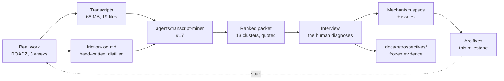
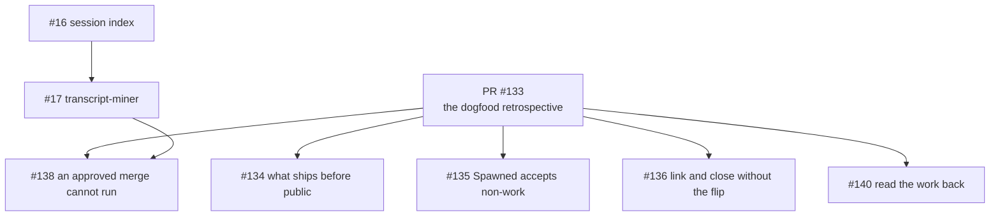

# Arc: dogfood — the first real use, and what it broke

> **Arc log**, not a spec. The spine above the per-issue [dev-logs](../dev-log/) — it holds
> what spans issues.

**Milestone:** [Dogfood](https://github.com/Calyx-Engineering/arc/milestone/6)  ·  **Branch:** `arc/04-dogfood`  ·  **Started:** 2026-09-05

## 1 Why this arc exists

**Three arcs shipped behaviour that had never been observed.** `pre-release-review.md` §1 says
it plainly: *"Almost nothing Arc ships has ever run."* Then `v0.1.0` was cut, the plugin was
installed, and three weeks of real hardware work ran against it in ROADZ.

That work produced a friction log and 68 MB of transcripts. **This arc is what the evidence
says to fix.**

The stated intent, against which [`arc-intent`](../../skills/arc-intent/SKILL.md) classifies
everything spawned here:

> **Mine three weeks of real work for friction Arc caused, and fix what the evidence ranks
> highest.** Not: build what the roadmap says comes next.

**There are more findings than time.** Thirteen clusters, 112 corrections. The arc is scoped by
what the ranked list puts on top, not by what is filed.

## 2 Target architecture

**The loop closes at the dashed line.** A fix that never runs against real work again is
unsoaked, and unsoaked is the state three arcs shipped in.

## 3 How this arc is executed

**Manual.** Every commit, push, PR and merge is the user's call.

| | |
|---|---|
| Mode | **Manual** |
| Why | The arc's subject is friction the tooling caused. Running it unattended means the tooling grading its own homework |
| Merges | The user's, explicitly. See §4 |

### 3.1 What is least certain, and why

| | |
|---|---|
| **Whether C7 causes the other five clusters** | Six clusters — response length, narrative prose, `Spawned` misuse, wrong branch, skills-not-loaded, dropped numbering — are all *a rule that exists in a skill and did not fire*. **44 of 112 corrections.** If C7 is the cause, fixing the other five individually fixes nothing. Untested |
| **Whether the handoff can be fixed at all** | The user's position is that the format has never worked once. A populated, correct, freshly-read north star did not bind — that is a worse defect than a missing field |
| **How much fits in two days** | The arc is time-boxed to roughly two days. Most of the milestone will not be built in it |

## 4 Load-bearing decisions

| | |
|---|---|
| **Findings are frozen; fixes are not** | The friction log and the miner's packet are evidence and are dated. Unbuilt findings are backlog, not loss. This is what makes the time-box safe |
| **Priorities are set after the ranked list, not before** | The user named handoff and skill-triggering up front and explicitly held them open pending the full ranking |
| **The interview is not skippable** | `plugin-retrospective` step 4. Three of the reference run's diagnoses were wrong and only review caught them. Where the time-box bites, it bites on interview *breadth* — top clusters interviewed, the tail recorded unreviewed |
| **m12 and m42 are both options, neither is retired** | The default-branch flip is the convenience where its preconditions pass; manual linking is what works multi-user and without admin rights. m12 §5's *retire the switch* is wrong and is corrected in [#136](https://github.com/Calyx-Engineering/arc/issues/136) |
| **The default branch was flipped to `arc/04-dogfood` mid-arc** | Started on `main` deliberately, which tested the manual route and proved it — [#132](https://github.com/Calyx-Engineering/arc/issues/132) and [#17](https://github.com/Calyx-Engineering/arc/issues/17) were closed and linked by hand. Flipped at T+107 so later PRs bind natively. **Not retroactive:** [PR #137](https://github.com/Calyx-Engineering/arc/pull/137) and [PR #139](https://github.com/Calyx-Engineering/arc/pull/139) stay unlinked forever, which is why the manual links were necessary. All four m42 preconditions passed |
| **A merge runs only on an explicit request** | Tested twice this arc. The harness denies `gh pr merge` after a general approval and allows it after a direct request naming the merge. Not a defect to reverse-engineer — [#138](https://github.com/Calyx-Engineering/arc/issues/138) documents the route |
| **Branches are created through `createLinkedBranch`** | `git checkout -b` produces no branch↔issue link, and the mutation cannot link a branch that already exists. Proven both ways on [#132](https://github.com/Calyx-Engineering/arc/issues/132) and [#17](https://github.com/Calyx-Engineering/arc/issues/17) |
| **Issue writing is in scope** | The user's call: *"good issue writing and naming has become a critical core to the development workflow."* Six issues carry it |

## 5 The tree

Classified by cause. [PR #133](https://github.com/Calyx-Engineering/arc/pull/133) is the
retrospective itself, so everything the evidence produced hangs off it.

**[#138](https://github.com/Calyx-Engineering/arc/issues/138) is blocked on
[#17](https://github.com/Calyx-Engineering/arc/issues/17)** — the fix that worked in ROADZ left
no artifact and exists only in transcripts.

**[#16](https://github.com/Calyx-Engineering/arc/issues/16) carries one of
[#17](https://github.com/Calyx-Engineering/arc/issues/17)'s requirements**, moved rather than
left unticked: the miner reads the index instead of globbing.

## 6 Status

| Issue | Dev-log | Status |
| :--- | :--- | :--- |
| [#132](https://github.com/Calyx-Engineering/arc/issues/132) local edits never reach the installed plugin | [issue-132-plugin-reload](../dev-log/issue-132-plugin-reload.md) | **Merged** — [PR #137](https://github.com/Calyx-Engineering/arc/pull/137). Closed and linked by hand |
| [#17](https://github.com/Calyx-Engineering/arc/issues/17) transcript-miner, friction mode | [issue-17-transcript-miner](../dev-log/issue-17-transcript-miner.md) | **Merged** — [PR #139](https://github.com/Calyx-Engineering/arc/pull/139). Closed and linked by hand |
| — the retrospective itself | [pr-133-dogfood-retrospective](../dev-log/pr-133-dogfood-retrospective.md) | **Open** — [PR #133](https://github.com/Calyx-Engineering/arc/pull/133), draft. Extraction done, interview not run |
| [#138](https://github.com/Calyx-Engineering/arc/issues/138) an approved merge cannot run | — | **Next.** Unblocked by [#17](https://github.com/Calyx-Engineering/arc/issues/17) |
| [#140](https://github.com/Calyx-Engineering/arc/issues/140) read the work back before a PR | — | Not started |
| [#135](https://github.com/Calyx-Engineering/arc/issues/135) `Spawned` accepts things that are not work | — | Not started |
| [#83](https://github.com/Calyx-Engineering/arc/issues/83) a spawned issue records no parent | — | Not started |
| [#87](https://github.com/Calyx-Engineering/arc/issues/87) a failed edit writes the original body back | — | Not started |
| [#84](https://github.com/Calyx-Engineering/arc/issues/84) issues carry no type label | — | Not started |
| [#85](https://github.com/Calyx-Engineering/arc/issues/85) issue template | — | Not started |
| [#16](https://github.com/Calyx-Engineering/arc/issues/16) index transcript locations | — | **End of milestone.** ~half a day |
| [#136](https://github.com/Calyx-Engineering/arc/issues/136) link and close without the flip | — | **Priority low.** May be pushed out |
| [#134](https://github.com/Calyx-Engineering/arc/issues/134) review what ships before public | — | **At arc close.** Blocks use at another employer |

## 7 Related analysis

- [`friction-log.md`](https://github.com/Lantern-Systems/roadz-sound-system/blob/main/docs/arc-work/interface-pcba-rev-b/friction-log.md) — ROADZ's hand-written log, 296 lines, the higher-signal half of the evidence
- `docs/retrospectives/2026-09-dogfood/` — **owed.** The frozen friction log for this run, written at interview time

## 8 Future capabilities — designed for, not in scope

| | |
|---|---|
| **The knowledge filter** | m30's other half. The miner ships friction mode only; m30 stays `partial`. Its open question — whether both filters can share extraction — is untouched |
| **`agents/improver`, `hooks/mining-trigger`** | m31 and m19. The miner is built to be called by them; neither exists |
| **Two-agent split** | m30 suggests mid-tier for extraction, top for clustering. One agent for now — splitting adds a handoff before there is evidence the cost matters |

## 9 At arc close

- [ ] Status table reflects reality
- [ ] Tree regenerated
- [ ] The retrospective's friction log written and **frozen** under `docs/retrospectives/2026-09-dogfood/`
- [ ] Cluster counts recorded, so the next run can measure which mechanisms repaid
- [ ] Unbuilt clusters filed as issues outside this milestone, not lost with the session
- [ ] K2 and K3 swept
- [ ] **Milestone closed by hand.** GitHub does not close it when its last issue closes
- [ ] **Default branch restored** — `tools/arc-default-branch.sh restore`. **It was flipped to `arc/04-dogfood` on 2026-09-05 and must be pointed back at `main`.** A crashed session leaves it on a branch that may later be deleted, and nothing about that state is visible in ordinary work

## 13 Soak

**Per `CLAUDE.md`: a plugin change runs against real work before it leaves the machine.**
Committed is not exercised. Unsoaked means a commit here with no soak line from any repo.

| Change | Soaked on | Result |
|---|---|---|
| `tools/plugin-reload.sh` ([#132](https://github.com/Calyx-Engineering/arc/issues/132)) | Its own test, then nothing since | **Partially soaked.** The uninstall-plus-reinstall pair was verified by marker on a real skill and reverted. **The claim it exists to serve — that a plugin fix can be exercised in the repo that hit the friction — is untested**, because no fix has been reloaded into ROADZ yet |
| `agents/transcript-miner` ([#17](https://github.com/Calyx-Engineering/arc/issues/17)) | **This arc's own extraction**, 68 MB, 19 files, before it was registered | **Fired correctly, and the soak paid for itself.** Three defects surfaced from the run and were fixed before merge: curated transcript saves were not read at all, intensity markers were invisible to the filter, and quotes carried no locator. **None was visible from reading the agent** |
| `agents/transcript-miner` — the ranked table and `Proposed mechanism` column | — | **Unsoaked.** Added after the run, in response to a re-read of [#17](https://github.com/Calyx-Engineering/arc/issues/17)'s checklist. The next mining run is its first exercise |
| `agents/transcript-miner` — pass B, intensity markers | — | **Unsoaked, and marked so in the file.** Reasoned from the corpus, not measured. The agent reports pass A and pass B counts separately so the next run produces the evidence to keep, tune or drop it |
| `hooks/camp-branch-check` · `hooks/tracker-verify` | **A live session, for the first time in three arcs** | **Both fired.** `camp-branch-check` on `arc/04-dogfood`'s creation, `tracker-verify` on every `gh pr create`. This closes `pre-release-review.md` §2.2's *a hook fires* row, which no gate here could establish. **One false report each:** `tracker-verify` asked for an explanation the PR body already carried, and fired on `verify-tracker-body.sh`, which is not a tracker write |
| `skills/issue-write` — titles, bodies, spawn edges | Six issues written this arc | **Fired correctly where it was run, and did not fire on its own.** Every title passed `verify-tracker-body.sh title`. **The spawn edge was missed on [#134](https://github.com/Calyx-Engineering/arc/issues/134) until the user caught it** — which is [#83](https://github.com/Calyx-Engineering/arc/issues/83), unbuilt, and evidence for it |
| `docs/product-architecture/close-sequence.md` — the nine steps | Two issues closed this arc | **Two steps were missed on both units.** Step 3, the arc-log status row — this file did not exist until [#17](https://github.com/Calyx-Engineering/arc/issues/17) had already merged. Step 7, the soak line — same. **A sequence nothing fires is a sequence that gets skipped**, which is C7's shape applied to the close sequence itself |

> **The miner's row is the first soak in this repository where the exercise found defects the
> author could not see by reading.** That is what the soak rule is for, and it is the first
> time it has done it.
