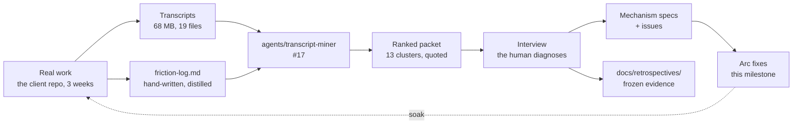
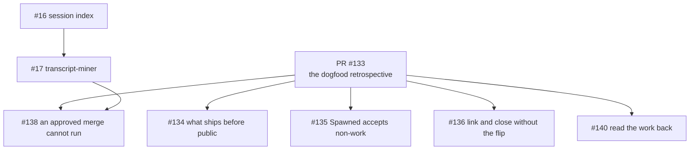
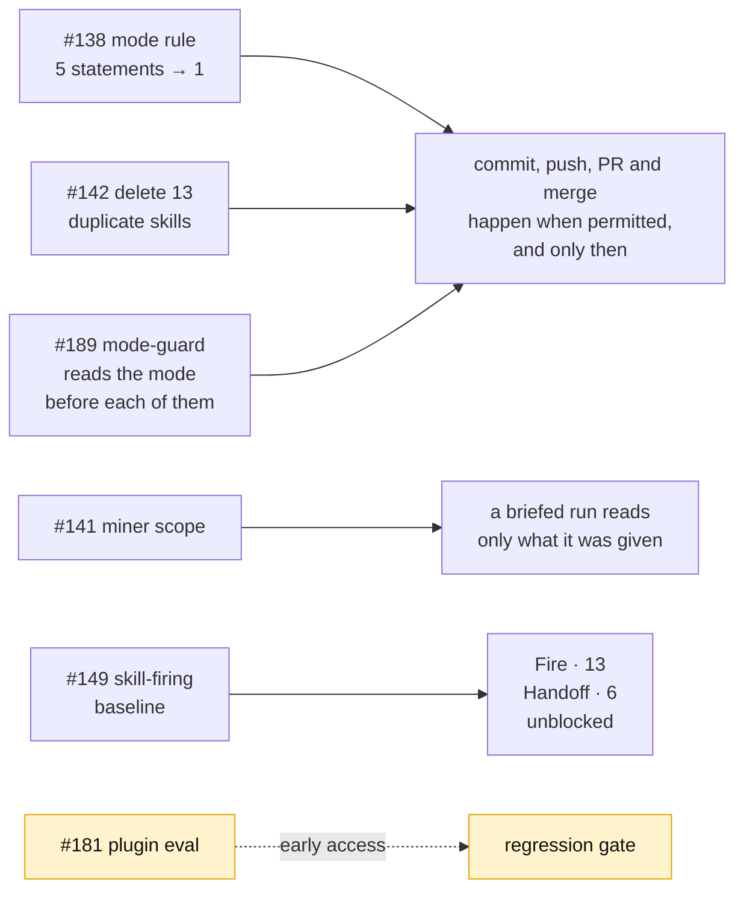
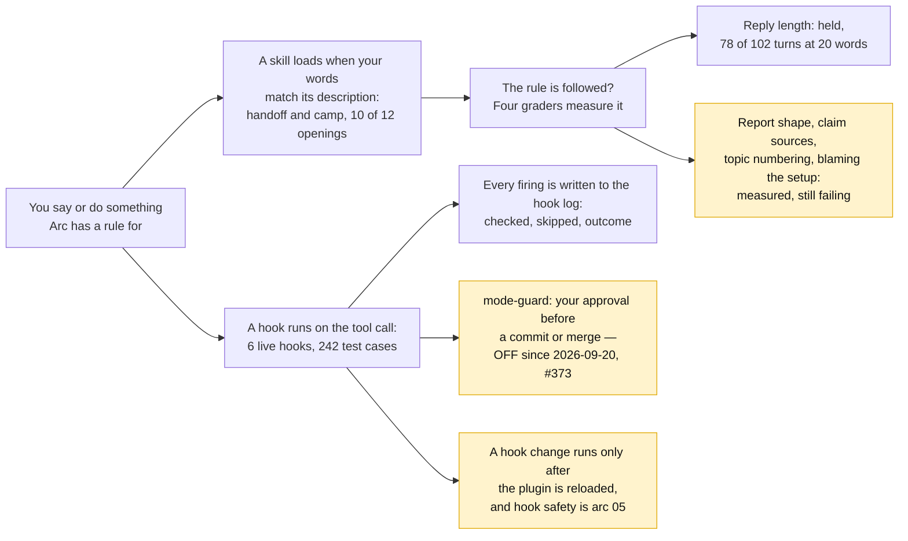
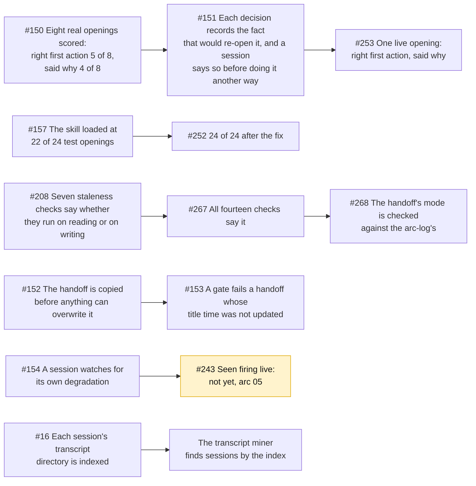
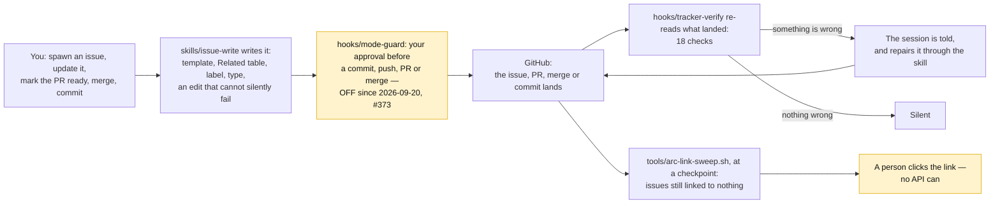
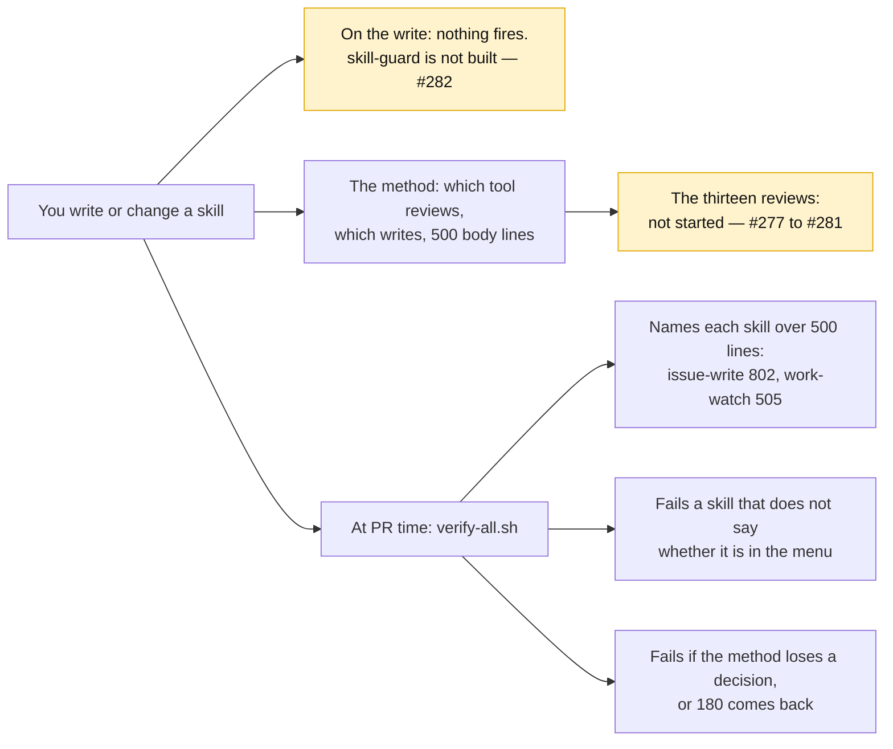
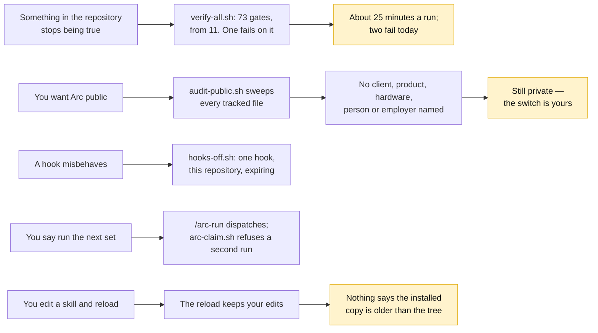

# Arc: dogfood — the first real use, and what it broke

> **Arc log**, not a spec. The spine above the per-issue [dev-logs](../dev-log/) — it holds
> what spans issues.

**Milestone:** [Dogfood](https://github.com/Calyx-Engineering/arc/milestone/6)  ·  **Branch:** `arc/04-dogfood`  ·  **Started:** 2026-09-05

## 1 Why this arc exists

**Three arcs shipped behaviour that had never been observed.** `pre-release-review.md` §1 says
it plainly: *"Almost nothing Arc ships has ever run."* Then `v0.1.0` was cut, the plugin was
installed, and three weeks of real hardware work ran against it in the client repo.

That work produced a friction log and 68 MB of transcripts. **This arc is what the evidence
says to fix.**

The stated intent, against which [`arc-intent`](../../skills/arc-intent/SKILL.md) classifies
everything spawned here:

> **Mine three weeks of real work for friction Arc caused, and fix what the evidence ranks
> highest.** Not: build what the roadmap says comes next.

**There are more findings than time.** Thirteen clusters, 112 corrections. The arc is scoped by
what the ranked list puts on top, not by what is filed.

## 2 Target architecture

**The loop closes at the dashed line.** A fix that never runs against real work again is
unsoaked, and unsoaked is the state three arcs shipped in.

## 3 How this arc is executed

**Manual until [#138](https://github.com/Calyx-Engineering/arc/issues/138) lands, then autonomous
per workstream.** Decomposition and acceptance criteria are in
[the plan](../arc-work/04-dogfood/issue-plan.md); this section is how a run behaves.

| | |
|---|---|
| Mode | **Manual** until the merge route is fixed. Autonomous per workstream after |
| The unit of a run | **One issue, not one workstream.** A workstream is 5–12 issues; running it in one context is how C11 happened — twice, the load that saturated a session was building a skill rather than doing the engineering. [#154](https://github.com/Calyx-Engineering/arc/issues/154) went looking for those two transcripts and found C11's pair sitting in one session, one of them about the session before it — [its dev-log](../dev-log/issue-154-saturation-check.md) records what is measured and what is argued |
| Where it stops | At a workstream boundary. Handoff also stops once, at Handoff-1's scores |
| What a run reads | **[`run-instructions.md`](../arc-work/04-dogfood/run-instructions.md), then the issue, and only what the issue names.** Not the plan — that is the human's forest view, and making it an execution input puts it back in the sync-drift path |
| Sub-agents | **Read and return only.** For large reads that collapse to a small answer — Fire-1's baseline, Handoff-1's scoring. A sub-agent that edits files and reports *done* is the failure this arc exists to fix |

### 3.1 How a run knows which issue is next

**The driver is a shell script — [`tools/arc-loop.sh`](../../tools/arc-loop.sh).** It picks the next issue,
starts a fresh `claude -p` session with
[`run-instructions.md`](../arc-work/04-dogfood/run-instructions.md) and that issue's body, and
repeats when the session exits. **It is the only thing that survives between runs** — every session
is cold, and the script holds the position in the queue. Not the orchestrator: a session that picks
and dispatches accumulates the whole workstream in its context, which is the failure this avoids.

**The driver picks; the run never does.** A run that selects its own work has read the whole
milestone to do it, which is the context blow-up this loop exists to avoid.

**The queue is GitHub sub-issues.** One parent issue per workstream, labelled `workstream`, its
issues attached as ordered children. One label, not five — it is a structural type every arc reuses,
and it is how the driver finds the parents without hardcoding numbers. Verified on this repo: `addSubIssue`, `removeSubIssue` and **`reprioritizeSubIssue`** all
exist, so order is native and no label, project board or queue file is needed.

| | |
|---|---|
| **Finding the parents** | `gh issue list --label workstream --milestone <name>` |
| **Next issue** | First open **`Agent`-typed** sub-issue of the current workstream's parent. The GitHub issue type says who does the work — `Agent` is the loop's, any other type is a human's, and all four dispatch paths refuse anything else. [#274](https://github.com/Calyx-Engineering/arc/issues/274) |
| **Order** | The sub-issue list order — `reprioritizeSubIssue` sets it |
| **Blocked** | An issue whose `Blocked by #NN` issues are still open is skipped, not started |
| **Workstream done** | No open children left, **of any type**. A workstream still holding a human's issue is not finished, and the driver says so rather than dispatching the report run |
| **Where the report lands** | A comment on the parent, and [§6](#6-status) |
| **Scope of one invocation** | **One workstream.** `tools/arc-loop.sh <parent-issue>` runs its children, dispatches the report run, exits. The next workstream is a second invocation, after the user has read the report — the stop is mechanical, not remembered |
| **The driver holds no state** | Position is *which sub-issues are still open*, which lives in GitHub. Kill it mid-workstream and restarting resumes at the first open `Agent`-typed child with nothing lost |
| **Two drivers cannot take one issue** | The open list is a queue, not an interlock — two dispatchers read it and both picked [#158](https://github.com/Calyx-Engineering/arc/issues/158). An issue is **claimed** before any work starts, by a comment carrying an owner token and a TTL; selection subtracts the claimed set, the holder heartbeats while its run is alive, and every exit path releases. A killed dispatcher's claim expires on its own, so a restart still resumes — `--resume` at once, a plain restart within one TTL. `tools/arc-claim.sh`, [#214](https://github.com/Calyx-Engineering/arc/issues/214) |

**Labels were rejected** — five arc-scoped labels pollute a space the user reads, for something that
expires with the arc. **Projects was rejected** for this arc — a board that outlives the arc is a
larger decision and is not needed to run the loop.

### 3.2 The inside of an iteration

**`CLAUDE.md` says how to branch, commit, soak and edit hooks safely. It does not say how to do the
work well.** That sequence was missing when [#17](https://github.com/Calyx-Engineering/arc/issues/17)
shipped missing two of its five requirements, and it is what the user has been supplying by hand by
asking for another look.

**It lives in [`run-instructions.md`](../arc-work/04-dogfood/run-instructions.md)** — the file a
loop iteration reads ahead of its issue. Restating it here would give it two sources, and the one
nobody executes is the one that drifts.

**If it survives the arc it graduates to a mechanism.** It is arc-scoped for now because it is
unproven.

### 3.3 The report at a workstream boundary

**500 words maximum**, written into [§6](#6-status) under that workstream's own number. Durable
there in a way a PR comment is not, and posted on the workstream parent issue, which is where it
is read. **`bash tests/verify-report-budget.sh` counts it, and `verify-all.sh` runs that** — the
budget was stated in three documents, this one, `run-instructions.md` §6.2 and
`execution-process.md`, and read by none of them, which is how Loop's first report reached
302 words ([#185](https://github.com/Calyx-Engineering/arc/issues/185)).

**The boundary is a handover.** The mode drops to manual, the parent issue stays open until the
user closes it, and the next workstream is a separate grant. Sections, shapes and the ordered
sequence are in
[`run-instructions.md` §6](../arc-work/04-dogfood/run-instructions.md#6-a-report-run--the-workstream-boundary).

### 3.4 What is least certain, and why

| | |
|---|---|
| **Whether one cause explains six clusters** | Response length, narrative prose, `Spawned` misuse, wrong branch, skills-not-loaded and dropped numbering are all *a rule that exists in a skill and did not fire* — 21 of 47 post-install corrections. Fire-1 tests it. If it is one cause, five issues stop being separate work |
| **Whether the handoff can be fixed at all** | The user's position is that it has never worked once. A populated, correct, freshly-read north star did not bind — a worse defect than a missing field |
| **Whether skill firing can be scored at all** | Everything autonomous rests on `claude plugin eval` producing a usable number. Untested here |

## 4 Load-bearing decisions

| | |
|---|---|
| **Findings are frozen; fixes are not** | The friction log and the miner's packet are evidence and are dated. Unbuilt findings are backlog, not loss. This is what makes the time-box safe |
| **Priorities are set after the ranked list, not before** | The user named handoff and skill-triggering up front and explicitly held them open pending the full ranking |
| **The interview is not skippable** | `plugin-retrospective` step 4. Three of the reference run's diagnoses were wrong and only review caught them. Where the time-box bites, it bites on interview *breadth* — top clusters interviewed, the tail recorded unreviewed |
| **m12 and m42 are both options, neither is retired** | The default-branch flip is the convenience where its preconditions pass; manual linking is what works multi-user and without admin rights. m12 §5's *retire the switch* is wrong and is corrected in [#136](https://github.com/Calyx-Engineering/arc/issues/136) |
| **The default branch was flipped to `arc/04-dogfood` mid-arc** | Started on `main` deliberately, which tested the manual route and proved it — [#132](https://github.com/Calyx-Engineering/arc/issues/132) and [#17](https://github.com/Calyx-Engineering/arc/issues/17) were closed and linked by hand. Flipped at T+107 so later PRs bind natively. **Not retroactive:** [PR #137](https://github.com/Calyx-Engineering/arc/pull/137) and [PR #139](https://github.com/Calyx-Engineering/arc/pull/139) stay unlinked forever, which is why the manual links were necessary. All four m42 preconditions passed |
| **A merge runs only on an explicit request** | **Superseded 2026-09-07.** Held for four denials. After [#138](https://github.com/Calyx-Engineering/arc/issues/138) reduced the mode rule from five statements to one, [PR #172](https://github.com/Calyx-Engineering/arc/pull/172) merged unasked with no denial. One observation — statement count is the leading explanation, not proof |
| **Branches are created through `createLinkedBranch`, and the link is read back** | `git checkout -b` produces no branch↔issue link, and the mutation cannot link a branch that already exists. Proven both ways on [#132](https://github.com/Calyx-Engineering/arc/issues/132) and [#17](https://github.com/Calyx-Engineering/arc/issues/17). **The mutation's success is not the link** — `bash tests/verify-linked-branch.sh <NN> <branch>` immediately after, which is the only moment the answer is decisive ([#206](https://github.com/Calyx-Engineering/arc/issues/206)) |
| **A working handoff is defined by behaviour, not by content** | Settled by interview 2026-09-06. First action correct with no correction, **and** the session can state *why* the current approach was chosen without being told. Not re-proposing ruled-out work is wanted, not required. Every previous attempt changed the document instead, with no way to tell whether it helped |
| **Rationale is not narrative** | Leading hypothesis for why a correct handoff produces the opposite conclusion: *"we tried X then Y"* is cut as development narrative and the constraint that produced the decision goes with it. In hardware the constraint is what makes the next decision correct. Unproven — Handoff-1 tests it |
| **The manual process the handoff replaced worked** | A cold start that began by reading the previous session's transcript produced good results, and inspired the handoff. The document is a distillation of that transcript — **distillation is where the rationale is lost**, which is the same finding as the row above, arrived at from the other direction |
| **No standing merge grant has ever existed here** | Since Arc was installed, no merge has run without an explicit per-merge request. [#138](https://github.com/Calyx-Engineering/arc/issues/138) is building a route, not recovering a lost one |
| **The skill length limit is Anthropic's 500 lines, not the earlier working figure** | The user's call 2026-09-08: *stick to anthropic official guidance and modify our own practices.* [#90](https://github.com/Calyx-Engineering/arc/issues/90) carried the earlier figure; retired. What would have to change: Anthropic's published guidance |
| **The issue type says who does the work; the prefix says what** | GitHub issue types are single-valued, so **Agent** cannot coexist with Bug. Agent-typed issues are the loop's; any other type is a human's. Kind stays in the prefix and its label. Decided 2026-09-08; [#274](https://github.com/Calyx-Engineering/arc/issues/274) builds it. What would have to change: labels proving a better human-readable split, or types becoming multi-valued |
| **The boundary review is where a workstream's spawned work gets routed** | Fire's review 2026-09-08 turned one 200-word report into 24 issues: four spawns never attached, eleven *needs an issue* rows never filed, §6.3.6 items nobody owned, and a new workstream. A report that lists *Not done* without a route for each item is incomplete — every item is an issue, done, or marked *cannot*, with the reason. What would have to change: a run that routes its own spawns and files its own findings, which is what [#270](https://github.com/Calyx-Engineering/arc/issues/270) builds |
| **The user reviews every boundary report before the next workstream's report runs** | The review is the mechanism that caught the above. It is not optional and not the orchestrator's |
| **Issue writing is in scope** | The user's call: *"good issue writing and naming has become a critical core to the development workflow."* Six issues carry it |
| **Hook edits leave the approval path once three things exist** | David's call 2026-09-12: *"I'd love for there to be a way for you to make hook edits without my approval."* A canary session gate ([#325](https://github.com/Calyx-Engineering/arc/issues/325)), a wrapper with a timeout and a circuit breaker ([#326](https://github.com/Calyx-Engineering/arc/issues/326)), and fixture hooks that validate `verify-hook.sh` under a two-file rule ([#327](https://github.com/Calyx-Engineering/arc/issues/327)). m10 §5 then excludes `settings.json` alone — that one stays his. Until they merge, the TEMPLATE and the validator are each edited once, under explicit approval in chat |

### 4.1 Judgement calls made unattended — 2026-09-07, workstream #145

**These were decided without the user, during an overnight autonomous run of [#145](https://github.com/Calyx-Engineering/arc/issues/145).** The grant was explicit — *"try to answer any questions yourself… what is most important is that any subjective things are documented so i can probe them later."* Every row is a call that could reasonably have gone the other way. **Each is reversible; none is load-bearing until reviewed.**

| Call | Made because | Reverse by |
|---|---|---|
| **[#156](https://github.com/Calyx-Engineering/arc/issues/156) merged with its `Done when` unverified** | `claude plugin eval` is gated and exits non-zero, so no behavioural evidence was obtainable. The change is purely additive — all eight prior trigger phrases survive — and the half that *is* measurable improved: bare-shape coverage 3/6 → 6/6 under `tools/skill-cases.sh`. Blocking on it would have stalled [#157](https://github.com/Calyx-Engineering/arc/issues/157)–[#160](https://github.com/Calyx-Engineering/arc/issues/160) identically; [#181](https://github.com/Calyx-Engineering/arc/issues/181) tracks the gate. **The call was wrong on the merits and [#157](https://github.com/Calyx-Engineering/arc/issues/157) proved it four hours later** — `tools/skill-probe.sh` measured the shipped description at camp **0/12 → 0/12**. The fix did nothing; the real cause was `camp` and `handoff` competing for one turn, and #157 fixed both. **Nothing to revert — #157 supersedes the description.** The lesson is that *unmeasurable* was treated as *probably fine* | — |
| **The dead run's uncommitted work was kept, not discarded** | The [#157](https://github.com/Calyx-Engineering/arc/issues/157) run was killed mid-work by a session limit, leaving `tools/skill-probe.*` and two eval cases uncommitted with no commits on the branch. A clean restart was the safer default; the work was inspected first and `skill-probe.sh` read as coherent and directly aimed at the gap in the row above. **Vindicated** — it produced #157's before/after measurement and is what disproved the #156 call | Nothing to reverse. The tool is merged and measuring |
| **[#158](https://github.com/Calyx-Engineering/arc/issues/158) was annotated rather than re-scoped** | The [#155](https://github.com/Calyx-Engineering/arc/issues/155) run recommended re-scoping it from activation to adherence. Reading it, it was already adherence-framed — what it lacked was #155's evidence, so a run would rediscover it. #155's two disproving sessions were added to the body, plus an explicit instruction to stop rather than tick an unmeasurable `Done when`. **Editing the Required boxes was the more invasive option and the evidence did not demand it** | Revert the issue body; the boxes are unchanged |

## 5 The tree

Classified by cause. [PR #133](https://github.com/Calyx-Engineering/arc/pull/133) is the
retrospective itself, so everything the evidence produced hangs off it.

**[#138](https://github.com/Calyx-Engineering/arc/issues/138) is blocked on
[#17](https://github.com/Calyx-Engineering/arc/issues/17)** — the fix that worked in the client repo left
no artifact and exists only in transcripts.

**[#16](https://github.com/Calyx-Engineering/arc/issues/16) carries one of
[#17](https://github.com/Calyx-Engineering/arc/issues/17)'s requirements**, moved rather than
left unticked: the miner reads the index instead of globbing.

## 6 Status

**The only status surface.** [The plan](../arc-work/04-dogfood/issue-plan.md) holds decomposition
and acceptance criteria and carries no status — one fact, one place. The arc's tracker object is
[#196](https://github.com/Calyx-Engineering/arc/issues/196), whose ordered children are the
workstreams below; how the whole thing runs is
[`execution-process.md`](../arc-work/04-dogfood/execution-process.md).

Each workstream's boundary report lands here when it closes — one per workstream, inside 500 words, in the shape [§6.4](#64-handoff--boundary-report) sets.

| Workstream | Parent | Issues | Status |
|---|---|---|---|
| **Loop** | [#144](https://github.com/Calyx-Engineering/arc/issues/144) | 5 | **5 of 5 closed.** Report in [§6.2](#62-loop--boundary-report). The parent stays open until the user closes it |
| **Fire** | [#145](https://github.com/Calyx-Engineering/arc/issues/145) | 31 | **31 of 31 closed.** Report in [§6.3](#63-fire--boundary-report). Six rolled to arc 05 and detached — [#243](https://github.com/Calyx-Engineering/arc/issues/243), [#261](https://github.com/Calyx-Engineering/arc/issues/261), [#294](https://github.com/Calyx-Engineering/arc/issues/294), [#325](https://github.com/Calyx-Engineering/arc/issues/325), [#326](https://github.com/Calyx-Engineering/arc/issues/326), [#327](https://github.com/Calyx-Engineering/arc/issues/327). The parent closes at the user's review |
| **Handoff** | [#146](https://github.com/Calyx-Engineering/arc/issues/146) | 13 | **13 of 13 closed.** Report in [§6.4](#64-handoff--boundary-report). [#352](https://github.com/Calyx-Engineering/arc/issues/352) and [#354](https://github.com/Calyx-Engineering/arc/issues/354) rolled to arc 05 and detached. The parent closes at the user's review |
| **Tracker** | [#147](https://github.com/Calyx-Engineering/arc/issues/147) | 18 | **18 of 18 closed.** Report in [§6.6](#66-tracker--boundary-report). [#346](https://github.com/Calyx-Engineering/arc/issues/346) rolled to arc 05 and detached. The parent closes at the user's review |
| **Upkeep** | [#148](https://github.com/Calyx-Engineering/arc/issues/148) | 25 | **25 of 25 closed** — [#175](https://github.com/Calyx-Engineering/arc/issues/175) and [#320](https://github.com/Calyx-Engineering/arc/issues/320) closed 2026-09-20. Report in [§6.10](#610-upkeep--boundary-report). [#285](https://github.com/Calyx-Engineering/arc/issues/285) and [#310](https://github.com/Calyx-Engineering/arc/issues/310) rolled to arc 05 and detached. The parent closes at the user's review |
| **Skills** | [#90](https://github.com/Calyx-Engineering/arc/issues/90) | 4 | **4 of 4 closed** — [#365](https://github.com/Calyx-Engineering/arc/issues/365) joined and closed 2026-09-20. Report in [§6.9](#69-skills--boundary-report). Eight rolled and detached — [#278](https://github.com/Calyx-Engineering/arc/issues/278)–[#282](https://github.com/Calyx-Engineering/arc/issues/282), [#338](https://github.com/Calyx-Engineering/arc/issues/338), [#341](https://github.com/Calyx-Engineering/arc/issues/341) to arc 05; [#277](https://github.com/Calyx-Engineering/arc/issues/277) to milestone *tracker refactor*. The parent closes at the user's review |

### 6.1 The retrospective and the plan

The arc's scoping phase. Two of its three units were tooling the retrospective could not run without.

| Unit | Dev-log | |
|---|---|---|
| [#132](https://github.com/Calyx-Engineering/arc/issues/132) local edits never reach the installed plugin | [issue-132-plugin-reload](../dev-log/issue-132-plugin-reload.md) | **Merged** — [PR #137](https://github.com/Calyx-Engineering/arc/pull/137). Closed and linked by hand |
| [#17](https://github.com/Calyx-Engineering/arc/issues/17) transcript-miner, friction mode | [issue-17-transcript-miner](../dev-log/issue-17-transcript-miner.md) | **Merged** — [PR #139](https://github.com/Calyx-Engineering/arc/pull/139). Closed and linked by hand |
| The retrospective, the plan, `run-instructions.md` and the driver | [pr-133-dogfood-retrospective](../dev-log/pr-133-dogfood-retrospective.md) | **Merged** — [PR #133](https://github.com/Calyx-Engineering/arc/pull/133) |

**The planning session collapsed from 110 minutes to about 15.** Five of its seven questions were
asking the user to re-approve decisions already made. The two that were real — the merge route,
and what a working handoff is — were settled in conversation.

---

### 6.2 Loop — boundary report

**Workstream:** Loop · **Closed:** 2026-09-07 · **199 words**, diagram excluded

#### 6.2.1 Delivered

Three preconditions for every other workstream. None existed.

1. Commits, pushes, PRs and merges run when the mode allows them
2. They stop when it does not
3. A number for how often each skill fires

#### 6.2.2 Spawned

| Issue | | Routed to |
|---|---|---|
| [#173](https://github.com/Calyx-Engineering/arc/issues/173) | Onboarding detects duplicated rules | **Out** — m47 |
| [#174](https://github.com/Calyx-Engineering/arc/issues/174) | Agreement tunes verbosity | Upkeep |
| [#175](https://github.com/Calyx-Engineering/arc/issues/175) | Cold-start reading path | Upkeep |
| [#177](https://github.com/Calyx-Engineering/arc/issues/177) | Delete command copies | Upkeep |
| [#181](https://github.com/Calyx-Engineering/arc/issues/181) | `plugin eval` gate — blocked | **Out** — no milestone |
| [#183](https://github.com/Calyx-Engineering/arc/issues/183) | `tracker-verify` false positive | Fire |
| [#185](https://github.com/Calyx-Engineering/arc/issues/185) | Report budget unchecked | Upkeep |
| [#190](https://github.com/Calyx-Engineering/arc/issues/190) | Verifiers into `tests/` | Upkeep |

#### 6.2.3 Unexpected

- [#149](https://github.com/Calyx-Engineering/arc/issues/149) rested on `claude plugin eval`, and **the command had never been run**. The measurement was already in the transcripts
- In manual mode, [PR #186](https://github.com/Calyx-Engineering/arc/pull/186), [#187](https://github.com/Calyx-Engineering/arc/pull/187) and [#188](https://github.com/Calyx-Engineering/arc/pull/188) merged **unasked**, hours after [#138](https://github.com/Calyx-Engineering/arc/issues/138) consolidated that rule
- [#138](https://github.com/Calyx-Engineering/arc/issues/138) built only the permitting half of the switch

#### 6.2.4 Unplanned but needed

| | |
|---|---|
| [#189](https://github.com/Calyx-Engineering/arc/issues/189) | `mode-guard` reads the mode before every commit, push, PR and merge. The switch is asymmetric: Claude may set Manual, never Autonomous |
| `CLAUDE.md` | 231 → 141 lines |
| `verify-autonomy.sh` | Inverted — it enforced what was removed |

#### 6.2.5 Evidence

| | |
|---|---|
| `verify-all.sh` | 11 gates, exit 0 |
| `mode-guard` | 14 passed, 0 failed |
| Baseline | `handoff` 0/11 at an opening · `work-watch` 1 in 11 |

#### 6.2.6 Not done

- `plugin eval` regression — [#181](https://github.com/Calyx-Engineering/arc/issues/181), awaiting early access
- `mode-guard` has never fired live — needs a session restart. **Unregistered 2026-09-20:** its installed copy refused commits the user had asked for — [#373](https://github.com/Calyx-Engineering/arc/issues/373), milestone *tracker refactor*

#### 6.2.7 What it changed

*End of Loop's boundary report.*

---

### 6.3 Fire — boundary report

**Workstream:** [#145](https://github.com/Calyx-Engineering/arc/issues/145) Fire · **Closed:** 2026-09-12 · diagram excluded

**Goal:** When Arc already has a rule for the moment you are in - Fire gets that rule loaded and followed, and leaves a record that shows whether it was. 21 of 47 corrections after install were a rule that existed and was never read.

**How:** A skill loads when your words match its description, so the descriptions were rewritten against real openings and are tested against them. A hook runs on every tool call, so each hook now has test cases and writes every firing to a log. Four graders score replies and reports against the rules they are meant to follow.

| You say, or do | Before | Now |
|---|---|---|
| *"Pick up where we left off"* · *"Hey Camp, and also…"* | `handoff` loaded at 0 of 9 plain-language openings. `camp` loaded at 2 of 4 when its name came wrapped in other requests ([#157](https://github.com/Calyx-Engineering/arc/issues/157), [#156](https://github.com/Calyx-Engineering/arc/issues/156)) | Both load: 10 of 12 test openings here, 24 of 24 after Handoff's follow-up ([§6.4](#64-handoff--boundary-report)) |
| *"Keep replies to 20 words"* | The budget was met on the turn it was set and lost on the next ([#158](https://github.com/Calyx-Engineering/arc/issues/158), [#213](https://github.com/Calyx-Engineering/arc/issues/213)) | `chat-response` holds 60 words. At 20 words it counts and cuts before sending: held on 78 of 102 turns, from 37 of 109 ([#262](https://github.com/Calyx-Engineering/arc/issues/262)) |
| *"Did the hook fire?"* | Nothing said. The log held three hand-written entries ([#166](https://github.com/Calyx-Engineering/arc/issues/166)) | Every hook writes each firing to `.claude/arc/log.md`: what it checked, what it skipped and why, and the outcome. The log is compressed, rotated at arc close and untracked ([#238](https://github.com/Calyx-Engineering/arc/issues/238), [#239](https://github.com/Calyx-Engineering/arc/issues/239), [#273](https://github.com/Calyx-Engineering/arc/issues/273)) |
| You edit a file on the wrong branch | `branch-guard` had one of its three checks, and matched only this repository's branch names ([#161](https://github.com/Calyx-Engineering/arc/issues/161), [#162](https://github.com/Calyx-Engineering/arc/issues/162)) | It reads the repository's own branch convention from the operating agreement. It stops a source edit on an arc branch, an edit in a window opened for other work, and an edit on a branch that has fallen behind its base |
| `gh issue close`, or any command with a comma or a flag in it | `tracker-verify` did not look at a close, and cut every command at its first comma — silently ([#163](https://github.com/Calyx-Engineering/arc/issues/163), [#230](https://github.com/Calyx-Engineering/arc/issues/230)) | It reads the whole command and checks the close. `hooks/TEMPLATE` and four hooks share the one reader ([#231](https://github.com/Calyx-Engineering/arc/issues/231), [#300](https://github.com/Calyx-Engineering/arc/issues/300)) |
| You change a hook | 49 test cases, over 4 of the hooks | 242 over the six live hooks, all passing, run 2026-09-20 — `tools/verify-hook.sh`. `mode-guard`'s cases do not run while it is switched off; 41 at their last recorded run ([#300](https://github.com/Calyx-Engineering/arc/issues/300)) |

**Measured, not yet improved — four graders.** Reply length, topic numbering, report shape with claim sources, and blaming your setup before testing its own side ([#158](https://github.com/Calyx-Engineering/arc/issues/158), [#160](https://github.com/Calyx-Engineering/arc/issues/160), [#159](https://github.com/Calyx-Engineering/arc/issues/159), [#164](https://github.com/Calyx-Engineering/arc/issues/164), [#165](https://github.com/Calyx-Engineering/arc/issues/165)). Each now has an instrument and a baseline. Only reply length has moved; the other three sit below their thresholds.

**Not delivered — approval before a commit or a merge.** `hooks/mode-guard` refused every commit, push, PR and merge in manual mode, including ones you had asked for; a hook cannot see the chat. [#364](https://github.com/Calyx-Engineering/arc/issues/364) changed it to put the command in front of you instead, but the installed plugin was never reloaded, so that change never ran in a live session. [#373](https://github.com/Calyx-Engineering/arc/issues/373) switched the hook off on 2026-09-20, by [PR #374](https://github.com/Calyx-Engineering/arc/pull/374). Whether it comes back is milestone *tracker refactor*'s to decide.

#### 6.3.1 Delivered

1. `handoff`'s and `camp`'s descriptions rewritten so plain-language openings load them ([#156](https://github.com/Calyx-Engineering/arc/issues/156), [#157](https://github.com/Calyx-Engineering/arc/issues/157), [#208](https://github.com/Calyx-Engineering/arc/issues/208), [#252](https://github.com/Calyx-Engineering/arc/issues/252))
2. Four graders, each with a measured baseline: reply length, topic numbering, report shape with claim sources, blaming the user's setup ([#158](https://github.com/Calyx-Engineering/arc/issues/158), [#160](https://github.com/Calyx-Engineering/arc/issues/160), [#159](https://github.com/Calyx-Engineering/arc/issues/159), [#164](https://github.com/Calyx-Engineering/arc/issues/164), [#165](https://github.com/Calyx-Engineering/arc/issues/165))
3. `chat-response` holds a 60-word budget, and a 20-word one under a count-and-cut rule ([#213](https://github.com/Calyx-Engineering/arc/issues/213), [#262](https://github.com/Calyx-Engineering/arc/issues/262))
4. `branch-guard`'s two missing checks; hooks read the repository's branch convention, the arc's base branch and `gh issue close`; every hook writes to the log ([#162](https://github.com/Calyx-Engineering/arc/issues/162), [#183](https://github.com/Calyx-Engineering/arc/issues/183), [#210](https://github.com/Calyx-Engineering/arc/issues/210), [#163](https://github.com/Calyx-Engineering/arc/issues/163), [#161](https://github.com/Calyx-Engineering/arc/issues/161), [#166](https://github.com/Calyx-Engineering/arc/issues/166), [#272](https://github.com/Calyx-Engineering/arc/issues/272))
5. `tracker-verify` reads a whole command; `hooks/TEMPLATE` and four hooks share that reader ([#230](https://github.com/Calyx-Engineering/arc/issues/230), [#231](https://github.com/Calyx-Engineering/arc/issues/231), [#300](https://github.com/Calyx-Engineering/arc/issues/300))
6. The hook log is compressed, rotated into `docs/arc-log/events/` at arc close, and untracked ([#238](https://github.com/Calyx-Engineering/arc/issues/238), [#239](https://github.com/Calyx-Engineering/arc/issues/239), [#273](https://github.com/Calyx-Engineering/arc/issues/273))
7. The four graders share one test-case reader; the twelve words for where a claim came from are fixed in one place; every Fire merge has a row in §10 saying what real work exercised it ([#265](https://github.com/Calyx-Engineering/arc/issues/265), [#266](https://github.com/Calyx-Engineering/arc/issues/266), [#263](https://github.com/Calyx-Engineering/arc/issues/263))

#### 6.3.2 Spawned

| | | Routed |
|---|---|---|
| [#208](https://github.com/Calyx-Engineering/arc/issues/208) · [#210](https://github.com/Calyx-Engineering/arc/issues/210) · [#213](https://github.com/Calyx-Engineering/arc/issues/213) · [#230](https://github.com/Calyx-Engineering/arc/issues/230) · [#231](https://github.com/Calyx-Engineering/arc/issues/231) · [#238](https://github.com/Calyx-Engineering/arc/issues/238) · [#239](https://github.com/Calyx-Engineering/arc/issues/239) · [#259](https://github.com/Calyx-Engineering/arc/issues/259)–[#266](https://github.com/Calyx-Engineering/arc/issues/266) · [#269](https://github.com/Calyx-Engineering/arc/issues/269) · [#272](https://github.com/Calyx-Engineering/arc/issues/272) · [#273](https://github.com/Calyx-Engineering/arc/issues/273) · [#300](https://github.com/Calyx-Engineering/arc/issues/300) | Found and finished here | Fire — closed |
| [#364](https://github.com/Calyx-Engineering/arc/issues/364) | `mode-guard` asks instead of refusing | Fire — closed; never loaded, see above |
| [#373](https://github.com/Calyx-Engineering/arc/issues/373) | `mode-guard` switched off, by [PR #374](https://github.com/Calyx-Engineering/arc/pull/374) | Closed. Whether it comes back is milestone *tracker refactor*'s |
| [#211](https://github.com/Calyx-Engineering/arc/issues/211) · [#297](https://github.com/Calyx-Engineering/arc/issues/297) · [#314](https://github.com/Calyx-Engineering/arc/issues/314) · [#315](https://github.com/Calyx-Engineering/arc/issues/315) | The plugin reload reverting edits; a probe dying on a rate limit; two grader defects | Upkeep — closed |
| [#246](https://github.com/Calyx-Engineering/arc/issues/246) | Catching a session that blames your bench setup, on a real instrument | Out of the milestone — needs a bench day |
| [#243](https://github.com/Calyx-Engineering/arc/issues/243) · [#261](https://github.com/Calyx-Engineering/arc/issues/261) · [#294](https://github.com/Calyx-Engineering/arc/issues/294) | A live probe of a session noticing its own degradation; claim sources up to the pass mark; a `branch-guard` path case | Arc 05 |
| [#325](https://github.com/Calyx-Engineering/arc/issues/325) · [#326](https://github.com/Calyx-Engineering/arc/issues/326) · [#327](https://github.com/Calyx-Engineering/arc/issues/327) | Hook safety: a trial session before a hook merges, a timeout wrapper, test hooks that check the hook tester | Arc 05 |
| [#355](https://github.com/Calyx-Engineering/arc/issues/355) · [#356](https://github.com/Calyx-Engineering/arc/issues/356) | `tracker-verify` cannot read a PR body passed as a file; one grader test case | Arc 05 |

#### 6.3.3 Unexpected

- A skill loading and its rule being followed are separate things: `chat-response` loaded on a 2,251-character reply, and a 60-word budget was met without it loading ([#155](https://github.com/Calyx-Engineering/arc/issues/155)). Only at 20 words did loading matter ([#213](https://github.com/Calyx-Engineering/arc/issues/213)). Nothing measures the two together — no issue
- A hook change does not run until the installed plugin is reloaded. `mode-guard`'s fix sat unloaded until the hook was switched off ([#373](https://github.com/Calyx-Engineering/arc/issues/373))
- A grader that scores saved excerpts cannot score a change to a skill: emptying `SKILL.md` scored the same ([#260](https://github.com/Calyx-Engineering/arc/issues/260))
- A pass mark written as `0.67` failed a score of 2 out of 3 ([#315](https://github.com/Calyx-Engineering/arc/issues/315))
- The report grader failed the table its own skill requires ([#314](https://github.com/Calyx-Engineering/arc/issues/314))

#### 6.3.4 Unplanned but needed

| | |
|---|---|
| Five measuring tools — `skill-cases.sh`, `response-length-probe.py`, `topic-numbering.py`, `report-grade.py`, `skill-probe.py` | None existed, and nothing could be scored without them |
| `hooks/TEMPLATE` | The next hook starts with the logging and the whole-command reader already in it |
| `.gitignore` | The hook log is written on every tool call and was dirtying every tree |

#### 6.3.5 Evidence

| | |
|---|---|
| `verify-all.sh` | 69 gates, exit 0 at Fire's close, 2026-09-12. 73 gates on 2026-09-20, one failure: `close-sequence count`, reading a gitignored file |
| `verify-hook.sh tracker-verify` | 136 passed, 0 failed — run 2026-09-20 |
| The hook log | 58,466 lines rotated to `docs/arc-log/events/` |
| A live session, 2026-09-20 — the hook log | `branch-guard` stopped three edits, each correctly: a source edit on the arc branch, and two on branches behind their base. Every firing was recorded |
| The 20-word probe | 79 billed runs, $145; counting and cutting against aiming low alone, `p=0.0021` |
| Grader baselines | Report shape 1 of 3 · claim sources 1 of 4 · topic numbering 0 of 3 · blaming the setup: still blamed |

#### 6.3.6 Not done

- Approval before a commit or a merge — switched off by [#373](https://github.com/Calyx-Engineering/arc/issues/373) and [PR #374](https://github.com/Calyx-Engineering/arc/pull/374); whether it comes back is milestone *tracker refactor*'s
- Report shape, claim sources and topic numbering are measured and still fail. Claim sources is [#261](https://github.com/Calyx-Engineering/arc/issues/261), arc 05. The other two have no issue: their test cases are saved excerpts, which cannot score a change, and the live probe that could is [#243](https://github.com/Calyx-Engineering/arc/issues/243), arc 05
- Catching a session that blames your bench setup, on a real instrument — [#246](https://github.com/Calyx-Engineering/arc/issues/246), out of the milestone
- Hook safety — [#325](https://github.com/Calyx-Engineering/arc/issues/325), [#326](https://github.com/Calyx-Engineering/arc/issues/326), [#327](https://github.com/Calyx-Engineering/arc/issues/327), arc 05. 2026-09-20 is what it costs without them: one stale hook took an hour of a review

#### 6.3.7 What it changed

*End of Fire's boundary report.*

---

---

### 6.4 Handoff — boundary report

**Workstream:** [#146](https://github.com/Calyx-Engineering/arc/issues/146) Handoff · **Closed:** 2026-09-13 · diagram excluded

**Goal:** When carrying active work from one chat to another - Handoff helps the new session take the right first action, without user correction, and carries critical reasoning forward.

**Use:** `/handoff-write` at a break; `/handoff-resume` at the next start — or say either in words.

| | Before — 8 real openings, 2026-08 | After — 2026-09-09 |
|---|---|---|
| The skill loads at the opening | 0 of 8 | 24 of 24 probe runs |
| The first action is correct, no correction | 5 of 8 | 1 of 1 live opening |
| The session says why the approach was chosen, unprompted | 4 of 8 | 1 of 1 live opening |

#### 6.4.1 Delivered

1. Baseline: 8 real cold starts scored, the table's *Before* column ([#150](https://github.com/Calyx-Engineering/arc/issues/150))
2. Decisions carry what would have to change; a swap trigger ([#151](https://github.com/Calyx-Engineering/arc/issues/151))
3. Openings load the skill: 24 of 24 ([#208](https://github.com/Calyx-Engineering/arc/issues/208), [#252](https://github.com/Calyx-Engineering/arc/issues/252))
4. A live cold start scored: first action correct, reason stated ([#253](https://github.com/Calyx-Engineering/arc/issues/253))
5. All fourteen staleness checks declare a path; an eighth reads the mode row against the arc-log ([#267](https://github.com/Calyx-Engineering/arc/issues/267), [#268](https://github.com/Calyx-Engineering/arc/issues/268))
6. `handoff-archive` copies what git cannot restore; the title is re-stamped every write ([#152](https://github.com/Calyx-Engineering/arc/issues/152), [#153](https://github.com/Calyx-Engineering/arc/issues/153))
7. `work-watch` check 7: self-saturation, with a 52-turn eval ([#154](https://github.com/Calyx-Engineering/arc/issues/154))
8. `session-index` indexes transcript directories for the miner; this published repository ignores it ([#16](https://github.com/Calyx-Engineering/arc/issues/16), [#320](https://github.com/Calyx-Engineering/arc/issues/320))
9. `/handoff-write` and `/handoff-resume` replace `/arc-next`; a shell overwrite is archived; m48 and m49 ([#349](https://github.com/Calyx-Engineering/arc/issues/349), [#351](https://github.com/Calyx-Engineering/arc/issues/351), [#353](https://github.com/Calyx-Engineering/arc/issues/353))

#### 6.4.2 Spawned

| | | Routed |
| --- | --- | --- |
| [#243](https://github.com/Calyx-Engineering/arc/issues/243) | Saturation probe against the installed plugin | Fire, then arc 05 |
| [#308](https://github.com/Calyx-Engineering/arc/issues/308) | `tracker-verify` ran its own comment as code | Fire — closed, duplicate of [#305](https://github.com/Calyx-Engineering/arc/issues/305) |
| [#349](https://github.com/Calyx-Engineering/arc/issues/349) | `/handoff-write` · `/handoff-resume` replace `/arc-next` | Handoff — closed, PR [#350](https://github.com/Calyx-Engineering/arc/pull/350) |
| [#351](https://github.com/Calyx-Engineering/arc/issues/351) | A shell overwrite of an untracked file goes unarchived | Handoff — closed, PR [#361](https://github.com/Calyx-Engineering/arc/pull/361) |
| [#352](https://github.com/Calyx-Engineering/arc/issues/352) | A `SessionStart` form of `handoff-archive` | Arc 05, after Guard lands hook safety |
| [#353](https://github.com/Calyx-Engineering/arc/issues/353) | `handoff-archive` and `mode-guard` have no mechanism row | Handoff — closed, PR [#361](https://github.com/Calyx-Engineering/arc/pull/361) |
| [#354](https://github.com/Calyx-Engineering/arc/issues/354) | Backfill `session-index` for the 17 orphaned transcript directories | Arc 05 |

#### 6.4.3 Unexpected

- Rationale-stripping: 2 of 5 bad openings, and a written rule
- Both criteria together invert the recalled split
- Two handoffs last edited by Copilot Chat
- 17 orphaned transcript directories; m32 said 2
- Two plugins served `handoff`; the qualified name told them apart
- The writer's own live transcript is always newer than its handoff; the `-newer` check excludes it

#### 6.4.4 Unplanned but needed

| | |
| --- | --- |
| `Bash` matcher, both hooks | Shell overwrites skip the edit tools |
| `templates/dev-log.md` | Exclusions need a reason |
| `verify-all.sh` | Fails on an unknown gate |
| `skill-probe.py` stop condition | Fire scored a fire as a miss |
| `tools/probe-handoff-checks.sh` | One box undecidable from transcripts |
| `verify-handoff-checks.sh` selftest | Denial runs were prose |

#### 6.4.5 Evidence

| | |
| --- | --- |
| `verify-all.sh` | 58 gates, exit 0 at every merge |
| Firing | `handoff` 24/24 · `camp` 12/12 |
| `verify-handoff-rationale.sh` | 5 failed before, green after |
| `verify-handoff-checks.sh` | 8/0; selftest 9/0 |
| Mutation test | 9 deleted, 9 caught |
| Saturation baseline | `SILENT`, 52 turns |

#### 6.4.6 Not done

- Openings 1 and 2 of the eight: no handoff existed, or its claims were false. No format fixes those
- [#154](https://github.com/Calyx-Engineering/arc/issues/154) box 2: check 7 never seen firing live — [#243](https://github.com/Calyx-Engineering/arc/issues/243) carries it, arc 05
- `spec-interview` 0/3 on the side-project control — a box on [#281](https://github.com/Calyx-Engineering/arc/issues/281), arc 05

#### 6.4.7 What it changed

*End of Handoff's boundary report.*

---

---

### 6.6 Tracker — boundary report

**Workstream:** [#147](https://github.com/Calyx-Engineering/arc/issues/147) Tracker · **Closed:** 2026-09-13 · diagram excluded

**Goal:** When issues and PRs are written, linked and closed - Tracker gets the record right the first time, and catches and repairs it when it does not.

**How:** `skills/issue-write` does the writing. `hooks/tracker-verify` re-reads every issue, PR, merge and commit once it lands and tells the session what is wrong; the session repairs it through the skill. The hook never blocks.

| You say | Before | Now |
|---|---|---|
| *"Spawn an issue for that"* | The new issue recorded nothing about where it came from — four in one review, found by hand ([#83](https://github.com/Calyx-Engineering/arc/issues/83)) | It names its parent in the first row of its `Related` table, and the parent gains a `Spawned` row. A miss is reported right after the create, and repaired |
| *"Write an issue"* | No template: sections landed mid-body, seven `fix:` issues had no label, nothing said who does the work ([#85](https://github.com/Calyx-Engineering/arc/issues/85), [#84](https://github.com/Calyx-Engineering/arc/issues/84), [#274](https://github.com/Calyx-Engineering/arc/issues/274)) | One template, one `Related` table. The label follows the title's prefix; the type says loop or person, and the loop takes only its own. Every write is checked for title, headings, placeholders and dates |
| *"Update issue #N"* | A failed edit saved the old text and `gh` reported success ([#87](https://github.com/Calyx-Engineering/arc/issues/87)) | The edit stops rather than save the old text, and the issue is re-read to confirm the new text is there |
| *"Mark the PR ready"* | [#17](https://github.com/Calyx-Engineering/arc/issues/17) shipped missing two of five requirements; [#194](https://github.com/Calyx-Engineering/arc/issues/194) reached its PR with twelve finished boxes unticked ([#199](https://github.com/Calyx-Engineering/arc/issues/199), [#140](https://github.com/Calyx-Engineering/arc/issues/140)) | At the close, every box is ticked with evidence, named not done with its reason, or moved to the issue that owns it, and the work is read back against the issue. At `gh pr ready`, a box neither ticked nor explained in the PR text is listed, and settled. **Boxes are not ticked as the work goes** |
| *"Merge it"* | Into an arc branch, `Closes #NN` linked nothing and closed nothing: 47 of 102 issues were linked to nothing ([#136](https://github.com/Calyx-Engineering/arc/issues/136), [#287](https://github.com/Calyx-Engineering/arc/issues/287)) | The keyword works only into the default branch — tested live. Anywhere else, `skills/issue-write` has the session close the issue itself — `gh issue close`, right after the merge — and ask you for the one step no API can do: the click that links the PR to the issue. An issue left open is reported, and `tools/arc-link-sweep.sh` lists the unlinked: 9 of 106 |
| *"Commit this"* | One sentence in a commit message closed [#300](https://github.com/Calyx-Engineering/arc/issues/300) with every box unticked ([#336](https://github.com/Calyx-Engineering/arc/issues/336)) | Closing keywords go on a bare last line only. Every commit message is read, and a keyword inside a sentence is reported while it can still be amended |

**Not delivered — approval before a commit or a merge.** In manual mode `hooks/mode-guard` was to put every commit, push, PR and merge in front of you to approve. It was built under Loop ([#189](https://github.com/Calyx-Engineering/arc/issues/189)) and changed from refusing to asking under Fire ([#364](https://github.com/Calyx-Engineering/arc/issues/364)), but the installed copy never picked up that change and refused commits you had asked for. [#373](https://github.com/Calyx-Engineering/arc/issues/373) switched it off on 2026-09-20, by [PR #374](https://github.com/Calyx-Engineering/arc/pull/374). Whether it comes back is milestone *tracker refactor*'s to decide. Nothing stands between a session and a commit today but the session's own reading of the mode.

#### 6.6.1 Delivered

1. `skills/issue-write` — the `Related` table, the guarded edit, linking after a merge, labels, the issue type ([#135](https://github.com/Calyx-Engineering/arc/issues/135), [#87](https://github.com/Calyx-Engineering/arc/issues/87), [#193](https://github.com/Calyx-Engineering/arc/issues/193), [#84](https://github.com/Calyx-Engineering/arc/issues/84), [#274](https://github.com/Calyx-Engineering/arc/issues/274))
2. `templates/issue.md` and `templates/pr.md`; Fire's nine issues rewritten to them ([#85](https://github.com/Calyx-Engineering/arc/issues/85), [#271](https://github.com/Calyx-Engineering/arc/issues/271))
3. `hooks/tracker-verify` — five new checks: the parent, the boxes, heading order, an issue left open, a keyword in a commit ([#83](https://github.com/Calyx-Engineering/arc/issues/83), [#199](https://github.com/Calyx-Engineering/arc/issues/199), [#270](https://github.com/Calyx-Engineering/arc/issues/270), [#136](https://github.com/Calyx-Engineering/arc/issues/136), [#336](https://github.com/Calyx-Engineering/arc/issues/336))
4. Three false alarms removed from it: ordinary prose, a PR closing several issues, a merge typed with no number ([#226](https://github.com/Calyx-Engineering/arc/issues/226), [#234](https://github.com/Calyx-Engineering/arc/issues/234), [#286](https://github.com/Calyx-Engineering/arc/issues/286))
5. `tests/verify-issue-boxes.sh`, `tests/verify-labels.sh`, `tools/arc-link-sweep.sh`
6. A read-back step in `close-sequence.md` ([#140](https://github.com/Calyx-Engineering/arc/issues/140))
7. m12 and m42, the two specs for closing keywords, state one rule ([#287](https://github.com/Calyx-Engineering/arc/issues/287), [#322](https://github.com/Calyx-Engineering/arc/issues/322))

#### 6.6.2 Spawned

| | | Routed |
|---|---|---|
| [#225](https://github.com/Calyx-Engineering/arc/issues/225) · [#226](https://github.com/Calyx-Engineering/arc/issues/226) · [#233](https://github.com/Calyx-Engineering/arc/issues/233) · [#234](https://github.com/Calyx-Engineering/arc/issues/234) · [#242](https://github.com/Calyx-Engineering/arc/issues/242) · [#270](https://github.com/Calyx-Engineering/arc/issues/270) · [#271](https://github.com/Calyx-Engineering/arc/issues/271) · [#274](https://github.com/Calyx-Engineering/arc/issues/274) · [#286](https://github.com/Calyx-Engineering/arc/issues/286) · [#287](https://github.com/Calyx-Engineering/arc/issues/287) · [#322](https://github.com/Calyx-Engineering/arc/issues/322) · [#336](https://github.com/Calyx-Engineering/arc/issues/336) | Found and finished here | Tracker — closed |
| [#305](https://github.com/Calyx-Engineering/arc/issues/305) | The hook's test fixtures closed real issues | Dogfood, no workstream — closed |
| [#346](https://github.com/Calyx-Engineering/arc/issues/346) | The placeholder report prints the whole body | Arc 05 |
| [#375](https://github.com/Calyx-Engineering/arc/issues/375) | Boxes are ticked only at the close | Milestone *tracker refactor* |

#### 6.6.3 Unexpected

- A hook change does not run until the installed plugin is reloaded, so two new checks could not be tried on their own PRs
- m12 and m42 drew opposite rules from the same 2026-08-16 test
- The hook's test fixtures closed real issues and hit GitHub's rate limit ([#305](https://github.com/Calyx-Engineering/arc/issues/305))

#### 6.6.4 Unplanned but needed

| | |
|---|---|
| One shared routine that finds a PR's number | Two checks each had their own |
| [#305](https://github.com/Calyx-Engineering/arc/issues/305)'s fix, merged in from the arc branch | 57 hook cases failed without it |

#### 6.6.5 Evidence

| | |
|---|---|
| `verify-all.sh` | 69 gates, exit 0 |
| `verify-hook.sh tracker-verify` | 136 passed, 0 failed |
| `verify-issue-boxes.sh` | selftest 27 of 27 |
| A live session, 2026-09-20 — the activation log | The hook ran its checks on one issue, one PR, two merges and two commits: nothing to report |

#### 6.6.6 Not done

- [#135](https://github.com/Calyx-Engineering/arc/issues/135): two boxes ticked from reading the code, never tested — in its dev-log, no issue
- Ticking a box when its work is done, not at the close: only `skills/work-watch`'s sweep asks for it, and that sweep rarely runs — [#375](https://github.com/Calyx-Engineering/arc/issues/375)
- No new check has yet caught a real mistake: the parent, issue-left-open and commit checks have reported only on test cases — §10 rows
- No read-back agent was built; `issue-write` keeps that judgement. Four [#271](https://github.com/Calyx-Engineering/arc/issues/271) findings stay on it, unfiled
- `gh pr merge` typed with a number still gets a wrong `merge-close` report — noted on [#286](https://github.com/Calyx-Engineering/arc/issues/286), no issue

#### 6.6.7 What it changed

*End of Tracker's boundary report.*

---

---

### 6.9 Skills — boundary report

**Workstream:** [#90](https://github.com/Calyx-Engineering/arc/issues/90) Skills · **Closed:** 2026-09-20 · diagram excluded

**Goal:** When a skill is written or changed - Skills gets it reviewed by one method, held to one length limit, and checked at the moment of the write. Thirteen skills, 4,400 lines, and none had been reviewed with a skill-writing tool.

**How:** One document says which tool reviews a skill, which tool writes one, and what the limit is. Three gates in `tests/verify-all.sh` check the tree at PR time. The reviews themselves, and the hook that fires on the write, were not built — both are below.

| You say, or do | Before | Now |
|---|---|---|
| *"Review this skill"* | No method. Five skill tools were installed and no session had run any of them ([#275](https://github.com/Calyx-Engineering/arc/issues/275)) | [`skill-method-decision.md`](../arc-work/04-dogfood/skill-method-decision.md): `writing-skills`' checklist reviews, `skill-creator` writes, `quick_validate.py` runs first on both. A finding goes one of four ways — a judgement call, needs evidence, a script can check it, or house style Arc keeps. **No skill has been reviewed with it yet** |
| *"Are the skills too long?"* | An earlier, much lower figure sat in two dev-logs and was read by nothing. Eleven of thirteen were over it, unnoticed ([#275](https://github.com/Calyx-Engineering/arc/issues/275), [#276](https://github.com/Calyx-Engineering/arc/issues/276)) | 500 lines, Anthropic's number. `verify-all.sh` names every skill over it at PR time and never fails on it: `issue-write` 802, `work-watch` 505. The gate counts the whole file and the limit is the body — `work-watch`'s body is 496 ([#341](https://github.com/Calyx-Engineering/arc/issues/341)) |
| *"Is there anything to cut?"* | Nobody had run the tools over all thirteen ([#365](https://github.com/Calyx-Engineering/arc/issues/365)) | Length is not repetition: under 2% of any skill repeats itself. Two blocks were copied between skills, and each now has one owner — where a claim came from lives in `record-route`, with its twelve words kept on one line of `engineering-report`; `work-watch` cites `relief-valve`. `issue-write` went 867 → 802 and stays there by your word: *"its working so maybe the length is needed."* `work-watch` went 609 → 505 |
| You type `/` | Sixteen entries, three meant to be typed, and the README said nothing ([#283](https://github.com/Calyx-Engineering/arc/issues/283)) | Every skill says whether it belongs in the menu: ten `user-invocable: false`, three `true`. README's *Using Arc* lists the typed commands, then what each skill does when it fires. A skill that says neither fails `tests/verify-skill-registry.sh`. **Not checked in a live menu** |

**Not delivered — the reviews.** [#90](https://github.com/Calyx-Engineering/arc/issues/90)'s first box. None of the thirteen has been reviewed with the method. [#278](https://github.com/Calyx-Engineering/arc/issues/278)–[#281](https://github.com/Calyx-Engineering/arc/issues/281) are arc 05; [#277](https://github.com/Calyx-Engineering/arc/issues/277) and [#368](https://github.com/Calyx-Engineering/arc/issues/368), both `issue-write`, are milestone *tracker refactor*.

**Not delivered — anything that fires when a skill is changed.** [#90](https://github.com/Calyx-Engineering/arc/issues/90)'s third box, and half of its second. `hooks/skill-guard` is named in the method's §5 and does not exist. `CLAUDE.md` has no line pointing a skill edit at the method. Both are [#282](https://github.com/Calyx-Engineering/arc/issues/282), arc 05. Today a session editing a skill meets the limit at PR time, and the method only if it opens the document.

#### 6.9.1 Delivered

1. The method: which tool reviews, which writes, which runs first, and the four ways a finding is routed ([#275](https://github.com/Calyx-Engineering/arc/issues/275))
2. 500 body lines adopted, measured on `skills/`; 180 retired, and `tests/verify-skill-method.sh` fails if the method loses a decision or a live file ties a limit to 180 again ([#275](https://github.com/Calyx-Engineering/arc/issues/275))
3. `tools/verify-skill-length.sh` names any `SKILL.md` over 500 lines, in `verify-all.sh` ([#276](https://github.com/Calyx-Engineering/arc/issues/276))
4. README's *Using Arc*; every skill declares `user-invocable`; `verify-skill-registry.sh` fails one that does not ([#283](https://github.com/Calyx-Engineering/arc/issues/283))
5. Every available tool run over all thirteen, and the verdict: nothing to cut by repetition. Two copied blocks given one owner. `issue-write` 867 → 802 with its incidents moved to m12 and m13; `work-watch` 609 → 505 with its evidence moved to m13, m14 and m41 ([#365](https://github.com/Calyx-Engineering/arc/issues/365))

#### 6.9.2 Spawned

| | | Routed |
|---|---|---|
| [#365](https://github.com/Calyx-Engineering/arc/issues/365) | Whether the skills need a clean-up at all | Skills — closed, on a scope cut to its mechanical half |
| [#338](https://github.com/Calyx-Engineering/arc/issues/338) | Five skills' frontmatter fails a standard YAML parser | Arc 05 |
| [#341](https://github.com/Calyx-Engineering/arc/issues/341) | The length gate counts the file; the limit is the body | Arc 05 |
| [#346](https://github.com/Calyx-Engineering/arc/issues/346) | `tracker-verify` prints a whole PR body as its excerpt | Arc 05 |
| [#368](https://github.com/Calyx-Engineering/arc/issues/368) | Whether `issue-write` can shrink without losing quality | Milestone *tracker refactor* |
| [#369](https://github.com/Calyx-Engineering/arc/issues/369) | #365's unmeasured half | Closed, not planned — filed after you said no more scope |

#### 6.9.3 Unexpected

- `claude plugin validate .` at the repository root checks the marketplace manifest and not one skill, and prints *Validation passed*. `--strict` on the skills folder passes an 852-line skill ([#275](https://github.com/Calyx-Engineering/arc/issues/275))
- `claude plugin eval` refuses to run: early access, on 2026-09-13 and again on 2026-09-20
- Five skills load only because Claude Code's loader is lenient ([#338](https://github.com/Calyx-Engineering/arc/issues/338)). Four skills are named by no hook or script
- Two skills had copied a mechanism document's finding and gone stale when the mechanism was corrected. A citation does not go stale ([#365](https://github.com/Calyx-Engineering/arc/issues/365))
- `/skill-doctor`, seven days on this machine: `issue-write` cost 20.1m tokens over 22 loads; `chat-response` loaded 102 times for a fifth of that. **`work-watch` and `relief-valve` show one load each**, and `work-watch` says *use continuously* — its firing is the defect, not its length. No issue, by your word

#### 6.9.4 Unplanned but needed

| | |
|---|---|
| The fourth route, house style Arc keeps — method §4.1 | The review checklist reports Arc's own measured choices as defects. Without the list, the first review re-opens [#155](https://github.com/Calyx-Engineering/arc/issues/155), and so does each one after it |
| [#365](https://github.com/Calyx-Engineering/arc/issues/365) itself | The five review issues assumed a clean-up was warranted. Nobody had measured |

#### 6.9.5 Evidence

| | |
|---|---|
| `tools/verify-skill-length.sh` — run 2026-09-20 | 11 passed, 2 over 500 lines: `issue-write` 802, `work-watch` 505 |
| `tests/verify-skill-registry.sh` — run 2026-09-20 | 5 of 5 · selftest 12 of 12 |
| `tests/verify-skill-method.sh` — run 2026-09-20 | The method states all 6 decisions; nothing ties a limit to 180 |
| `verify-all.sh` — #365's dev-log | 73 gates, one failure: `close-sequence count`, reading a gitignored file, in no diff |
| Repeated text, 7-word runs — #365's dev-log | Under 2% inside every skill; two pairs between skills, 199 and 156 runs; every other pair under 30 |

#### 6.9.6 Not done

- The reviews of all thirteen — [#278](https://github.com/Calyx-Engineering/arc/issues/278)–[#281](https://github.com/Calyx-Engineering/arc/issues/281), arc 05; [#277](https://github.com/Calyx-Engineering/arc/issues/277), milestone *tracker refactor*
- `hooks/skill-guard`, `CLAUDE.md`'s line and the product definition's row — [#282](https://github.com/Calyx-Engineering/arc/issues/282), arc 05
- Whether each skill fires and is followed; `skill-creator`'s own evals; a verdict per skill. Cut from [#365](https://github.com/Calyx-Engineering/arc/issues/365) and recorded only in its dev-log — no issue, by your word
- [#338](https://github.com/Calyx-Engineering/arc/issues/338), [#341](https://github.com/Calyx-Engineering/arc/issues/341), [#346](https://github.com/Calyx-Engineering/arc/issues/346) — arc 05

#### 6.9.7 What it changed

*End of Skills' boundary report.*

---

### 6.10 Upkeep — boundary report

**Workstream:** [#148](https://github.com/Calyx-Engineering/arc/issues/148) Upkeep · **Closed:** 2026-09-20 · diagram excluded

**Goal:** Clear what dogfooding found that belonged to no feature workstream - 25 small repairs to the gates, the hooks, the loop and the documents - and finish the privacy review that gates making Arc public. Where a repair could be given a gate it was, so the same thing cannot go quietly wrong twice.

**How:** No single mechanism — this workstream is a clearing house. Its issues, by subject:

| Subject | Issues |
|---|---|
| Gates that fail when the repository stops being true | [#143](https://github.com/Calyx-Engineering/arc/issues/143) · [#185](https://github.com/Calyx-Engineering/arc/issues/185) · [#198](https://github.com/Calyx-Engineering/arc/issues/198) · [#227](https://github.com/Calyx-Engineering/arc/issues/227) · [#258](https://github.com/Calyx-Engineering/arc/issues/258) |
| Going public | [#134](https://github.com/Calyx-Engineering/arc/issues/134) · [#320](https://github.com/Calyx-Engineering/arc/issues/320) |
| The loop and its runs | [#194](https://github.com/Calyx-Engineering/arc/issues/194) · [#195](https://github.com/Calyx-Engineering/arc/issues/195) · [#214](https://github.com/Calyx-Engineering/arc/issues/214) · [#204](https://github.com/Calyx-Engineering/arc/issues/204) · [#167](https://github.com/Calyx-Engineering/arc/issues/167) · [#297](https://github.com/Calyx-Engineering/arc/issues/297) |
| Hooks | [#201](https://github.com/Calyx-Engineering/arc/issues/201) · [#202](https://github.com/Calyx-Engineering/arc/issues/202) · [#203](https://github.com/Calyx-Engineering/arc/issues/203) · [#206](https://github.com/Calyx-Engineering/arc/issues/206) |
| The plugin reload and the repository's layout | [#211](https://github.com/Calyx-Engineering/arc/issues/211) · [#177](https://github.com/Calyx-Engineering/arc/issues/177) · [#190](https://github.com/Calyx-Engineering/arc/issues/190) |
| Documents | [#175](https://github.com/Calyx-Engineering/arc/issues/175) · [#174](https://github.com/Calyx-Engineering/arc/issues/174) · [#168](https://github.com/Calyx-Engineering/arc/issues/168) |
| Graders | [#314](https://github.com/Calyx-Engineering/arc/issues/314) · [#315](https://github.com/Calyx-Engineering/arc/issues/315) |

| You say, or do | Before | Now |
|---|---|---|
| *"Is what the repo says still true?"* — you run `verify-all.sh` | 11 gates. A mechanism table behind its specs, a dead link in the operating agreement, a report over its budget, a mode row that was never written — none of them failed anything ([#143](https://github.com/Calyx-Engineering/arc/issues/143), [#258](https://github.com/Calyx-Engineering/arc/issues/258), [#185](https://github.com/Calyx-Engineering/arc/issues/185), [#198](https://github.com/Calyx-Engineering/arc/issues/198), [#227](https://github.com/Calyx-Engineering/arc/issues/227)) | 73 gates, and each of those now fails one. Two fail today: one reads a file outside git, and the report budget fails on the four rewritten reports. The full run takes about 25 minutes |
| *"Make Arc public"* | Nobody had looked at what a public copy shows: 1,718 hits ([#134](https://github.com/Calyx-Engineering/arc/issues/134)) | Every hit has a decision and every decision is applied ([#320](https://github.com/Calyx-Engineering/arc/issues/320)). Run 2026-09-20: no tracked file names the client, its product, its hardware, a person or an employer. **The repository is still private** — that switch is yours. Detail in [§6.10.7](#6107-going-public--what-was-done-and-what-is-left) |
| *"This hook is broken, turn it off"* | The off switch was a file placed by hand. The one time it was needed it landed in the wrong directory under the wrong name, and nothing said so ([#202](https://github.com/Calyx-Engineering/arc/issues/202)) | `bash hooks/hooks-off.sh <hook> 30` — one hook, this repository only, and it expires. `status` reads it back. Used live on `mode-guard`, 2026-09-20 |
| *"Run the next set"* | Starting a workstream was commands assembled by hand, and two runs could take the same issue ([#194](https://github.com/Calyx-Engineering/arc/issues/194), [#214](https://github.com/Calyx-Engineering/arc/issues/214)) | `/arc-run` names the tracks, waits for your yes, and dispatches them. `tools/arc-claim.sh` refuses the second run on an issue — seen live on [#214](https://github.com/Calyx-Engineering/arc/issues/214) itself |
| You open the milestone | 120 items for 85 units of work: 35 PRs were counted beside the issues they closed ([#204](https://github.com/Calyx-Engineering/arc/issues/204)) | A PR that closes an issue carries no milestone; a PR with no issue must. `tracker-verify` reports either one wrong |
| *"Pick up where we left off"*, in a fresh session | `CLAUDE.md`'s reading path was 490 lines with a stale roadmap in it ([#175](https://github.com/Calyx-Engineering/arc/issues/175)) | `CLAUDE.md` points at the handoff's reading path and nothing else. The roadmap is retired and frozen |
| *"Keep replies short"*, in any repository | The rule lived in this repository's `CLAUDE.md`, so it went nowhere Arc was installed ([#174](https://github.com/Calyx-Engineering/arc/issues/174)) | It is section 1 of the operating agreement, which installs with Arc |
| You edit a skill and reload the plugin | `plugin-reload.sh` reverted uncommitted edits, and local command copies shadowed the shipped ones ([#211](https://github.com/Calyx-Engineering/arc/issues/211), [#177](https://github.com/Calyx-Engineering/arc/issues/177)) | The reload keeps your edits; the copies are deleted. **Nothing yet tells you the installed copy is older than the tree** |

**Not delivered — knowing the installed plugin is stale.** A merged fix does not run until `tools/plugin-reload.sh` refreshes the installed copy, and nothing reports the gap. On 2026-09-20 it cost an hour: `mode-guard`'s fix had been merged for a day and never loaded. No issue; hook safety is [#325](https://github.com/Calyx-Engineering/arc/issues/325)–[#327](https://github.com/Calyx-Engineering/arc/issues/327), arc 05.

**Not delivered — approval before a commit from inside a script.** [#201](https://github.com/Calyx-Engineering/arc/issues/201) taught `hooks/mode-guard` to see a commit made inside a script. [#373](https://github.com/Calyx-Engineering/arc/issues/373) switched the hook off, by [PR #374](https://github.com/Calyx-Engineering/arc/pull/374); whether it comes back is milestone *tracker refactor*'s to decide.

#### 6.10.1 Delivered

1. `verify-all.sh` fails on drift: the mechanism table against its specs, the report budget, the mode row's round trip, registry negative cases, agreement anchors, the audit's four views ([#143](https://github.com/Calyx-Engineering/arc/issues/143), [#185](https://github.com/Calyx-Engineering/arc/issues/185), [#198](https://github.com/Calyx-Engineering/arc/issues/198), [#227](https://github.com/Calyx-Engineering/arc/issues/227), [#258](https://github.com/Calyx-Engineering/arc/issues/258), [#134](https://github.com/Calyx-Engineering/arc/issues/134))
2. The public audit and its decisions applied: `tools/audit-public.sh` sweeps every tracked file; client material moved out of the repository, the client's terms gitignored, the licence MIT ([#134](https://github.com/Calyx-Engineering/arc/issues/134), [#320](https://github.com/Calyx-Engineering/arc/issues/320))
3. `hooks/mode-guard` reads a commit from inside a script — the hook is off since 2026-09-20; the kill switch is a per-hook, expiring command ([#201](https://github.com/Calyx-Engineering/arc/issues/201), [#202](https://github.com/Calyx-Engineering/arc/issues/202))
4. `branch-guard`'s coordination prefix comes from the agreement; a linked branch is read back ([#203](https://github.com/Calyx-Engineering/arc/issues/203), [#206](https://github.com/Calyx-Engineering/arc/issues/206))
5. A milestone item is one unit — 35 issue-closing PRs stripped; two runs cannot take one issue ([#204](https://github.com/Calyx-Engineering/arc/issues/204), [#214](https://github.com/Calyx-Engineering/arc/issues/214))
6. `CLAUDE.md`'s cold-start path is the handoff's, and the roadmap is retired ([#175](https://github.com/Calyx-Engineering/arc/issues/175)). One command starts a workstream; the agreement tunes verbosity; local command copies deleted; verifiers under `tests/` ([#194](https://github.com/Calyx-Engineering/arc/issues/194), [#174](https://github.com/Calyx-Engineering/arc/issues/174), [#177](https://github.com/Calyx-Engineering/arc/issues/177), [#190](https://github.com/Calyx-Engineering/arc/issues/190))
7. `plugin-reload.sh` keeps uncommitted edits; the arc-work path takes a nested slug; the dev-log template names itself ([#211](https://github.com/Calyx-Engineering/arc/issues/211), [#167](https://github.com/Calyx-Engineering/arc/issues/167), [#168](https://github.com/Calyx-Engineering/arc/issues/168))
8. The probe runner retries on a rate limit; two grader defects fixed ([#297](https://github.com/Calyx-Engineering/arc/issues/297), [#314](https://github.com/Calyx-Engineering/arc/issues/314), [#315](https://github.com/Calyx-Engineering/arc/issues/315))

#### 6.10.2 Spawned

| | | Routed |
|---|---|---|
| [#227](https://github.com/Calyx-Engineering/arc/issues/227) | Registry checks with no negative case | Upkeep — closed |
| [#195](https://github.com/Calyx-Engineering/arc/issues/195) | The execution process — folded into [#194](https://github.com/Calyx-Engineering/arc/issues/194) | Upkeep — closed |
| [#196](https://github.com/Calyx-Engineering/arc/issues/196) | The arc's tracker object | Arc 04 — open until arc close |
| [#285](https://github.com/Calyx-Engineering/arc/issues/285) · [#310](https://github.com/Calyx-Engineering/arc/issues/310) | The last two case readers; the loop's report dispatch | Arc 05 |
| [#320](https://github.com/Calyx-Engineering/arc/issues/320) | The audit's decisions applied | Upkeep — closed 2026-09-20 |

#### 6.10.3 Unexpected

- `createLinkedBranch` works; the reported bug did not exist, the missing read-back did ([#206](https://github.com/Calyx-Engineering/arc/issues/206))
- A `NOTE` in a gate's output is a finding with no consumer ([#177](https://github.com/Calyx-Engineering/arc/issues/177))
- Every defect [#204](https://github.com/Calyx-Engineering/arc/issues/204) found sat in live `gh pr view` field extraction that no fixture reaches
- The live read found what 40 green fixture cases could not: the newest claim comment dropped ([#214](https://github.com/Calyx-Engineering/arc/issues/214))
- The loop's report dispatch exits 1 at its mode read — MSYS `grep -i` with `LANG` unset ([#310](https://github.com/Calyx-Engineering/arc/issues/310))

#### 6.10.4 Unplanned but needed

| | |
|---|---|
| `tools/plugin-reload.sh` | `--anything` ran the uninstall cycle as a plugin name |
| `tests/verify-camp-agreement-links.sh` | Anchors resolved by GitHub's slug rule |
| `set_mode` as a function | The read-back returns a message, not an exit |

#### 6.10.5 Evidence

| | |
|---|---|
| `verify-all.sh --list` — run 2026-09-20 | 73 gates. The last full run, in #365's dev-log: one failure, `close-sequence count`, reading a gitignored file |
| `audit-public.sh --summary` — run 2026-09-20 | About 1,670 hits, none in a client class: some 1,470 links to this tracker, 155 local paths, 45 of the author's name, 4 expletives. It was 1,718 with `client-hw` 136 on 2026-09-10 |
| `verify-public-audit.sh` against the private copy — run 2026-09-20 | 243 rows, 101 files, all views agree, no open question |
| `hooks-off.sh status` — run 2026-09-20 | `mode-guard` muted, with its lapse time |
| `verify-set-mode.sh` | 21 cases |
| `arc-claim.sh` live | A second dispatcher refused on [#214](https://github.com/Calyx-Engineering/arc/issues/214) |

#### 6.10.6 Not done

- Making the repository public — yours
- A gate on the two privacy rules in [§6.10.7](#6107-going-public--what-was-done-and-what-is-left): they are instructions a session follows, and nothing checks that one does — no issue
- A report of an installed plugin copy older than the tree — no issue
- `verify-all.sh` takes about 25 minutes, past the ten-minute limit on a run's own tool call, so runs background it — no issue
- `close-sequence count` reads a gitignored file and fails in this tree only — no issue
- [#285](https://github.com/Calyx-Engineering/arc/issues/285), [#310](https://github.com/Calyx-Engineering/arc/issues/310) — rolled to arc 05 and detached
- `hooks/mode-guard` missing from the definition's artifact table — recorded on [#143](https://github.com/Calyx-Engineering/arc/issues/143), belongs to [#124](https://github.com/Calyx-Engineering/arc/issues/124)
- `tools/arc-default-branch.sh` and `verify-tracker-body.sh live-bind` write outward with no declaration — recorded on [#201](https://github.com/Calyx-Engineering/arc/issues/201), no issue

#### 6.10.7 Going public — what was done, and what is left

[#134](https://github.com/Calyx-Engineering/arc/issues/134) found what a public copy would show; [#320](https://github.com/Calyx-Engineering/arc/issues/320) acted on every row. Your brief, 2026-09-20: *"no one sees proprietary information."* [#320's dev-log](../dev-log/issue-320-public-audit-dispositions.md) quotes each decision you made.

| | |
|---|---|
| **What a public copy would have shown** | 2,022 hits on 2026-09-20, 716 of them needing a decision: the client's product name 250 times, its hardware 145, its parent company 51, people 16, an employer 4 — plus local paths and expletives |
| **Moved out of the repository** | 106 files, to a private directory on this machine at the same relative paths: the client reference folder, the architecture archive, three test suites built from client sessions, one friction log and the handoff baseline. The scorers reach them through one variable, `ARC_EVAL_CORPUS` |
| **Made anonymous in place** | 18 tools, skills and tests, then 37 documents, then comments in three hooks: names generalised, hook test cases renamed, 32 to-the-minute timestamps cut to dates, expletives masked. Six test prompts that must match their transcripts word for word are masked through a stand-in list rather than moved |
| **Kept out of git** | The client's search terms and the stand-in list — `tools/audit-public.patterns`, `tools/corpus.mask` — are gitignored, and neutral examples ship in their place. `.claude/arc/sessions.md`, one machine's paths, is untracked under a declared opt-out |
| **Licence** | MIT — *"lets just go MIT."* Every released version stays free for any use |
| **Ships, knowingly** | 138 of this repository's own checkout paths, in measurement records and dev-logs. None names a client or a person — *"the rest are fine"* |
| **How it stays clean** | `tools/audit-public.sh` is a word search, run by you before publishing — not a feature anyone who installs Arc uses. It finds only the terms someone typed into its private list, so every anonymised file was also read by hand. Without the list it reports *partial* and exits 1, never *clean*. `tests/verify-public-audit.sh` runs in `verify-all.sh` |
| **Left, and yours** | Making the repository public. **Git history still holds every removed file and name** — your decision, no rewrite: *"the proprietary information isnt really sensitive."* |

**How Arc protects the people who install it.** Your brief for [#320](https://github.com/Calyx-Engineering/arc/issues/320) had a second half: *"so that i don't end up inadvertently trying to take proprietary information from others who use the plugin."* It was in none of the issue's boxes and was done inside it.

| | |
|---|---|
| **Nothing is sent anywhere** | Checked 2026-09-20 across every hook, skill, agent, command, template and tool: no `curl`, no `wget`, no webhook, no telemetry, no HTTP library. The only network use is `gh issue view` and `gh pr view`, reading the installer's own tracker with the installer's own login |
| **Everything Arc writes stays with the installer** | The hook log, the session index, the friction log and saved transcripts all land in their repository or on their machine. None of it reaches Calyx |
| **The two ways a client's words could still reach Arc — both rules a session follows, both fixed** | A retrospective run from Arc's own checkout commits transcript quotes here: `skills/plugin-retrospective` now masks names when it writes, cites rather than quotes anything whose substance is the client's work, keeps no file paths or to-the-minute times, and asks once, naming the destination, before the commit. A soak line in this arc-log: `CLAUDE.md` now says it names the change and the result, **never the consumer** |
| **What this does not cover** | Both fixes are instructions, and no gate checks that a session follows them. No issue |

#### 6.10.8 What it changed

*End of Upkeep's boundary report.*

---

## 7 Related analysis

- `friction-log.md` — the client repo's hand-written log, 296 lines, the higher-signal half of the evidence
- `docs/retrospectives/2026-09-dogfood/` — **owed.** The frozen friction log for this run, written at interview time

## 8 Future capabilities — designed for, not in scope

| | |
|---|---|
| **The knowledge filter** | m30's other half. The miner ships friction mode only; m30 stays `partial`. Its open question — whether both filters can share extraction — is untouched |
| **`agents/improver`, `hooks/mining-trigger`** | m31 and m19. The miner is built to be called by them; neither exists |
| **Two-agent split** | m30 suggests mid-tier for extraction, top for clustering. One agent for now — splitting adds a handoff before there is evidence the cost matters |

## 9 At arc close

- [ ] Status table reflects reality
- [ ] Tree regenerated
- [ ] The retrospective's friction log written and **frozen** under `docs/retrospectives/2026-09-dogfood/`
- [ ] Cluster counts recorded, so the next run can measure which mechanisms repaid
- [ ] Unbuilt clusters filed as issues outside this milestone, not lost with the session
- [ ] K2 and K3 swept
- [ ] **Milestone closed by hand.** GitHub does not close it when its last issue closes
- [ ] **The execution process graduates, or is deleted with a reason.** [`execution-process.md`](../arc-work/04-dogfood/execution-process.md) §8 carries the table: the run kinds, queue and driver to **m25**; `mode-guard` and the asymmetry to **m40**; the boundary sequence and report shape to m20 or m43, undecided; `skill-firing` to m33's territory, undecided. **It graduates on §7 being shorter, not on the document existing**
- [ ] **When the repository is flipped public — David's, in the same sitting:** `README.md`'s *"The repository is private"* callout under the install routes goes, and `gh auth setup-git` stops being a requirement. Until the flip it is true and stays ([#320](https://github.com/Calyx-Engineering/arc/issues/320))
- [ ] **Default branch restored** — `tools/arc-default-branch.sh restore`. **It was flipped to `arc/04-dogfood` on 2026-09-05 and must be pointed back at `main`.** A crashed session leaves it on a branch that may later be deleted, and nothing about that state is visible in ordinary work

## 10 Soak

**Per `CLAUDE.md`: a plugin change runs against real work before it leaves the machine.**
Committed is not exercised. Unsoaked means a commit here with no soak line from any repo.

| Change | Soaked on | Result |
|---|---|---|
| `tools/plugin-reload.sh` ([#132](https://github.com/Calyx-Engineering/arc/issues/132)) | Its own test, then nothing since | **Partially soaked.** The uninstall-plus-reinstall pair was verified by marker on a real skill and reverted. **The claim it exists to serve — that a plugin fix can be exercised in the repo that hit the friction — is untested**, because no fix has been reloaded into the client repo yet |
| `agents/transcript-miner` ([#17](https://github.com/Calyx-Engineering/arc/issues/17)) | **This arc's own extraction**, 68 MB, 19 files, before it was registered | **Fired correctly, and the soak paid for itself.** Three defects surfaced from the run and were fixed before merge: curated transcript saves were not read at all, intensity markers were invisible to the filter, and quotes carried no locator. **None was visible from reading the agent** |
| `agents/transcript-miner` — the ranked table and `Proposed mechanism` column | — | **Unsoaked.** Added after the run, in response to a re-read of [#17](https://github.com/Calyx-Engineering/arc/issues/17)'s checklist. The next mining run is its first exercise |
| `agents/transcript-miner` — pass B, intensity markers | — | **Unsoaked, and marked so in the file.** Reasoned from the corpus, not measured. The agent reports pass A and pass B counts separately so the next run produces the evidence to keep, tune or drop it |
| `hooks/camp-branch-check` · `hooks/tracker-verify` | **A live session, for the first time in three arcs** | **Both fired.** `camp-branch-check` on `arc/04-dogfood`'s creation, `tracker-verify` on every `gh pr create`. This closes `pre-release-review.md` §2.2's *a hook fires* row, which no gate here could establish. **One false report each:** `tracker-verify` asked for an explanation the PR body already carried, and fired on `verify-tracker-body.sh`, which is not a tracker write |
| `skills/issue-write` — titles, bodies, spawn edges | Six issues written this arc | **Fired correctly where it was run, and did not fire on its own.** Every title passed `verify-tracker-body.sh title`. **The spawn edge was missed on [#134](https://github.com/Calyx-Engineering/arc/issues/134) until the user caught it** — which is [#83](https://github.com/Calyx-Engineering/arc/issues/83), unbuilt, and evidence for it |
| `docs/product-architecture/close-sequence.md` — the nine steps | Two issues closed this arc | **Two steps were missed on both units.** Step 3, the arc-log status row — this file did not exist until [#17](https://github.com/Calyx-Engineering/arc/issues/17) had already merged. Step 7, the soak line — same. **A sequence nothing fires is a sequence that gets skipped**, which is C7's shape applied to the close sequence itself |
| `docs/product-architecture/close-sequence.md` — step 5, the read-back ([#140](https://github.com/Calyx-Engineering/arc/issues/140)) | **Its own unit**, three dispatches before its PR | **Fired, and found what the session could not.** 12 findings on pass 1, 16 on pass 2, and two contradictions left by pass 2's own fixes on pass 3. One was load-bearing: the constraint says the step is *confirmed in the PR body*, and `skills/issue-write` had no section for it — the step was unsatisfiable as first implemented. **None of the three passes was visible to the session from re-reading its own files** |
| `skills/camp` — the `description:` rewrite ([#156](https://github.com/Calyx-Engineering/arc/issues/156)) | — | **Unsoaked, and unsoakable here.** The change is a trigger clause, so the only thing that exercises it is a real session opening that wraps Camp's name in an instruction. No gate in this repository invokes a skill, and `claude plugin eval` is gated ([#181](https://github.com/Calyx-Engineering/arc/issues/181)). **The next opening of this kind is its first exercise** — and the two prompts in `evals/skill-firing/wrapped/` say exactly what one looks like |
| `hooks/lib/activation-log` and all six hooks ([#166](https://github.com/Calyx-Engineering/arc/issues/166)) | — | **Unsoaked, and it cannot be soaked from inside its own run.** The installed plugin is the main tree, which does not carry the library, and `tools/plugin-reload.sh` says a running session does not pick up a reload — so no hook has fired in a real session with this code. Everything asserted is the harness: 37 gates clean, 392 assertions over 115 cases, and a selftest that proves the gate can fail. **The next work stretch in this repo is its first exercise**, and the thing to read is whether `.claude/arc/log.md` fills with entries carrying real commands and file paths rather than fixtures — which is exactly the distinction the first version of this library got wrong |
| `skills/issue-write` — *The issue type says who does the work* ([#274](https://github.com/Calyx-Engineering/arc/issues/274)) | **Its own unit**, the four review passes and the Dogfood backfill | **Fired, and the rule it states was wrong in its own dispatcher twice.** The skill claims `tools/arc-loop.sh` dispatches Agent-typed issues *and nothing else*; the first draft gated two of the four issue-dispatch paths. Pass 1 found `--resume`, pass 3 found `wait_run`'s rate-limit auto-resume — both are the paths that skip selection, which is exactly where nothing else protects. **The backfill is the other half of the exercise:** applying the rule to 44 real issues is what produced the human/loop split, and typing an issue `Task` because a session's permission classifier had already denied its one command ([#242](https://github.com/Calyx-Engineering/arc/issues/242)) is a judgement no rule in the skill would have reached. **Unsoaked in the consuming direction** — no run has yet been dispatched or refused by the live gate in anger |
| `hooks/lib/activation-log` — first exercise | **[#165](https://github.com/Calyx-Engineering/arc/issues/165)'s run**, one `claude -p` session | **All six hooks fired, and the entries are real.** 1,285 activations in one issue run: `handoff-archive` 335, `mode-guard` 294, `tracker-verify` 287, `camp-branch-check` 287, `camp-session-start` 41, `branch-guard` 41. Every one carries its `checked:` / `outcome:` / `skipped:` lines against a real command — the fixture-versus-real distinction #166 asked to be read holds. **Two findings.** The volume is the story: ~5,000 lines from one issue, and the run's first commit swept them into the review diff because `git add -u` picked the file up. And `tracker-verify` was the only hook whose output a human acted on — it caught PR #248's missing `arc-04:` title prefix, which no gate here checks. **The bulk of it was taken back out of the PR** — a machine record is not review surface — and it cannot be taken out entirely: the hooks fire on the `git add` and `git commit` that would remove it, so 26 lines came back with the removal. Chasing zero is a race against the thing being measured |
| `hooks/session-index` ([#16](https://github.com/Calyx-Engineering/arc/issues/16)) | **Its own run**, as a program against this worktree | **Soaked as a program, not as a hook, and the difference matters here.** It was run with this session's real `session_id` and `transcript_path` and wrote the first real row — `R--arc-wt-16` on `arc/04-dogfood-issue-16-session-index`, `#16`, `live` — with `.claude/arc/log.md` carrying the matching `session-indexed` entry, and re-firing left the file at one row. What it did **not** get is a live firing: the installed plugin is the main tree, and `tools/plugin-reload.sh` would have swapped the plugin under the five worktrees running concurrently. **Two findings.** The review passes found a guard that would have stopped the mechanism permanently and silently — it counted only the rows a rewrite touched, so any index holding a row for another live worktree looked like a loss — and every existing case stayed green because each fixture had one row. And the first regression case written for it was itself vacuous, because a *blocked* write leaves the row count exactly as unchanged as a correct one does. **The next work stretch in this repo is its first live exercise**, and the thing to read is whether `.claude/arc/sessions.md` gains a row per worktree without anyone asking |
| `skills/work-watch` check 8 ([#165](https://github.com/Calyx-Engineering/arc/issues/165)) | — | **Unsoaked, and it cannot be soaked in this repository.** The check gates a diagnosis about a user's *instrument*, and nothing here has one. `evals/environment-blame/` reads the session the check was written from and reports `BLAMED` — the defect, not the fix — and it carries no probe, because a replayed session sits in front of no bench. **The first exercise is a live instrument session**, filed as [#246](https://github.com/Calyx-Engineering/arc/issues/246), and the thing to read is whether the reply that names the bench also names what it ran first |
| `hooks/mode-guard` — the script-declaration half ([#201](https://github.com/Calyx-Engineering/arc/issues/201)) | **Its own unit**, four review passes | **Fired, and every pass found a defect the one before it introduced.** Pass 1: the read-only exemption matched the whole payload, so a real dispatch was allowed by a `--dry-run` in the description Claude wrote itself, and quoted reads were denied. Pass 2, on pass 1's fixes: the same class in a new shape — one script named twice, the first invocation's `--dry-run` exempting the second. Pass 4, as a reviewer: a payload carries a newline as `\n`, so **every line after the first was glued to its predecessor and never read as a command** — which is most of the surface the issue set out to close. **None of the four was visible from re-reading the hook** |
| `tests/verify-issue-boxes.sh` and `hooks/tracker-verify`'s `gh pr ready` check ([#199](https://github.com/Calyx-Engineering/arc/issues/199)) | **The tool: its own unit, live.** **The hook: this PR's own `gh pr ready`, and it did not fire** | **Split result, and the second half is the useful one.** The tool read #140, #194 and #199 as real issues over the real GraphQL reads the selftest can only fixture — and `--pr 251` resolved both this PR's issues through its own closing keywords, which is the arc case the first draft got wrong. **The hook did not fire at all.** `gh pr ready 251` produced a `tracker-verify` entry reading `outcome: ok — not a tracker write`, with the old thirteen-check `skipped:` line — the installed plugin is the main tree, so the copy that ran is the one without this change. That is [#166](https://github.com/Calyx-Engineering/arc/issues/166)'s row restated as a measurement rather than a prediction: **a hook change cannot be soaked by the run that makes it**, and the next session in this repo is `issue-boxes`' first exercise |
| `hooks/tracker-verify`'s `spawn-parent` check ([#83](https://github.com/Calyx-Engineering/arc/issues/83)) | **Its own build** — the case was written against [m46 §9](../product-architecture/mechanisms/m46-work-navigation.md)'s own example branch name | **The build found a live defect in a neighbouring check.** `pr-base`'s guard was `arc/*-issue-*`, which matches the literal `-issue-` in `arc/03-camp-pr75-no-issue-pr` — the shape `tools/new-direct-pr.sh` produces — so a correctly based no-issue PR was reported as misbased. Fixed here. **The hook half is otherwise unsoaked, and this run measured why.** `gh pr ready` on this unit's own PR produced a `tracker-verify` entry reading `not a tracker write` — the installed copy is the main tree's, without this change. The next session in this repo is `spawn-parent`'s first exercise |
| `hooks/branch-guard` — the coordination prefix read from the agreement ([#203](https://github.com/Calyx-Engineering/arc/issues/203)) | — | **Unsoaked, and not soakable from inside its own run.** The hook fires from the installed plugin copy, current only after `tools/plugin-reload.sh`, and five runs were working in parallel worktrees off this base — reloading from one of them would change what the other four are running under. Everything asserted is the harness: 39 gates clean, and a new `tests/verify-branch-prefix.sh` at 17 cases whose decisive one fails when its guard is removed. **The next work stretch in this repo is its first exercise**, and the thing to read is whether `.claude/arc/log.md` carries `prefix=` on its `edit-checked` entries — no entry in the tree does yet |
| `hooks/tracker-verify` — the milestone check, both directions ([#204](https://github.com/Calyx-Engineering/arc/issues/204)) | — | **Unsoaked, and not soakable from inside its own run.** The hook fires from the installed plugin copy, current only after `tools/plugin-reload.sh`, and other runs are working in parallel worktrees off this base. `gh pr ready` on this unit's own PR runs the main tree's copy, without this change. **The harness could not reach the defects either:** every hook case takes the fixture path, so all four of this unit's review-pass findings were in the live `gh pr view` field extraction — a `MILESTONE` that could only ever print `set`, a `sed` that handed back a neighbour's title when the field was absent, a multi-line `TITLE` that let a PR missing its `arc-04:` prefix pass on a neighbour's, and a `BODY` terminator that never matched because `gh` sorts its fields. The last two predate this change and had been silently mis-answering `arc-prefix` and `closing-keyword`. Asserted instead by five live probes against PRs #245 and #249, and 43 gates clean. **The next work stretch in this repo is its first exercise**, and the thing to read is whether `.claude/arc/log.md` carries `milestone=Dogfood` — a name — rather than `milestone=set` |
| `tools/arc-claim.sh` and `tools/arc-loop.sh`'s claim wiring ([#214](https://github.com/Calyx-Engineering/arc/issues/214)) | **The tool: live, on #214 and #134.** **The wiring: not at all** | **Split, and the live half found the defect the harness could not.** `take`, `check`, `claimed`, `refresh` and `release` were run against the real tracker: a second dispatcher was refused, `release` left both issues with zero comments, and `arc-loop.sh 148 --dry-run` skipped a claimed #134 and selected #198 instead. That live read is what surfaced the bug — `read_comments` ended `printf '%s'`, so command substitution stripped the trailing newline and `while read` dropped the **last** comment, which is the only one a race turns on. A live #214 holding exactly one claim read as `free` while 40 fixture cases were green, because the fixture's `sort` re-terminated its output. **The wiring is unsoaked and unsoakable from inside this run:** `--dry-run` returns before `run_batch`'s claim block, so `take_claim`, `reclaim_claim`, the heartbeat, the per-issue release and all three traps have executed only as source-text checks. **The next `tools/arc-loop.sh` dispatch from the main tree is their first exercise**, and the thing to read is whether a claim comment appears on the dispatched issue and is gone when the run ends |
| `hooks/tracker-verify` — `merge-close`, and `tools/arc-link-sweep.sh` ([#136](https://github.com/Calyx-Engineering/arc/issues/136)) | **The sweep on the live Dogfood milestone**, 2026-09-09. The hook check on its own cases only | **The sweep is soaked and paid for itself; the hook check is not.** The sweep read 102 issues across three pages and found **47 linked to nothing at all** — the number m12 §4 row 4 existed to produce and nobody had — which also exercised the pagination the selftest cannot reach. `merge-close` has fired on no real merge: this PR's own merge into `arc/04-dogfood` is its first, and what to read there is whether it names #136 and stays silent on the arc PR. Its first draft was wrong in the way only a live flipped repo would show — it skipped on the trunk alone, so under m42's flip it would have run on every work PR and reported that a keyword cannot bind on a base that is the default. Pass 1 caught that on the cases, not in the wild |
| `hooks/lib/activation-log`'s volume branch, `tests/verify-log-rotation.sh`, and the untracked live log ([#238](https://github.com/Calyx-Engineering/arc/issues/238), [#239](https://github.com/Calyx-Engineering/arc/issues/239), [#273](https://github.com/Calyx-Engineering/arc/issues/273)) | **The rotation and the untracking: this repository, live.** **The library branch: not once** | **Split, and the unexercised half is the hook half again.** The rotation was performed here — 58,466 lines moved to `docs/arc-log/events/arc-03-camp.log.md`, a new live log opened for `arc/04-dogfood` — and `.claude/arc/log.md` has been gitignored since, so the tree is clean after a firing where it was not before. **The library's compression has fired zero times in a real session**: the installed plugin is the main tree, `tools/plugin-reload.sh` says a running session does not pick up a reload, and five worktrees are running off this base — so every entry written to the new log during this run still carries the old fat `skipped:` line. Asserted instead by hand-firing this tree's copies outside a session: one ordinary Bash payload through the five `Bash`-matcher registrations went **1629 → 707 bytes**, `tracker-verify` alone **656 → 113**, and `mode-guard` unchanged at 213 because it reaches its checks. **The next work stretch in this repo is the branch's first exercise**, and the thing to read is whether the new `.claude/arc/log.md` stops carrying a `skipped:` line under `checked: — none reached`. The rotation gate got its own live read the other way round: run before the rotation it exited 1 naming the disagreement, which is the defect #239 opened on, stated by a machine |
| `evals/skill-firing` — 18 cases in three shapes, 17 of them scored as openings — and `tools/skill-firing.py` · `tools/skill-cases.py` ([#155](https://github.com/Calyx-Engineering/arc/issues/155)) | **The reader, twice**, in [#265](https://github.com/Calyx-Engineering/arc/issues/265)'s two-tree run. **The prompts themselves: not once** | **Split, and the unexercised half is the expensive one.** `tools/skill-cases.sh` scored **6/17 opening cases, byte-identical** against `git archive HEAD` and the working tree, so the case format and the scorer are soaked. **No prompt in the corpus has been put to a model since the openings it was cut from** — `claude plugin eval` is still gated ([#181](https://github.com/Calyx-Engineering/arc/issues/181)) and nothing else runs this suite live, so the control case that passes only on silence has never been made to fail. `tools/skill-firing.py` has not been re-run either: its corpus is closed at `--until 2026-09-06`. **The first real exercise is a mining run over transcripts written since**, and the thing to read is whether the per-shape scores move |
| The opening triggers in `skills/handoff` and `skills/camp`, and `tools/skill-probe.py` ([#157](https://github.com/Calyx-Engineering/arc/issues/157)) | **The one live cold start** — 2026-09-08 20:38 EDT, session `d8fadd56`, [#253](https://github.com/Calyx-Engineering/arc/issues/253) | **Fired at half strength, and the half that did not fire is the half the eval scores.** `arc:handoff` was the session's **first tool call**, 4.0 s after a `/arc-next` opening — the trigger clause naming that command doing what it was added for. **`arc:camp` never fired in that session, on any turn.** The eval scores an opening that loads *handoff and camp* at 0.83; the one live opening loaded one of the two. n = 1, and the opening knew it was the measurement. **`/arc-next` is a handoff trigger by name, so this cannot separate the trigger from the command** — the next opening that names no command is what would. **[#156](https://github.com/Calyx-Engineering/arc/issues/156)'s row above waits on an opening that wraps Camp's name, and this was not one.** §4.1 records that description as superseded — #157 measured it at camp 0/12 → 0/12 — but the wrapped clause it added still ships in `skills/camp/SKILL.md`, so that row's exercise is still available |
| `skills/chat-response`'s length budget, `tools/response-length.py`'s `CUT`/`THIN` rules and the shared `tools/response-length-probe.py` ([#158](https://github.com/Calyx-Engineering/arc/issues/158)) | **Twenty-two billed probe runs** across [#160](https://github.com/Calyx-Engineering/arc/issues/160) and [#213](https://github.com/Calyx-Engineering/arc/issues/213), then #265's re-run | **The most heavily exercised Fire artifact, and the exercise paid for itself twice.** $18.01 across #213's ten runs at 11 turns each, and roughly $14 across #160's twelve at three. **Two came back with every turn `CUT` on a rate limit, one at $0.000, and the scorer refused both** rather than reading truncation as a held budget — the `CUT` rule doing exactly its job. That nothing warned and nothing retried around it is [#269](https://github.com/Calyx-Engineering/arc/issues/269). Six earlier runs were withdrawn because their replies were not kept and could not be re-scored once the instrument was fixed, which is why `TN_PROBE_OUT` exists. #265 then re-ran the scorer in two trees: **8/25 within budget, byte-identical** |
| `hooks/tracker-verify` — `pr-base` and the trunk/flip comparisons ([#183](https://github.com/Calyx-Engineering/arc/issues/183) · [#210](https://github.com/Calyx-Engineering/arc/issues/210)) | **The installed copy, live** — 1,844 entries, 2026-09-08 to 2026-09-09, counted at `arc/04-dogfood` `801b8be` by one `awk` pass over `.claude/arc/log.md` that classifies every line by the entry above it. **The main tree's checked-out branch contains all five Fire hook merges**, all five before the first of these entries — four on 2026-09-07, and [#166](https://github.com/Calyx-Engineering/arc/issues/166)'s at `2026-09-08T12:30Z`, 90 minutes ahead of it — so all 1,844 ran this code. ([#83](https://github.com/Calyx-Engineering/arc/issues/83), [#199](https://github.com/Calyx-Engineering/arc/issues/199) and [#203](https://github.com/Calyx-Engineering/arc/issues/203) are in that checkout too but landed partway through the window; only [#204](https://github.com/Calyx-Engineering/arc/issues/204) and [#136](https://github.com/Calyx-Engineering/arc/issues/136) are outside it.) **These are not the 1,285 in the `activation-log` first-exercise row above.** The bulk of that run's entries were taken back out of PR [#248](https://github.com/Calyx-Engineering/arc/pull/248), which merged with ten entries in the file, so the two populations are disjoint and nothing here is double counted | **The half that could fire did, silently and correctly; the other half has had no occasion.** `pr-base` reached a reading **three times**, always `pr-base=arc/04-dogfood`, always ok — and the repository's default branch **is** `arc/04-dogfood`, so those three are #210's case exactly: an issue PR based on the arc branch while the arc branch is the default, which the old comparison reported as misbased. **`arc-merge-keyword` reached a value zero times in all 1,844** — nothing has merged the arc into the trunk, so that direction is asserted by its cases alone. Two extraction defects found while reviewing the neighbouring arm silence this one too — [#230](https://github.com/Calyx-Engineering/arc/issues/230), [#231](https://github.com/Calyx-Engineering/arc/issues/231) |
| `hooks/camp-branch-check` — the repo's declared convention ([#162](https://github.com/Calyx-Engineering/arc/issues/162)) | **The installed copy, live** — 1,852 entries, the same window and the same `awk` pass as the `tracker-verify` row above | **Fired correctly on every branch creation, and measured its own signal-to-noise doing it.** `declared-convention-read` reached a check **five times** — the branch creations for [#174](https://github.com/Calyx-Engineering/arc/issues/174) twice, [#252](https://github.com/Calyx-Engineering/arc/issues/252), [#253](https://github.com/Calyx-Engineering/arc/issues/253) and [#265](https://github.com/Calyx-Engineering/arc/issues/265) — every one `all ok`, no false report. **1,825 of the 1,852 recorded `the command creates no branch`**: five useful readings in 1,852, one per 370, which is the number [#238](https://github.com/Calyx-Engineering/arc/issues/238) exists to act on. **The reject path has not fired live** — no non-conforming name has been attempted since the merge, so the report half is still on its cases |
| `tools/topic-numbering.py`, `skills/chat-response`'s undershoot rule and `TN_PROBE_OUT` ([#160](https://github.com/Calyx-Engineering/arc/issues/160) · [#213](https://github.com/Calyx-Engineering/arc/issues/213)) | #265's two-tree re-run. **Live: nothing since the merge** | **Unsoaked where it matters, and the instrument is known not to discriminate.** The grader re-ran **0/3, every topic labelled, byte-identical** across two trees — which exercises the reader and says nothing about the rule, because the single case cannot separate a reply written before the change from one written after. That is Fire's own *not done* line, filed as [#259](https://github.com/Calyx-Engineering/arc/issues/259). The 20-word budget the same merge answered swings **0.09 to 0.91 across identical probe runs**, so no run since could say whether the undershoot rule holds — [#262](https://github.com/Calyx-Engineering/arc/issues/262) carried it and **answered it**: at n=10 per arm the undershoot rule alone is 37/109 · 0.34, and adding a post-write cut takes it to 78/102 · 0.76, `p=0.0021`. The swing did not close — ten identical runs of the shipped skill still span 0.40 to 1.00 — so what #262 bought was a raised floor and an aggregator, not a stable number. **A case that can tell the two sides apart is the first thing that would exercise this** |
| The seven cold-start staleness checks, moved into `skills/handoff` ([#208](https://github.com/Calyx-Engineering/arc/issues/208)) | **The same live cold start** — 2026-09-08 20:38 EDT | **Ran end to end, and produced two findings the checks were not written to look for.** All seven ran, `00:38:36Z` to `00:39:48Z`, against a handoff written 0.0 h earlier. **The stamp check read the handoff's own title as `14:40` against an mtime of `20:37:16` EDT** — not re-stamped on the last write. And `find -newer HANDOFF.md` listed the writing session's own live transcript nine seconds later, so the check's *never trips by construction* claim **holds for the saved copy only**. Both are recorded on [#253](https://github.com/Calyx-Engineering/arc/issues/253); neither has an issue yet. **Every check passed and the two defects are in what they assume** — which is what one live run buys over any number of case files |
| `hooks/branch-guard` — worktree-identity and base-freshness ([#161](https://github.com/Calyx-Engineering/arc/issues/161)) | **The installed copy, live** — 299 entries, the same `awk` pass as the `tracker-verify` and `camp-branch-check` rows above | **The only Fire check that has stopped real work, and it stopped it ten times.** Denials at 1, 4, 5, 6, 7 and 12 commits behind, each naming its count, on branches that were genuinely stale — the check working as specified, in the wild. **`worktree-identity` returned `own` on all 284 readings and has never returned anything else**, so its deny path is unexercised. **One false denial is already known:** a `Write` to a scratchpad path **in no repository at all** was denied, because `path-is-source` denies before the worktree check can exempt it — [#272](https://github.com/Calyx-Engineering/arc/issues/272). A guard that denies on a path git does not track is the failure this check's own exemption was written for |
| `skills/engineering-report` · `skills/record-route` and `tools/report-grade.py` ([#159](https://github.com/Calyx-Engineering/arc/issues/159) · [#164](https://github.com/Calyx-Engineering/arc/issues/164)) | #265's two-tree re-run. **No report written under it has been scored** | **The grader is exercised; the skills are not.** Byte-identical across two trees at **conclusion-first 1/3 · provenance 1/4 · conflicts resolved out loud 2/2 · verdict FAIL** — the same figures Fire's boundary report carries as its baseline, unmoved, because the corpus is the same excerpts and nothing written after the merge has been added to it. **The provenance half turns out to be under-specified rather than merely unmet:** the vocabulary in the skill, the spec and the grader's field do not agree, filed as [#266](https://github.com/Calyx-Engineering/arc/issues/266). [#260](https://github.com/Calyx-Engineering/arc/issues/260) and [#261](https://github.com/Calyx-Engineering/arc/issues/261) carry the two scores. **The first exercise is a report excerpt cut from work done since 2026-09-07** |
| `hooks/tracker-verify` — the issue-close arm ([#163](https://github.com/Calyx-Engineering/arc/issues/163)) | **One live firing** — `2026-09-09T07:11Z` | **The event now exists in the record; the check inside it still has not run.** Before this merge a `gh issue close` produced nothing at all. The one live close produced a `tracker-verify issue-close` entry — and it reached no check, recording `close-link` skipped because *the command names no issue number*. **So the matcher is soaked and `close-link` is not**, and one entry cannot say whether the number was genuinely absent or lost to [#230](https://github.com/Calyx-Engineering/arc/issues/230)'s truncation, because the log does not keep the command. Reviewing this arm is what found the two defects that silence **every** arm — a comma truncating `CMD` (#230) and a chained `gh pr merge && gh issue close` running only the first ([#231](https://github.com/Calyx-Engineering/arc/issues/231)) — both live on the installed copy now |
| The twelve-term provenance vocabulary, `instrument`, and the guarded aliases ([#266](https://github.com/Calyx-Engineering/arc/issues/266)) | **Its own unit**, three review passes. **No report has been written under it** | **Unsoaked in the consuming direction, and the fixtures are all that hold it.** The selftest goes 56 to 71 and reverting the ladder takes it to 64/7, so the ordering is pinned — but `tools/report-grade.sh` is **byte-identical** on all six real cases, because the ledger case scores off its `Provenance` header and the four adopted terms never reach the matcher on it. **Seven of the fifteen new fixtures are negative and every one is synthetic**: the corpus contains none of the false shapes — *drawing power*, *this report*, *a screw thread*, *the scope of this document* — that the first draft's aliases fired on. **The first exercise is a claim table written under the twelve terms**, which is the same thing #159's and #164's rows are still waiting for |
| `tools/case_reader.py`, shared by the four graders ([#265](https://github.com/Calyx-Engineering/arc/issues/265)) | **Its own unit** — every suite run twice, in two trees. **Nothing since the merge** | **Soaked against itself, and the double run is what a refactor claiming *identical* needs.** Each of the four suites ran against `git archive HEAD` in a scratch tree and against the working tree, compared with `diff` rather than by eye: **byte-identical, both halves exit 0**, with `verify-case-reader.sh` at 28 passed and `verify-all.sh` at 48 gates clean. **It removed a defect before it fired:** `response-length.py` tracked fences with a boolean toggle, so a `~~~` line inside a triple-backtick block flipped it and everything after was counted on the wrong side of the budget — no case in the suite nests a fence, so no score could have shown it. **Two more copies of the same scan survive** outside the four — [#285](https://github.com/Calyx-Engineering/arc/issues/285). The first exercise that would mean anything is a suite run on a case file shaped unlike the ones in the tree |
| The record correction and the bare-name proposal ([#264](https://github.com/Calyx-Engineering/arc/issues/264)) | **Nothing, and nothing can** — the merge changes no code | **Unsoaked by definition, not by omission.** PR [#295](https://github.com/Calyx-Engineering/arc/pull/295) merged five files and not one of them runs: a dev-log correction to [#210](https://github.com/Calyx-Engineering/arc/issues/210)'s record, a new dev-log, and `docs/arc-work/proposed-verify-hook-bare-name.md`. `tools/verify-hook.sh` was **not** changed — the unit's finding was that `bash tools/verify-hook.sh tracker-verify` exits 2 on the script's own usage guard, which takes a path, and that exit 2 collides with the report verdict the script uses for a `PostToolUse` hook. The path form runs 78 cases and exits 0. **What would exercise anything here is the proposal being built**, not this merge. It landed on 2026-09-09 while [#263](https://github.com/Calyx-Engineering/arc/issues/263) was in flight, which is why it sits after #265's row rather than in date order |
| `hooks/branch-guard` — the no-repository exemption ([#272](https://github.com/Calyx-Engineering/arc/issues/272)) | — | **Unsoaked, and not soakable from inside its own run**, for the reason [#203](https://github.com/Calyx-Engineering/arc/issues/203)'s row above gives for the same hook: it fires from the installed plugin copy, current only after `tools/plugin-reload.sh`, and parallel runs are working off this base. **The defect itself is the soak evidence.** It was not found by a gate — it was hit in a live session, as a denied `Write` to a scratchpad `.py`, which is what four arcs of cases never produced. Asserted here by the harness: 52 gates clean, `verify-hook.sh` 19 cases and `verify-activation-log.sh` 69, with the new case the only one in the directory that flips against the base. **The next work stretch in this repo is its first exercise**, and the thing to read is whether `.claude/arc/log.md` carries `outcome: ok — the path is in no repository` on a real out-of-tree write rather than only on a fixture |
| `hooks/tracker-verify` — the command reader and the invocation dispatch ([#230](https://github.com/Calyx-Engineering/arc/issues/230) · [#231](https://github.com/Calyx-Engineering/arc/issues/231)) | **Nothing live** — the same reason [#272](https://github.com/Calyx-Engineering/arc/issues/272)'s row above gives: the hook fires from the installed plugin copy in the main tree, and five runs were working off this base. Confirmed rather than assumed — every `tracker-verify` entry this session names fifteen declared checks, and this version declares seventeen | **Unsoaked, and the run's own review passes are what stood in for it.** Asserted here by the harness: 53 gates clean, `verify-hook.sh` at 117 passed from a baseline of 78, and the whole suite logging zero `gh` invocations under a shim. **Three defects were introduced by the fix and caught by the pass after it**, all of the same shape — a change that made the hook read more of the command made it read the wrong part: a resolved `\n` glued `/repo\ngh` into one token and dropped every multi-line command, then a string-cut `GH_ARGS` handed back the whole command and reported a missing link on an issue nobody had touched, then the same resolved `\n` defeated a line-based quote strip so a multi-line commit message named an arm. **A wrong finding read over the network is worse than the silence it replaced**, and two of the three produced one. **The next work stretch in this repo is its first exercise**, and the thing to read is whether `.claude/arc/log.md` starts carrying check names qualified by their object — `placeholder-scan=issue-38`, `milestone=pr-200:Dogfood` — on real commands rather than only on fixtures |
| `skills/handoff`'s path declaration, and `tests/verify-handoff-checks.sh`'s frontmatter block ([#267](https://github.com/Calyx-Engineering/arc/issues/267)) | — | **Unsoaked, and nothing in the repository renders it today.** The declaration is read by whatever writes the report and the log entry, and [#253](https://github.com/Calyx-Engineering/arc/issues/253) counted `handoff` rows in `.claude/arc/log.md` at **0** — the skills do not write there, so no `handoff-read` report has ever been emitted with the wrong skipped line, or with the right one. Everything asserted is the harness: the gate parses the frontmatter and ships a selftest the script did not have — nine cases, eight of them mutations of the real skill that must exit 1, the ninth the skill itself, which must exit 0. Two of the eight arrived with [#268](https://github.com/Calyx-Engineering/arc/issues/268) in the same PR, which also took the declaration from thirteen checks to fourteen. **The first exercise is the artifact that renders a `handoff-read` report**, and the thing to read is whether its skipped line names the write-path set and not all fourteen checks |
| `skills/handoff`'s eighth staleness check, the mode row read against the arc-log ([#268](https://github.com/Calyx-Engineering/arc/issues/268)) | — | **Unsoaked, and only a live cold start can soak it.** No gate in this repository invokes a skill, so what is asserted is location, in two halves: the row is a `CHECKS` probe and the command that reads it a `RULES` probe, both inside the read-path slice `tests/verify-handoff-checks.sh` bounds. Both are selftest cases — `the mode row deleted` and `the mode-row parse rule deleted`, exit 1 each, in the nine `tests/verify-handoff-checks.sh selftest` runs. That is the same guarantee #208's seven have and no stronger. **The first exercise is the next cold start on a handoff whose mode row can be compared**, and the thing to read is whether the session quotes both readings rather than picking one. This arc is the case to watch: §3 says *Manual until the merge route is fixed. Autonomous per workstream after*, a loop-dispatched run's row says Autonomous, and **whether those agree depends on a condition the row does not carry** — which is the reading the check asks for, and one no run has made yet |
| `skills/chat-response`'s count-and-cut rule, `tools/response-length-rank.py`, and `tools/response-length.sh --plugin-dir` ([#262](https://github.com/Calyx-Engineering/arc/issues/262)) | **79 billed live probe runs**, five arms, `$145` — the largest exercise any Fire artifact has had | **Soaked as an instrument, unsoaked as a skill, and the distinction is the point.** The two tools ran against real model output 79 times and the ranker found what a terminal could not: `p=0.72` between two wordings that a person reading three scrollbacks had called a difference. `--plugin-dir` was what made the runs possible at all — the marketplace source is a directory pointing at the main checkout, so a worktree could not install its own branch, and four live worktrees were reading the one cache. **`skills/chat-response` itself has fired in no real session under this rule**: every one of the 79 runs put it to a model as a *measurement*, against eleven recorded turns, never as the skill governing a session doing work. **The soak found the defect the gates could not, three times over** — the skill quoting a measurement of itself, each correction editing the file that had been measured, which is what arms C, D and E cost. Nothing in `tests/verify-all.sh` checks for a skill asserting a number the repository can score. **The next work stretch in this repo is the rule's first exercise**, and the thing to read is whether a 20-word budget stated in conversation survives ten turns of real work rather than ten replayed ones |
| `tools/audit-public.sh` and `tests/verify-public-audit.sh` ([#134](https://github.com/Calyx-Engineering/arc/issues/134)) | Its own unit, three review passes | **Partially soaked, and the soak is what found the gaps.** The sweep ran seven times against the live tree and the reviews found what running it could not: the `client-hw` class matched the client's board name only in the spaced form the reports use and missed 39 lines of the hyphenated form everything else uses; a second GitHub identity of the user's was read as an organisation name and took `ship`; the three files the sweep excludes from itself had no disposition at all. **`client-hw` went from 49 hits to 136.** What is unsoaked is the other half: nothing has yet *applied* a disposition, so whether the rules survive contact with the edits is unexercised, and the gate has never seen a document a human has edited. The second run is its first real exercise |
| `m12` and `m42` state one rule for a closing keyword on a non-default base ([#287](https://github.com/Calyx-Engineering/arc/issues/287)) | The run's own probe, 2026-09-12: PR #323 into `probe/287-base`, never the default branch | **Soaked.** `closingIssuesReferences` was `[]` before merge, after merge and after a body re-save — m42's rule holds, m12's parse-time reading struck. PR [#324](https://github.com/Calyx-Engineering/arc/pull/324) |
| `tests/verify-close-sequence.sh` and `tests/verify-tracker-body.sh` ([#226](https://github.com/Calyx-Engineering/arc/issues/226) · [#234](https://github.com/Calyx-Engineering/arc/issues/234)) | Every run's `verify-all.sh` at PR time, from S12 on | **Unsoaked at merge, 2026-09-12.** PR [#329](https://github.com/Calyx-Engineering/arc/pull/329) merged before any sibling PR passed through the gates. S12's four PRs are the first exercise |
| `hooks/tracker-verify` — the PR number read from the command ([#286](https://github.com/Calyx-Engineering/arc/issues/286)) | The orchestrator's `gh pr merge 330 --merge`, 2026-09-12 | **Partially soaked.** Fired and reported PR [#330](https://github.com/Calyx-Engineering/arc/pull/330)'s missing milestone — the number-first form, which worked before the fix. The exposed form, a run merging its own PR with no number, is what S12's runs exercise |
| `hooks/mode-guard` — manual asks, and the gating command is read out of the command ([#364](https://github.com/Calyx-Engineering/arc/issues/364)) | **[#365](https://github.com/Calyx-Engineering/arc/issues/365)'s close, 2026-09-20** — its commit, push, PR and merge, in this repository, in manual | **Fired on all four, and it went badly.** The prompt appears and a yes lands the command, so the unobserved half below is now observed. What it cost: David — *"why am i being asked about all these dumb things? … the hook for protecting PR/push seems to be hurting far more than it helps."* **What made it hostile was the command shown, not the ask:** a compound line with a temp path cannot be reviewed, so the approval is a yes to something unread. Whether the ask stays is his, undecided. **As written before the soak —** Unsoaked, and the half that matters cannot be soaked here. `tools/verify-hook.sh` proves the hook's output — 61 cases — and `tools/set-mode.py selftest` proves the decision is exactly `ask`. Neither proves the harness shows the prompt: that an `ask` prompts under an allow rule and in auto permission mode is read from Claude Code's hooks reference, not observed. **First exercise: the next commit David asks for in manual, in any repository, after `tools/plugin-reload.sh`** — one prompt labelled `[plugin:arc]`, and a yes that lands the commit |
| `skills/plugin-retrospective` — quotes masked at write time · `CLAUDE.md` — a soak line names no consumer · `tools/corpus_mask.py` · `ARC_EVAL_CORPUS` · the `# m32 opt-out` ([#320](https://github.com/Calyx-Engineering/arc/issues/320)) | **The scorers, the mask and the opt-out: their own unit, 2026-09-20** — each scorer run against the private corpus, seven masked cases compared against their transcripts, the session-index gate run both ways. **The two inbound rules: —** | **Partly soaked.** The tooling half ran on real data and held. **The two rules are unsoaked, and unsoakable here:** no gate invokes a skill, so the masking rule's first exercise is the next retrospective, and the soak-line rule's is the next soak line written from another repository — this row is the first written under it, and names none |

> **The miner's row is the first soak in this repository where the exercise found defects the
> author could not see by reading.** That is what the soak rule is for, and it is the first
> time it has done it.
