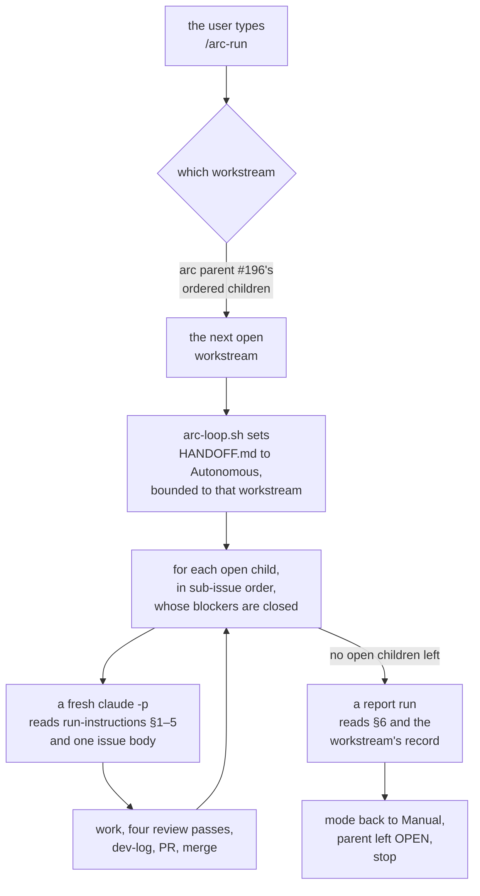

# How arc 04 was executed

The process as it actually ran, written at the point Loop closed. **It points at its sources
rather than restating them** — two copies of a rule is the defect
[#138](https://github.com/Calyx-Engineering/arc/issues/138) was about.

**Most of this is unproven.** §7 says which parts, and that section is the reason this document
exists — a process document that reads as settled is how something nobody tested gets adopted.

## 1 The shape

## 2 Two kinds of run, and nothing else

| | Does | Reads |
|---|---|---|
| **Issue run** | One issue, start to finish. Its record is the issue's ticked checklist, the dev-log and the PR body | [`run-instructions.md`](run-instructions.md) §1–§5, then §7 |
| **Report run** | No work. Reads a closed workstream's record and writes its boundary report | `run-instructions.md` §6, then §7 |

**Neither run picks its own issue and neither sets its own mode.** Both are the driver's.

## 3 The queue

Ordering is GitHub sub-issues at two levels, using the same mutation at both.

| Level | Parent | Ordered by |
|---|---|---|
| Workstreams | [#196](https://github.com/Calyx-Engineering/arc/issues/196), labelled `arc` | `reprioritizeSubIssue` |
| Issues within a workstream | The workstream parent, labelled `workstream` | `reprioritizeSubIssue` |

An issue whose body carries a literal `Blocked by #NN` line is **skipped** while that issue is
open, not started and not failed. Mechanics in
[arc-log §3.1](../../arc-log/arc-04-dogfood.md#31-how-a-run-knows-which-issue-is-next).

**Labels and a project board were both rejected**, and the reasoning is in that section.

## 4 The mode

**Asymmetric.** Claude may set the row to Manual and may never set it to Autonomous.

| Who | May write |
|---|---|
| The user, in chat | Either. Claude writes the row on being told |
| `tools/arc-loop.sh` | Autonomous, bounded to one workstream — **because a human ran the script**, which is the same explicitness as saying it. Manual at the boundary |
| A run | Neither |

`hooks/mode-guard` reads `HANDOFF.md`'s Execution mode row before every `git commit`, `git push`,
`gh pr create`, `gh pr merge` and `gh pr ready`, and denies in Manual. Absent or unreadable is
Manual. It cannot enforce the asymmetry — it sees a file change, not who asked — so that half
stays a rule. Spec: [m40 §4](../../product-architecture/mechanisms/m40-autonomy-switch.md).

## 5 The boundary

Seven ordered steps in [`run-instructions.md` §6.1](run-instructions.md). The three that were
learned the hard way, on 2026-09-07:

| | |
|---|---|
| Post the report **on the parent issue** | The arc-log is durable; the issue is where it is read |
| **Drop the mode to Manual** | The named boundary is reached, so the grant is spent. Running past it is how three PRs merged unasked |
| **Leave the parent open** | All children closed is mechanical completion. Closing it removes the surface the report is reviewed on |

The report is seven `####` sections: delivered, spawned with routing, **unexpected**, unplanned
but needed, evidence, not done, and the diagram. **The prose of the first six is what the 200
covers** — the diagram is optional and outside it, and so are the headings and the frame lines.
**The count is `tools/verify-report-budget.sh`'s, which `verify-all.sh` runs, and that script's
header is where the rule is exact** — the budget was written in three documents, this one
included, and read by none.

## 6 What this replaced

| Was | Now |
|---|---|
| A workstream run inside one session, context accumulating | One fresh session per issue, ~11 KB of prompt each |
| The mode remembered | The mode read, at the moment of the action |
| The report written from memory of the work | A report run reading the merged record, having done none of it |
| Workstream order = issue numbers | An ordered list that admits insertion |

## 7 What is unproven

**This is the section that matters.** Everything above describes one workstream's worth of use.

| | |
|---|---|
| **The driver has never dispatched a real run** | `arc-loop.sh`'s selection, skipping and three guards are tested. `claude -p` from it is not. Loop was executed inline in a single session — the thing the loop exists to replace |
| **`mode-guard` has never fired live** | 14 standalone cases pass. It was registered and reloaded but never exercised in a session, because a reload needs a restart |
| **The report format cost six rounds of correction** | It is now codified, and has been used exactly once |
| **No skill fix has moved the firing baseline** | `skill-firing.sh` produced a number. Nothing has yet changed it |
| **One workstream is not a process** | Loop was four issues plus one the workstream's own failure produced. Fire is thirteen |

## 8 If it survives the arc

[#194](https://github.com/Calyx-Engineering/arc/issues/194) carries the graduation table. The
short version:

| | Graduates to |
|---|---|
| The run kinds, the queue, the driver, `run-instructions.md` | **m25** — autonomous execution |
| `mode-guard` and the asymmetry | **m40** — already its spec |
| The boundary sequence and report shape | **m20**, or m43's *report* obligation. Undecided |
| `skill-firing` | m33's territory — measuring Arc against itself. Undecided |

**Nothing graduates on the strength of this document.** It graduates on §7 being shorter.
