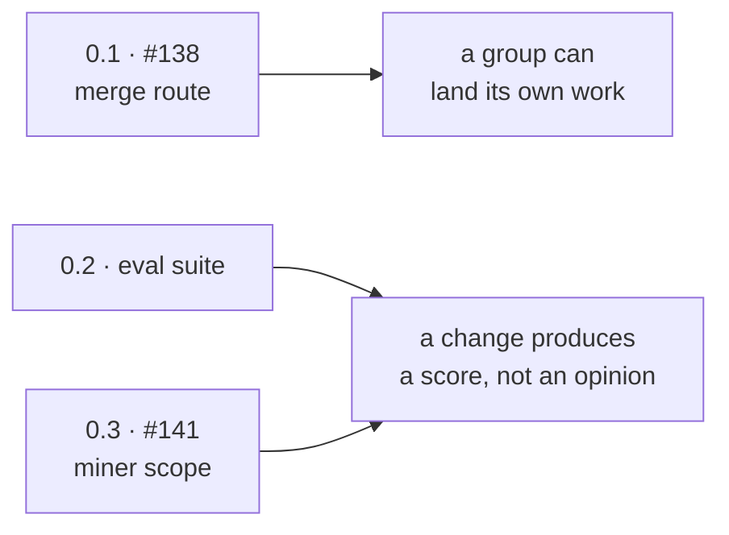
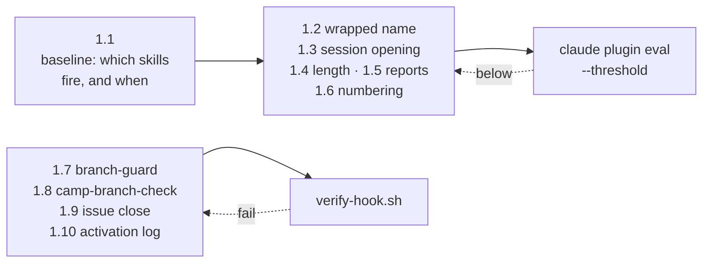
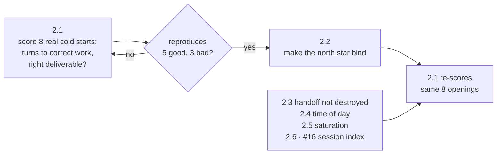
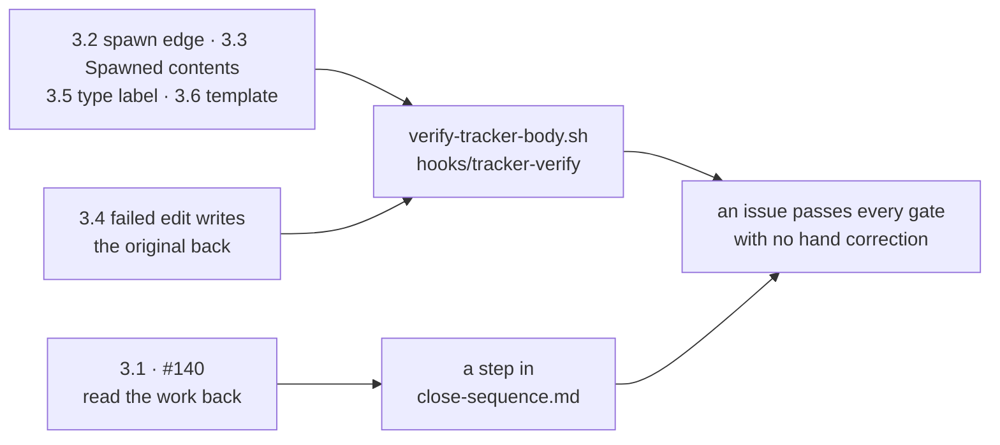
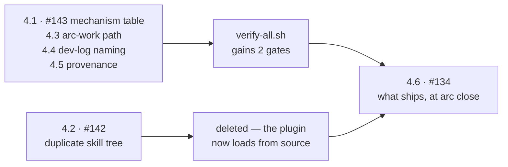
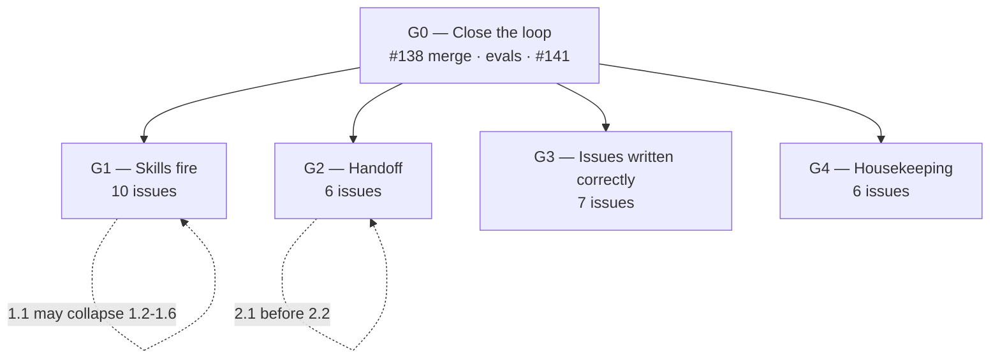

# Execution plan — arc 04 dogfood

Built against [the north-star brief](north-star-brief.md) and
[the retrospective](../../retrospectives/2026-09-dogfood/README.md).

**Five groups. Each one stops for review.** Group 0 exists because the other four cannot land
their own work or verify it without it.

**The next session agrees §"The problem" and §"Working looks like" for each group — nothing else.**
Everything below that line is already decided and does not need discussing.

---

## The skill-behaviour test harness

`claude plugin eval` runs cases against the installed plugin and grades them.

| | |
|---|---|
| `tool_used: Skill` | A first-class grader. **It tests whether a skill fired** — which is the retrospective's largest finding stated as a test |
| `--runs <n>`, default 3 | Firing is probabilistic. One run proves nothing |
| `--threshold <0..1>` | **Exits 1 below threshold.** A gate, so a loop and a PR check both have a target |
| `--ablation with-without` | Scores against a no-plugin baseline |

**Arc has no `evals/` directory.** Building one is G0's second issue and the precondition for
G1 and G2 being executable without the user.

---

## The next session — 110 minutes, and what it must produce

**Agreement only. No work.** Everything below this section is already decided; what is missing is
the user's sign-off on *what the problem is* and *what working looks like*, plus four numbers that
an autonomous run cannot invent for itself.

| Minutes | Subject | Output |
|---|---|---|
| 20 | **[#138](https://github.com/Calyx-Engineering/arc/issues/138)** — the merge route. The user guides this; he has solved it before | The working route, written into `CLAUDE.md` |
| 15 | G0 — the problem, working looks like | Agreed, or corrected |
| 20 | G1 — the problem, working looks like | Agreed, plus **the firing threshold** |
| 20 | G2 — the problem, working looks like | Agreed, plus **what a successful spin-up is**, numerically |
| 15 | G3 — the problem, working looks like | Agreed |
| 10 | G4 — the problem, working looks like | Agreed |
| 10 | The five moved out of the milestone | Confirmed out, or pulled back |

### The four numbers an autonomous run cannot choose

Each one is a judgement about acceptable behaviour, not a fact about the code. **Without them,
every group stalls at its own acceptance criterion.**

| | Needed for | Candidate |
|---|---|---|
| **Skill firing threshold** | G1, every issue | `--threshold 0.8` over 3 runs. Below 1.0 because firing is probabilistic; a suite that demands perfection fails on noise |
| **Turns to correct work** | G2.1 | A resumed session reaches correct work on the right deliverable within **N turns**. The corpus has 8 real openings to calibrate against |
| **Spin-up accuracy** | G2.1 | Whether pursuing a *different* deliverable is a fail or a partial. On 09-04 the session was fluent and wrong — the instrument must score that as a failure |
| **Report budget** | Every group | 600 words is set. Whether a diagram counts against it is not |

### What each group must state, in the user's words

The plan proposes both; the session either accepts or replaces them.

| Group | The problem | Working looks like |
|---|---|---|
| **G0** | Work cannot be landed or verified without the user | A group finishes, its PR merges, and an exit code says whether it worked |
| **G1** | Skills fire on a bare demand, not on a situation | Every shipping skill scores above threshold on cases built from the real misses |
| **G2** | A correct, freshly-read north star does not bind | A resumed session reaches correct work on the right deliverable, measured |
| **G3** | Issues are written wrongly and nothing catches it | An issue written by a session passes every gate with no hand correction |
| **G4** | Documents drift in ways nothing detects | `verify-all.sh` fails on drift that is invisible today |

---

## Can each group run autonomously after the planning session

**Yes for G1, G3 and G4, once G0 has landed.** Their acceptance criteria are exit codes —
`verify-hook.sh`, `claude plugin eval --threshold`, `verify-all.sh`, `gh` read-back — so the run
can tell whether it succeeded without asking.

**G2 needs one checkpoint inside the group.** 2.1 builds the instrument that grades 2.2, both in
the same run, which means grading my own work with a ruler I just made. The checkpoint is small:
**2.1's scores on the eight known cold starts, before 2.2 begins.** If it reproduces the five that
worked and the three that failed, the rest of the group proceeds unattended.

**G0 is not autonomous by design** — [#138](https://github.com/Calyx-Engineering/arc/issues/138) is
the issue the user guides, and it is the one that makes autonomy possible at all.

| Group | Autonomous | Stops for |
|---|---|---|
| G0 | No | [#138](https://github.com/Calyx-Engineering/arc/issues/138) is guided |
| G1 | **Yes** | Group end. **Unless 1.1 concludes the group collapses** — that changes the scope and is worth a sentence before continuing |
| G2 | **Yes, with one checkpoint** | 2.1's scores, then group end |
| G3 | **Yes** | Group end |
| G4 | **Yes** | Group end |

---

## Group 0 — Close the loop

Every other group ends with a PR that cannot be merged and a change whose effect cannot be
measured. These three build the two instruments that fix that, and are not touched again.

**The problem.** Work cannot be landed or verified without the user. A merge is denied unless he
asks for it in the same turn, and no skill's behaviour can be tested at all.

**Working looks like.** A group finishes, its PR merges, and `claude plugin eval --threshold`
returns an exit code that says whether the change worked — with the user reading a report rather
than operating the session.

| # | Issue | Evaluate | Fix | Test |
|---|---|---|---|---|
| 0.1 | [#138](https://github.com/Calyx-Engineering/arc/issues/138) an approved merge cannot run | **The user guides this one.** He has solved it in ROADZ and the route left no artifact | Document the working route in `CLAUDE.md` and `skills/autonomy-set` | A merge runs from a standing grant, twice, in one session |
| 0.2 | **NEW** `feat: an eval suite that tests whether a skill fires` | No `evals/` exists. Establish the current firing rate per skill as a baseline number | `evals/` with one case per shipping skill; `experimental.evals` in the manifest; `--threshold` wired into `tools/verify-all.sh` | The suite runs, reports a per-skill score, and fails below threshold |
| 0.3 | [#141](https://github.com/Calyx-Engineering/arc/issues/141) the miner scans repositories it was not given | Scope is a shared prefix, not the briefed set | Anchor to briefed slugs; report skipped directories | A run against a briefed pair reads exactly those, and names what it skipped |

**Exit:** a merge lands without a per-merge ask, and `verify-all.sh` includes a skill-behaviour
gate. **0.2 blocks G1 and G2. 0.1 blocks every group's close.**

---

## Group 1 — Make all the skills fire appropriately

Correct rules exist and are not read at the moment they are needed. **1.1 runs first and may
collapse the group** — if one cause explains all six symptoms, 1.2 to 1.6 stop being separate work.

**Two independent lanes.** Skills wait on 1.1; the hooks do not.

**The problem.** A skill fires on a bare explicit demand and not on a situation, and an
instruction wrapped around a skill's name suppresses the match. Measured: `arc:camp` fired at 2 of
4 openings that addressed it by name; **`arc:handoff` fired 3 times in the corpus and never at a
session opening**, against 8 openings that instructed a handoff read. One session ran 920 turns
with 4 skill invocations, two of them 4 seconds after the user demanded them.

**The group covers hooks as well as skills.** Four of its ten issues are hooks — a hook that fires
on every conforming branch and is wrong every time is the same failure as a skill that never fires.
`camp-branch-check` was correct 0 times out of 5.

**21 of 47 post-install corrections are downstream of this.** If it is one cause, the five
symptom issues below are not separate work.

**Working looks like.** For every shipping skill, `claude plugin eval` scores firing at or above
an agreed threshold across 3 runs, on cases written from the transcripts where it did not fire —
including openings whose address carries further instruction.

| # | Issue | Evaluate | Fix | Test |
|---|---|---|---|---|
| 1.1 | **NEW** `scope: why a skill does not fire, and what would make it` | Eval cases from the real misses. Vary one thing at a time: bare name, name plus instruction, situation with no name | A decision, not code — what a `description:` must contain | The cases exist and produce a baseline score per skill |
| 1.2 | **NEW** `fix: an instruction wrapped around a skill name suppresses the match` | The two missed Camp openings | `description:` frontmatter, per 1.1's decision | Those two openings score above threshold |
| 1.3 | **NEW** `fix: a session opening does not load handoff or camp` | 8 openings, 0 handoff fires | Same, plus whatever `commands/arc-next` should carry | Opening cases fire both |
| 1.4 | **NEW** `fix: response length is not held after it is set` | C6, and it recurred inside the retrospective | `chat-response` | A long-answer case scores within budget |
| 1.5 | **NEW** `fix: reports are written as narrative, not as conclusion` | C3 | `engineering-report` | A report case is graded on conclusion-first structure |
| 1.6 | **NEW** `fix: numbered topics are dropped mid-reply` | C13, zero pre-install hits | `chat-response` | A multi-topic case is graded on numbering |
| 1.7 | **NEW** `fix: work continues on the wrong branch` | C10 | `hooks/branch-guard` | `tools/verify-hook.sh` cases. Loops |
| 1.8 | **NEW** `fix: camp-branch-check rejects conforming branches` | **P1.** Fired 5 times, correct 0 times | Read the repo's declared convention; extract the number rather than match a shape | `verify-hook.sh` cases including ROADZ's real branch names. Loops |
| 1.9 | **NEW** `fix: nothing fires when an issue closes` | `tracker-verify` matches create, edit, PR merge only | Add `gh issue close` to the command match | `verify-hook.sh` cases. Loops |
| 1.10 | **NEW** `feat: an activation log` | Three friction-log rows are one absence: **Arc has no record of itself** | Every hook appends one line before exit | A session produces a log with one line per firing. Loops after 1.9 |

**1.1 first, and stop there if it says the others are symptoms.** The rest of the group is written
assuming they are independent; 1.1 is what tests that assumption.

**Exit:** every shipping skill has at least one eval case and scores above threshold; the four
hook issues pass `verify-hook.sh`; the activation log records real firings.

---

## Group 2 — Make the handoff work

A cold start reads the handoff, reports status correctly, then does the wrong work — facts
survive, intent does not. **2.1 builds the score before 2.2 changes anything**, because every
previous attempt changed the document with no way to tell whether it helped.

**2.3 to 2.6 do not wait on 2.1.** They are independent defects in the same document.

**The problem.** *"you have consistently failed in picking up the handoff… i dont think its ever
worked well once."* A correct, freshly-read north star did not bind: on 09-04 the session read
`HANDOFF.md` end to end, reported status correctly, then redesigned the measurement twice without
either redesign being checked against the deliverable. The session was abandoned.

**Correction-counting cannot measure this** — the cost lands at spin-up, before there is anything
specific to object to, so the cluster produces corrections in inverse proportion to its damage.

**Working looks like.** A resumed session reaches correct work on the right deliverable within an
agreed number of turns, measured — not asserted — across the real cold starts in the corpus.

| # | Issue | Evaluate | Fix | Test |
|---|---|---|---|---|
| 2.1 | **NEW** `feat: measure handoff spin-up time and accuracy` | Read the transcript that **wrote** each handoff, then score the session that read it: turns to first correct work, and whether it pursued the right deliverable | The instrument, as a miner mode or a second agent | It scores the 8 real openings and separates the 5 that worked from the 3 that did not |
| 2.2 | **NEW** `fix: a north star is read at cold start and does not bind` | 2.1's baseline | A trigger when an approach is replaced inside an accepted unit; the invariant quoted in the handoff, not only in the dev-log; *out of scope* stating **why**, so exclusion and deferral stop looking alike | 2.1's score improves against the same openings |
| 2.3 | **NEW** `fix: rewriting HANDOFF.md destroys the only copy of it` | It is gitignored, so it has no history | Copy to `forensics/` at **cold start**, not at session end | A rewrite leaves the prior version on disk |
| 2.4 | **NEW** `fix: the handoff header carries no time of day` | A cold start cannot tell an hour-old handoff from a week-old one | Date-and-time header, re-stamped on every write | A case asserts the stamp changed |
| 2.5 | **NEW** `feat: the session notices its own saturation before the user does` | C11. Twice the saturating load was building a skill, not doing the work | **A seventh `work-watch` check** — its six are commit-point, test-obligation, depth, edit-completeness, working-surface, friction. None covers this | An eval case on a long session. **Touches [#106](https://github.com/Calyx-Engineering/arc/issues/106)** — the check count is restated in several places |
| 2.6 | [#16](https://github.com/Calyx-Engineering/arc/issues/16) index transcript locations | 2 live worktrees, 4 directories, 2 orphans | `hooks/session-index` | `verify-hook.sh` cases. Also closes [#17](https://github.com/Calyx-Engineering/arc/issues/17)'s moved requirement |

**2.1 before 2.2.** Redesigning the handoff without a way to tell whether it improved is how every
previous attempt was done.

**Exit:** 2.1 reproduces the known-good and known-bad openings, and 2.2 moves the score.

---

## Group 3 — Write issues correctly

The tracker is the only durable record of what the work was, and it is written wrongly in ways
nothing detects. **Most of this group adds cases to checks that already exist** rather than
building new machinery.

**3.1 is the one that is not a check.** Reading prose back for staleness is judgement, which is
why it becomes a required step rather than a script.

**The problem.** *"good issue writing and naming has become a critical core to the development
workflow."* Spawn edges go unrecorded, `Spawned` fills with things that are not work, a failed
edit writes the original body back, and nothing reads the work against the issue before a PR.
Three of these recurred during the retrospective itself.

**Working looks like.** An issue written by a session passes `verify-tracker-body.sh` on title and
body, records its parent at both ends, and a PR cannot open until the work has been read back
against the issue's checklist.

| # | Issue | Evaluate | Fix | Test |
|---|---|---|---|---|
| 3.1 | [#140](https://github.com/Calyx-Engineering/arc/issues/140) read the work back against the issue before a PR | **P1.** [#17](https://github.com/Calyx-Engineering/arc/issues/17) shipped missing 2 of 5 requirements | A step in `close-sequence.md` between 4b and 5; unchecked boxes resolved, not named | An eval case where a stale section survives a change |
| 3.2 | [#83](https://github.com/Calyx-Engineering/arc/issues/83) a spawned issue records no parent | 4 issues filed with no edge; recurred on [#134](https://github.com/Calyx-Engineering/arc/issues/134) | `tracker-verify` reports it | `verify-hook.sh` cases. Loops |
| 3.3 | [#135](https://github.com/Calyx-Engineering/arc/issues/135) `Spawned` accepts things that are not work | 8 corrections, last one 09-05 | The negative case stated; section order enforced | `verify-tracker-body.sh body` |
| 3.4 | [#87](https://github.com/Calyx-Engineering/arc/issues/87) a failed edit writes the original body back | Silent | Read-back after write | Cases from m13's evaluation set |
| 3.5 | [#84](https://github.com/Calyx-Engineering/arc/issues/84) issues carry no type label | — | Label at creation | `gh issue view` read-back |
| 3.6 | [#85](https://github.com/Calyx-Engineering/arc/issues/85) issue template | — | The template | It exists and `issue-write` points at it |
| 3.7 | [#136](https://github.com/Calyx-Engineering/arc/issues/136) link and close without the flip | m12 unbuilt; m42 shipped instead | Both stay options | **Priority low. May leave the arc** |

**Exit:** an issue written end to end by a session passes every gate with no hand correction.

---

## Group 4 — Housekeeping

Small wrongnesses that share one property: nothing fails when they happen. **Each becomes a gate,
or the thing causing it gets deleted.**

**The problem.** Documents and paths that are wrong in ways nothing detects. The mechanism table
drifts from its specs by hand, local skill copies duplicate every skill in the session's list, and
the plugin has never been reviewed for what it would expose if published.

**Working looks like.** `tools/verify-all.sh` fails on drift that is currently invisible, and the
plugin is safe to install at another employer.

| # | Issue | Fix | Test |
|---|---|---|---|
| 4.1 | [#143](https://github.com/Calyx-Engineering/arc/issues/143) verify the mechanism table against its specs | `tools/verify-mechanisms.sh` | Fixture cases, in `verify-sync-parity.sh`'s shape |
| 4.2 | [#142](https://github.com/Calyx-Engineering/arc/issues/142) delete the local skill copies | Now unblocked — [#132](https://github.com/Calyx-Engineering/arc/issues/132) is closed | `verify-all.sh` still clean; the artifact-table gate survives |
| 4.3 | **NEW** `fix: the arc-work path assumes a flat slug` | A rule, not a per-repo guess | A module-shaped slug resolves |
| 4.4 | **NEW** `fix: the dev-log template calls itself a decision log` | Collides with `ddr/` | `verify-template-links.sh` unaffected; wording checked |
| 4.5 | **NEW** `feat: an analysis table records where each row came from` | A provenance column, strength-ordered | A table without one is reported |
| 4.6 | [#134](https://github.com/Calyx-Engineering/arc/issues/134) review what ships before making Arc public | **At arc close.** Blocks use at Dedrone | The audit checklist completes |

**Exit:** `verify-all.sh` gains two gates and loses none.

---

## Filed, then moved out of the milestone

Not this arc. Filed so they are not re-derived.

| Issue | Cluster | Why out |
|---|---|---|
| **NEW** `fix: an obligation stated in conversation is dropped` | C2 — **the largest post-install cluster, 11** | A process gap, not a rule that failed to fire. [#140](https://github.com/Calyx-Engineering/arc/issues/140) covers its PR-time half only |
| **NEW** `fix: commits land before review, and not at the stopping points` | C9 | Group C |
| **NEW** `fix: a failed instrument reading is blamed on the bench` | C5 — highest single-day cost in the corpus | Group D |
| **NEW** `fix: draw.io edits are lost to unsaved desktop state` | C8 | Group D |
| **NEW** `chore: behavior rules do not follow the user to another machine` | C12 | Group D. Overlaps [#134](https://github.com/Calyx-Engineering/arc/issues/134) |

---

## Filing

**Every new issue goes into the `Dogfood` milestone**, is written through `skills/issue-write`, and
records its parent. The plan's own section number — `1.4`, `2.1` — is not the issue number and does
not survive filing; the issue's `Related` table carries the link back.

**Branches come from `createLinkedBranch`, never `git checkout -b`** — otherwise no branch↔issue
link forms, and the mutation cannot link a branch that already exists.

## Order

**G0 gates everything.** G1–G4 are independent of each other and may run in any order.

## Running these in a loop

**A loop needs two things: a bounded context, and something to converge against.** Almost every
issue here has both once G0 lands, and the point of the loop is the first one — the orchestrator
never holds 37 issues at once, because each iteration starts fresh from this file and the issue.

| Convergence target | Covers |
|---|---|
| `tools/verify-hook.sh` | Every hook issue — 1.7, 1.8, 1.9, 1.10, 2.6, 3.2 |
| `claude plugin eval --threshold` | Every skill issue — 1.2 to 1.6, 2.3 to 2.5, 3.3 |
| `tools/verify-all.sh` | Every gate and document issue — 4.1 to 4.5 |
| `gh` read-back | The tracker issues — 3.4, 3.5, 3.6 |

**Six do not loop, and the reason is the same for all of them: the output is a judgement, not a
passing test.**

| | Why |
|---|---|
| [#138](https://github.com/Calyx-Engineering/arc/issues/138) | The user guides it. He has the answer; a loop would rediscover it badly |
| 1.1 | Its deliverable is a decision about what a `description:` must contain. A loop cannot tell a good decision from a confident one |
| 2.1 — the design half | Choosing what "spin-up succeeded" means is a judgement. **Scoring against it, once chosen, loops** |
| 2.2 | It is graded by 2.1, which this session will have just written. Grading a change with an instrument built in the same run needs a human look |
| 3.1 | Reading prose back for staleness is the judgement a script cannot do — that is why the issue exists |
| 4.6 | A publication audit is a risk decision |

**Each looping issue needs its cases written before the loop starts.** `verify-all.sh` fails on a
hook with no case directory, and an eval case is the spec of the behaviour being fixed. **Writing
the cases is the part a loop cannot do, and it is where the thinking is.**

## The report at each group boundary

**600 words maximum.** Written to `docs/dev-log/` and summarised in the group's PR.

| Section | |
|---|---|
| What was done | One paragraph |
| Files changed, and why | A table — path, one line |
| Evidence | The gate output. `verify-all.sh` exit, eval scores before and after |
| What did not get done | Named, with the reason. Silence here is the failure this arc exists to fix |
| A diagram | Where a flow or relationship changed |

## Counts

| | |
|---|---|
| Issues in the plan | **37** |
| Already filed | 13 |
| **To file** | **24** — 19 in scope, 5 filed-then-moved-out |
| Per group | G0 3 · G1 10 · G2 6 · G3 7 · G4 6 · out 5 |
| **Runs in a loop** | **31 of 37.** Not 1.1, 2.1's design half, 2.2, 3.1, 4.6 or [#138](https://github.com/Calyx-Engineering/arc/issues/138) — see below |
| Blocked on G0 | G1 and G2 entirely; G3 and G4 for their merges |
