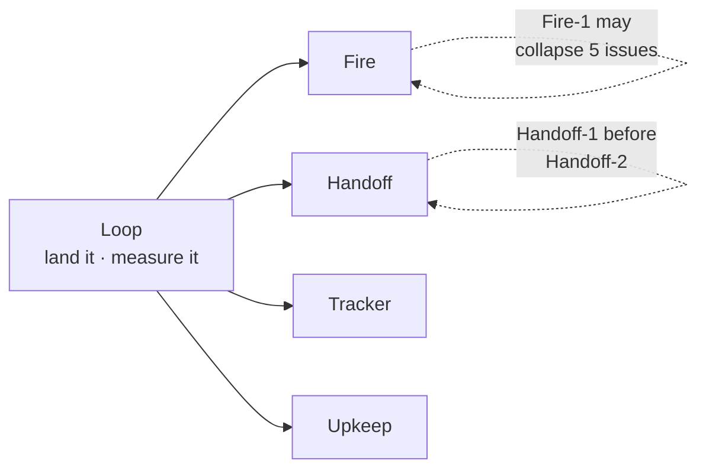
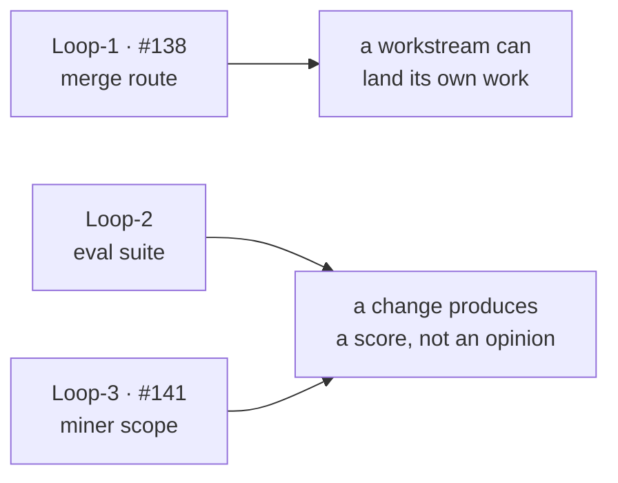
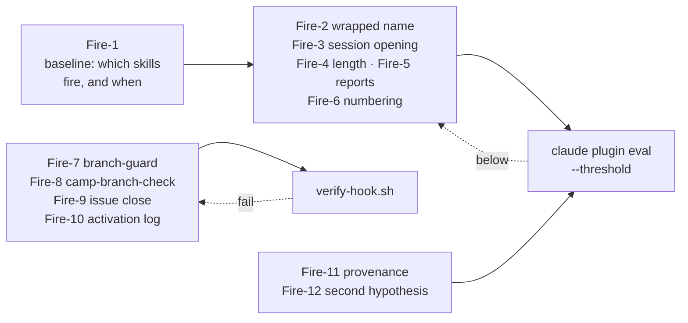
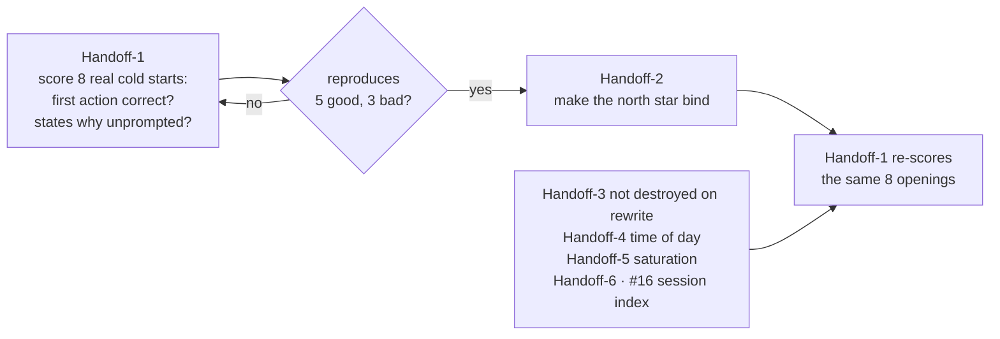
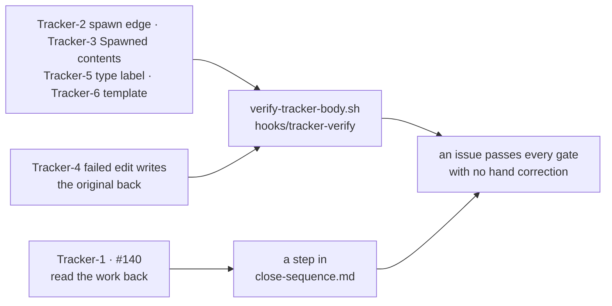
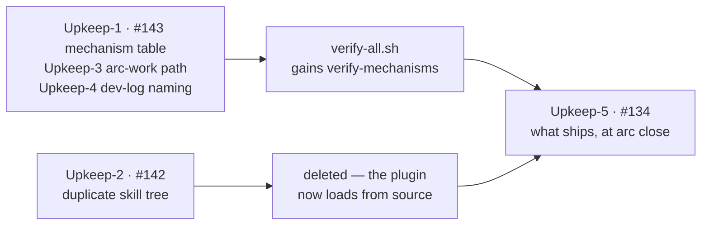

# Arc 04 — dogfood

**Arc was installed on real hardware work for twelve days and produced 84 corrections.** This arc
fixes what that exposed.

## 1 Objective

**Make Arc hold up under real use, and prove it with a number rather than an opinion.**

Three arcs shipped behaviour that had never been executed. Then `v0.1.0` was installed in a live
hardware project and the gap showed: skills that do not fire, a handoff that restores facts but
not intent, issues written wrongly with nothing detecting it.

## 2 What success looks like

**Every row is a measured fact today, and a number after.** Nothing here is a feeling about
whether Arc got better.

| Today, measured | After this arc |
|---|---|
| `arc:handoff` fired at **0 of 8** session openings that asked for it | Every opening case fires, at or above threshold, across 3 runs |
| One session ran **920 turns with 4 skill invocations**, two of them 4 seconds after you demanded them | Skills fire on the situation, scored by `claude plugin eval` |
| `camp-branch-check` fired **5 times and was correct 0 times** | It reads the repository's declared convention and passes on conforming branches |
| No way to tell whether a handoff worked except how annoyed the next session made you | The 8 real cold starts are scored; a change to the handoff moves that number |
| [#17](https://github.com/Calyx-Engineering/arc/issues/17) shipped **missing 2 of its 5 requirements**, found only by a manual re-review | An issue's checklist is resolved before its PR opens |
| A PR needs you in the room to merge | A workstream lands its own work and reports the result |

**If the eval suite cannot be made to score skill firing, this arc has failed at its first
workstream** — every row above except the last reverts to assertion.

## 3 Scope

| In | Out |
|---|---|
| Skills and hooks that fire wrongly or not at all | Anything found before 2026-08-24 — Arc did not exist yet |
| The handoff, and the instrument that measures it | New capability. Nothing here is a feature |
| Issue and PR writing | The knowledge half of transcript mining — m30 stays `partial` |
| Gates that catch invisible drift | Three clusters filed and deliberately deferred |

**Evidence:** [the retrospective](../../retrospectives/2026-09-dogfood/README.md).
**Execution model:** [arc-log §3](../../arc-log/arc-04-dogfood.md#3-how-this-arc-is-executed).

---

## 4 The five workstreams

**Named, not numbered** — the repo's own convention, and letters already mean the retrospective's
cluster groups. Issues are referenced `Fire-3`, `Handoff-1`.

| Parent | Workstream | What it fixes | Issues | Autonomous |
|---|---|---|---|---|
| [#144](https://github.com/Calyx-Engineering/arc/issues/144) | **[Loop](#5-loop--the-merge-route-and-the-eval-suite)** | Work cannot be landed or measured without you | 3 | No — one issue you guide |
| [#145](https://github.com/Calyx-Engineering/arc/issues/145) | **[Fire](#6-fire--skills-and-hooks-fire-when-they-should)** | Correct rules are not read when they are needed | 12 | Yes |
| [#146](https://github.com/Calyx-Engineering/arc/issues/146) | **[Handoff](#7-handoff--intent-survives-a-cold-start)** | Facts survive a cold start; intent does not | 6 | Yes, one checkpoint |
| [#147](https://github.com/Calyx-Engineering/arc/issues/147) | **[Tracker](#8-tracker--the-record-is-written-correctly)** | The durable record is written wrongly, undetected | 7 | Yes |
| [#148](https://github.com/Calyx-Engineering/arc/issues/148) | **[Upkeep](#9-upkeep--drift-fails-instead-of-hiding)** | Small wrongnesses nothing fails on | 5 | Yes |

**Loop gates everything.** The other four are independent and may run in any order.

---

## 5 Loop — the merge route and the eval suite

Every other workstream ends with a PR that cannot be merged and a change whose effect cannot be
measured. These three build the two instruments that fix that, and are not touched again.

| # | Issue | Evaluate | Fix | Done when |
|---|---|---|---|---|
| Loop-1 | [#138](https://github.com/Calyx-Engineering/arc/issues/138) an approved merge cannot run | **You guide this.** You solved it in ROADZ and it left no artifact | The route in `CLAUDE.md` and `skills/autonomy-set` | A merge runs from a standing grant, twice, in one session |
| Loop-2 | [#149](https://github.com/Calyx-Engineering/arc/issues/149) an eval suite that tests whether a skill fires | No `evals/` exists. Establish a baseline firing rate per skill | `evals/`, the manifest key, `--threshold` in `tools/verify-all.sh` | The suite reports a per-skill score and fails below threshold |
| Loop-3 | [#141](https://github.com/Calyx-Engineering/arc/issues/141) the miner scans repositories it was not given | Scope follows a shared prefix, not the briefed set | Anchor to briefed slugs; report what was skipped | A briefed pair is read exactly, skipped directories named |

**Done when:** a merge lands without a per-merge ask, and `verify-all.sh` includes a
skill-behaviour gate. **Loop-2 blocks Fire and Handoff. Loop-1 blocks every close.**

---

## 6 Fire — skills and hooks fire when they should

Correct rules exist and are not read at the moment they are needed. **Fire-1 runs first and may
collapse the workstream** — if one cause explains all six symptoms, Fire-2 to Fire-6 stop being
separate work.

**Two independent lanes.** The skills wait on Fire-1; the hooks do not.

| # | Issue | Evaluate | Fix | Done when |
|---|---|---|---|---|
| Fire-1 | [#155](https://github.com/Calyx-Engineering/arc/issues/155) why a skill does not fire, and what would make it | Eval cases from the real misses — bare name, name plus instruction, situation with no name | A decision about what a `description:` must contain | The cases exist and produce a baseline per skill |
| Fire-2 | [#156](https://github.com/Calyx-Engineering/arc/issues/156) an instruction wrapped around a skill name suppresses the match | The two missed Camp openings | `description:` frontmatter, per Fire-1 | Those openings score above threshold |
| Fire-3 | [#157](https://github.com/Calyx-Engineering/arc/issues/157) a session opening does not load handoff or camp | 8 openings instructed a handoff read; `arc:handoff` fired at none | Same, plus what `commands/arc-next` carries | Opening cases fire both |
| Fire-4 | [#158](https://github.com/Calyx-Engineering/arc/issues/158) response length is not held after it is set | Recurred inside the retrospective itself | `chat-response` | A long-answer case scores within budget |
| Fire-5 | [#159](https://github.com/Calyx-Engineering/arc/issues/159) reports are written as narrative, not as conclusion | 5 post-install corrections | `engineering-report` | A report case grades conclusion-first |
| Fire-6 | [#160](https://github.com/Calyx-Engineering/arc/issues/160) numbered topics are dropped mid-reply | Zero pre-install hits | `chat-response` | A multi-topic case grades numbering |
| Fire-7 | [#161](https://github.com/Calyx-Engineering/arc/issues/161) work continues on the wrong branch | 2 post-install corrections | `hooks/branch-guard` | `verify-hook.sh` cases. **Loops** |
| Fire-8 | [#162](https://github.com/Calyx-Engineering/arc/issues/162) camp-branch-check rejects conforming branches | **P1.** Fired 5 times, correct 0 | Read the repo's declared convention; extract the number rather than match a shape | `verify-hook.sh` cases including ROADZ's real branches. **Loops** |
| Fire-9 | [#163](https://github.com/Calyx-Engineering/arc/issues/163) nothing fires when an issue closes | `tracker-verify` matches create, edit, PR merge only | Add `gh issue close` | `verify-hook.sh` cases. **Loops** |
| Fire-10 | [#166](https://github.com/Calyx-Engineering/arc/issues/166) an activation log | Three friction-log rows are one absence: **Arc has no record of itself** | Every hook appends one line before exit | A session produces one line per firing. **Loops after Fire-9** |

| Fire-11 | [#164](https://github.com/Calyx-Engineering/arc/issues/164) a claim records where it came from, and strong beats weak | A demand list carried three kill-path signals read off **a photograph of a board we do not hold**, treated as specified for weeks. Separately, a bench measurement the user had verified was discounted in favour of an inference from a dead instrument | A provenance vocabulary, strength-ordered — `measured > datasheet > vendor > schematic > photograph > conversation > inferred` — in `record-route` and `engineering-report`. **A table row carries its source, and a strong claim is not overridden by a weak one** | A table without provenance is reported. An eval case where a user-stated measurement conflicts with an inference |
| Fire-12 | [#165](https://github.com/Calyx-Engineering/arc/issues/165) a failure is blamed on the environment before a second hypothesis is tested | *"you keep assuming **I** did something wrong when you're just stopping at the first issue and not trying to figure it out yourself"* — the highest single-day cost in the corpus | **An eighth `work-watch` check.** A failure attributed to the user's setup requires one tested alternative first | An eval case: an instrument returns nothing, the user has stated a measurement. The session must test its own command path before asserting the bench is wrong |

**Fire-12 and Handoff-5 both add a `work-watch` check and must be sequenced.**
[#106](https://github.com/Calyx-Engineering/arc/issues/106) exists because that check count is
restated in several places; two issues editing it in parallel will collide. Handoff-5 first.

**Done when:** every shipping skill has an eval case and scores above threshold, the four hook
issues pass `verify-hook.sh`, and the activation log records real firings.

---

## 7 Handoff — intent survives a cold start

**What working means, settled 2026-09-06:** the first action is correct with no correction, **and**
the session can state *why* the current approach was chosen without being told. Never re-proposing
something already ruled out is wanted, not required.

A cold start reads the handoff, reports status correctly, then does the wrong work — and sometimes
reaches **the opposite conclusion to what the document says**. Facts survive; intent does not. It
also never starts on its own: the handoff is read only when asked for in natural language, which is
a firing failure Fire owns.

**The leading hypothesis is that rationale is stripped along with narrative.** *"We tried X, then
Y"* is disposable. *"The 3.3V rail cannot source 500mA"* is load-bearing, and nothing distinguishes
them — so a fresh session holds a decision with none of its constraints and reverses it the moment
circumstances look different. Unproven; Handoff-1 tests it.

**The manual process it replaced worked.** Before the handoff existed, a cold start began by reading
the previous session's transcript, and the results were good — that is what inspired the handoff in
the first place. **The document is a distillation of that transcript, and distillation is where the
rationale is lost.** Handoff-2's fix has to close that gap, not restyle the summary.

**Handoff-1 builds the score before Handoff-2 changes anything.** Every previous attempt changed the
document with no way to tell whether it helped — the format was rewritten three or four times, once
to the point of listing skills to load by name.

**Handoff-3 to Handoff-5 do not wait on Handoff-1.** They are independent defects in the same
document. **Handoff-6 is not independent** — a cold start cannot read the previous transcript if it
cannot find it.

| # | Issue | Evaluate | Fix | Done when |
|---|---|---|---|---|
| Handoff-1 | [#150](https://github.com/Calyx-Engineering/arc/issues/150) measure handoff spin-up time and accuracy | Read the transcript that **wrote** each handoff, then score the session that read it | A miner mode or a second agent | It separates the 5 openings that worked from the 3 that did not, and says for each bad one whether the wrong answer was something the document mentioned |
| Handoff-2 | [#151](https://github.com/Calyx-Engineering/arc/issues/151) a north star is read at cold start and does not bind | Handoff-1's baseline | Carry the constraint behind each decision, not only the decision — rationale kept where narrative is cut; a trigger when an approach is replaced inside an accepted unit; *out of scope* stating **why** | On the same 8 openings: first action correct, and the session states why the approach was chosen unprompted |
| Handoff-3 | [#152](https://github.com/Calyx-Engineering/arc/issues/152) a file the user authored is overwritten with no copy kept | `HANDOFF.md` is gitignored, so a rewrite destroys the state the session was given. Same shape as a diagram the user spent hours on being replaced rather than archived | Preserve before overwriting: copy to `forensics/` at **cold start**, and archive a user-authored file before replacing it | A rewrite leaves the prior version on disk |
| Handoff-4 | [#153](https://github.com/Calyx-Engineering/arc/issues/153) the handoff header carries no time of day | A cold start cannot tell an hour-old handoff from a week-old one | Date-and-time header, re-stamped every write | A case asserts the stamp changed |
| Handoff-5 | [#154](https://github.com/Calyx-Engineering/arc/issues/154) the session notices its own saturation before the user does | Twice the saturating load was building a skill, not doing the work | **A seventh `work-watch` check** — its six do not cover this | An eval case on a long session. Touches [#106](https://github.com/Calyx-Engineering/arc/issues/106) |
| Handoff-6 | [#16](https://github.com/Calyx-Engineering/arc/issues/16) index transcript locations | 2 live worktrees, 4 directories, 2 orphans. **Prerequisite for Handoff-2** if the fix reaches back to the transcript | `hooks/session-index` | `verify-hook.sh` cases. Also closes [#17](https://github.com/Calyx-Engineering/arc/issues/17)'s moved requirement |

**Done when:** Handoff-1 reproduces the known-good and known-bad openings, and Handoff-2 moves the
score against the definition above.

---

## 8 Tracker — the record is written correctly

The tracker is the only durable record of what the work was, and it is written wrongly in ways
nothing detects. **Most of this adds cases to checks that already exist** rather than building new
machinery.

**Tracker-1 is the one that is not a check.** Reading prose back for staleness is judgement, which
is why it becomes a required step rather than a script.

| # | Issue | Evaluate | Fix | Done when |
|---|---|---|---|---|
| Tracker-1 | [#140](https://github.com/Calyx-Engineering/arc/issues/140) read the work back against the issue before a PR | **P1.** [#17](https://github.com/Calyx-Engineering/arc/issues/17) shipped missing 2 of 5 requirements | A step in `close-sequence.md`; unchecked boxes resolved, not named | An eval case where a stale section survives a change |
| Tracker-2 | [#83](https://github.com/Calyx-Engineering/arc/issues/83) a spawned issue records no parent | Recurred on [#134](https://github.com/Calyx-Engineering/arc/issues/134) | `tracker-verify` reports it | `verify-hook.sh` cases. **Loops** |
| Tracker-3 | [#135](https://github.com/Calyx-Engineering/arc/issues/135) `Spawned` accepts things that are not work | 8 corrections, last on 09-05 | The negative case stated; section order enforced | `verify-tracker-body.sh body` |
| Tracker-4 | [#87](https://github.com/Calyx-Engineering/arc/issues/87) a failed edit writes the original body back | Silent | Read-back after write | m13's evaluation set |
| Tracker-5 | [#84](https://github.com/Calyx-Engineering/arc/issues/84) issues carry no type label | — | Label at creation | `gh issue view` read-back |
| Tracker-6 | [#85](https://github.com/Calyx-Engineering/arc/issues/85) issue template | — | The template | `issue-write` points at it |
| Tracker-7 | [#136](https://github.com/Calyx-Engineering/arc/issues/136) link and close without the flip | m12 unbuilt; m42 shipped instead | Both stay options | **Low priority. May leave the arc** |

**Done when:** an issue written end to end by a session passes every gate with no hand correction.

---

## 9 Upkeep — drift fails instead of hiding

Small wrongnesses that share one property: nothing fails when they happen. **Each becomes a gate,
or the thing causing it gets deleted.**

| # | Issue | Fix | Done when |
|---|---|---|---|
| Upkeep-1 | [#143](https://github.com/Calyx-Engineering/arc/issues/143) verify the mechanism table against its specs | `tools/verify-mechanisms.sh` | Fixture cases, in `verify-hook.sh`'s shape |
| Upkeep-2 | [#142](https://github.com/Calyx-Engineering/arc/issues/142) delete the local skill copies | Unblocked — [#132](https://github.com/Calyx-Engineering/arc/issues/132) is closed | `verify-all.sh` still clean; the artifact-table gate survives |
| Upkeep-3 | [#167](https://github.com/Calyx-Engineering/arc/issues/167) the arc-work path assumes a flat slug | A rule, not a per-repo guess | A module-shaped slug resolves |
| Upkeep-4 | [#168](https://github.com/Calyx-Engineering/arc/issues/168) the dev-log template calls itself a decision log | Collides with `ddr/` | Wording checked |
| Upkeep-5 | [#134](https://github.com/Calyx-Engineering/arc/issues/134) review what ships before making Arc public | **At arc close.** Blocks use at Dedrone | The audit completes |

**Done when:** `verify-all.sh` gains `verify-mechanisms.sh`, the duplicate skill tree is gone, and no existing gate was lost with it.

---

## 10 Filed, then moved out of the milestone

Not this arc. Filed so they are not re-derived.

| Issue | Why out |
|---|---|
| [#169](https://github.com/Calyx-Engineering/arc/issues/169) an obligation stated in conversation is dropped | **The largest post-install cluster, 11 hits.** A process gap, not a rule that failed to fire. [#140](https://github.com/Calyx-Engineering/arc/issues/140) covers its PR-time half only |
| [#170](https://github.com/Calyx-Engineering/arc/issues/170) commits land before review, and not at the stopping points | Process gap |
| [#171](https://github.com/Calyx-Engineering/arc/issues/171) behavior rules do not follow the user to another machine | Overlaps [#134](https://github.com/Calyx-Engineering/arc/issues/134) |

---

## 11 What needs you

**30 of 36 issues run without you.** This section is every point where they do not — one issue you
run with me, one number a run cannot invent, and the six whose output is a judgement rather than a
passing test. How a run behaves is
[`run-instructions.md`](run-instructions.md), which is what an iteration reads — not this file.

### 11.1 [#138](https://github.com/Calyx-Engineering/arc/issues/138) — you guide it

**Not a question to answer. A work session to run together**, manual, first in the arc.

What is already known: since Arc was installed here, **no merge has ever run without an explicit
per-merge request.** There is no standing grant to recover — the route does not exist yet and has to
be built. Diagnosis happens inside the issue, not before it.

### 11.2 The one number left

| | Needed for | Candidate |
|---|---|---|
| **Skill firing threshold** | Every Fire issue | `--threshold 0.8` over 3 runs. Below 1.0 because firing is probabilistic; a suite demanding perfection fails on noise |

**Two of the four are now settled** by the definition in [§7](#7-handoff--intent-survives-a-cold-start)
— turns to correct work is **zero**, and spin-up is accurate only if the session can state *why*
unprompted. **The report budget is 200 words**; whether a diagram counts against it is a call
[`run-instructions.md`](run-instructions.md) already makes — it does not.

### 11.3 The six that stop for you during execution

**A loop needs something to converge against.** These six produce a judgement instead, so each one
stops and hands you the output.

| | What you are handed |
|---|---|
| Loop-1 | The merge route — [§11.1](#111-138--you-guide-it) |
| Fire-1 | A decision about what a skill `description:` must contain, from the baseline the cases produce |
| Handoff-1 | The baseline scores, and whether they reproduce the split you remember — 5 openings that worked, 3 that did not |
| Handoff-2 | A score produced by an instrument built in the same arc. Whether it moved is your read, not the number's |
| Tracker-1 | Whether a read-back caught what it should have. Reading prose against an issue is judgement |
| Upkeep-5 | A risk decision — what ships when Arc goes public |

**The cases for every other issue are written before its loop starts.** `verify-all.sh` fails on a
hook with no case directory, and an eval case is the spec of the behaviour being fixed. **Writing
the cases is where the thinking is, and a loop cannot do it** — budget it as real time, not setup.

## 12 Filing

**Every new issue goes into the `Dogfood` milestone**, is written through `skills/issue-write`, and
records its parent. `Fire-3` is this file's reference, not the issue number — the issue's `Related`
table carries the link back.

**Each workstream gets a parent issue, and its issues are attached as ordered sub-issues.** That
list is the execution queue — see
[arc-log §3.1](../../arc-log/arc-04-dogfood.md#31-how-a-run-knows-which-issue-is-next). An issue that
cannot start until another closes carries a `Blocked by #NN` line the driver can read.

**Branches come from `createLinkedBranch`, never `git checkout -b`** — otherwise no branch↔issue
link forms, and the mutation cannot link a branch that already exists.

## 13 Counts

| | |
|---|---|
| Issues | **36** — all filed |
| Workstream parents | **5**, labelled `workstream` |
| In the milestone | 33 children plus 5 parents |
| Out of the milestone | 3 — [#169](https://github.com/Calyx-Engineering/arc/issues/169), [#170](https://github.com/Calyx-Engineering/arc/issues/170), [#171](https://github.com/Calyx-Engineering/arc/issues/171) |
| Per workstream | Loop 3 · Fire 12 · Handoff 6 · Tracker 7 · Upkeep 5 · out 3 |
| Stop for you | **6 of 36** — [§11.3](#113-the-six-that-stop-for-you-during-execution) |
| Blocked on Loop | Fire and Handoff entirely; Tracker and Upkeep for their merges |
