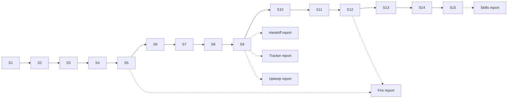

# Arc 04 playlist — what runs together, what runs alongside

## 1 Terms

| | |
|---|---|
| **Track** | One run: one worktree, one branch, one PR, one or more issues sharing a deliverable. `tools/arc-loop.sh <ws> --issues a,b --track S2.F4` |
| **Set** | Tracks dispatched concurrently. A set closes when every track's PR is merged |
| **Playlist** | Ordered sets, per workstream, plus which workstreams may overlap |

## 2 What shapes it

| Constraint | Effect on the playlist |
|---|---|
| Two issues edit one file | Same track, or different sets. Never two tracks in one set |
| `Blocked by #NN` | A later set than the blocker's |
| **The installed plugin is one machine-wide cache** — `plugin-reload.sh` then `skill-probe.sh` / `response-length.sh --probe` | At most **one probe track per set**. Two runs reloading the cache measure each other's edits |
| [#190](https://github.com/Calyx-Engineering/arc/issues/190) moves every verifier and case directory into `tests/` | Runs alone, last, nothing else in flight — its own constraint |
| One merge target, `arc/04-dogfood` | Orchestrator merges, one PR at a time, each rebased on the arc tip first |
| **Cap: 5 tracks per set** | Wall time is the constraint the user named. The ceiling is the usage window, not the graph — a limit-hit run is resumed by `arc-loop.sh`, not lost |

## 3 Tracks, by workstream

### 3.1 Fire — [#145](https://github.com/Calyx-Engineering/arc/issues/145)

Merged: [#155](https://github.com/Calyx-Engineering/arc/issues/155) · [#156](https://github.com/Calyx-Engineering/arc/issues/156) · [#157](https://github.com/Calyx-Engineering/arc/issues/157) · [#158](https://github.com/Calyx-Engineering/arc/issues/158)

| Track | Issues | Edits | Probe | Set |
|---|---|---|---|---|
| **F1 tracker-verify** | [#183](https://github.com/Calyx-Engineering/arc/issues/183) [#210](https://github.com/Calyx-Engineering/arc/issues/210) [#163](https://github.com/Calyx-Engineering/arc/issues/163) | `hooks/tracker-verify`, its cases, `verify-all.sh` | — | **S1** — running now as #183+#210. #163 is **F1b**, in S3 |
| **F2 camp-branch-check** | [#162](https://github.com/Calyx-Engineering/arc/issues/162) | `hooks/camp-branch-check`, its cases | — | **S1** |
| **F3 chat-response** | [#160](https://github.com/Calyx-Engineering/arc/issues/160) [#213](https://github.com/Calyx-Engineering/arc/issues/213) | `skills/chat-response`, `evals/response-length` | probe | **S1** — the set's probe slot |
| **F4 branch-guard** | [#161](https://github.com/Calyx-Engineering/arc/issues/161) | `hooks/branch-guard`, its cases, `verify-all.sh` | — | **S2** — `verify-all.sh` keeps it out of S1 with F1 |
| **F5 engineering-report** | [#159](https://github.com/Calyx-Engineering/arc/issues/159) [#164](https://github.com/Calyx-Engineering/arc/issues/164) | `skills/engineering-report`, `skills/record-route` | probe | **S2** — probe slot |
| **F6 handoff** | [#208](https://github.com/Calyx-Engineering/arc/issues/208) | `skills/handoff`, `commands/arc-next.md` | — | **S2** |
| **F7 activation log** | [#166](https://github.com/Calyx-Engineering/arc/issues/166) | **every hook** | — | **S4**, the only hook track in its set. Blocked by #163; touches what F1 F2 F4 touch |
| **F8 work-watch** | [#165](https://github.com/Calyx-Engineering/arc/issues/165) | `skills/work-watch` | probe | **S5**. Blocked by [#154](https://github.com/Calyx-Engineering/arc/issues/154), Handoff's H3, which runs in S4 |
| **F9 tracker-verify extraction** | [#230](https://github.com/Calyx-Engineering/arc/issues/230) [#231](https://github.com/Calyx-Engineering/arc/issues/231) | `hooks/tracker-verify`, its cases | — | **S7**. Spawned by F1's run, attached to Fire 2026-09-08 |
| **F10 activation log volume** | [#238](https://github.com/Calyx-Engineering/arc/issues/238) [#239](https://github.com/Calyx-Engineering/arc/issues/239) [#273](https://github.com/Calyx-Engineering/arc/issues/273) | `hooks/lib`, every hook's log write | — | **S9**, the set's only hook track. #273 (the tracked log dirties every tree) is the same file. Never beside another hook track: it touches every hook's log write |
| **F11 case reader** | [#265](https://github.com/Calyx-Engineering/arc/issues/265) | `tools/report-grade.py`, `topic-numbering.py`, `response-length.py`, `skill-cases.py` | — | **S7**. Before every grader track below — they import what it builds |
| **F16 probe runner** | [#269](https://github.com/Calyx-Engineering/arc/issues/269) | `tools/skill-probe.py` | — | **S8**. Before the probe tracks in S10–S12 |
| **F17 soak lines** | [#263](https://github.com/Calyx-Engineering/arc/issues/263) | arc-log §10 | — | **S8**. Docs only |
| **F18 verify-hook exit** | [#264](https://github.com/Calyx-Engineering/arc/issues/264) | a proposal under `docs/arc-work/` — `verify-hook.sh` is never edited by a run | — | **S8** |
| **F19 branch-guard outside a repo** | [#272](https://github.com/Calyx-Engineering/arc/issues/272) | `hooks/branch-guard`, its cases | — | **S8**. A different hook file from F9; neither touches `verify-all.sh` |
| **F12 topic case** | [#259](https://github.com/Calyx-Engineering/arc/issues/259) | `evals/topic-numbering`, `tools/topic-numbering.py` | — | **S10**. After F11 |
| **F13 report shape** | [#260](https://github.com/Calyx-Engineering/arc/issues/260) | `skills/engineering-report` | probe | **S10** — probe slot |
| **F14 provenance** | [#266](https://github.com/Calyx-Engineering/arc/issues/266) then [#261](https://github.com/Calyx-Engineering/arc/issues/261) | `skills/record-route`, `evals/`provenance | #261 probe | **S10** for the scope, **S12** for #261 — the set's probe slot |
| **F15 twenty words** | [#262](https://github.com/Calyx-Engineering/arc/issues/262) | `skills/chat-response`, `evals/response-length` | probe | **S11** — probe slot. After U8 (#174) has merged, same file |

**Why not the brief's #162+#183+#210:** #162 is a different hook in a different file. #163 edits `tracker-verify` too and was unscoped when the brief was written.

### 3.2 Handoff — [#146](https://github.com/Calyx-Engineering/arc/issues/146)

| Track | Issues | Edits | Probe | After |
|---|---|---|---|---|
| **H1 baseline** | [#150](https://github.com/Calyx-Engineering/arc/issues/150) | a report under `docs/`; sub-agent reads transcripts | — | Nothing. Docs only — can run beside anything |
| **H2 the handoff document** | [#151](https://github.com/Calyx-Engineering/arc/issues/151) [#152](https://github.com/Calyx-Engineering/arc/issues/152) [#153](https://github.com/Calyx-Engineering/arc/issues/153) | `skills/handoff`, `templates/handoff.md` | — | H1 (#151 is blocked by #150) and Fire's F6 (#208, same skill) |
| **H3 saturation check** | [#154](https://github.com/Calyx-Engineering/arc/issues/154) | `skills/work-watch` | probe | Nothing. Unblocks Fire's F8 — same file, same check count; F8 runs in the set after |
| **H4 session index** | [#16](https://github.com/Calyx-Engineering/arc/issues/16) | new `hooks/session-index`, `hooks.json`, `agents/transcript-miner` | — | Fire's F7 (#166 instruments every hook) |
| **H5 handoff, live** | [#252](https://github.com/Calyx-Engineering/arc/issues/252) [#253](https://github.com/Calyx-Engineering/arc/issues/253) | probe run on the eight openings; a scored live cold start on a real `HANDOFF.md` | probe | H2, F6. Filed after Handoff's boundary report: *no score moved, nothing soaked live* |
| **H6 checks and the mode row** | [#267](https://github.com/Calyx-Engineering/arc/issues/267) [#268](https://github.com/Calyx-Engineering/arc/issues/268) | `skills/handoff` | — | H5 — an edit to the skill during H5's measurement corrupts it. **S9** |

### 3.3 Tracker — [#147](https://github.com/Calyx-Engineering/arc/issues/147)

| Track | Issues | Edits | Probe | After |
|---|---|---|---|---|
| **T1 read-back step** | [#140](https://github.com/Calyx-Engineering/arc/issues/140) | `docs/product-architecture/close-sequence.md` | — | Nothing. Before T2 — #199 narrows #140's constraint |
| **T2 tracker-verify II** | [#199](https://github.com/Calyx-Engineering/arc/issues/199) [#83](https://github.com/Calyx-Engineering/arc/issues/83) | `hooks/tracker-verify`, new `tools/verify-issue-boxes.sh`, `verify-all.sh` | — | Fire's F1 and T1 |
| **T3 issue-write rules** | [#87](https://github.com/Calyx-Engineering/arc/issues/87) [#135](https://github.com/Calyx-Engineering/arc/issues/135) [#193](https://github.com/Calyx-Engineering/arc/issues/193) | `skills/issue-write`, `verify-tracker-body.sh`, `tools/tracker-cases/` | probe (#135's m13 case) | Nothing |
| **T4 issue shape** | [#84](https://github.com/Calyx-Engineering/arc/issues/84) [#85](https://github.com/Calyx-Engineering/arc/issues/85) | `skills/issue-write`, new `templates/issue.md`, GitHub labels | — | T3 (same skill) |
| **T5 manual linking** | [#136](https://github.com/Calyx-Engineering/arc/issues/136) | `m12`, `skills/issue-write`, `hooks/tracker-verify` | — | T2, T4. **Low priority — the issue says it may leave the arc** |
| **T6 findings to the dev-log** | [#270](https://github.com/Calyx-Engineering/arc/issues/270) | `run-instructions.md`, `hooks/tracker-verify` | — | Nothing. **S7** — every later run follows the rule it sets. F9 edits the same hook, so F9 waits for S8 |
| **T7 Fire's bodies reshaped** | [#271](https://github.com/Calyx-Engineering/arc/issues/271) | nine issue bodies, nine dev-logs | — | T6. **S9** |
| **T8 the issue type** | [#274](https://github.com/Calyx-Engineering/arc/issues/274) | `skills/issue-write`, `tools/arc-loop.sh`, `tools/verify-labels.sh` | — | U11 (#214, `arc-loop.sh`). **S9** |
| **T9 the body and close-sequence gates** | [#226](https://github.com/Calyx-Engineering/arc/issues/226) [#234](https://github.com/Calyx-Engineering/arc/issues/234) | `tests/verify-close-sequence.sh`, `tests/verify-tracker-body.sh`, their cases | — | Nothing. **S11**. Spawned by #87's run; routed at Tracker's report review 2026-09-09 |
| **T10 tracker-verify PR checks** | [#286](https://github.com/Calyx-Engineering/arc/issues/286) | `hooks/tracker-verify`, its cases | — | Nothing. **S11**, the set's only hook track. Spawned by #136's run |
| **T11 m12 and m42 agree** | [#287](https://github.com/Calyx-Engineering/arc/issues/287) | `m12`, `m42` | — | Nothing. **S11**. Docs only |
| **Human** | [#242](https://github.com/Calyx-Engineering/arc/issues/242) | six stock labels deleted — the token was denied the delete | — | David |

### 3.4 Upkeep — [#148](https://github.com/Calyx-Engineering/arc/issues/148)

| Track | Issues | Edits | Probe | After |
|---|---|---|---|---|
| **U1 branch link read-back** | [#206](https://github.com/Calyx-Engineering/arc/issues/206) | `run-instructions.md` §4, `m12`, `new-direct-pr.sh` | — | Nothing. **Early** — every run's branch↔issue link depends on it |
| **U2 verifiers I** | [#143](https://github.com/Calyx-Engineering/arc/issues/143) [#167](https://github.com/Calyx-Engineering/arc/issues/167) [#168](https://github.com/Calyx-Engineering/arc/issues/168) | three new `tools/verify-*.sh`, `verify-all.sh`, `templates/dev-log.md` | — | Not beside another `verify-all.sh` track |
| **U3 verifiers II** | [#185](https://github.com/Calyx-Engineering/arc/issues/185) [#198](https://github.com/Calyx-Engineering/arc/issues/198) | `verify-report-budget.sh`, `set-mode.py` selftest, `verify-all.sh`, a `mode-guard` case | — | U2 |
| **U4 shadow commands** | [#177](https://github.com/Calyx-Engineering/arc/issues/177) | `.claude/commands/`, `verify-skill-registry.sh` | — | Nothing |
| **U5 mode-guard scripts** | [#201](https://github.com/Calyx-Engineering/arc/issues/201) | `hooks/mode-guard`, its cases | — | Fire's F7 |
| **U6 branch-guard prefix** | [#203](https://github.com/Calyx-Engineering/arc/issues/203) | `hooks/branch-guard`, the operating agreement | — | Fire's F4 and F7 |
| **U7 milestone rule** | [#204](https://github.com/Calyx-Engineering/arc/issues/204) | `hooks/tracker-verify`, `skills/issue-write`, ten PRs' milestones | — | T2, T4 |
| **U8 verbosity setting** | [#174](https://github.com/Calyx-Engineering/arc/issues/174) | operating agreement, `skills/chat-response` | probe | Fire's F3 |
| **Human** | [#134](https://github.com/Calyx-Engineering/arc/issues/134) [#175](https://github.com/Calyx-Engineering/arc/issues/175) [#202](https://github.com/Calyx-Engineering/arc/issues/202) | Decisions (#134, #175); `hooks/TEMPLATE` is never edited autonomously (#202) | — | David at the keyboard, any time. #202 after U6 |
| **U10 plugin reload** | [#211](https://github.com/Calyx-Engineering/arc/issues/211) | `tools/plugin-reload.sh` | — | Nothing. Not beside a probe track |
| **U11 one run per issue** | [#214](https://github.com/Calyx-Engineering/arc/issues/214) | `tools/arc-loop.sh` — refuse an `in-progress` issue | — | Nothing |
| **U9 move to `tests/`** | [#190](https://github.com/Calyx-Engineering/arc/issues/190) | every verifier, every case directory, every citation | — | **Everything. Alone. Last.** `verify-hook.sh`'s move is a proposal to David |

### 3.5 Skills — [#90](https://github.com/Calyx-Engineering/arc/issues/90)

Added 2026-09-08 at the user's direction. Every skill reviewed with Anthropic's skill-writing tooling, and for each the question whether a hook, script or template does part of its job more cheaply. **Runs alone, after every other workstream has reported** — it touches every skill, and it should read Fire's graders as they end up.

| Track | Issues | Edits | Probe | After |
|---|---|---|---|---|
| **K1 the method** | [#275](https://github.com/Calyx-Engineering/arc/issues/275) | a scope document | — | Nothing. **S13**, alone — everything below is blocked by it |
| **K2 length gate** | [#276](https://github.com/Calyx-Engineering/arc/issues/276) | new `tools/verify-skill-length.sh`, `verify-all.sh` | — | Nothing. **S13** |
| **K3 issue-write** | [#277](https://github.com/Calyx-Engineering/arc/issues/277) | `skills/issue-write`, `hooks/tracker-verify` | — | K1. **S14** |
| **K4 work-watch** | [#278](https://github.com/Calyx-Engineering/arc/issues/278) | `skills/work-watch`, `skills/relief-valve` | — | K1. **S14** |
| **K5 the writing skills** | [#279](https://github.com/Calyx-Engineering/arc/issues/279) | `skills/chat-response`, `engineering-report`, `record-route` | probe | K1. **S14** — probe slot, Fire's graders before and after |
| **K6 the spine** | [#280](https://github.com/Calyx-Engineering/arc/issues/280) | `skills/handoff`, `camp`, `autonomy-set`, `arc-intent` | — | K1. **S15** |
| **K7 the rest** | [#281](https://github.com/Calyx-Engineering/arc/issues/281) | `skills/spec-interview`, `decompose`, `plugin-retrospective` | — | K1. **S15** |
| **K8 the rule's home** | [#282](https://github.com/Calyx-Engineering/arc/issues/282) | `CLAUDE.md`, the product definition | — | K1. **S15** |
| **K9 the menu** | [#283](https://github.com/Calyx-Engineering/arc/issues/283) | `README.md`, every `SKILL.md` frontmatter, `verify-skill-registry.sh` | — | K3–K7 — the README describes the skills as they end up, not as they start. **S15**, last |

**The queue grows.** A review that finds a hook should exist files it under #90; the orchestrator adds a track.

## 4 The sets — whole arc, in order

Workstreams are **not** the parallel unit; the track is. Each set mixes workstreams where the files allow. Five tracks, at most one probe.

| Set | Tracks | Workstreams | Probe slot |
|---|---|---|---|
| **S1** (running) | F1 · F2 · F3 | Fire | F3 |
| **S2** | F4 · F5 · F6 · T1 · U1 | Fire · Tracker · Upkeep | F5 |
| **S3** | F1b (#163) · H1 · T3 · U2 · U4 | Fire · Handoff · Tracker · Upkeep | T3 |
| **S4** | F7 (the only hook track) · H2 · H3 · T4 | Fire · Handoff · Tracker | H3 |
| **S5** | F8 · T2 · H4 · U5 · U6 | Fire · Tracker · Handoff · Upkeep | F8 |
| **S6** | U7 · U3 · U8 · U11 | Upkeep | U8 |
| **S7** | H5 · U10 · T5 · T6 · F11 · human (#134 #175 #202) | Handoff · Upkeep · Tracker · Fire | H5 |
| **S8** | F9 · F16 · F17 · F18 · F19 | Fire | — |
| **S9** | U9 · F10 · H6 · T7 · T8 | Upkeep · Fire · Handoff · Tracker | — |
| **S10** | F12 · F13 · F14 (#266) | Fire | F13 |
| **S11** | F15 · T9 · T10 · T11 | Fire · Tracker | F15 |
| **S12** | F14 (#261) | Fire | F14 |
| **S13** | K1 · K2 | Skills | — |
| **S14** | K3 · K4 · K5 | Skills | K5 |
| **S15** | K6 · K7 · K8 · K9 | Skills | — |

A workstream's report run fires when its last child closes — Fire after S5 and again after S12 (fifteen issues reopened it 2026-09-08), Handoff and Tracker after S9 (both reported 2026-09-09; Tracker reopened by T9–T11), Upkeep after S9 with the user's four, Skills after S15. The boundary is a review, not a scheduling unit.

**Fifteen sets at ~45 min if the sub-agent passes hold: a working day of wall time, against thirty-plus serial runs.**

## 5 The orchestrator's loop

| | |
|---|---|
| 1 | Take the next set. For each track, `tools/arc-loop.sh <ws> --issues … --track S2.F4` in the background; `--status` shows them. The track label is the session's title — `arc/04 — S2.F4 · #161` |
| 2 | On a track's exit: read the usage summary. PR ready → rebase on the arc tip, merge, confirm the issues closed. Not ready → read `.arc-work/runs/<id>/err.log`, decide: relaunch, hand to a human, or park |
| 3 | A worktree left behind is evidence; read it before `git worktree remove --force` |
| 4 | Append the run's usage line to the arc-log — the soak record |
| 5 | Set closed → next set, without asking. A workstream's last child closed → its report run, `tools/arc-loop.sh <ws>` — and stop there: the boundary report is the review, and the next set waits for the yes that follows it |

David's input: this document, a yes per workstream boundary, and the report at each.
