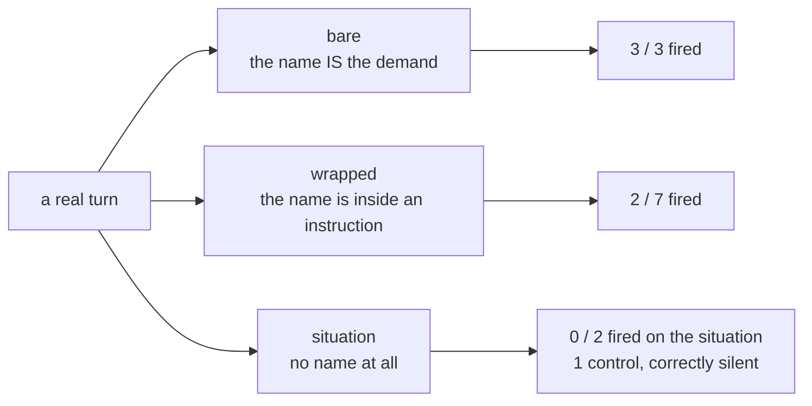

# What a skill `description:` must contain

**Decision, [#155](https://github.com/Calyx-Engineering/arc/issues/155), 2026-09-07.** Measured
on 13 cases drawn from real turns in the post-install corpus, scored by
[`tools/skill-cases.sh`](../../../tools/skill-cases.sh).

> **A trigger clause must contain the words the user types.** The situation, written in the
> author's vocabulary, does not fire. `handoff` describes *"a cold start to rehydrate from the
> previous session"* and the user types *"read handoff"* — those share no word, and `handoff`
> fired at none of the five prompts that asked for it.

## 1 The four rules

| | Rule | Because |
|---|---|---|
| **R1** | **The trigger clause opens the description, and holds the user's own nouns and verbs** — quoted from transcripts, not paraphrased | Every skill that fired on a wrapped name had the user's phrase in its description. Every one that did not, did not |
| **R2** | **The artifact's name belongs in the trigger clause, not the *Covers* clause** | `handoff`'s description says *handoff* once, inside *"Covers what the handoff holds"*. That is scope, and scope does not match |
| **R3** | **A trigger clause must survive company** — say that it applies even when the request carries other instructions | Naming Camp fires when the name is the whole demand and fails when three more requests follow. Same name, same description |
| **R4** | **The user's word wins over the taxonomy's word** | `record-route` enumerates *"a decision, a measurement, an analysis, a rejected approach, a finding, a report"*. It does contain **log** — but only inside `dev-log` and `arc-log`, which are destinations, not the user's verb. The user says *"log this in the friction log"*, and nothing fired |

**R3 is the one that is not obvious.** R1, R2 and R4 all say "put the right words in"; R3 says
the words being present is not sufficient, and the clause has to claim the crowded case
explicitly.

## 2 The three shapes, measured

An **opening** is a session's first three prompt turns; a **shape** is a property of one turn.

| Shape | Fired | What the passes have in common |
|---|---|---|
| **bare** | **3/3** | Nothing — every bare demand fired, including the blunt one. *"please load all the skills from Arc"* pulled eleven at once |
| **wrapped** | **2/7** | Both passes are prompts whose exact words are in the description: *"autonomous mode"* → `autonomy-set`, *"retrospective process"* → `plugin-retrospective` |
| **situation** | **2/3** | One pass is the control, where silence is correct. Of the two cases that expect a skill, one did not fire and the other fired only inside a workflow the assistant had already begun. **Neither fired on the situation alone** |

### 2.1 The comparison the decision rests on

Four prompts, one skill, one description. `camp`'s description already says *"Use when the user
addresses Camp by name"*.

| The prompt | Rest of the message | `camp` fired |
|---|---|---|
| *"Hi Camp, where are we at?"* | nothing | **yes** |
| *"Camp, where are we at?"* | nothing | **yes** |
| *"Hey Camp, please read handoff and get back up to speed. Tell me where we are at —"* … | three further requests | **no** |
| *"hey camp - i want to conclude measurements on issue 40 today. please read handoff, get up to speed, and tell me where we are at"* | a goal and two requests | **no** |

**The name is present in all four.** What changes is how much else is in the message — which is
why R3 exists, and why "put the name in the description" is not on its own a fix.

## 3 Does one cause explain the six symptoms?

**No.** It explains three of them, is disproved for one, and two are unmeasured.

| | Symptom | A firing failure? | Evidence |
|---|---|---|---|
| **Fire-1** [#155](https://github.com/Calyx-Engineering/arc/issues/155) | Fires on a bare demand, not on a situation | **Yes** | bare 3/3; neither situation case with an expected skill fired on the situation alone |
| **Fire-2** [#156](https://github.com/Calyx-Engineering/arc/issues/156) | An instruction wrapped around a name suppresses the match | **Yes** | §2.1 — the two misses are the two prompts carrying other requests |
| **Fire-3** [#157](https://github.com/Calyx-Engineering/arc/issues/157) | An opening does not load handoff or camp | **Yes** | `handoff` 0/5. Its trigger clause holds none of the user's words — R1 and R2 |
| **Fire-4** [#158](https://github.com/Calyx-Engineering/arc/issues/158) | Response length is not held after it is set | **No — disproved** | §3.1 |
| **Fire-5** [#159](https://github.com/Calyx-Engineering/arc/issues/159) | Reports are narrative, not conclusion | **Unmeasured** | `engineering-report` fired once in 15 sessions, inside a bulk load. No session has it firing while a report stayed narrative |
| **Fire-6** [#160](https://github.com/Calyx-Engineering/arc/issues/160) | Numbered topics are dropped mid-reply | **Unmeasured** | The session where the user complains ran 223 turns and `chat-response` never fired in it. Consistent with a firing failure, but nothing tests firing as the remedy |

### 3.1 Why Fire-4 is disproved rather than unmeasured

Two observations, pointing opposite ways, and neither is about firing.

1. **The skill fired and the behaviour failed immediately.** In `c4fe2b5c`, `chat-response`
   fired on prompt turn 1. The reply it governed was 2251 characters, and the user's next words
   were *"ooof - that is a lot of words."*
2. **The budget was met without the skill.** In `be5aca1c`, the user asked for *"60 words or
   less"* at turn 1 and got 54 words. `chat-response` never fired in that session at all — and
   by turn 3 the replies were back over 3000 characters.

**Firing is neither necessary nor sufficient for Fire-4.** Whatever governs a held budget, it is
not whether the skill loaded.

### 3.2 What this means for the workstream

| | |
|---|---|
| **Fire-2 and Fire-3 collapse into Fire-1's fix** | Both are a trigger clause missing the user's words. Applying §1 to `handoff` and `camp` is one edit each, and §2.1 is the case that says whether it worked |
| **Fire-4 does not** | It needs a different investigation — adherence across a session, not activation at a turn |
| **Fire-5 and Fire-6 are not yet answerable** | Neither has a session where the skill fired and the symptom still occurred. Until one exists, "fire it more" is untested as a remedy |

## 4 The instrument was wrong, and the baseline moved

**A skill's own firing inflated the turn counter that measured it.** When a skill fires, its
`SKILL.md` body is injected into the transcript on a `user` envelope. So does a tool result, a
slash command's echo, an interrupt marker and a task notification. The
[first baseline](skill-firing-baseline.md) counted every one of them as a user turn, which pushed
later turns past the opening window and biased **at opening** downward — worst in exactly the
sessions where a skill fired early.

`origin.kind` and `promptSource` are what separate a prompt from the rest. The corrected rule is
`is_prompt_turn()`, identical in [`tools/skill-firing.py`](../../../tools/skill-firing.py) and
[`tools/skill-cases.py`](../../../tools/skill-cases.py), and each of its five exclusions has a
fixture that goes red when that exclusion is deleted.

| Skill | At opening, before | After |
|---|---|---|
| `arc-intent` | 0/15 | **2/15** |
| `autonomy-set` | 1/15 | **2/15** |
| `decompose` | 0/15 | **1/15** |
| `engineering-report` | 0/15 | **1/15** |
| `handoff` | 0/15 | **1/15** |
| `issue-write` | 1/15 | **4/15** |
| `plugin-retrospective` | 1/15 | **2/15** |
| `relief-valve` | 0/15 | **1/15** |
| `spec-interview` | 0/15 | **1/15** |
| `work-watch` | 0/15 | **1/15** |
| `camp`, `chat-response`, `record-route` | unchanged | unchanged |

**Read the corrected column with care.** Most of the movement is one session — `c4fe2b5c`, where
the user typed *"please load all the skills from Arc"* and eleven skills fired on turn 2. Under
the old rule the injections caused by the first of those pushed the rest out of the window; under
the correct rule all eleven land inside it. `handoff`'s single **at opening** fire is that bulk
load, not a trigger that worked.

**This is why the per-shape score is the instrument for Fire-2 to Fire-6, and the corpus rate is
not.** A rate over whole sessions cannot tell a match from a bulk load; a per-prompt case can.
