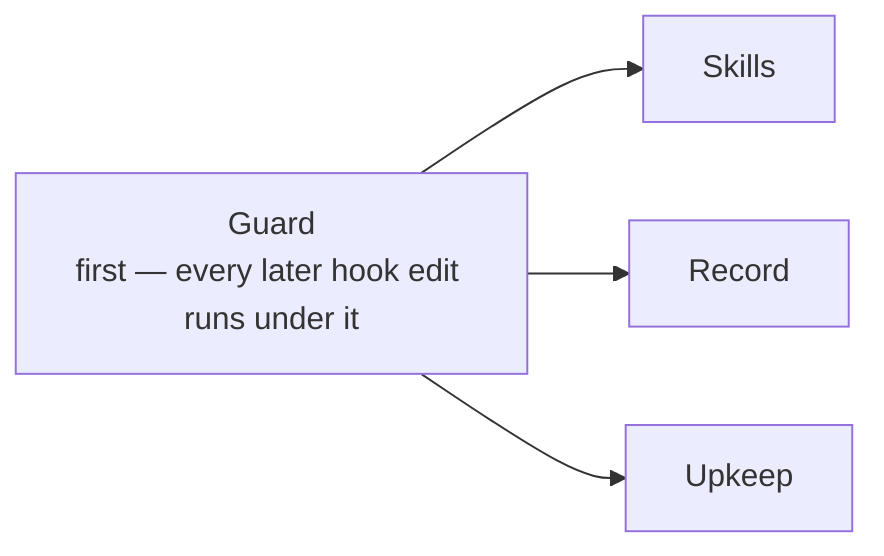

# Arc 05 — upkeep

**Arc 04 ran Arc on Arc and left a pile: three hook-safety mechanisms designed but not built, six skill reviews, a record with gaps, and a loop that bills Fable by accident.** This arc pays that down before Arc runs on real work again.

**Milestone:** Upkeep (new)  ·  **Branch:** `arc/05-upkeep`  ·  **Starts:** after arc 04 closes and `v0.2.0` is tagged. One arc branch live at a time.

## 1 Objective

**Make Arc safe and cheap to run unattended.** Hooks that cannot take a session down. Runs that cost Sonnet money by default. Skills trimmed to what fires.

Not self-improvement. [#18](https://github.com/Calyx-Engineering/arc/issues/18) · [#19](https://github.com/Calyx-Engineering/arc/issues/19) · [#36](https://github.com/Calyx-Engineering/arc/issues/36) · [#261](https://github.com/Calyx-Engineering/arc/issues/261) stay in the Self-improvement milestone, unclaimed, until a work week's transcripts exist to measure them against.

## 2 What success looks like

| Today | After |
|---|---|
| A bad hook fires on every tool call in every repo; the only guard is a kill-switch file | A hook PR merges only after a canary session; every hook runs under a wrapper with a timeout and a circuit breaker |
| 47 of 51 arc 04 runs billed Fable because `arc-loop.sh` passes no model | `arc-loop.sh` refuses to launch without `--model`; the playlist names the model per track |
| Six skills have never been reviewed against what they made runs do | Each review lands as a diff and a soak line |
| `ROADMAP.md` stale since 2026-08-21 and nobody reads it | Deleted. Arc-logs and milestones carry the plan |
| Three of four S12 runs stalled — two waited on a background gate, one stopped to ask | `run-instructions.md` §3 rewritten 2026-09-12, uncommitted: nothing in the background, nobody answers. S13 on is the soak |

## 3 Scope

| In | Out |
|---|---|
| Hook safety: canary, wrapper, fixtures, the two branch-guard and loop fixes | Probes that need real-work transcripts |
| The skill reviews filed by Fire's review, and three skill-loading bugs | Mining a work week — the Retrospective is its own arc |
| Record gaps: mechanism registry, soak section, CI, artifact table | New capability. Nothing here is a feature except Guard's three, and those were designed in arc 04 |
| Upkeep: the loop's model default, ROADMAP retired, the seven unmilestoned issues | Bench-day work — [#246](https://github.com/Calyx-Engineering/arc/issues/246) |

## 4 The four workstreams

| Workstream | What it fixes | Issues | Model |
|---|---|---|---|
| **Guard** | A hook change can break the session needed to fix it | 5 | **Opus.** Hooks. David present for TEMPLATE, `verify-hook.sh`, SessionStart |
| **Skills** | Skills carry rules that never fire, and three loading bugs | 9 | Opus for the six reviews; Sonnet for the three fixes |
| **Record** | The durable record has holes the next arc falls into | 5 | Sonnet; Opus for [#5](https://github.com/Calyx-Engineering/arc/issues/5) |
| **Upkeep** | Small wrongnesses, the loop's cost default, and the unrouted | 9–10 | Sonnet |

**Guard first.** The wrapper and canary exist so the other three can touch hooks safely. Skills, Record and Upkeep are independent after that.

### 4.1 Guard

| Issue | Delivers | Model |
|---|---|---|
| [#325](https://github.com/Calyx-Engineering/arc/issues/325) | A canary session before a hook PR merges | Opus |
| [#327](https://github.com/Calyx-Engineering/arc/issues/327) | Fixture hooks that validate `verify-hook.sh` — same track as #325, same files | Opus |
| [#326](https://github.com/Calyx-Engineering/arc/issues/326) | `hooks/lib` wrapper: timeout and circuit breaker, every hook, TEMPLATE. **Alone in its set** | Opus |
| [#294](https://github.com/Calyx-Engineering/arc/issues/294) | branch-guard's verdict no longer depends on the root form | Opus |
| [#310](https://github.com/Calyx-Engineering/arc/issues/310) | The loop's report dispatch stops exiting 1 at its mode read | Sonnet |

### 4.2 Skills

| Issue | Delivers | Model |
|---|---|---|
| [#277](https://github.com/Calyx-Engineering/arc/issues/277) | issue-write reviewed; checkable rules move into tracker-verify | Opus |
| [#278](https://github.com/Calyx-Engineering/arc/issues/278) | work-watch and relief-valve reviewed | Opus |
| [#279](https://github.com/Calyx-Engineering/arc/issues/279) | chat-response, engineering-report, record-route reviewed | Opus |
| [#280](https://github.com/Calyx-Engineering/arc/issues/280) | The four spine skills reviewed | Opus |
| [#281](https://github.com/Calyx-Engineering/arc/issues/281) | spec-interview, decompose, plugin-retrospective reviewed | Opus |
| [#282](https://github.com/Calyx-Engineering/arc/issues/282) | CLAUDE.md and the product definition carry the skill rule | Sonnet |
| [#106](https://github.com/Calyx-Engineering/arc/issues/106) | A count restated in a skill is stated once | Sonnet |
| [#123](https://github.com/Calyx-Engineering/arc/issues/123) | A skill's `references/` directory is copied | Sonnet |
| [#125](https://github.com/Calyx-Engineering/arc/issues/125) | A skill with no declaration is reported | Sonnet |

**One review per track, one review per set.** Each review edits one skill family; two in a set would grade each other's cache.

### 4.3 Record

| Issue | Delivers | Model |
|---|---|---|
| [#5](https://github.com/Calyx-Engineering/arc/issues/5) | A registry issuing mechanism numbers across the three plugins | Opus |
| [#94](https://github.com/Calyx-Engineering/arc/issues/94) | The arc-log template gains its Soak section — arc 04 wrote one by hand | Sonnet |
| [#117](https://github.com/Calyx-Engineering/arc/issues/117) | `verify-all.sh` runs in CI on every PR | Sonnet |
| [#124](https://github.com/Calyx-Engineering/arc/issues/124) | The artifact table says what exists | Sonnet |
| [#126](https://github.com/Calyx-Engineering/arc/issues/126) | camp-session-start renamed for its event | Sonnet |

### 4.4 Upkeep

| Issue | Delivers | Model |
|---|---|---|
| *new* | `arc-loop.sh` refuses to launch without `--model`; the playlist's Model column is the source | Sonnet |
| *new* | `ROADMAP.md` deleted, CLAUDE.md line removed; closes [#175](https://github.com/Calyx-Engineering/arc/issues/175) and [#49](https://github.com/Calyx-Engineering/arc/issues/49) | Sonnet |
| [#243](https://github.com/Calyx-Engineering/arc/issues/243) | The saturation probe run against the installed plugin — the verdict arc 04 owed | Sonnet, one probe run |
| [#285](https://github.com/Calyx-Engineering/arc/issues/285) | The last two case readers use the shared reader | Sonnet |
| [#169](https://github.com/Calyx-Engineering/arc/issues/169) | An obligation stated in conversation is not dropped | Opus |
| [#170](https://github.com/Calyx-Engineering/arc/issues/170) | Commits do not land before review | Sonnet |
| [#171](https://github.com/Calyx-Engineering/arc/issues/171) | Behaviour rules follow the user to another machine | Sonnet |
| [#79](https://github.com/Calyx-Engineering/arc/issues/79) | Each record names the skill that wrote it | Sonnet |
| [#105](https://github.com/Calyx-Engineering/arc/issues/105) | The product definition re-split — **David's**, guided | — |

**Moved to Self-improvement 2026-09-12:** [#181](https://github.com/Calyx-Engineering/arc/issues/181) eval suite that gates skill firing, [#77](https://github.com/Calyx-Engineering/arc/issues/77) spec-reviewer agent. Capability, not upkeep.

## 5 Size

| | |
|---|---|
| Issues | 28 filed, 2 new |
| Tracks | ~22 — Guard's #325+#327 share one; reviews are one each |
| Sets | **8**, at 3–4 tracks per set and one hook track or one review per set |
| Cap | **10 sets.** Past it, cut at plan time — arc 04 cut mid-arc and lost the shape |
| Cost | Arc 04: 51 runs, ~$1,080, mostly Fable. Sonnet runs in S12 cost $3–5 each. Estimate **$150–250** with Opus on the ten judgement tracks |

## 6 Decisions made at planning

| Decision | What would have to change |
|---|---|
| **Sonnet is the default run model.** Opus for hooks, scoping, reviews. Fable only by agreement between David and the orchestrator, per issue | A Sonnet run ships a defect a review pass should have caught, on a bounded fix |
| **The model is named per track in the playlist**, at plan time | — |
| **Guard runs first, and only when David is present** | The wrapper (#326) lands and proves a hook edit cannot take a session down |
| **One arc branch live at a time** — arc 05 opens after `v0.2.0` | — |
| **ROADMAP.md is retired** | — |
| **A run never asks.** It decides, states the assumption in its dev-log, continues | — |
| **Self-improvement is a separate milestone**, not a workstream here | A work week's transcripts exist |

## 7 What is least certain

| | |
|---|---|
| **The reviews' instrument** | Arc 04 found frozen graders cannot score a skill change (#260). A review that trims a skill needs a live probe to say nothing broke. `tools/skill-probe.sh` exists; whether each review can afford a probe run is decided per track |
| **The canary (#325)** | A `claude -p` session that exercises a hook before merge — the design is m10 §5's, the cost per hook PR is unmeasured |
| **Sonnet on reviews** | Untested. The plan says Opus; if the first review on Opus is clean and cheap, the rest may follow at Sonnet |
