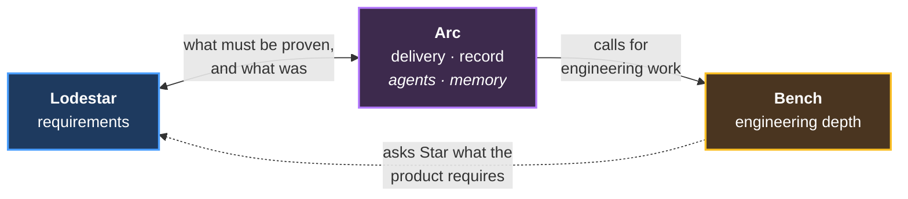

# Product Plan — mechanisms by plugin

**The conclusion of the 2026-08 retrospective.** What each plugin is, what it ships, and
what state each mechanism is in.

Evidence for the friction-derived rows lives in [friction-transcript-log.md](../../retrospectives/2026-08-plugin-line/friction-transcript-log.md).
Specifications live in [mechanisms/](mechanisms/). This file is the plan; those are the
inputs.

**This document is expected to change.** Every shipped mechanism updates a status; every
retrospective may add rows.

---

## 1. The three plugins

| Plugin | One line | Nature |
|---|---|---|
| **Lodestar** | Know what the product must be | **Invention** — nothing works yet, anywhere |
| **Arc** | Get the work done, in order, with a record — and put the right agent on it | Extraction + an autonomy switch |
| **Bench** | Analyse at real engineering depth, and drive the instruments | Extraction + one hard build |

**Arc absorbed agent orchestration.** It was scoped as a separate plugin (`Crew`) and
failed the always-loaded-together test in both directions: every Arc mechanism that
dispatches work needs the roster, and every orchestration mechanism is triggered by an
arc. Agent orchestration survives as a **group inside Arc**, not a boundary — see §3.

---

## 2. How they fit together

**Arc calls Bench when a task needs engineering depth.** Nothing calls Arc. Lodestar and
Bench each call nothing outward, which is what lets either be published or frozen alone.

**The Arc ↔ Lodestar line is data, not dependency.** Lodestar supplies the acceptance
criteria a chunk of work must meet — what *done* means for a requirement — and receives
back whether it was actually proven, which moves the verification matrix. Arc needs
Lodestar; Lodestar never needs Arc.

**The dotted arrow is the new one.** The EE persona queries **Star** for requirements
rather than reading stories directly
([friction-transcript-log §3.4](../../retrospectives/2026-08-plugin-line/friction-transcript-log.md#34-the-lodestar-gap-appears-twice-and-not-where-the-design-expects-it)),
which makes Lodestar an active participant in delivery rather than a document store.

**Freezing any one plugin leaves the others valid** — the direct answer to single-track
working, where products develop in sequence with long gaps between.

---

## 3. Why three plugins, not five

**The test is always-loaded-together.** Two candidate plugins failed it and were absorbed
into Arc.

### Agent orchestration is a group in Arc, not a plugin

Scoped as `Crew` — roster, delegation tiers, waves, human gate, the wiki, transcript
mining. It fails the test in **both** directions:

| | |
|---|---|
| **Arc without it** | Impossible. Arc's decomposition, mining trigger, and arc-tree all dispatch agents |
| **It without Arc** | Impossible. Mining is triggered by Arc's PR hook; waves and gates are arc-shaped |
| **The boundary cost was real** | Row 19 is an Arc hook whose only job is calling a Crew agent — a plugin crossing for one call |
| **`Crew` was also the wrong public name** | Too generic for a marketplace competing with finance and HR plugins |

**What survives:** `agent-process-foundation.md` is written to be dropped into any repo,
and delegation genuinely is repo-agnostic. That makes it a **portable file**, not a
separate plugin.

### Plugin self-improvement is also a group in Arc

Same test, same answer, and it was already settled before the merge:

| | |
|---|---|
| **One agent, two filters** | Splitting by filter rather than by capability is the wrong axis |
| **Improvement happens in two places** | From the plugin repo, and **live from a product repo** mid-development. A separate plugin would have to be loaded in both |
| **It is agent behavior** | Arc owns how agents work and what they remember. "Notice the tooling is failing and propose a fix" belongs there. The wiki sets the precedent |
| **Three mechanisms do not justify a plugin** | Per-plugin tax is real; the maintenance unit is the mechanism |

**The case against is genuine:** a separate plugin would let improvement tooling version
independently of delegation. **Revisit if either stops loading with the other.**

### Supporting detail — transcript mining is one capability with two filters

Both knowledge mining and friction mining run the same pipeline over **past Claude Code
chat sessions** (the JSONL transcripts under `~/.claude/projects/`) — extract user turns,
filter, cluster, propose. They differ only in **what they filter for** and **where the
output goes**:

| | Knowledge filter | Friction filter |
|---|---|---|
| Looks for | Findings, measurements, rejected options | Corrections |
| Writes to | **K4 → K2** — `arc-work/` · `scratch/` · wiki | Issues + fixes in the plugin repo |
| Invoked at | PR time, by Arc | PR time, and by the retrospective |

**Both live together.** Splitting them by filter would duplicate the pipeline across two
groups and let it drift — and the transcript index they share would sit on the far side
of a boundary from one of its consumers.

Arc invokes the agent at PR time the same way it invokes any other agent in its roster.

---

## 4. Every mechanism

| | Legend | | | |
|---|---|---|---|---|
| **Form** | hook — code that runs on an event; does small work, denies, or triggers | skill — invoked, shapes behavior | agent — token-heavy, returns a packet | |
| **Source** | 🔥 friction — this retrospective | 📐 design — Lodestar docs 01–04 | ⚙️ proven — runs in TimeScope or ROADZ | |
| **State** | ✅ written | 🟩 works, needs porting | 🟦 spec written | ⬜ not designed |
| **Effort** |  high |  medium |  low | — none, already built |

| # | Plugin | Group | Mechanism | Form | Src | State | Eff | Payback | Spec |
|---|---|---|---|---|---|---|---|---|---|
| 1 | **Lodestar** | Capture | Story capture + wake-word | hook skill | 📐 | ⬜ |  | **Requirements get solicited during ordinary chat.** *Notices a discussion touching on requirements and builds the story on the spot, with the user* | — |
| 2 |  | Capture | Source retrieval | agent | 🔥 | ⬜ |  | **Requirements stop hiding in Slack.** *Finds requirements someone already stated in writing — Slack threads, email, tickets, docs — and writes them into the story set* | [evidence](../../retrospectives/2026-08-plugin-line/friction-transcript-log.md#34-the-lodestar-gap-appears-twice-and-not-where-the-design-expects-it) |
| 3 |  | Capture | Source decomposition | agent | 🔥 | ⬜ |  | **Constraints become requirements nobody wrote down.** *Derives them from datasheets, standards, and interface specs — the requirement exists in the engineering, not in anything anyone said* | [evidence](../../retrospectives/2026-08-plugin-line/friction-transcript-log.md#34-the-lodestar-gap-appears-twice-and-not-where-the-design-expects-it) |
| 4 |  | Capture | Story set upkeep | skill hook | 📐 | ⬜ |  | **The set stays coherent.** *Fires when a story is written or changed; dedupes, retires, flags contradictions as the set grows* | — |
| 5 |  | Represent | RD generation | skill | 📐 | 🟦 |  | **One readable product definition.** *Groups stories by area and stakeholder into `docs/stories/RD.md`* | [doc 01](https://github.com/Calyx-Engineering/lodestar/blob/main/docs/01-design-story-driven-requirements.md#the-requirements-document-rd) |
| 6 |  | Represent | Verification method per story | skill | 📐 | ⬜ |  | **Every story says how it will be proven.** *Authors acceptance criteria and picks the method — test, analysis, inspection, or demonstration* | [doc 04](https://github.com/Calyx-Engineering/lodestar/blob/main/docs/04-arc-execution-and-roles.md#what-star-owns) |
| 7 |  | Represent | RVTM generation | skill | 📐 | ⬜ |  | **Proof status is visible in one place.** *The RVTM (Requirements Verification Traceability Matrix) — requirement × configuration × method × status. The test plans now hand-written as issues* | [doc 04](https://github.com/Calyx-Engineering/lodestar/blob/main/docs/04-arc-execution-and-roles.md#what-star-owns) |
| 8 |  | Represent | **Star** — PO-delegate | agent | 📐 | ⬜ |  | **Requirements get used, not just stored.** *Answers mid-build with authority, marks provisional, or escalates a gap* | — |
| | ‎ | | | | | | | | |
| 9 | **Arc** | Workflow | Kickoff + scope gate | skill | ⚙️ | 🟩 |  | ✅ *Already TimeScope — a hard stop before any branch* | — |
| 10 |  | Workflow | Branch / worktree guard | hook | 🔥 | 🟩 |  | **Right workspace, every time.** *Verifies branch, worktree, and base freshness before any edit* | — |
| 11 | | Workflow | `issue-writing` | skill | ⚙️ | ✅ | — | ✅ *Already written — issue and PR body practice* | — |
| 12 |  | Workflow | Issue linking | hook skill | 🔥 | 🟦 |  | **Everything links, nothing strays.** *Branch↔issue and PR↔issue links form; PR targets the arc branch* | [spec](mechanisms/issue-linking.md) |
| 13 |  | Workflow | Issue write-back | hook skill | 🔥 | 🟦 |  | **Edits land, agreed actions get filed.** *Reads back what it wrote; captures follow-ups agreed mid-conversation* | [spec](mechanisms/issue-write-back.md) |
| 14 |  | Workflow | Commit rhythm | skill hook | 🔥 | 🟦 |  | **Commits at reviewable points.** *Skill judges when to propose; hook checks files saved, identity, nothing dropped* | [spec](mechanisms/commit-rhythm.md) |
| 15 |  | Record | Context ladder / handoff | skill agent | 🔥 | 🟦 |  | **Cold starts stop costing 20 minutes.** *The reading order — which documents a fresh session opens, and when to stop* | [spec](mechanisms/handoff-spine.md) |
| 16 |  | Record | Record routing | skill | 🔥 | 🟦 |  | **Analysis stays findable.** *Decides which file a finding is written to across K1–K4, and promotes it when an analysis outlives the arc* | [tiers](mechanisms/knowledge-tiers.md) · [structure](mechanisms/hardware-record-structure.md) |
| 17 |  | Record | K1 upkeep | skill | ⚙️ | 🟩 |  | ✅ *Already TimeScope — keeps the always-read files current: the `arc-log` status table as work lands, a `dev-log` per issue filled at decision points* | — |
| 18 | | Record | `engineering-report` | skill | ⚙️ | ✅ | — | ✅ *Already written — report layering and length budgets* | — |
| 19 |  | Record | Knowledge mining trigger | hook | 🔥 | 🟦 |  | **Reasoning in Claude transcripts reaches the record.** *Fires at PR time and invokes row 29 with the knowledge filter; findings land in K2 — `arc-work/`, `scratch/`, the wiki* | [spec](mechanisms/transcript-mining.md) |
| 20 |  | Planning | Arc decomposition, checkpoints | skill | 📐 | 🟦 |  | **Work arrives in reviewable chunks.** *Sequences issues and places checkpoints right after the riskiest work — risk-weighted, not calendar-weighted* | [doc 04](https://github.com/Calyx-Engineering/lodestar/blob/main/docs/04-arc-execution-and-roles.md#checkpoints--risk-weighted-not-calendar-weighted) |
| 21 |  | Planning | Arc-tree — spawn diagram | agent | 🔥 | ⬜ |  | **Arc shape is visible.** *Family tree of which issue spawned which — scope growth shows early. Rendered into the `arc-log` at arc close, so the shape the arc actually took is part of its record.* **Proposed by the retrospective, not extracted from friction** | — |
| 22 |  | Planning | Configuration management | skill | 🔥 | ⬜ |  | **What is in this revision, exactly.** *Software: solved by branches, PRs, releases — sits naturally in Arc. Hardware: component versions and BOM state,* **undefined and deferred** — *file as an Arc issue when the plugin exists* | [needs interview](../../retrospectives/2026-08-plugin-line/friction-transcript-log.md#5-what-still-needs-the-interview) |
| 23 |  | Planning | Test obligation capture | hook skill | 🔥 | 🟦 |  | **Designs get tested when the part arrives.** *Proposes the test item at design time; `issue-writing` files it* | [spec](mechanisms/test-obligation-capture.md) |
| 24 |  | Planning | Verification campaign | skill | 📐 | ⬜ |  | **Requirements get proven, and the matrix moves.** *Turns unproven RVTM rows into a validation milestone; results flow back to Lodestar. The top-down twin of row 23.* **Deferred — needs the interview** | [gap](../../retrospectives/2026-08-plugin-line/friction-transcript-log.md#5-what-still-needs-the-interview) |
| 25 | | Agents | Agent roster + dispatch tiers | skill | ⚙️ | ✅ | — | ✅ *Already written — TimeScope's `agent-process-foundation.md`: named agent definitions (scout, planner, builder, reviewer) plus how much to delegate — T0-Inline none · T1-Squad one track · T2-Wave parallel worktrees* | — |
| 26 | | Agents | Briefs down / packets up | skill | ⚙️ | ✅ | — | ✅ *Already written — a subagent gets a small brief and returns a bounded packet, never its raw working context. What keeps the orchestrator from filling up* | — |
| 27 |  | Agents | Worktree waves | skill | ⚙️ | 🟩 |  | ✅ *Already TimeScope — parallel tracks on disjoint files* | — |
| 28 |  | Agents | Human gate | skill | ⚙️ | 🟩 |  | ✅ *Already TimeScope — one gate per feature-complete state* | — |
| 29 |  | Agents | Agent wiki | skill hook | ⚙️ | 🟩 |  | ✅ *Already works in both repos — fork planned* | — |
| 30 |  | Self-improve | Transcript mining | agent | 🔥 | 🟦 |  | **One pipeline, two filters.** *Knowledge filter promotes K4 → K2; friction filter clusters corrections into mechanism candidates. The knowledge filter is not yet designed* | [spec](mechanisms/transcript-mining.md) |
| 31 |  | Self-improve | Self-improvement loop | agent hook | 🔥 | 🟦 |  | **Tooling fixes land without leaving the work.** *Files the issue, makes the fix in the local plugin repo uncommitted, opens the diff. Recurrence counter escalates what keeps coming back* | [spec](mechanisms/self-improvement-loop.md) |
| 32 |  | Self-improve | Session preservation | hook | 🔥 | 🟦 |  | **Past chat sessions stay findable.** *Indexes transcript directories at creation, before a worktree is deleted. Row 30 reads that index — without this, K4 has holes* | [spec](mechanisms/session-preservation.md) |
| 33 | | Self-improve | Plugin retrospective | skill | 🔥 | ✅ | — | **Turns future work into mechanisms.** *The process that produced this plan* | [skill](../../.claude/skills/plugin-retrospective/SKILL.md) |
| | ‎ | | | | | | | | |
| 34 | **Bench** | Analysis | Domain engineer persona | agent skill | 🔥 | 🟦 |  | **Analysis at real engineering depth.** *Reads datasheet curves, asks Star for requirements, escalates once then logs* | [spec](mechanisms/domain-engineer-persona.md) |
| 35 |  | Analysis | Datasheet graph reading | agent | 🔥 | ⬜ |  | **Curves become usable numbers.** *Prerequisite for the persona — the data is in images, not text* | — |
| 36 | | Analysis | Schematic → netlist | skill | ⚙️ | 🟩 | — | ✅ *Already works — `sch_netlist.py`* | — |
| 37 |  | Analysis | Bench instrument control | skill | 🔥 | ⬜ |  | **Instruments are driven, captures land in the record.** *Scope, supply, load, DMM.* **Nothing exists yet** — *the row is here to claim the slot: instrument control belongs in EE Toolbox, not scattered into Arc or a repo's `tools/`* | — |

**✅ in the Payback column marks a mechanism that already exists** — it is here for
completeness, not because it needs designing. Skip those rows.

---

## 5. Reading the table

| | Lodestar | Arc | Bench |
|---|---|---|---|
| Mechanisms | 8 | 26 | 4 |
| Already written or working | **0** | 11 | 1 |
| From friction evidence | 2 | 16 | 3 |

**Arc is most of the plan — 26 of 37 mechanisms.** Eleven already exist in TimeScope or
ROADZ; most of the rest are low-effort adaptation. Its Agents and Self-improve groups are
the most complete part.

**Lodestar has nothing built.** Every other plugin extracts something that works. That is
its risk and its value in one line.

**Nine mechanisms carry High effort with nothing to copy:**

- Lodestar's story capture, source retrieval, source decomposition, and Star
- Arc's configuration management and verification campaign — both **deferred**, both
  hardware gaps awaiting the interview
- Arc's self-improvement loop
- Bench's domain persona, its datasheet-graph prerequisite, and instrument control

Everything else is extraction or a low-effort adaptation.

**This table is a checkpoint, not a final scope.** All evidence behind it is
discovery-phase — execution was never observed, and may need mechanisms nobody has named.
Re-run the retrospective after the first execution stretch
([friction-transcript-log §5](../../retrospectives/2026-08-plugin-line/friction-transcript-log.md#5-what-still-needs-the-interview)).

---

## 6. Build order

| # | Plugin | Why |
|---|---|---|
| 1 | **Arc — Agents group** | Mostly copying files from TimeScope. Improves the work of building everything else |
| 2 | **Arc — the rest** | Proven in software; hardware branch pattern proven. The autonomy switch is the real design work |
| 3 | **Lodestar** | Invention. Highest risk, and it benefits most from Arc existing |
| 4 | **Bench** | Accretes as engineering work happens; no forcing function |

**The uncomfortable part:** Lodestar is the thing most wanted and the evidence says build
it third — capture mechanisms only work when exercised against live work, which Arc
supplies.

**Defensible alternative:** extract the Agents group fast, then go straight to Lodestar
and leave the rest of Arc for later. Momentum is a real asset.

---

## 7. Open questions

| Question | Blocks |
|---|---|
| Does the autonomy switch hold, or do report and issue styles diverge? | [friction-transcript-log §6](../../retrospectives/2026-08-plugin-line/friction-transcript-log.md#6-parked--pull-on-these-later) |
| Where do requirements actually live today? | Lodestar's source-decomposition mechanism |
| Does hardware's gate latency break the human-gate model? | Arc's guided mode |
| Does `Bench` stay right if the domain-persona pattern generalises beyond EE? | Nothing yet; the name commits to hardware |

**Answered 2026-08-16:** *"is four plugins too many"* — yes, it was. Three now, and
`Crew`'s naming problem disappeared with the merge (§3).
