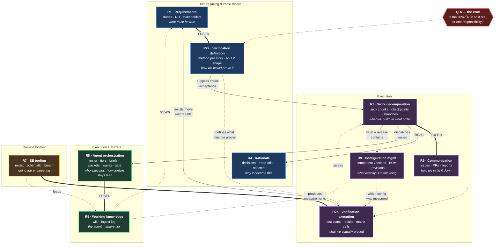
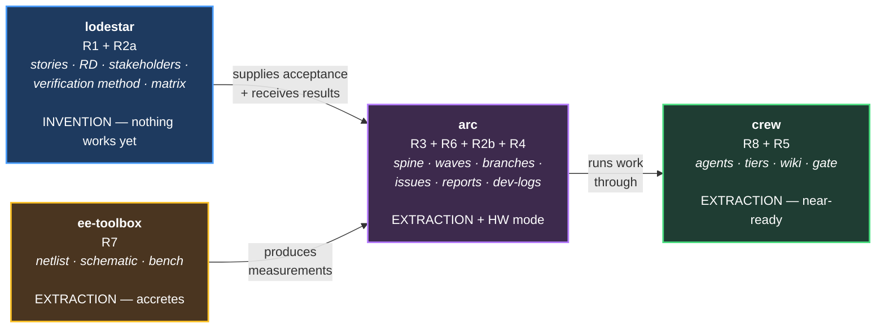

# Responsibility Decomposition — before drawing any product boundary

> **Read [what-the-tools-do.md](what-the-tools-do.md) first.** That document reframes
> this material as *actions the tool performs* rather than *artifacts someone owns*,
> and it is the newer thinking. This one remains the detailed artifact-side analysis —
> the overlap matrix, the FUSED/TIGHT couplings, and the tested architecture options
> live here and are not repeated there.

Working document, 2026-08-14. Supersedes the split proposed in `capability-map.md`
(that map listed capabilities but never decomposed them, so it asserted a boundary it
had not earned).

**Method.** Decompose into responsibilities. Establish what each one *owns*, what it
*reads*, and what it *writes*. Find the overlaps. Only then draw boundaries — and test
each candidate boundary against explicit criteria, including David's single-track
constraint.

**Revision, 2026-08-14 (later).** TimeScope's repo was located at
`R:\vscode_customizations\timescope` and read directly. It holds substantially more
built infrastructure than Lodestar's `reference-timescope/` folder described — 8
agents, 6 hooks, 4 workflow skills, 13 dev-logs, a working arc-log, and
`docs/agent-process-foundation.md`, which is an **explicitly portable, already-written
agent-orchestration model** with a domain-tuning table and a seeding checklist. Two
sections below are materially changed by this: §R4 (rationale — the hardware-vs-software
framing was wrong) and §R8 (a new responsibility that did not appear in the first pass).

---

## 1. The nine responsibility clusters

A responsibility is a thing that owns an artifact and answers a question. Not a
feature.

### R1 — Requirements definition

| | |
|---|---|
| **Question** | What must be true for this product to be right? |
| **Owns** | Stories (`STnnn`), the RD, stakeholder axis, definition-maturity status |
| **Reads** | Conversation, source documents (standards, specs, datasheets) |
| **Writes** | `docs/stories/*.md`, `RD.md` |
| **Human role** | Negotiated, agreed, shared |
| **Domain sensitivity** | Vocabulary only |
| **State today** | Designed (Lodestar docs 01/02), 2 stories exist, capture unbuilt |

### R2 — Verification definition & tracking

| | |
|---|---|
| **Question** | How do we prove it, and where does that stand? |
| **Owns** | Verification method per story, RVTM, config × status matrix, verification log |
| **Reads** | R1 stories; results from wherever testing happens |
| **Writes** | Matrix cells, verification log entries, test plans |
| **Human role** | Shared; auditable |
| **Domain sensitivity** | **Method vocabulary = nuance. Timing = control flow** (see §3) |
| **State today** | Designed; David is hand-building test plans as GitHub issues — painful, unsupported |

**Note.** Separated from R1 deliberately. Doc 04 already calls these "the
fulfillment-axis twin" — two lenses, one requirement set. They may still land in the
same product, but they are not the same responsibility, and their domain sensitivity
differs.

### R3 — Work decomposition & sequencing

| | |
|---|---|
| **Question** | What do we build, in what order, and when do we stop and check? |
| **Owns** | Arc definition, chunking, kickoff, checkpoints, branch/worktree structure |
| **Reads** | R1 (scope), R2 (acceptance) |
| **Writes** | Issues, branches, the execution plan |
| **Human role** | HW: engineer-driven. SW: agent-driven with touchpoints |
| **Domain sensitivity** | **Control flow — the deepest divergence in the system** |
| **State today** | Open design (doc 04); branch pattern working in ROADZ but unwritten |

### R4 — Rationale capture

| | |
|---|---|
| **Question** | Why did it become what it is? |
| **Owns** | Decision register / dev-log / arc-log, trade-offs, rejected approaches |
| **Reads** | Everything |
| **Writes** | `ddr/`, `docs/dev-log/`, `docs/arc-log/` |
| **Human role** | Human-facing, durable, survives the diff |
| **Domain sensitivity** | **Low** — a rejected approach is a rejected approach |
| **State today** | **Split verdict.** ROADZ `ddr/_ddr.md` = empty stub. TimeScope = **13 dev-logs + a working arc-log**, hook-enforced |

**The mechanism, confirmed by direct inspection.** TimeScope does not rely on
discipline. `dev_log_pr_link_gate.js` runs on `Stop` and gates the dev-log against the
PR. `docs/dev-log/TEMPLATE.md` and `docs/arc-log/ARC-TEMPLATE.md` supply the format.
The `feature` skill names the dev-log as part of the loop. Trigger + template +
enforcement — the same three-part pattern as the wiki.

**Correction to the first pass.** That pass framed this as "rationale works in
software, fails in hardware." That is the wrong axis, and §2.5 below shows why: the
variable is not domain, it is whether a mechanism exists. ROADZ has no dev-log
mechanism and produced no rationale; TimeScope has one and produced 13.

### R5 — Working knowledge

| | |
|---|---|
| **Question** | What does an agent need to know to act correctly here? |
| **Owns** | Wiki pages, ingest log, architecture/component/interface facts |
| **Reads** | Repo, bench findings, schematics, human correction |
| **Writes** | `.claude/wiki/` |
| **Human role** | **Agent-facing.** Humans read it, but it exists to make the agent efficient |
| **Domain sensitivity** | Low — the mechanism is domain-agnostic; the content is not |
| **State today** | **Working in both repos.** ROADZ 11 pages + dated ingest log; TimeScope 6 pages. Third-party `agent-wiki` plugin — **decision: fork it** (see the revised R5 finding in §2 — fork it *with* R8, not standalone) |

### R6 — Communication practice

| | |
|---|---|
| **Question** | How do we write it down for another person? |
| **Owns** | Issue/PR bodies, engineering reports, tracker link mechanics |
| **Reads** | Any of the above |
| **Writes** | Issues, PRs, `docs/report/` |
| **Human role** | Human-to-human |
| **Domain sensitivity** | **Format = low. Granularity = high** (see §3) |
| **State today** | Built and portable — `issue-writing`, `engineering-report`. Link mechanics stuck in ROADZ `CLAUDE.md` |

### R7 — Domain execution tooling

| | |
|---|---|
| **Question** | How do we actually do the engineering work? |
| **Owns** | Netlist extraction, schematic parsing, bench instrument control, test automation |
| **Reads** | CAD files, instruments |
| **Writes** | Measurements, parsed artifacts |
| **Human role** | Engineer's toolbox |
| **Domain sensitivity** | **Total — this IS the domain.** No shared core exists |
| **State today** | `tools/sch_netlist.py`, `amp-load-test`, altium parsing. **Decision: own plugin (EE toolbox)** |

### R8 — Agent orchestration

| | |
|---|---|
| **Question** | Who does the work, at what model tier, and how does context stay lean? |
| **Owns** | Agent roster, delegation tiers, briefs-down/packets-up protocol, worktree waves, model/effort mapping, spine-and-satellite sessions, the human gate |
| **Reads** | The work item; the wiki |
| **Writes** | Agent definitions, hook guards, session structure |
| **Human role** | The human is the orchestrator and holds the gate |
| **Domain sensitivity** | **Mechanism universal; gate and tracks swap per domain** — the tuning table already states this |
| **State today** | **The most mature thing in either repo.** 8 agents, 6 hooks, 4 skills, and `agent-process-foundation.md` — already written as portable, with a firmware column and a seeding checklist |

**Why this is its own responsibility, not part of R3.** R3 (work decomposition) asks
*what to build and in what order*. R8 asks *who executes and how context is managed*.
TimeScope separates them cleanly in its own files: the `feature` skill is R3, the
`delegate` skill is R8, and the arc spine coordinates both. They compose but do not
merge — an arc can run with no delegation (Tier 0, inline), and delegation applies to
work that never came from an arc.

**Why it did not appear in the first pass.** It is invisible from
`reference-timescope/`, which describes hooks and logs but not the orchestration model.
It only appeared on reading the repo. This is the largest gap the first pass had.

**The domain question for R8.** The tuning table lists a Firmware column but no
hardware-design column. Hardware's human gate is "assembled board in hand" — weeks
after the work, not minutes. Whether R8's model survives that latency is genuinely
open; it is the same control-flow issue as R2 timing, appearing in a second place.

### R9 — Configuration management

| | |
|---|---|
| **Question** | What exactly is in this thing, at this revision? |
| **Owns** | Component versions, BOM state, revision identity, what a release contains |
| **Reads** | Design source, part selections, the release event |
| **Writes** | BOM revisions, version tags, lifecycle state |
| **Human role** | Auditable; the thing a buyer, a regulator, or a future maintainer asks about |
| **Domain sensitivity** | **HW: component versions + BOM control. SW: version control, tagging, release identity** |
| **State today** | **SW: solved by convention** (git, semver, tags — TimeScope's `release` skill does this). **HW: unsupported.** ROADZ has `design_notebook/component_selections.md` and no BOM revision control |

**Why it is its own responsibility.** It answers a question no other cluster asks. R1
says what must be true; R2 says whether it was proven; R4 says why it was chosen. None
of them says *which physical parts, at which revisions, constitute the thing that was
proven*. In hardware that is the question a field failure starts with.

**Where it sits.** Delivery (`arc`), per David. It is release-space, not
requirements-space — it describes the artifact that gets shipped, not the requirements
the artifact must satisfy.

**Its coupling to R2b is the sharp part.** A verification result is meaningless without
the configuration it was measured against. ROADZ's own verification log format already
carries this implicitly — *"2026-07-06 — Standalone → Verified — rev A, bench
RAS-0001"* — where `rev A` **is** a configuration-management fact embedded in a
verification record. The two are already entangled in practice, with no mechanism
behind the entanglement.

**The lifecycle connection.** This is where David's dev/main + component-lifecycle-state
question lands (open item 3). "Which components are released vs in-work" is a
configuration-management question, and it is what a real PLM system exists to answer.
Any future Altium 365 / PLM integration is an R9 integration.

**Domain asymmetry worth noting.** R9 is the one responsibility where software's version
is *nearly free* — git and semver solve it by convention, which is why it never
surfaced from TimeScope. Hardware has no equivalent default, which is exactly why it
surfaced from ROADZ. A software-only view of this problem would have missed it entirely.

---

## 2.5 The evidence table — what actually got produced

Direct counts from both repos. This is the strongest empirical result in the document,
and it corrects the framing of the first pass.

| Artifact | TimeScope (SW) | ROADZ (HW) | Mechanism present? |
|---|---|---|---|
| **Wiki pages** | 6 | 11 | ✅ both — plugin, protocol, ingest log |
| **Rationale logs** | **13 dev-logs + 1 arc-log** | **0** (title-only stub) | ✅ TS: template + `Stop` hook gate + skill. ❌ ROADZ: none |
| **Stories** | **2 written** (11 backlog placeholders explicitly marked *"not yet real stories"*) | **2** | ❌ **neither** |
| **Agents / hooks** | 8 / 6 | 0 / 0 | ✅ TS only |

### What this proves

**1. The variable is mechanism, not domain.** Rationale capture succeeded in the repo
that had a template, a skill reference, and a `Stop`-hook gate; it failed in the repo
with a filename and good intentions. Nothing about hardware caused the ROADZ stub.

**2. Story capture fails in both domains — this is the central finding.** TimeScope has
more process infrastructure than most production repos, an explicit stories-are-the-
requirements doctrine, an index, a template, and a capture-trigger catalog. It still
has **2 written stories and 11 admitted placeholders.** ROADZ has 2 stories. Two
independent repos, opposite domains, very different rigor levels, identical outcome.

Story capture is the one responsibility that has **never been made to work anywhere**,
by anyone, in this body of work. Every other responsibility has at least one
working instance to generalize from. R1 has none.

**3. That is Lodestar's actual thesis, and it is now evidence-backed.** Not "hardware
needs requirements tooling" — *nobody* has working requirements capture, including the
software repo that wrote a doctrine about it. The gap is real and unclaimed.

**4. It also sets Lodestar's risk.** Every other product here is *extraction* — taking
something that demonstrably works and making it portable. Lodestar is *invention*. It
must build the mechanism that neither repo has. Higher risk, higher value, and it
argues for building Lodestar against a live capture need rather than in the abstract.

**5. The three-part pattern is now a design rule.** Everything that worked has:
**trigger** (something says *now*) + **template** (format is not a blank page) +
**enforcement** (a hook, gate, or mandatory closing step). Everything that failed has at
most one of the three. Lodestar's story capture must ship all three or it will produce
a third repo with 2 stories in it.

---

## 2. The overlap matrix

Where two responsibilities touch, and how tightly. This is what the earlier map was
missing.

| | R1 Req | R2 Verif | R3 Work | R4 Why | R5 Wiki | R6 Comms | R7 Tools | R8 Agents | R9 Config |
|---|---|---|---|---|---|---|---|---|---|
| **R1 Req** | — | **FUSED** | feeds | informs | feeds | uses | — | — | — |
| **R2 Verif** | **FUSED** | — | **TIGHT** | informs | feeds | uses | **TIGHT** | uses | **TIGHT** |
| **R3 Work** | reads | **TIGHT** | — | **TIGHT** | feeds | **FUSED** | — | **TIGHT** | **TIGHT** |
| **R4 Why** | informs | informs | **TIGHT** | — | feeds | uses | — | uses | informs |
| **R5 Wiki** | feeds | feeds | feeds | feeds | — | feeds | reads | **FUSED** | feeds |
| **R6 Comms** | uses | uses | **FUSED** | uses | feeds | — | — | uses | uses |
| **R7 Tools** | — | **TIGHT** | — | — | feeds | — | — | — | feeds |
| **R8 Agents** | — | uses | **TIGHT** | uses | **FUSED** | uses | — | — | — |
| **R9 Config** | — | **TIGHT** | **TIGHT** | informs | feeds | uses | reads | — | — |

**Legend.** FUSED = cannot be separated without breaking one. TIGHT = frequent
coordinated change across the boundary. feeds/uses/informs = loose, one-directional.

### The four couplings that matter

| Coupling | Nature | Consequence |
|---|---|---|
| **R1 ↔ R2** | FUSED | A story without a verification method is incomplete; a matrix without stories is meaningless. Same product, not negotiable |
| **R3 ↔ R6** | FUSED | An arc's output *is* issues. Issue practice with no arc is a style guide nobody invokes. Confirms David's always-loaded-together test |
| **R5 ↔ R8** | FUSED | The wiki is the agent memory tier, designed around agent context economics. Splitting them splits one mechanism across two repos |
| **R2 ↔ R3** | TIGHT | Verification supplies chunk acceptance; results flow back. **This is the one cross-product seam** — and in hardware it is far looser than in software (§3) |
| **R2 ↔ R7** | TIGHT | Bench tooling *produces* the verification results. `amp-load-test` writes what the matrix records. Unexamined until now |
| **R3 ↔ R8** | TIGHT | The arc spine dispatches waves; delegation tiers are chosen at plan time. Compose closely, but separable — an arc can run Tier 0 with no agents at all |
| **R2 ↔ R9** | TIGHT | A verification result is meaningless without the configuration it was measured against. ROADZ's log format already fuses them informally: *"Verified — rev A, bench RAS-0001"* |
| **R3 ↔ R9** | TIGHT | What a merge or release *contains* is a configuration fact; the arc decides when that boundary falls |

### The R5 finding — revised after reading TimeScope

The first pass concluded R5 (wiki) was FUSED to nothing and therefore clean substrate.
**That was wrong, and the reason matters.**

R5 is **FUSED to R8**. `agent-process-foundation.md` §6 makes the wiki one of the eight
invariant components of the orchestration model, and the reason is stated outright:
*"distilled operational knowledge every agent reads before exploring — so exploration
cost compounds down across sessions."* The wiki's page budgets, prune-before-append
rule, and PR-time lint all exist to keep **agent context** lean. It is not a general
knowledge base that agents happen to use; it is the memory tier of the delegation
model.

Test: remove all agents. The wiki's specific design — 200-line budgets, six fixed
pages, an index router with a team table — stops making sense. It would become an
ordinary docs folder.

**Consequence for the fork decision.** Forking the wiki plugin is still right, but it
is not an independent product. It should be forked **as part of, or tightly paired
with, R8's orchestration product** — otherwise the two halves of one mechanism sit in
separate repos and drift, which is exactly the leapfrog risk (C3) applied to a FUSED
pair.

R5's true profile: feeds everything, **fused to R8**, owned by R8.

---

## 3. Where domain divergence actually bites

Re-tested per responsibility, and the earlier map's claim gets *sharper* — the
divergence concentrates harder than "requirements vs delivery."

| Resp | Divergence | Type |
|---|---|---|
| R1 Requirements | Stakeholder emphasis, AC vocabulary, release marker | **Nuance** |
| R2 Verification — *method* | test/analysis/inspection vs CI | **Nuance** |
| **R2 Verification — *timing*** | **HW: only after merge + physical hardware. SW: continuous, pre-merge** | **CONTROL FLOW** |
| R3 Work decomposition | HW engineer-guided per-issue; SW autonomous between touchpoints | **CONTROL FLOW** |
| R4 Rationale | None | — |
| R5 Wiki | None in mechanism | — |
| R6 Comms — *format* | Both want tables, checklists, no narrative | **Nuance** |
| **R6 Comms — *granularity*** | **HW: few, human-executed, checklist-heavy. SW: many, small, AI-digestible** | **CONTROL FLOW** |
| R7 Tooling | Total — no shared core | **Separate by construction** |
| **R9 Configuration** | **HW: component versions + BOM control, largely unsolved. SW: git + semver, solved by convention** | **Asymmetric — not a fork, but HW carries nearly all the weight** |

**Result: three control-flow divergences, and they do not cluster cleanly.**

- R3 (work) — expected, on the delivery side
- R6 granularity (issues) — expected, fused to R3 anyway
- **R2 timing (verification) — NOT expected. This one sits on the requirements side.**

That third one is the problem with the earlier map. It claimed "every control-flow
divergence falls on the delivery side." False. Verification *timing* is control flow,
and R2 is FUSED to R1. So the clean line does not exist where it was drawn.

### What R2's timing divergence actually is

Software: `design → build → verify → merge`. Verification gates the merge.

Hardware: `design → review → merge → fabricate → assemble → verify`. The merge happens
while everything is 🔶 Designed. Verification is a **separate later campaign** against
physical hardware, and it can fail long after the arc closed.

### The two-gate finding (David, 2026-08-14)

Earlier drafts of this document treated hardware's merge as *ungated* — nothing to
verify against, so nothing to approve. Wrong. **A design review completes and approves
the merge.** The merge is gated; it is just gated by a different kind of check.

| | Gate 1 — at merge | Gate 2 — after fabrication |
|---|---|---|
| **Software** | Verification: tests, CI | *(same gate — there is only one)* |
| **Hardware** | **Design review** — human, judgement-based, minutes-to-hours | **Verification** — bench/HIL against physical hardware, weeks later |

**Software collapses both gates into one event. Hardware separates them by weeks and by
kind.** Gate 1 asks *"is this design sound enough to commit to fabrication?"*; gate 2
asks *"did the physical thing do what we said it would?"*

### Three consequences

**1. Gate 2 has no branch event to bind to.** Every enforcement mechanism that works
today — TimeScope's `Stop` hook, the dev-log PR gate, the wiki's PR-time lint — binds
to a git moment. Hardware's verification gate binds to *a board arriving on a desk*.
There is no commit, no PR, no session boundary to hang a hook on.

This is the **third independent appearance of the same underlying problem**: story
capture has no natural moment (Q-7), hardware verification has no natural moment, and
R8's human gate stretches to weeks (Q-C). One root cause, three symptoms.

**2. It partly answers Q-C.** R8's orchestration model assumes a human gate at
minutes-to-hours latency. Design review *is* exactly that — a human gate at merge time,
at the right latency. So the orchestration model transfers to hardware's gate 1
without modification. It is only gate 2 that has no home in the model.

**3. It confirms the R2a/R2b split (Q-A) from a new direction.** Design review evaluates
against requirements — that is R2a, verification *definition*, consumed at merge. Bench
results arrive later and update the matrix — that is R2b, verification *execution*. In
hardware the two are not merely separable; they are separated by weeks and performed
against different objects (a design vs a physical board). Software's single gate is
what makes them *look* like one responsibility.

**Open.** Design review is itself an unmodelled artifact. It has inputs (the design,
the requirements), a human decision, and an outcome that gates a merge — but no
responsibility above owns it. Candidates: R2a (it is a verification method), R3 (it is
a checkpoint), or R6 (it produces a review record). Unresolved.

**The consequence for product architecture.** In hardware, R2 partly *detaches* from
R3 and becomes its own long-running effort — David hand-building test plans as GitHub
issues *is* that detached campaign, unsupported. In software, R2 and R3 stay locked
together per-commit.

So the R2↔R3 seam is not one seam. It is tight in software and loose in hardware.
A product boundary placed there is well-chosen *for hardware* and awkward *for
software* — which is acceptable, because it fails in the direction of the domain that
actually needs the separation.

---

## 4. Candidate architectures

Four, tested rather than asserted.

### Criteria

| # | Criterion | Source |
|---|---|---|
| C1 | Each product independently describable in one line | Publishing in ~2 weeks |
| C2 | No product carries a control-flow fork inside it | Lodestar doc 03's own principle |
| C3 | **Survives leapfrog** — one side can sit frozen for weeks without rotting | **David: single-track, long focus, context switch** |
| C4 | Dependencies one-directional; Lodestar standalone | Publishability |
| C5 | Boundary count ≤ what one person maintains | Reality |
| C6 | FUSED pairs never split across products | §2 |

### Option A — Two products (`capability-map.md`'s proposal)

`lodestar` (R1+R2) · `delivery` (R3+R4+R6) · wiki forked · EE separate → *actually four*

| Criterion | |
|---|---|
| C1 | ✅ |
| C2 | ❌ **R2's timing divergence lands inside Lodestar** |
| C3 | ⚠️ R2↔R3 needs coordinated change in software |
| C4 | ✅ |
| C5 | ✅ |
| C6 | ✅ |

**Fails C2.** The defect the earlier map missed in itself.

### Option B — Three products + substrate

`lodestar` (R1 + R2-definition) · `delivery` (R3+R4+R6 + R2-execution) · `ee-toolbox` (R7) · `wiki` (R5)

Splits R2: *defining* what proves a requirement stays with requirements; *running* the
campaign and recording results goes to delivery.

| Criterion | |
|---|---|
| C1 | ✅ |
| C2 | ✅ Control-flow forks isolated in delivery |
| C3 | ✅ Requirements freeze cleanly; a frozen RD is still valid |
| C4 | ✅ |
| C5 | ⚠️ Four repos |
| C6 | ❌ **Splits FUSED R1↔R2** |

**Fails C6 — but the failure is worth examining rather than dismissing.** Is the fused
thing really *all* of R2, or only its definition half? A verification *method* on a
story is definition. A verification *result* is execution. Those may genuinely be two
things. **This is the crux question of the whole architecture.**

### Option C — One product, modes throughout

Everything but R7 in one plugin with a HW/SW mode switch.

| Criterion | |
|---|---|
| C1 | ❌ Not describable in one line |
| C2 | ❌ Forks throughout |
| C3 | ✅ **Best on leapfrog — nothing to coordinate** |
| C4 | ❌ Nothing standalone |
| C5 | ✅ One repo |
| C6 | ✅ |

**Wins on the constraint David just raised, loses everything else.** Not dismissible;
C3 is a real constraint and this is the only option that fully satisfies it.

### Option D — Two products, split on human-facing vs agent-facing

`lodestar` = R1+R2+R4 (the negotiated, durable, human record) ·
`workflow` = R3+R6 (how work gets executed) · R5, R7 separate

Rationale (R4) joins requirements: both are durable human-facing records of intent,
both failed in ROADZ for the same reason, both are read by everyone.

| Criterion | |
|---|---|
| C1 | ✅ |
| C2 | ⚠️ R2 timing still inside Lodestar |
| C3 | ✅ |
| C4 | ✅ |
| C5 | ✅ |
| C6 | ❌ Splits R5↔R8 (not known when this option was drafted) |

### Option E — Four products, drawn on maturity and FUSED pairs

Added after reading TimeScope. The first four options were all drawn without R8, which
is the most mature asset in the entire body of work.

| Product | Holds | Source | Nature |
|---|---|---|---|
| **`lodestar`** | R1 + R2a — stories, RD, stakeholders, verification method, matrix | Lodestar docs; nothing working yet | **Invention** |
| **`arc`** (name TBD) | R3 + R6 + R2b + R4 + **R9** — arc spine, waves, branch model, issues/PRs, reports, dev-logs, **configuration management** | TimeScope (proven, SW) + ROADZ branch pattern (proven, HW) | **Extraction + a HW mode** |
| **`crew`** (name TBD) | R8 + R5 — agent roster, tiers, briefs/packets, worktrees, gate, wiki | TimeScope `agent-process-foundation.md`, already written portable | **Extraction, near-ready** |
| **`ee-toolbox`** | R7 — netlist, schematic parse, bench instruments | ROADZ | **Extraction, domain-total** |

| Criterion | |
|---|---|
| C1 | ✅ Each states its own one-liner |
| C2 | ✅ Control-flow forks isolated: HW/SW mode in `arc`, gate-latency in `crew` |
| C3 | ✅ **Best of the multi-product options** — see below |
| C4 | ✅ `lodestar` depends on nothing |
| C5 | ⚠️ Four repos — the real cost |
| C6 | ✅ R1↔R2a together, R3↔R6 together, R5↔R8 together |

**Why it survives leapfrog (C3) better than A/B/D.** The dependency chain is a line,
not a web: `crew ← arc ← lodestar`, each depending only leftward. `crew` is the trunk
and depends on nothing; `lodestar` is the leaf and depends on nothing. Freezing any one
of them leaves the others valid. The first four options all had at least one product
sitting downstream of a *changing* one.

**Why it splits R2.** Same crux as Option B — see Q-A. `arc` takes verification
*execution* (the campaign, results, matrix updates) because in hardware that campaign
is a delivery effort that outlives the arc.

**The cost, stated honestly.** Four repos, four marketplace entries, four version
lines, maintained by one person who works single-track. C5 is a genuine strike against
this and is not dismissible.

---

## 5. The two questions that decide it

Everything reduces to these. They are not rhetorical — the answers are David's.

### Q-A: Is R2 one responsibility or two?

> Is *"this requirement is verified by bench test RAS-0001, method: test"* the same
> kind of thing as *"bench test RAS-0001 ran on 2026-07-06 and passed"*?

- **One thing** → R1+R2 stay fused → Option A or D
- **Two things** → definition with requirements, execution with delivery → Option B

**Evidence for two.** In hardware they happen months apart, are done by different
people, and the execution half is the part David is hand-building as issues right now.
The verification log in doc 01 already separates "current state" (frontmatter) from
"history" (log) — the model half-anticipates this split.

**Evidence for one.** Doc 04 calls the verification plan Star's artifact, explicitly
paired with the RD as the fulfillment-axis twin. Splitting it means Star owns method
but not results, which weakens the PO role.

### Q-B: How bad is leapfrog, really?

Option C wins C3 outright. A + B + D all assume coordinated evolution across
boundaries is affordable. If a product can sit frozen six weeks and resume cleanly,
the multi-product options hold. If frozen products rot — interfaces drift, the
returning context is gone — then C's single-repo simplicity may beat conceptual purity.

**The mitigating factor:** dependency direction. Lodestar depends on nothing.
Delivery depends on Lodestar. So Lodestar can freeze indefinitely with zero
consequence — it is the leaf, not the trunk. Only *delivery* is exposed to drift, and
only if Lodestar changes while delivery is frozen.

**That reframes C3.** The question is not "can products freeze" but "which product
sits downstream of a changing one." Answer: only one, and Lodestar is the stable side.
Leapfrog risk is therefore lower than it first appears — but it is real for delivery,
and only for delivery.

---

## 6. Recommendation, held loosely

**Option E**, on three grounds that only became visible after reading TimeScope.

**1. R8 exists and is nearly shippable.** `agent-process-foundation.md` was already
written to be ingested into other repos, with a domain-tuning table and a seeding
checklist. It is the single highest-value, lowest-effort extraction available, and none
of the first four options had a place to put it.

**2. Maturity, not just concept, should set the boundaries.** The four products in
Option E differ sharply in readiness — one is invention, three are extraction. Grouping
by maturity means each product has a coherent build story rather than mixing "port this
working thing" with "invent this missing thing" inside one repo.

**3. It fits single-track working.** The dependency chain is linear and each product is
independently useful, so David can focus one at a time and leave the others frozen
without rot. That is the strongest available answer to C3.

### The build-order consequence

The evidence table (§2.5) sets this, not preference:

| Order | Product | Why |
|---|---|---|
| 1 | **`crew`** (R8+R5) | Already written portable. Extraction, not invention. Immediately improves every other repo's work — including the work of building the others |
| 2 | **`arc`** (R3+R6+R2b+R4) | Proven in SW, branch pattern proven in HW. Needs the HW mode designed, which is real but bounded |
| 3 | **`lodestar`** (R1+R2a) | **Invention.** Nothing works yet, anywhere. Highest risk, highest value, and it benefits most from the other two existing first |
| 4 | **`ee-toolbox`** (R7) | Accretes naturally as EE work happens; no forcing function |

**The uncomfortable implication.** Lodestar is the repo this conversation is happening
in, it is the thing David wants most, and the evidence says build it third. That is a
real finding, not a hedge: the two extractions are lower-risk, they compound, and
Lodestar's own thesis (§2.5) says a capture mechanism only works when it is exercised
against live work — which the other two products supply.

**Counter-argument worth weighing.** Momentum and interest are real assets, and this
document may be over-indexing on tidiness. If David's attention is on requirements now,
building `crew` first risks the requirements work never starting. A defensible
compromise: extract `crew` fast (it is mostly copying files), then go to Lodestar and
leave `arc` for later.

---

## 7. The picture

**Reading it.** The three `FUSED` double lines are unbreakable — any boundary crossing
them is wrong. The red node marks the one unanswered question that changes the
diagram: if R2a and R2b are really one thing, they merge and the boundary moves.

### The same picture as products (Option E)

**The dependency chain is a line, not a web.** Arrows point toward what a product
depends on. `crew` depends on nothing — it is the trunk. `lodestar` depends on nothing
— it is a leaf and stays publishable alone. Freezing any single product leaves the
others valid, which is the direct answer to the leapfrog constraint.

---

## 8. Still open

| # | Question | Blocking? |
|---|---|---|
| Q-A | Is verification definition separable from verification execution? | **Yes — decides the architecture** |
| Q-B | How costly is leapfrog across a frozen boundary? | **Yes — decides whether multi-product survives** |
| **Q-C** | **Does R8's orchestration model survive hardware's gate latency?** The human gate assumes minutes-to-hours; hardware's is weeks (board in hand). Second appearance of the R2-timing problem | **Yes for `crew`'s HW mode** |
| **Q-D** | **Is four products too many for one single-track maintainer?** The only criterion Option E fails (C5) | **Yes — the real cost** |
| 1 | Names for `arc`, `crew`, `ee-toolbox` | No |
| ~~2~~ | ~~Fork scope for the wiki plugin~~ — **DECIDED 2026-08-14: fork it, then fine-tune. Lands in `crew` (FUSED to R8)** | Closed |
| 3 | Branch model beyond rev B; dev/main; lifecycle states; PLM/Altium 365 — **now understood as an R9 question** | No — later |
| ~~4~~ | ~~Arc-branch tracker mechanics~~ — **DECIDED: build hooks + rigor so the spine links and closes issues/branches itself, with no dependency on GitHub default-branch automation. See §4.1** | Closed — becomes build work |
| 5 | HW vs SW issue granularity — same format, different size? | No — R6 detail |
| ~~6~~ | ~~Does R4 belong with `arc` or `lodestar`?~~ — **restated and answered below** | Closed |
| 7 | Do the story-capture failures share a cause beyond missing mechanism? Both repos had templates. Worth understanding before building the fix | **Yes for Lodestar's design** |
| ~~8~~ | ~~Where does EE tooling live?~~ — **DECIDED 2026-08-14: separate plugin** | Closed |

### 4.1 — The tracker-mechanics decision (was open item 4)

**Decided.** The spine must link and close issues and branches through its own hooks and
enforced steps, not by relying on GitHub's default-branch behavior.

**Why it matters beyond convenience.** ROADZ currently sets the *arc branch* as the repo
default so that `gh` auto-links `Closes #NN`. That works for one person and breaks in a
multi-user repo — the default branch is a repo-global setting being used as per-arc
state. Worse, it silently mis-links rather than failing loudly (ROADZ #44/#45).

**What this becomes.** A `crew`/`arc` build item: hooks that verify link state at PR
time and fail loudly, replacing an environment trick with an enforced step. Note this is
**the same three-part pattern** that made dev-logs work — trigger, template,
enforcement — applied to tracker linkage.

### 4.2 — Clarifying old item 6 (R4's placement)

The original phrasing was too compressed to be useful. Restated:

**The question.** Rationale capture (R4) writes two different artifacts:

| Artifact | Scope | Natural moment | Answers |
|---|---|---|---|
| **dev-log** | One issue | PR time — already gated in TimeScope | *Why is this code the way it is?* |
| **arc-log / DDR** | A whole effort, or the product's life | None yet | *Why is the product the way it is?* |

These have different lifetimes. A dev-log is scoped to work that lands and is
effectively archival afterward. A **design decision register** is consulted for the
product's entire life — a maintainer three years later asks "why this part?", not "why
this commit?"

**The placement question.** dev-log clearly belongs with `arc` — it is per-issue and
gates at PR time. But a DDR that outlives every arc looks more like a requirements-space
artifact: durable, human-facing, product-scoped, sitting beside the stories that say
what the product must do.

**Current placement:** all of R4 in `arc`. **Possible revision:** split R4 the same way
R2 splits — per-work rationale in `arc`, product-lifetime decisions in `lodestar`.

**Not decided.** Flagged because ROADZ's empty `ddr/_ddr.md` is the DDR half, and it is
the half with no natural moment — which makes it a Q-7 instance, not an `arc` gap.

### Q-7 deserves emphasis

Both repos had a story template. TimeScope also had an index, a doctrine, and a
capture-trigger catalog. Both still produced exactly 2 stories. Template alone is
demonstrably insufficient, and TimeScope's near-miss suggests trigger + template is
*also* insufficient — what its stories lacked, and its dev-logs had, was
**enforcement at a moment that already happens** (`Stop` hook, PR time).

Dev-logs are gated at PR time because a PR is a natural checkpoint. Stories have no
equivalent natural moment — a requirement can surface at any instant in conversation.
That may be the actual reason story capture keeps failing, and if so, Lodestar's
central design problem is **finding or manufacturing the moment**, not writing a better
template.
