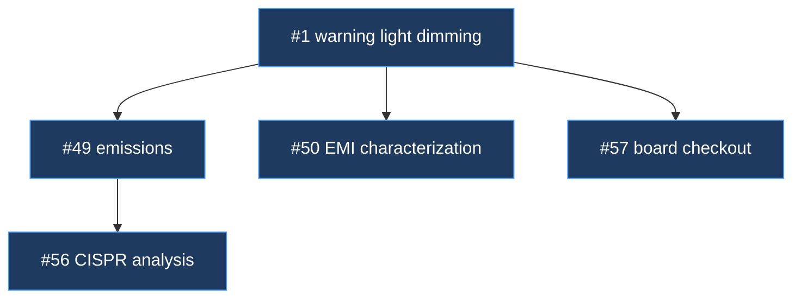

# Mechanism — Arc-Tree

**Status:** partial — the data source is established practice; the artifact that renders it
is unresolved.
**Home:** Arc — Campaign.
**Src:** 🔥 observed.
**Covers:** row 21.

---

## What it is

**An arc's shape, made visible.** Hardware arcs start with 3–8 issues and a general idea,
then *generate* issues as understanding develops.

> *"i think of it like a tree … we'll branch out broadly as we learn more of what we need to
> do. in some places we'll develop the branches of thought more deeply and the issues will
> sequence off eachother more deeply."* — David

**This is the deepest difference from software delivery found so far.** Waves partition
*known* work into disjoint tracks; a guided arc discovers its own scope as it runs. A flat
issue list loses that structure entirely.

Issues already record what spawned them — established ROADZ practice — so the data exists.
What is missing is anything that reads it.

| Use | |
|---|---|
| Scope control | A branch growing fast is a signal, visible early |
| Handoff | The fastest way to convey arc shape to a cold session |
| Retrospective | How a revision's scope actually grew |

---

## The unresolved part — what carries it

Row 21 alone does not justify an agent. The open question is bigger than a diagram:
**does an arc need something that holds its shape?**

> *"some sort of agent i can talk to about the status of my arc (milestone) and support
> moving through the issues"* — David, 2026-08-17

That is more than rendering a tree. It is answering *where are we, what is next, what must
not be re-litigated* — and moving work along. Three candidate forms:

| Form | For | Against |
|---|---|---|
| **An agent** — `agents/camp` | Conversational. Reads the arc-log, the tree, and open issues without filling the main thread | Heaviest to build. Needs a defined packet |
| **A skill** writing to the arc-log | Cheapest. The arc-log already holds the status table | Not conversational — you read a file rather than ask a question |
| **A role the main thread adopts** | No new artifact. TimeScope's spine works this way | The spine's known failure: a window holding that much context saturates |

**Leaning toward an agent,** named to pair with Lodestar's Star. TimeScope's spine failed
because a *window* cannot hold arc state; an agent that reads durable state on demand does
not have that failure.

---

## What is not decided

**Generated on demand, or maintained live?** Leaning on demand — cheap to regenerate from
issue metadata, and no drift risk. Rendered into the arc-log at arc close so the shape is
part of the record.

**Spawned versus related.** The distinction is by cause, not subject: spawned means this
effort caused the issue to exist. ROADZ got this wrong at least once. The tree is only as
good as that classification, so the mechanism may need to check it rather than trust it.

**Where the data comes from.** Issue bodies carry spawn relationships as prose. GitHub
sub-issues are a real API relationship. Reading prose is fragile; sub-issues require the
relationship to be recorded at creation.

**What else the agent would own**, if it is an agent: the handoff, the status table, moving
between issues. Those are rows 15 and 17, which have their own artifacts — so the agent may
be a reader of them rather than an owner.

---

## Related

- [handoff-spine](handoff-spine.md) — the same "what does a cold session need" question
- [k1-upkeep](k1-upkeep.md) — the arc-log this renders into
- [friction-log §2.7](../../retrospectives/2026-08-plugin-line/friction-log.md#27-follow-up-actions-forgotten) — spawned work that was never filed
