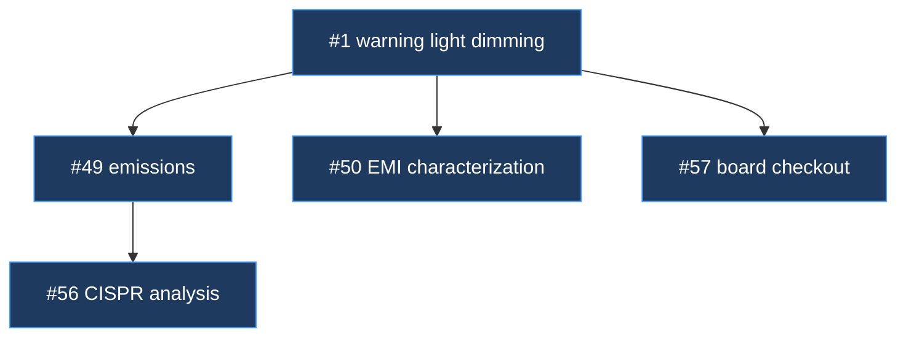

# Mechanism — Handoff / Spine

**Status:** partial — the artifact is designed; whether issue-level K2 extends the dev-log or sits beside it is open.
**Home:** Arc — Knowledge.
**Spawned from:** [friction-transcript-log.md](../../retrospectives/2026-08-plugin-line/friction-transcript-log.md) §2.4.

---

## The problem

Cold starts cost 20+ minutes and sometimes send the work down the wrong path.

> *"Its monday. I started a clean chat and it seems to be **COMPLETELY** clueless … your
> handoff was insufficient to start a new chat. i've wasted about 20 minutes trying to
> get it to start up and i'm out of paitence with that approach."* — 2026-08-10

> *"it looks like we lost the conversation from when we completed issue 44. Gosh this is
> a real limitation of claude and worktrees."* — 2026-08-04

**Why cold starts are unavoidable in hardware work.** Sessions consistently ran at
250k+ context. Starting fresh chats was *necessary* to keep the model working well —
so the handoff is not a nice-to-have for continuity, it is the price of a working
context budget. The mechanism must assume frequent restarts, not try to prevent them.

---

## Why the existing two mechanisms do not cover it

| Mechanism | Scope | Lifetime | Why it does not fit |
|---|---|---|---|
| **Wiki** | Durable facts about the repo | Forever | Too slow-moving. A two-week arc's state is not a durable repo fact |
| **TimeScope spine** | One coordinating chat window | The arc | Assumes the spine window *stays alive*; hardware kills windows on context |
| **ROADZ handoff files** | Ad-hoc markdown | Written at session end | **Tried and proved insufficient** — the 2026-08-10 failure |

**The gap:** something that robustly supports **2 to 12 days of end-on-end
development**, survives repeated window death, and is cheap to rehydrate from.

```text
wiki      ──── durable repo facts ──────────── forever
handoff   ──── this arc's live state ───────── 2–12 days   ← the gap
transcript ─── one session ────────────────── hours
```

---

## The context ladder — David, 2026-08-16

Deep context splits, because the per-issue document already exists and is where it
naturally belongs:

> *"it reminds me how we create a doc md for each issue. perhaps that is where the
> 'handoff' should be. and that way it also stays durable beyond the completion of the
> issue itself … [arc-log; arc-global-deep-context; issue-document-deep-context] each
> with a bit more detail that takes a bit more effort to process."*

| Tier | Holds | Cost to read | Read when |
|---|---|---|---|
| **K1 — Arc log** | Where we are, what is next, status table, load-bearing decisions | Cheap | **Every** session start |
| **K2 — Deep context** | Arc-level: findings spanning issues, architecture rationale, standards analysis. Issue-level: measurements, rejected approaches, bench results | Medium | When the work touches it |
| **K3 — Report** | A product capability, written for people | Expensive | Only for the active issue |

Tier definitions are canonical in [knowledge-tiers](knowledge-tiers.md); this file
covers the **reading order** across them.

**The principle:** a fresh session reads K1 always, and opens K2 or K3 only when the
topic demands. Cost scales with relevance.

**Arc-deep and issue-deep are both K2** — same depth, different scope. They map to
`arc-work/` and `scratch/` respectively in
[hardware-record-structure](m16-hardware-record-structure.md).

### Why deep context splits per-issue

One arc-level context file grows across a 2–12 day arc until it saturates a fresh session
by itself — **the spine window's failure, relocated to a file.** Splitting per-issue caps
what any session must read.

### What already exists in TimeScope

| Tier | TimeScope artifact | Fit |
|---|---|---|
| K1 | `docs/arc-log/arc-<slug>.md` | **Good.** Architecture, load-bearing decisions, build order, live status table |
| K1 | `docs/dev-log/issue-<N>-<slug>.md` | **Good.** Compact per-issue rationale |
| K2 | *(none)* | **Gap** |

**The dev-log is K1, not K2.** Its own template says: *"Decision log, not a spec …
capture the why, not a blow-by-blow."* Sections are Problem · Decisions & trade-offs ·
Rejected approaches · Retrospective.

That is **rationale**, deliberately kept short — summary depth, read every session. K2
is **working context**: the measurements, the scope captures, the datasheet numbers, the
failed bench attempt. In ROADZ that material lives in `docs/report/issue-NN-*/`, a
different artifact with a different purpose.

**Open question:** does K2 issue-level context extend the dev-log, or is it a separate
file beside it? Extending risks destroying what makes the dev-log readable. Leaning
separate, with the dev-log linking to it.

### Where the wiki fits

David: *"we then need to find a good way to pair this with our AI wiki."*

The wiki is **K2 by depth, but permanent by lifetime** — that second axis is what
separates it from the rest of K2.

| | Arc-scoped K1–K3 | Wiki |
|---|---|---|
| Scope | This arc, this issue | The whole repo |
| Lifetime | 2–12 days, then archival | Forever |
| Question | *"Where are we and why?"* | *"What is true here?"* |
| Content | In-flight, provisional | Settled, durable |

**The pairing rule:** when something in K2 or K3 stops being in-flight and becomes a
durable fact about the product, it **graduates to the wiki**. The arc-scoped tiers are
working memory; the wiki is long-term memory.

Two implications:

- **Arc close is a graduation checkpoint.** Sweep tiers 2 and 3 for facts that outlived
  the arc and promote them. Without this the wiki starves while the ladder accumulates
  dead weight.
- **Duplication is the failure mode.** A fact in both places will drift. Graduating
  means the ladder entry becomes a link, not a copy.

---

## The proposed shape: bake the spine into the handoff

TimeScope's spine is a *chat window* holding coordination state. In hardware that
window dies on context pressure. So invert it:

> **The spine is a document, not a window.** Any fresh session becomes the spine by
> reading it.

TimeScope's own arc-log doc half-anticipates this — *"its state is the spine document,
so any fresh session rehydrates in one read (disposable-but-durable)."* Hardware needs
that property to be the primary design point, not a secondary one.

### What it must contain

Derived from what was actually missing at the failed cold starts:

| Section | Holds | Why |
|---|---|---|
| **Where we are** | Current issue, branch, worktree, what was just done | The 2026-08-03 wrong-branch disaster |
| **The tree** | Issues opened, their parents, their status (§ arc-tree below) | Hardware work branches; a flat list loses structure |
| **Load-bearing decisions** | What must not be re-litigated | Prevents a fresh session re-opening settled questions |
| **Open threads** | Agreed but unfiled follow-ups | Friction §2.7 — *"i asked you to update #12 … that didn't happen"* |
| **Next action** | One line, concrete | Removes the "what now?" round-trip |
| **Do-not** | Live traps — wrong branch, don't commit, don't squash | Friction §2.1, §2.5 |

### Update cadence

Not continuously — TimeScope already learned that lesson for dev-logs
(*"Continuous per-turn dev-log churn is narration by another name"*). Write at
checkpoints: issue close, branch change, session end, and before any handoff.

### The entry point — `/arc-next`

A document-as-spine still needs something to open it. Left to a pasted prompt, the read
path is only as reliable as what the user types while tired at the end of a long stretch.

> **The prompt is a pointer, and a pointer that never varies should not be retyped.**

Everything that changes between stop points — the issue, the branch, the constraint — is
already in the handoff's *Do these in order*. What is left is invariant: *read the handoff,
then execute its ordered actions*. So it is a command rather than a message.

| | |
|---|---|
| **`commands/arc-next.md`** | Reads `HANDOFF.md` first, then only what it points at, then executes the ordered actions top to bottom |
| **The loop is one action** | New session, `/arc-next`. Nothing to copy, nothing to keep straight |
| **Two stated failure modes** | No handoff — stop and say so, because guessing the arc's state is the failure this mechanism exists to prevent. No ordered actions — report what the handoff does carry and ask, rather than filling the gap by inference |

**A pasted prompt remains valid** and is still the way to carry something that has no home in
the handoff — a standing approval, or an instruction for how the next session should run.
The command replaces the invariant half, not the whole message.

**Observed 2026-08-20.** The user's description of the loop was *"all I do is pull the handoff
from you at the end of each stop point, copy/paste a prompt, and then start a new prompt"* —
three manual steps where the varying part was already written down.

---

## Arc-tree — the shape hardware work actually takes

**David's model, verbatim in structure:** hardware arcs start with 3–8 issues and a
general idea. The work then *generates* issues as understanding develops. It branches
broadly while learning what is needed, then deepens along specific lines where issues
sequence off each other.

> *"i think of it like a tree … we'll branch out broadly as we learn more of what we
> need to do. in some places we'll develop the branches of thought more deeply and the
> issues will sequence off eachother more deeply."*

This is **exploratory and heuristic**, not a planned decomposition. It is the deepest
difference from software delivery found so far: TimeScope's waves partition *known*
work into disjoint tracks; a hardware arc discovers its own scope as it runs.

### The deliverable: a spawn diagram

Issues already record what spawned them (ROADZ practice, and the subject of the
2026-08-14 spawned-vs-related correction). That data supports a generated
**family tree of issues** — each node an issue, each edge a spawn relationship.



**Uses:**

- Retrospective — see how a rev's scope actually grew
- Handoff — the fastest way to convey arc shape to a cold session
- Scope control — a branch growing fast is a signal, visible early

**Open:** generated on demand, or maintained live in the handoff? Leaning on-demand
(cheap to regenerate from issue metadata; no drift risk).

---

## GitHub mechanics — Projects over Milestones

**David's position:** Milestones are good but cannot express issue *order*. Projects
can.

This confirms the decision already recorded in [CLAUDE.md](../../../CLAUDE.md#arc-tracking-github-mechanics)
— Milestone drag-order is UI-only with no API backing; a Project's item position is
real and settable via `updateProjectV2ItemPosition`.

**Consequence for this mechanism:** the handoff's tree section and the Project's
ordering are two views of the same thing. The handoff should link to the Project rather
than duplicate its ordering — duplicated order drifts.

---

## Open questions

| Question | Notes |
|---|---|
| One handoff per arc, or per issue? | Arc-level fits the 2–12 day window. Per-issue may be too granular |
| Where does it live? | `docs/arc-log/` follows TimeScope. Committed, so it survives worktree death |
| Who writes it? | Candidate for a scribe-type agent at checkpoints — keeps it out of orchestrator context |
| How does a fresh session find it? | `SessionStart` hook could inject the pointer. Same pattern TimeScope uses for role-casting |
| Relationship to the dev-log | Dev-log is per-issue *why*; handoff is arc-level *where*. Overlapping but distinct |

---

## Related

- [friction-transcript-log.md](../../retrospectives/2026-08-plugin-line/friction-transcript-log.md) §2.4 — the evidence
- [`work-watch`](../../../skills/work-watch/SKILL.md) check 5 — **the in-session case of this argument.** State outside the context does not degrade with context length; this mechanism applies that between sessions, that check applies it within one
- [transcript-mining.md](m30-transcript-mining.md) — sibling mechanism
- TimeScope `docs/arc-log/arc-local-first-storage.md` — the software precedent
- ROADZ `CLAUDE.md` — arc-tracking GitHub mechanics
