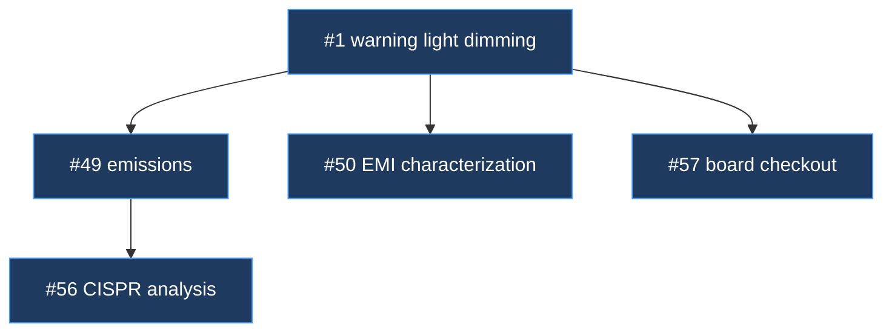
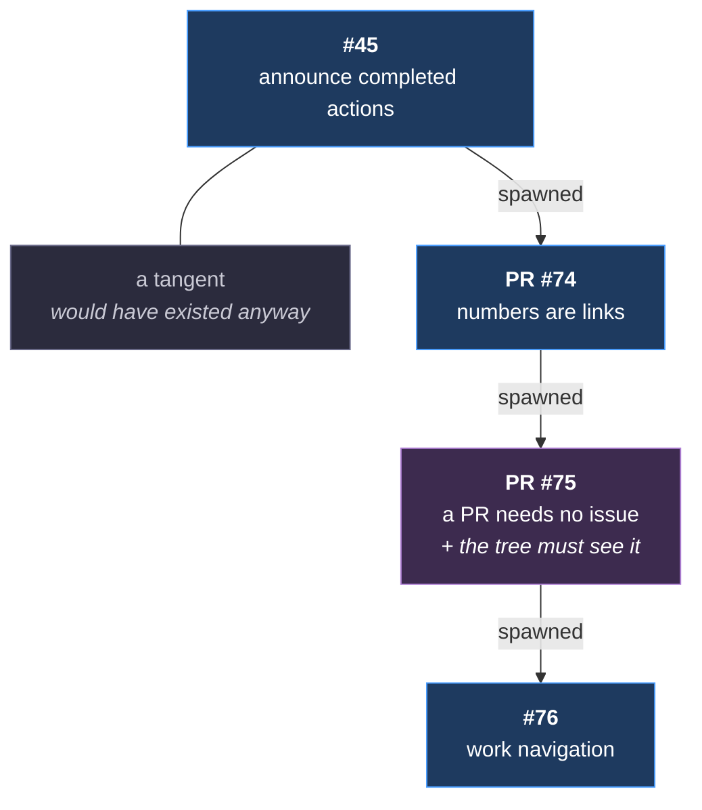

# Mechanism — Arc-Tree

**Status:** partial — the data source is established practice, and the artifact is settled
as `skills/camp` by [m43](m43-camp-assistant.md). What renders the tree, and whether it is
generated on demand or maintained live, is open.
**Home:** Arc — Campaign.
**Src:** 🔥 observed.
**Covers:** m21.

---

## What it is

**An arc's shape, made visible.** Hardware arcs start with 3–8 issues and a general idea,
then *generate* issues as understanding develops.

> *"i think of it like a tree … we'll branch out broadly as we learn more of what we need to
> do. in some places we'll develop the branches of thought more deeply and the issues will
> sequence off eachother more deeply."* — David

**This is the deepest difference from software delivery found so far.** Waves partition
*known* work into disjoint tracks; a guided arc discovers its own scope as it runs. A flat
issue list loses that structure entirely.

Issues already record what spawned them — established ROADZ practice — so the data exists.
What is missing is anything that reads it.

| Use | |
|---|---|
| Scope control | A branch growing fast is a signal, visible early |
| Handoff | The fastest way to convey arc shape to a cold session |
| Retrospective | How a revision's scope actually grew |

---

## What carries it — settled

m21 alone does not justify a dedicated artifact. The question it belongs to is bigger than a
diagram: **does an arc need something that holds its shape?**

> *"some sort of agent i can talk to about the status of my arc (milestone) and support
> moving through the issues"* — David, 2026-08-17

That is more than rendering a tree. It is answering *where are we, what is next, what must
not be re-litigated* — and moving work along. Three forms were considered:

| Form | For | Against |
|---|---|---|
| **An agent** — `agents/camp` | Conversational. Reads the arc-log, the tree, and open issues without filling the main thread | Heaviest to build. Needs a defined packet, and reads the conversation continuously |
| **A skill** — `skills/camp` ← **selected** | Cheapest. Addressed by name or `/camp`, and reads the record on demand | Cannot watch the conversation unprompted — the relief valve fires on countable signals instead |
| **A role the main thread adopts** | No new artifact. TimeScope's spine works this way | The spine's known failure: a window holding that much context saturates |

**Settled by [m43](m43-camp-assistant.md): a skill**, named to pair with Lodestar's Star.
TimeScope's spine failed because a *window* cannot hold arc state, and a skill reading
durable state on demand does not have that failure. An agent was rejected on cost — it would
read the conversation continuously, and only the relief valve needed that, so the valve
degrades to a skill instead.

---

## What is not decided

**Generated on demand, or maintained live?** Leaning on demand — cheap to regenerate from
issue metadata, and no drift risk. Rendered into the arc-log at arc close so the shape is
part of the record.

**Spawned versus related.** The distinction is by cause, not subject: spawned means this
effort caused the issue to exist. ROADZ got this wrong at least once. The tree is only as
good as that classification, so the mechanism may need to check it rather than trust it.

**Where the data comes from.** Issue bodies carry spawn relationships as prose. GitHub
sub-issues are a real API relationship. Reading prose is fragile; sub-issues require the
relationship to be recorded at creation.

---

## A node is a work item, not an issue

**Settled 2026-08-20.** The tree's node is the unit of work, which is usually an issue and
sometimes only a PR — a small fix taken branch-to-PR spawns no issue, and reading issue
bodies alone makes it invisible.

| Shape | Renders as |
|---|---|
| **Issue with its PR — the 1-to-1 case** | **One node.** The issue, with its PR noted on it |
| **Issue with several PRs** | One node per PR beneath the issue. The split is the interesting part |
| **PR with no issue** | **One node.** The PR itself |

**The 1-to-1 collapse is the rule that keeps the tree readable.** Most issues have exactly
one PR, so drawing both doubles every node and adds nothing — the pair is one piece of work
that happens to have two identifiers. Only draw the second node when the ratio is not 1-to-1,
because that is when it carries information.

**A 0-to-1 is always drawn.** It is real work with a real parent, and it is the case the
issue-only reader loses entirely.

### What it reads

| Source | Carries |
|---|---|
| An issue's `Spawned` section | Its children, whether those are issues or PRs |
| A PR body's `Spawned by #NN` | Its parent, when no issue records it |

Both are written by [`skills/issue-write`](../../../skills/issue-write/SKILL.md). **The tree
reads; it never infers a relationship nobody recorded.**

**What else the agent would own**, if it is an agent: the handoff, the status table, moving
between issues. Those are m15 and m17, which have their own artifacts — so the agent may
be a reader of them rather than an owner.

---

## Rendering the three relations

**[m46 §4](m46-work-navigation.md#4-three-relations-not-two) gives a discovery three possible
relations to its parent. The tree draws all three, and only one of them is a new node.**

| Relation | In the tree | Why |
|---|---|---|
| **Tangent** | A child node, plain edge | It would have existed anyway. The parent is where it was *found*, not why it exists |
| **Tangent with dependency** | A child node, **labelled edge** | Same shape, different fact: it would not exist without the parent. The label is the only place that survives |
| **Descent** | **No node.** An annotation on the parent | It changed what the parent *is*. Drawing it as a child would claim two units where there is one |

**The italic line inside `PR #75` is a descent.** *The tree must see a no-issue PR* was its own
piece of work, recorded in a `Spawned` row, and it stayed in that PR because a rule and the
thing that reads it are one story. It is drawn where it landed.

| | |
|---|---|
| **The plain edge and the `spawned` label are different claims** | *This was found here* against *this would not exist without what was found here*. The second is the arc's most common relation and has no distinct branch shape, so the tree is the only place it can be seen at all |
| **A descent is why a node's title changed** | [`issue-write`](../../../skills/issue-write/SKILL.md) makes retitling mandatory when a unit descends, so the node's own name already records that it grew. The annotation says what it grew into |
| **The tree never infers the relation** | Same rule as the rest of this mechanism. A `Spawned` row that does not say *tangent* or *descent* renders as a plain edge, and that is the honest drawing |

**This is the axis the git graph cannot carry.** m46's worked example branched five units from
one base, because none needed another's code — so the git graph is flat and the spawned tree is
four levels deep. **Both are correct**, and forcing either to match the other loses the
information that made them differ.

---

## Pinned — the tree shows execution, not only spawning

**2026-08-18.** Arc 02 spawned nothing: six issues, planned up front, executed in order. A
tree of that arc is six static nodes.

**That is a result, not an empty diagram.** It says the arc was constrained in vision,
planned up front, and executed autonomously — and it says so at a glance.

So the tree carries two axes, not one:

| Axis | Shows |
|---|---|
| **Spawning** | Which issue caused which to exist. Scope growth |
| **Execution** | The order work actually ran, and what ran in parallel |

A heavily-spawning tree under autonomous execution is a signal worth checking — autonomous
work sticks to what the issue says, so spawning means the issue was wrong. Exploratory
guided work spawns as a matter of course, and the same shape means something different.

**Both readings are retrospective and informative.** The tree does not get work done; it
tells you how the work went. Worth having, not worth blocking on.

**Backlog, not scope:** related-issue relationships. Spawned is what matters; related is a
different diagram and does not belong in this one.

---

## Related

**Artifacts** — what carries this mechanism:

- [`skills/camp`](../../../skills/camp/SKILL.md) — the settled carrier, per [m43](m43-camp-assistant.md)
- [`skills/issue-write`](../../../skills/issue-write/SKILL.md) — writes both sources the tree reads: the `Spawned` section and `Spawned by #NN`

**Mechanisms:**

- [handoff-spine](m15-handoff-spine.md) — the same "what does a cold session need" question
- [k1-upkeep](m17-k1-upkeep.md) — the arc-log this renders into
- [m46](m46-work-navigation.md) — how the relations this renders are created, and the `Spawned` rows it reads
- [friction-transcript-log §2.7](../../retrospectives/2026-08-plugin-line/friction-transcript-log.md#27-follow-up-actions-forgotten) — spawned work that was never filed
