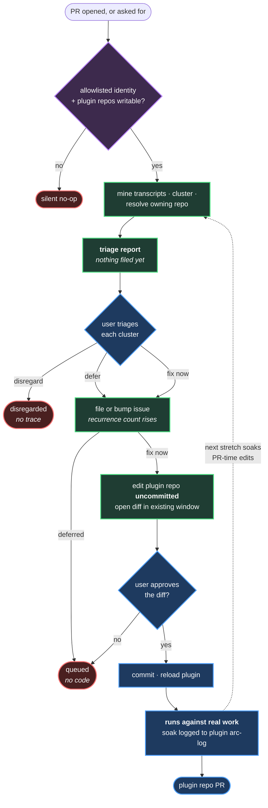

# Mechanism — Self-Improvement Loop

**Status:** specified.
**Home:** Arc — Self-improvement.
**Form:** agent + hook.
**Spawned from:** [transcript-mining](m30-transcript-mining.md), which stops at *propose*.
This spec covers what happens after.

---

## The problem

Transcript mining produces good proposals and drops them into a chat the user is
already in, mid-work. Acting on one means switching to a different repo, finding the
right file, making the edit, and losing the thread of whatever was being built.

So the proposals do not get acted on. The tooling stays broken, and the same correction
recurs.

> *"i want fixes to happen fast but with rigor"* — David, 2026-08-16

**The value is in where the output lands, not in the noticing.** Noticing is already
solved.

---

## What it does

At PR time (or on demand), against the transcripts for the current branch:

1. Run the **friction filter** from [transcript-mining](m30-transcript-mining.md). The
   knowledge filter runs at the same trigger but feeds K2 rather than this loop.
2. For each cluster, resolve **which plugin repo owns the mechanism** at fault.
3. **Present the triage report and stop.** Nothing is filed or written before the user
   has seen it.
4. For each cluster the user marked *fix now* or *defer*: bump an open issue, reopen a
   closed one, or file new.
5. For each cluster marked *fix*: **make the change in the local plugin repo,
   uncommitted.**
6. Open the diff in the user's existing editor window and stop.

The user reviews, approves, commits with `Closes #NN`, and pushes when convenient.

**It never commits and never pushes.** The dirty working tree is the review surface —
the same reason [CLAUDE.md](../../../CLAUDE.md) forbids unrequested commits.



**Green is the agent, blue is the human, red is a stop.** The agent halts twice — at the
triage report before anything is filed, and at the diff before anything is committed.

---

## Triage — the decision point

**Nothing is filed or written before the user has seen the report.** An agent that files
issues on its own judgement produces a queue the user did not choose, which is the
backlog-rot failure this mechanism exists to avoid.

### Three categories

Clusters are grouped by what they match, because the three mean different things:

| Category | Meaning | Ranked |
|---|---|---|
| **Matched — closed issue** | The fix shipped and the friction came back. **The fix did not work** | **First.** A failed fix outranks a new problem |
| **Matched — open issue** | Known, still unfixed. Recurrence count rises | Second, by count |
| **New** | Not seen before | Last |

**Matched-to-closed is the highest-value signal this mechanism produces.** It is the
only evidence that a shipped mechanism is not doing its job — the case
[transcript-mining](m30-transcript-mining.md) calls *"cluster persists after a skill
ships"*. Reopening the issue keeps the history attached rather than starting a fresh one.

### The report

Presented in chat, ranked by category then recurrence:

| Column | Content |
|---|---|
| Cluster | What went wrong, in one line |
| Times | Recurrence count, including prior PRs |
| Repo | Resolved from the manifests. **Empty means the architecture has no home for this** — the user routes it |
| File | The specific skill, agent, or hook at fault — `skills/commit-rhythm/SKILL.md`, `hooks/branch-guard.sh`. **Empty means the fix needs a new file**, which is a bigger decision than editing one |
| Evidence | Verbatim quote — a cluster without one is an inference, not a finding |
| Proposed | The fix the agent would make |

### Three outcomes

| Outcome | Effect |
|---|---|
| **Fix now** | Issue filed, bumped, or reopened · code change made locally · diff opened |
| **Defer** | Issue filed, bumped, or reopened. No code. Recurrence keeps counting |
| **Disregard** | Nothing filed, nothing recorded |

**Nothing is filed silently, including unrouted clusters.** An empty owning-repo cell is
information — the architecture has no home for that problem yet — not a reason to dump
an issue somewhere convenient.

**Disregard leaves no trace by design.** If the same cluster recurs it surfaces again
with a higher count, and the user can change their mind with better evidence.

---

## Why it writes code rather than only filing issues

The obvious safe design is issue-only. It was rejected:

> *"agreed issues pile up. look at all my other repos. this is important work, i need to
> be able to quickly execute solutions here."* — David, 2026-08-16

An issue queue that is never swept is theatre. The rigor comes from the write being
**reviewable before it is committed**, not from refusing to write.

Both happen: the issue is the durable record and the recurrence counter; the local edit
is what makes the fix cheap to accept.

---

## Trigger

| Trigger | When |
|---|---|
| **PR-time hook** | Fires when a PR is opened in a consuming repo |
| **Explicit command** | Any time the user asks |

PR time is chosen because the user is already stopping, and because the relevant
transcripts are exactly the ones that produced the diff under review.

**Transcript scope is branch-local.** Only transcripts for the current branch or
worktree. Cross-repo pattern-finding is the retrospective's job
([plugin-retrospective](https://github.com/Calyx-Engineering/lodestar/blob/main/.claude/skills/plugin-retrospective/SKILL.md)), not
this hook's.

---

## Routing — which repo owns the fix

There will be several plugin repos (Lodestar, Arc, Bench). A hook bug belongs to Arc's
repo; a persona bug to Bench's.

**Each plugin declares the mechanisms it owns in its own manifest.** The agent reads the
manifests of all plugin repos present on disk and builds `mechanism → repo` at runtime.

No central registry — a central map in one repo would drift from the plugins it claims
to describe, and would itself need maintaining.

**Unmatched clusters go to the user, not to a default repo.** A cluster matching no
declared mechanism is flagged in the triage report and the user routes it. This is a
signal that the architecture has no home for the problem yet — worth seeing, not worth
auto-filing somewhere convenient.

---

## Gating — who this fires for

Two independent gates. Both must pass.

| Gate | Check | Fails when |
|---|---|---|
| **Identity** | git identity is on the allowlist | Anyone else — including the user's Dedrone identity |
| **Capability** | plugin repos present and writable on disk | Nobody else has them checked out |

Allowlist, in plugin config so entries can be added without a code change:

```text
davidcalyx
heliman84
david@calyxengineering.com
```

**Fail closed and fail silent.** An unrecognized identity means the retrospective does
not fire, is not offered, and is not mentioned. No prompt to decline.

This is a **guard, not a control** — anyone with the repo can edit the allowlist. It
exists to keep the feature from firing where it does not belong, not to stop a
determined actor.

**Deferred:** when these plugins go public, issue-filing needs its own rate limit —
one-keystroke filing at public scale produces hundreds of unprocessable tickets. File
that as an issue at split-out time. It is a different threat from this gate.

---

## Recurrence and escalation

An issue that keeps coming back is stronger evidence than the original report.

| Step | Behavior |
|---|---|
| Matches an **open** issue | Increment the recurrence count; append the new evidence |
| Matches a **closed** issue | **Reopen it**, increment, and label the fix as failed. History stays attached |
| Count crosses a threshold | Add an escalating label |
| No match | File new, count 1 |

**Why it matters:** the backlog sorts itself. "This friction hit five PRs" is the signal
that turns a parked issue into work worth stopping for. It also gives the retrospective
sweep a ranking key rather than a flat list.

The retrospective skill sweeps this queue — issues are its input, not a dead-letter box.

---

## Safe hook editing

The agent edits the files that govern agents. A bad skill edit gives worse advice in one
place; a bad hook registration fires on every tool call in every repo, and can break the
very session needed to fix it.

The user is explicit about not being a hook author. The design goal is therefore that
**a mistake is survivable**, not that mistakes are prevented by review skill.

### 1. Kill switch

Every hook the plugins ship begins with:

```bash
. "${0%/*}/lib/hooks-off" 2>/dev/null && arc_hooks_off && exit 0
```

`bash hooks/hooks-off.sh <hook> 30` from any terminal makes that hook inert — no editing JSON
while the broken thing fights back.

**This must be in each plugin's README**, and the agent must state it in chat before
proposing any hook change. A README line alone is a rule with no trigger — the failure
mode this whole plan exists to fix.

### 2. Fail open

A hook that errors must not deny the tool call. Deny only on the specific condition it
was written to catch; on any unexpected failure, exit 0.

A broken guard that lets work through is an annoyance. A broken guard that blocks
everything is a dead session.

**This is a template obligation.** The agent writes hooks from a skeleton that already
contains the kill-switch line and the error wrapper, so it cannot be omitted.

### 3. Test before registering

A hook is a program reading JSON on stdin, so it runs standalone:

```bash
echo '{"tool_name":"Edit","tool_input":{"file_path":"x.md"}}' | .claude/hooks/my-hook.sh
```

`tools/verify-hook.sh <hook>` runs the cases — one that should pass, one that should
deny, one malformed — and exits non-zero on failure.

**The agent must run it and paste the real output before asking for approval.**

Deliberately *not* a hook: a hook validating hook changes can be broken by the change it
is validating, and would be disabled by the kill switch alongside everything else. A
script works with hooks off and produces output the user can see.

### 4. One hook per commit

Hook changes commit individually, with the verify output in the commit body, so
`git revert` is surgical.

### 5. Hard-excluded from autonomous edits

| Never edited autonomously | Why |
|---|---|
| `settings.json` outside the plugin's own hooks block | Blast radius beyond the plugin |
| `tools/verify-hook.sh` | The thing that validates changes |
| The hook template | Carries the kill switch and wrapper |
| Any `SessionStart` hook | Runs before the user can intervene |

Changes to these come to the user as a proposal, always.

---

## Soak — proving a change before it leaves the machine

A self-improvement edit made at PR time has not been exercised by anything. Merging it
on the strength of review alone reintroduces the failure this plan is built around:
plausible, untested, silently wrong.

**Soak = the change has run against real work.**

| Change | Soaked by | Pushed |
|---|---|---|
| Made mid-stretch, live | The rest of the current issue | This PR |
| Made at PR time | The *next* work stretch | Next PR |

Push is the gate, and it gates on *has this run*, not *is this committed*.

### The loop in practice

A worked example — one ROADZ issue, five plugin edits:

| Step | What happens |
|---|---|
| Mid-stretch | 3 edits made live. Each is committed locally, then **the plugin is reloaded** so the change is active for the rest of the issue |
| Rest of the issue | Those 3 run against real work — that is the soak |
| PR time | The loop fires, produces 2 more edits. Reviewed and committed, but nothing has exercised them |
| Push | ROADZ PR goes up. Plugin repo gets **its own PR**, carrying the 3 soaked edits |
| Next stretch | The 2 unsoaked edits are live from the start; they soak there and ride the next plugin PR |

**Reload is what makes soak real.** A committed but unloaded change has not been
exercised no matter how long it sits. The reload step is part of making the edit, not a
thing the user remembers to do.

**Two PRs, not one.** The consuming repo and the plugin repo have independent PRs. They
do not have to land together, and a plugin change that has not soaked simply waits for
the next one.

### Where the soak record lives

**In the plugin repo's own arc-log, appended by whichever repo exercises the change.**

```text
a3f21b0 — branch-guard fix
  soak: timescope 2026-08-16 (authored)
  soak: roadz 2026-08-16..09-13, 4 weeks live
```

The consuming repo cannot own this record. A change authored while working in TimeScope,
then exercised for four weeks in ROADZ, would leave its only evidence in a TimeScope
arc-log nobody opens — and would look unsoaked forever.

Soak is recorded **on use, not on edit**, so the repo doing the exercising is the one
that credits it.

**Writing it is automatic:** the plugin is loaded in the consuming repo, so the
mechanism that records the soak already knows both the plugin commit and the current
repo. It must not depend on the agent remembering — that is exactly the silent-success
failure mode.

**Unsoaked** = a commit in the plugin repo with no soak line from any repo. One place to
look.

### No `dev` branch

Trunk-based, per [CLAUDE.md](../../../CLAUDE.md). Local `main` between commit and push
already provides a private place for unsoaked work.

`dev` earns its place when commits must leave the machine before soaking — a second
machine, or an external consumer. The soak check is also the watcher for this: when
unsoaked commits are routinely stranded across machines, that is data rather than a
hunch.

---

## Review surface

| Requirement | Behavior |
|---|---|
| Diff opens in the **existing** editor window | `code --diff <old> <new>` or `code -r` |
| Never steal focus with a new window | Opening a window mid-work is the context switch this mechanism exists to avoid |
| New window only on explicit request | A flag, never the default |

The agent leaves the work on disk and says it is there. The user opens it when they
choose.

---

## Delegation

Runs at **T1-Squad** — a bounded agent doing scoped work and returning a packet. Not
T0-Inline: it reads megabytes of transcript and must not land in the orchestrator's
context. Not T2-Wave: one track, no parallel worktrees.

| Tier | Name | This mechanism |
|---|---|---|
| T0 | Inline | No — token volume |
| **T1** | **Squad** | **Yes** |
| T2 | Wave | No — single track |

---

## Open questions

| Question | Notes |
|---|---|
| Manifest format and location | Likely `.claude-plugin/plugin.json`; depends on what the plugin skeleton looks like, which does not exist yet |
| Recurrence thresholds | What count triggers escalation, and what the labels are |
| Where the soak line is written from | The plugin's arc-log needs a defined section and an append mechanism |
| What happens to a fix the user rejects | Close the issue, or keep it with a "rejected" marker so it is not re-proposed |
| Triage report format | Chat table is the default. If a run produces many clusters it may need to be a file the user opens instead |
| Does *disregard* need a memory | Leaving no trace means the same cluster is re-proposed next PR with a higher count. That may be correct, or may be noise |

---

## Related

- [transcript-mining](m30-transcript-mining.md) — the pipeline this consumes
- [session-preservation](m32-session-preservation.md) — the transcript index it queries
- [plugin-retrospective](https://github.com/Calyx-Engineering/lodestar/blob/main/.claude/skills/plugin-retrospective/SKILL.md) — sweeps
  the issue queue this fills
- [commit-rhythm](m14-commit-rhythm.md) — the commit discipline this inherits
