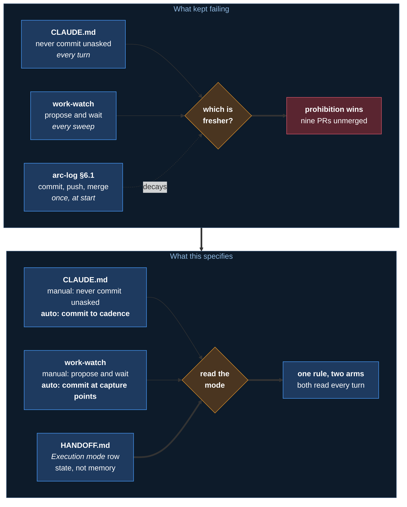
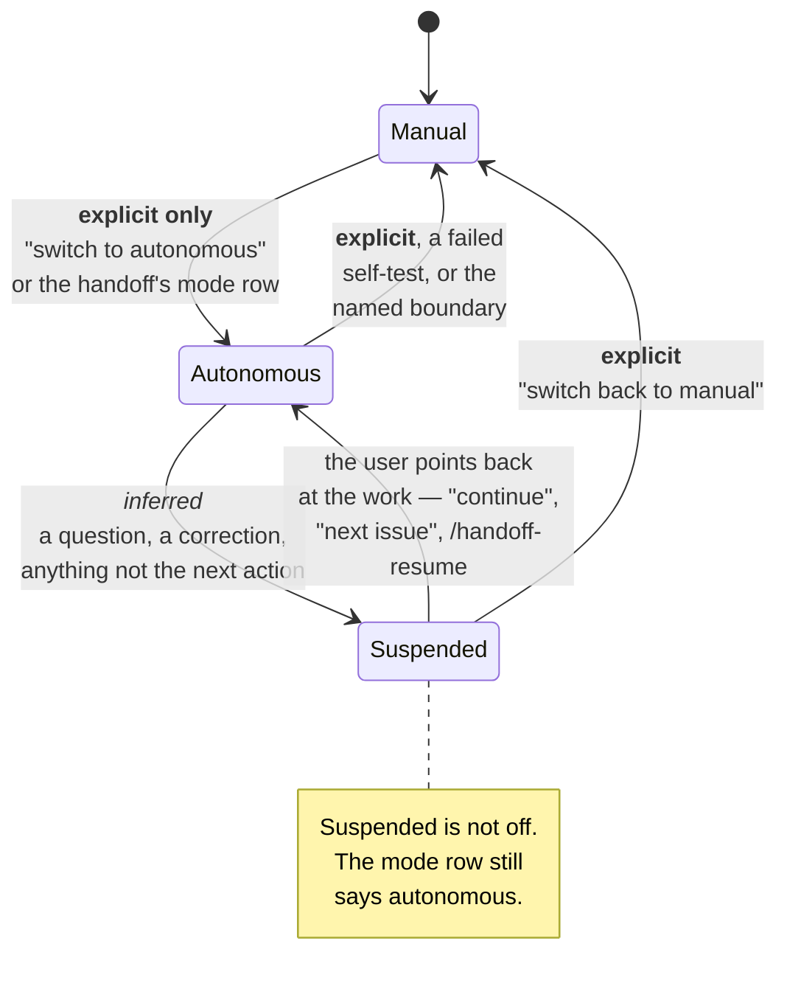
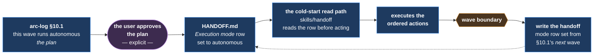

# m40 — The autonomy switch

> **The workflow matches how the work actually runs.** One switch, with state the user can
> see — not an instruction the session has to remember.

**Status:** built — `hooks/mode-guard` reads `HANDOFF.md`'s *Execution mode* row before every
commit, push, PR and merge, `skills/autonomy-set` carries the three states, and
`tests/verify-autonomy.sh` gates §9's single-statement rule.

**Spawned from:** three to five attempts to declare auto mode in prose, none of which changed
behaviour. `docs/arc-work/03-camp/friction-log.md` entries 1, 2 and 4 are the observations.

---

## 1 The failure this fixes

**Auto mode has been declared repeatedly and has never run.** Every attempt wrote it down
somewhere and assumed writing it down was enough.

The reason is a read-frequency asymmetry, and nothing else:

| | Read | Says |
|---|---|---|
| The repo's `CLAUDE.md` | **Every turn** | *Never commit unasked* |
| `skills/work-watch`, registered always-on | **Every sweep** | *Standing. Propose and wait* |
| The arc-log's execution section | **Once, at session start** | *Commit per refine loop, merge the PR* |

> **The prohibition is restated on every turn. The permission decays with the context that
> held it.** Whichever is fresher wins, and it is never the permission.

**So the permission must live where the prohibition lives, and be read as often.** That is the
whole mechanism. Everything below follows from it.



---

## 2 Three states

**Two states cannot express a conversation.** A wave that cancels on the first clarifying
question is not runnable, and an agent that keeps executing through a question is not talking
to anyone.

| State | The agent | Entered by |
|---|---|---|
| **Manual** | Work stops at the edit. Files change; nothing is committed. `git status` and the diff are the review surface | **The default.** Any explicit return |
| **Autonomous** | Executes the ordered actions to a named boundary — commits, pushes, opens PRs, merges, deletes branches | **Explicitly. Always** |
| **Autonomous, suspended** | Auto is still set. This exchange is a conversation, and is answered rather than executed | **Inferred**, per §4 |

> **Entering auto is always explicit. Returning to manual never has to be.**

That asymmetry is the design. Auto is a decision someone makes; manual is the floor the session
falls back to whenever nobody has decided otherwise. **A mistaken manual costs a round trip. A
mistaken auto costs an unwanted push**, and the two are not symmetric.



**Suspended is not a third mode to configure.** It is what auto looks like during an exchange,
and it needs no setting — which is why the mode row carries two values and not three.

---

## 3 Where the mode lives

**The handoff's *Execution mode* row.** It already exists, and there is no second store.

| | |
|---|---|
| **The user can see it** | A mode the user cannot observe is a wrong belief that surfaces only after an unwanted push |
| **It survives the window** | The same argument that makes the handoff a document rather than a chat — [m15](m15-handoff-spine.md) |
| **A mid-session change rewrites it immediately** | Not at the next break. The row *is* the state, so it is wrong the moment it lags |
| **A fresh session reads it before acting** | The cold-start read path already does — `skills/handoff`, whether it was opened by `/handoff-resume` or by wording. Absent or unreadable means manual |

**A dedicated `mode` file was rejected.** Two files holding one fact disagree — the condition
[#105](https://github.com/Calyx-Engineering/arc/issues/105) exists to fix, created on purpose.

**Which mode a wave runs in is the arc-log's**, stated once beside the description of the wave.
The handoff cues the *current* session; the arc-log is the plan. When they disagree the handoff
is stale, and the staleness checks in `skills/handoff`'s read path are what catch it.

### 3.1 How a plan reaches a session

**The arc-log does not enter auto by itself.** A plan is a statement of intent; entering is a
decision, and §4 admits only three ways to make one. The route is short and every step is
visible:



| | |
|---|---|
| **The approval is the entry** | Approving a plan that states the mode is one of §4's three explicit routes. The plan alone is not |
| **The handoff carries it forward** | At a break, the mode row is set from the arc-log's assignment for the **next** wave — not from whatever mode this window happened to run in |
| **Every session after that reads, never remembers** | The row is state. A session that has to recall the mode has already lost it |

**So a plan executes correctly because the chain has one decision in it and three reads** — not
because a document declared something and everyone downstream was expected to comply.

---

## 4 Entering and leaving

**The switch is asymmetric.** Claude may set the mode to manual and may never set it to
autonomous. Only the user raises it, by saying so; Claude writes the row on being told.
Dropping to manual stays Claude's to do — at a named boundary, or when the self-test fails.

**This cannot be enforced mechanically and is not pretended to be.** `hooks/mode-guard` sees a
file change, not who asked for it, and gating writes to `HANDOFF.md` would block the rest of a
file Claude legitimately maintains. What became mechanical is the other half: the mode is read
at the moment of a commit rather than recalled, and manual denies.

**The user never hand-edits `HANDOFF.md` to switch modes.** The switch is a sentence in chat.

### Entering — explicit, and never inferred

| Counts as entering | Does not |
|---|---|
| *"switch to autonomous"*, *"run autonomously"*, *"go auto"* — said **now** | The same words in an earlier message in this session |
| The handoff's mode row saying autonomous, read at session start | The arc-log naming a wave autonomous, without the handoff or the user saying so |
| The user approving an execution plan that states the mode | An inference from the work looking well-specified |

**A phrase from earlier in the conversation is not an instruction now.** A session that scrolls
back and finds *"run autonomously"* from two hours ago is remembering, not being told — and
remembering is what this mechanism exists to replace.

### Leaving — three ways, two of them not explicit

| | |
|---|---|
| **The named boundary** | Auto always runs *to* something — a wave, an issue count, an arc. Reaching it ends auto and hands back |
| **An explicit return** | *"switch back to manual"*, *"stop"*, *"wait"* |
| **A failed self-test** | §6. Ends auto and hands off — never *try harder* |

**All three are Claude writing the row.** That direction needs no permission: dropping to manual
removes authority rather than granting it, so there is nothing to guard.

### Suspension — inferred, per exchange

**Auto suspends when the exchange is a conversation rather than the execution of a named
action.** The signals, any one of which is enough:

| | |
|---|---|
| A direct question to the agent | *"did you update the spec?"*, *"what is up with this block?"* |
| A correction, or a challenge to something just done | *"that means, be complete"* |
| A request scoped to something other than the next ordered action | *"give me a 60 word summary"* |
| Any turn where the user is deciding rather than the agent executing | Discussing an approach, weighing options |

**Resuming needs the user to point back at the work.** *"continue"*, *"next issue"*,
`/handoff-resume`, or naming the issue. **It does not resume because the conversation happened to
stop.**

> **When suspended, answer. Do not commit, push, or merge as a side effect of answering.**

An edit made while answering a question is a manual edit — it stays in the tree, and it is
mentioned. That is what the user sees as the mode having intuited itself correctly.

---

## 5 The announcement

**Every transition says so, in one line.** The user cannot see the mode otherwise, and a wrong
belief is invisible until it is expensive.

```text
**Camp here —** autonomous, to the end of wave 6.
  Commits, pushes, PRs and merges without asking. Say "manual" to stop.
```

| Transition | Announced |
|---|---|
| Manual → autonomous | **Yes**, with the boundary named |
| Autonomous → manual | **Yes**, with the reason — boundary reached, asked, or self-test |
| Autonomous → suspended | **No.** Answering the question *is* the signal, and a line saying so on every question is noise |
| Suspended → autonomous | **Yes.** The user is handing control back and needs to see it landed |

Format is [`camp-reports.md`](../camp-reports.md). All four reach the event log regardless of
verbosity — [m44](m44-event-log.md).

---

## 6 The self-test

**Auto ends at a boundary the plan named. It must also end when the session degrades before
reaching one.** Degradation has been observed: a session went autonomous against instruction
and reported an issue number that was never created.

> **It must not be self-assessment.** *"Am I still doing fine?"* is the question a degraded
> session answers wrong. Every check below has an answer that is checkable against something
> outside the session.

| Check | Verifiable against |
|---|---|
| Name the current issue, branch and next ordered action **without re-reading** — then read, and compare | `HANDOFF.md`, `git branch --show-current` |
| The last completion claim survives a `grep` of the file it claims to have changed | The file |
| The tree matches what was just reported — nothing uncommitted that was called committed | `git status --short` |
| The last PR opened actually bound its issue | `gh pr view --json closingIssuesReferences` |

| When | |
|---|---|
| **At every wave boundary**, at minimum | Where the plan already stops |
| **Before entering a break** | The handoff is written by whichever mode the agent believes it is in, and two of this arc's bad handoffs happened at a mode boundary |
| **On any degradation signal** | A denied command, a contradicted claim, a correction from the user |

**A failed self-test ends auto and writes the handoff.** It never retries and never asks to
continue. The session that would judge whether it is safe to continue is the one that just
failed the test.

---

## 7 What this switch cannot do

> **Auto mode does not change what the harness permits.**

Merging a PR is outward-facing and hard to reverse, and the harness confirms such actions
unless durably authorized. **A markdown file is not authorization, and neither is this
specification.** A permission allow-list in `.claude/settings.json` is necessary and is not
sufficient: [PR #114](https://github.com/Calyx-Engineering/arc/pull/114) was denied twice with
that file in place and merged on the first attempt after the user asked.

| On a denial | |
|---|---|
| **Retry at most once** | Then hand it over and say exactly what was tried |
| **Record it** | The PR body, the dev-log, and the friction log where the repo keeps one |
| **Never diagnose it from one session** | Two of three previous diagnoses were wrong, and each was committed to several documents before one `grep` disproved it |
| **Never treat the denial as the mode failing** | The mode governs what the agent attempts. The harness governs what succeeds. Conflating them is what three previous attempts were built on |

**The agent cannot install its own switch.** `.claude/settings.json` outside the hooks block is
the user's to write, and an agent that can widen its own permissions has no switch at all.

---

## 8 Portability — the hard requirement

**A rule written into one repository's `CLAUDE.md` dies at the repository boundary.** This has
been re-taught three times here and would be re-taught in the next repo.

> Install Arc in a fresh repository, and the mode behaviour is there. **Zero re-teaching.**

| | |
|---|---|
| **The rules ship in the plugin** | [`skills/autonomy-set`](../../../skills/autonomy-set/SKILL.md) carries them, and every artifact that states a prohibition states its auto arm beside it |
| **A repo may set the current mode** | Auto or manual is per-arc, and per-session. That is the repo's |
| **A repo must never redefine what the modes mean** | If it has to, the plugin did not ship the behaviour |
| **Onboarding writes the repo's half** | [m47](m47-onboarding.md) — the mode row in the handoff template, and the `CLAUDE.md` clause. It offers; it never performs unasked |

---

## 9 Why the permission was duplicated, and why it is not any more

**Superseded 2026-09-06 by [#138](https://github.com/Calyx-Engineering/arc/issues/138).** The
reasoning below was right about the problem and wrong about the remedy; it is kept because the
problem has not changed.

### The reasoning, as it stood

| | |
|---|---|
| **A cross-reference is read once** | *"see m40"* is a pointer the reader follows if they have budget. The clause beside the rule is read whenever the rule is |
| **The asymmetry is the whole bug** | §1. Fixing it means making the permission exactly as frequent as the prohibition, which means putting it in the same place |
| **The cost is four copies of one clause** | Accepted deliberately, on the grounds that a script keeps them honest |

### What it did not account for

**The harness weighs the aggregate, not the ratio.** The base instruction permits an
outward-facing action only when it is *durably authorized*. Five prohibitions each carrying an
override is still five prohibitions, and each one is evidence that authorization has not been
given.

| | arc | ROADZ |
|---|---|---|
| Mode rule stated in | 5 artifacts | 1 |
| `gh pr merge` denied | **4** — #95, #97, #114, #137 | **0**, across 12 merges |

ROADZ reached one statement on install day, [`44dbb06`](https://github.com/Lantern-Systems/roadz-sound-system/commit/44dbb06):
*"Two copies of the same rule drift, and the copy an agent reads first wins."* Its `CLAUDE.md`
states the mode as a state, once, with the override inside the sentence, and delegates
everything else to the skill.

### The rule now

| | |
|---|---|
| **One authority** | [`skills/autonomy-set`](../../../skills/autonomy-set/SKILL.md) states the rule. Nothing else does |
| **The repository's `CLAUDE.md` may state the mode once** | As a *state*, with the override in the same sentence, delegating the rest |
| **Everything else points** | `work-watch` says whether you commit is the mode's call, not its own |
| **The state carrier is not a restatement** | `templates/handoff.md` defines what *suspended* means. That is the semantics of the state, not a standing prohibition |

`tests/verify-autonomy.sh` enforces it as a census: the prohibition appears only in
`autonomy-set`, and `CLAUDE.md` states the mode exactly once with its override. **Scope is what
a session loads every turn** — `CLAUDE.md`, skills, templates, hooks, agents, commands. `docs/`
is opened deliberately rather than loaded, so m14 §3 and `close-sequence.md` steps 9 and 10 keep
the older shape.

**This is no longer an exception to *one fact, one place*.** It is that rule, applied.

---

## 10 Acceptance

**The three things the user must be able to do**, from [#73](https://github.com/Calyx-Engineering/arc/issues/73):

| | Delivered by |
|---|---|
| A document defining an execution plan with the switch set **executes correctly** | §3 — the arc-log states the wave's mode, the handoff cues the session, and the cold-start read path in [`handoff`](../../../skills/handoff/SKILL.md) reads it before acting |
| *"switch to autonomous"* enters auto; *"switch back to manual"* leaves it | §4, and [`skills/autonomy-set`](../../../skills/autonomy-set/SKILL.md) |
| It **returns to manual on its own when conversation starts** | §4's suspension, on signals that need no setting |

**What can be tested mechanically, and what cannot.** `tests/verify-autonomy.sh` tests the half
that is decidable from text — that the prohibition is stated only by `autonomy-set`, that
`CLAUDE.md` states the mode once with its override, and that the mode vocabulary has not
drifted. Behaviour is a separate instrument: Arc is now installed in this repository and
`claude plugin eval` can execute a skill, which [#149](https://github.com/Calyx-Engineering/arc/issues/149)
builds the suite for. **That is the failure that actually happened**, five
times; the behavioural half is exercised by using it.

---

## 11 Related

- [`autonomy-set`](../../../skills/autonomy-set/SKILL.md) — **the skill that implements this**
- [`work-watch`](../../../skills/work-watch/SKILL.md) — check 1's capture points are what auto commits at
- [m14](m14-commit-rhythm.md) — the commit rule this scopes to manual
- [m15](m15-handoff-spine.md) — the handoff, which holds the mode
- [m43](m43-camp-assistant.md) — Camp, which announces the transitions
- [m47](m47-onboarding.md) — how the behaviour reaches a fresh repository
- [`close-sequence.md`](../close-sequence.md) — steps 9 and 10, now mode-dependent
- `docs/arc-work/03-camp/friction-log.md` entries 1, 2 and 4 — the evidence
