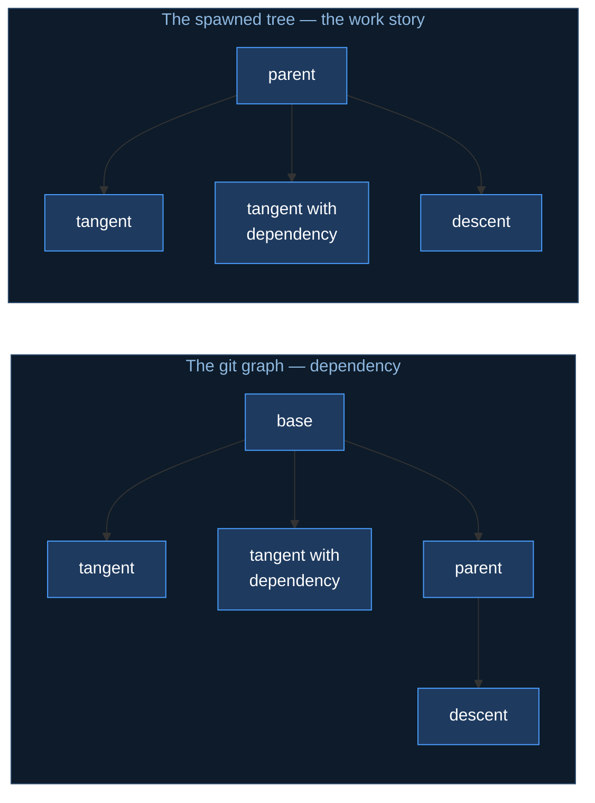
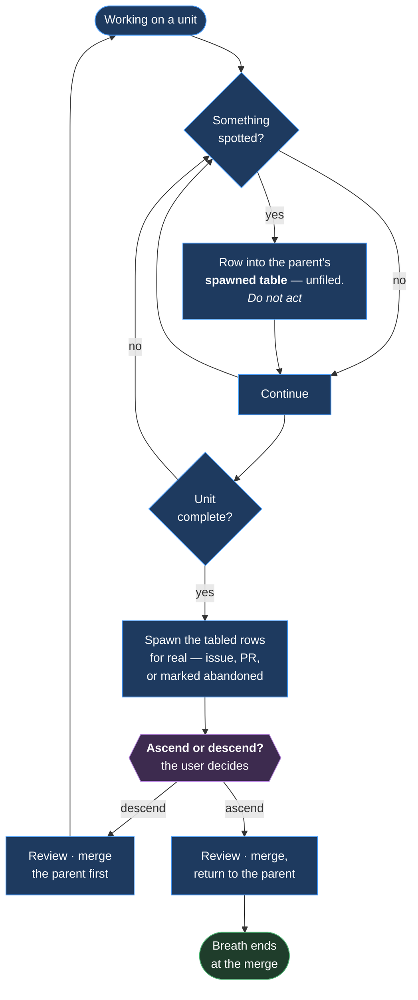

# Mechanism — Work Navigation

**Status:** specified. The decisions are settled; the artifacts that carry them are named
below and built separately.
**Home:** Arc — Authoring.
**Src:** 🔥 observed, 2026-08-20.
**Covers:** m46.

---

## The friction

Work is discovered while doing other work. There was no defined way to record it, decide
whether it belonged here or elsewhere, or find the way back out — so a discovery either
derailed the current work or was lost.

> *"i go to review 1 change… and we're in a different branch so there is no change! that
> specific case has happened at least 8 different times over the last 3 days."*

**Eleven PRs open across five branches, each cut from a different base.** A review begun in
one branch lost its subject when the working tree moved to another. The review time spent
before each move was lost with it.

The naming was the visible symptom. **The cause was that a discovery moved the working tree
at all.**

---

## What this is not

**Not scope control.** Whether a discovery belongs in this arc is
[m43](m43-camp-assistant.md)'s obligation 0.

**Not decomposition.** Turning a body of work into issues is
[m43](m43-camp-assistant.md)'s (not [m20](m20-arc-decomposition.md)'s) obligation 2, carried
by [`skills/decompose`](../../../skills/decompose/SKILL.md). This decides *where a discovery
goes and how you get back*; decompose decides *what shape it takes* once it is going
somewhere.

**Not arc-scoped.** Discovery happens outside arcs, which is why this is its own mechanism
rather than part of [m21](m21-arc-tree.md) or the arc-log.

---

## The industry model — a patch series

**This is the patch series tradition**, most visible in Linux kernel practice: a set of
related changes reviewed and landed as one unit, ordered so each builds on the last.

Two mainstream traditions disagree about the unit, and both agree about the constraint:

| Tradition | The unit | Says |
|---|---|---|
| **Trunk-based** (Google, Meta) | One small change | Split discoveries into separate changes |
| **Patch series** (Linux kernel) | An ordered series | Land related discoveries together |
| **Both** | — | **One reviewable unit, one coherent story** |

**Arc follows the patch series model**, because discovery work produces changes that only
make sense together — a rule and the artifact that reads it, a process and the skill that
performs it.

> **The anti-pattern is not size. It is a unit that grows without its title and description
> growing with it.** A PR that expanded four times and still carries its first title is
> unreviewable no matter how few lines it touches.

Naming the tradition is deliberate: a reader can research it rather than treating this as a
local invention.

---

## Three relations, not two

A discovery relates to its parent in one of three ways, and the branch shape follows.

| Relation | Test | Branches from | Merges to |
|---|---|---|---|
| **Tangent** | It would exist anyway | The shared base | The shared base |
| **Descent** | It changes what the parent should be | The parent branch | The parent |
| **Tangent with dependency** | Shared base, but it would not exist without the parent | The shared base | The shared base |

**The third is the most common and has no distinct branch shape.** `chat-response`'s link
rule was only discovered because of the handoff work, but it does not depend on it — it is
a work-tree relationship, not a git one.



> **The git graph carries dependency. The spawned tree carries the work story.** They are
> different views of the same work and **neither fakes the other** — a tangent with a
> dependency is a child in the tree and a sibling in the graph, and forcing either view to
> match the other loses information.

**Branch where the dependency actually is**, so merge order stays reorderable and a
dependent change cannot land before what it depends on.

---

## The loop

**A unit of work is a breath.** It opens, it may nest, and it ends at a merge.



**Entry condition:** a small, scoped discovery during manual work — the no-issue PR case.
Larger or already-scoped work goes to a worktree instead, and does not move the tree at all.

### Breaths nest

A discovery inside a discovery is normal and does not need flattening.

> *"when you're sobbing you'll do a burst breath in, start to exhale just a bit, then burst
> breath in a bit more, lungs filling deeper… and then finally your lungs fill up so large
> you have a large exhale."*

Nested inhales, one long exhale. **Trying to exhale mid-nest is what splits one story across
several PRs** — the failure this mechanism was written after.

---

## The spawned table is a scope buffer

**A spotted tangent goes into the parent's spawned table immediately, unfiled. Nothing is
acted on when it is spotted.**

| | |
|---|---|
| **Not a to-do list** | A growing definition of what this work turned out to be |
| **Long is fine** | Length is evidence of scope, and seeing it early is the point |
| **Unfiled rows get numbers later** | At spawn time, not at spot time |
| **Abandoned rows stay**, marked at the front of the row | A record of what was chosen against is worth more than a tidy table |

**This is [`decompose`](../../../skills/decompose/SKILL.md)'s other input.** It reads a spec
*or* a spawned table, and records which — so the proposed set carries its own origin. A table
that grew for three days is exactly the raw material decomposition needs.

**Both directions are recorded**, and the pair is what makes the tree navigable rather than
only readable:

| | Written on |
|---|---|
| `Spawned` table | The parent |
| `Spawned by #NN` | The child — **the only record when the child has no issue** |

---

## The ascend/descend prompt

**Whether a discovery is a tangent or a descent is the user's call and cannot be inferred.**
It is the same judgement as *is this in scope*, and it is cheap for the user to make in the
moment — but only if the question is asked plainly.

| Rule | |
|---|---|
| **Fires only when there is somewhere to descend to** | At depth zero there is no decision, so there is no prompt |
| **A standalone break in the conversation** | Just the ask. **No other content in that message** — it is a decision point, not a paragraph |
| **Both destinations named concretely** | The user answers without reconstructing where they are |
| **The words match the action** | *Ascend* and *descend*, on the work tree |

```text
**Descend into the spawned process update, or ascend to #45 (the handoff blockage)?**
```

**Never *"what next?"*** — that puts the reconstruction back on the person the prompt exists
to serve.

---

## Manual mode

Auto and manual are [m40](m40-autonomy-switch.md)'s. What binds here:

| | |
|---|---|
| **Work stops at the edit** | The user reviews, then merges. `git status` and the editor's diff are the review surface |
| **Every merge in a stack is reviewed** | Including intermediate ones — a stacked merge carries changes the previous did not |
| **"This is good, merge up" delegates the rest** | **Explicit only.** Never assumed |

**Nine unreviewed PRs merged at once is the failure state**, and it is what this section
exists to prevent.

---

## Branch naming

**The branch name is often the only reference visible** — an editor's status bar truncates
early, and it is the one place the current work is named while a PR is being reviewed in a
browser.

**Two forms, and the number names whichever identifier exists first.**

```text
arc/<nn>-<slug>-issue-<NN>-<hint>    an issue exists — use its number
arc/<nn>-<slug>-pr<NN>-<hint>        no issue — the PR number is the only identifier

arc/03-camp-issue-76-work-nav
arc/03-camp-pr75-no-issue-pr
```

**Do not write `pr<NN>` for an issue-backed branch.** The issue number and the PR number are
different numbers from the same counter, and naming a branch after the wrong one points the
reader at an unrelated object. If an issue exists, its number is the one that names the work.

| | |
|---|---|
| **The number is mandatory** | It is what makes the branch sayable and matchable against what is under review |
| **The hint is short** | A twenty-word slug truncates to nothing |
| **The PR title carries the real name** | And is **retitled as the unit grows** |

**GitHub's issue and PR numbers share one counter**, so the PR number is already unique
across both. A second index would create two tokens for one thing.

**A number cannot be reserved** — it is allocated on creation, so predicting it is silently
wrong whenever anything lands in between. The branch is therefore named after the PR exists,
and renamed before its first push if a placeholder was used.

---

## What is not designed

**Where the mechanism's rules live so they are portable.** They must arrive with the plugin
and not be re-taught per repo — the same requirement as
[#73](https://github.com/Calyx-Engineering/arc/issues/73). The carrier is undecided.

**When a worktree is right instead.** Already-scoped parallel work belongs in a worktree, and
unscoped discovery does not. The boundary between them is judgement.

**Whether the ascend/descend prompt over-fires** at depth two or three. No budget is set.

---

## Artifacts

| Artifact | Carries |
|---|---|
| [`skills/issue-write`](../../../skills/issue-write/SKILL.md) | The spawned table, the abandoned marker, mandatory retitling |
| [`skills/decompose`](../../../skills/decompose/SKILL.md) | Reading the spawned table as an input, and recording its origin |
| [`skills/chat-response`](../../../skills/chat-response/SKILL.md) | The ascend/descend prompt as a standalone message |
| `CLAUDE.md` — branching | Branch naming with the number |
| [m21](m21-arc-tree.md) | Rendering these relations |

---

## Related

- [#76](https://github.com/Calyx-Engineering/arc/issues/76) — the issue this specifies
- [m40](m40-autonomy-switch.md) — auto and manual, and who reviews
- [m20](m20-arc-decomposition.md) — sequences an arc at kickoff; this navigates discovery at any point
- [m21](m21-arc-tree.md) — the tree these relations render into
- [m43 §3.1](m43-camp-assistant.md) — obligation 0, which owns whether a discovery belongs in this arc
