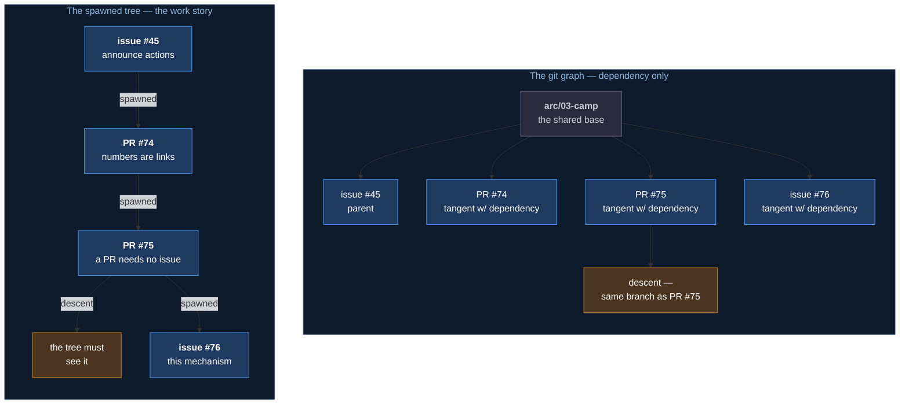
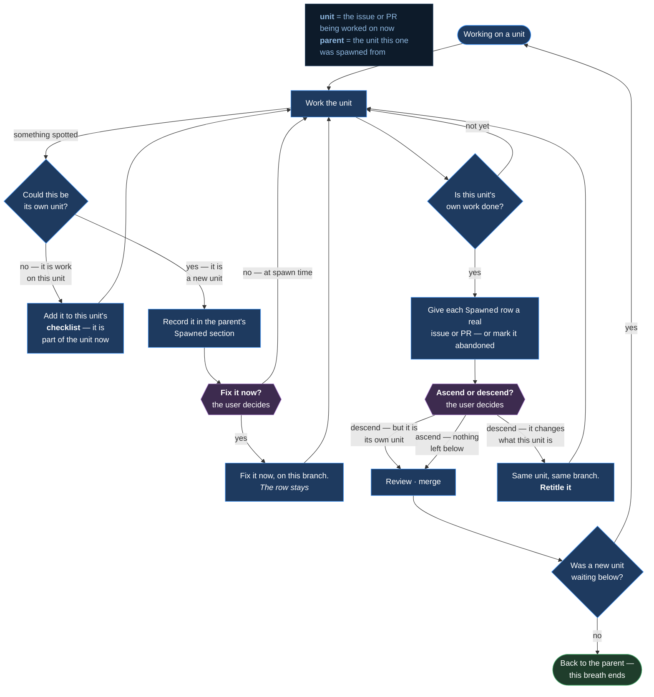
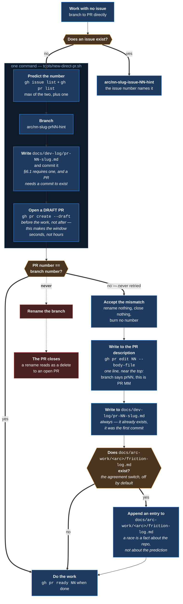

# Mechanism — Work Navigation

**Status:** specified. The decisions are settled; the artifacts that carry them are named
below and built separately.
**Home:** Arc — Authoring.
**Src:** 🔥 observed, 2026-08-20.
**Covers:** m46.

---

## 1 The friction

Work is discovered while doing other work. There was no defined way to record it, decide
whether it belonged here or elsewhere, or find the way back out — so a discovery either
derailed the current work or was lost.

> *"i go to review 1 change… and we're in a different branch so there is no change! that
> specific case has happened at least 8 different times over the last 3 days."*

**Eleven PRs open across five branches, each cut from a different base.** A review begun in
one branch lost its subject when the working tree moved to another. The review time spent
before each move was lost with it.

The naming was the visible symptom. **The cause was that a discovery moved the working tree
at all.**

---

## 2 What this is not

**Not scope control.** Whether a discovery belongs in this arc is
[m43](m43-camp-assistant.md)'s intent check.

**Not decomposition.** Turning a body of work into issues is
[m43](m43-camp-assistant.md)'s (not [m20](m20-arc-decomposition.md)'s) decomposition, carried
by [`skills/decompose`](../../../skills/decompose/SKILL.md). This decides *where a discovery
goes and how you get back*; decompose decides *what shape it takes* once it is going
somewhere.

**Not arc-scoped.** Discovery happens outside arcs, which is why this is its own mechanism
rather than part of [m21](m21-arc-tree.md) or the arc-log.

---

## 3 The industry model — a patch series

**This is the patch series tradition**, most visible in Linux kernel practice: a set of
related changes reviewed and landed as one unit, ordered so each builds on the last.

Two mainstream traditions disagree about the unit, and both agree about the constraint:

| Tradition | The unit | Says |
|---|---|---|
| **Trunk-based** (Google, Meta) | One small change | Split discoveries into separate changes |
| **Patch series** (Linux kernel) | An ordered series | Land related discoveries together |
| **Both** | — | **One reviewable unit, one coherent story** |

**Arc follows the patch series model**, because discovery work produces changes that only
make sense together — a rule and the artifact that reads it, a process and the skill that
performs it.

> **The anti-pattern is not size. It is a unit that grows without its title and description
> growing with it.** A PR that expanded four times and still carries its first title is
> unreviewable no matter how few lines it touches.

Naming the tradition is deliberate: a reader can research it rather than treating this as a
local invention.

---

## 4 Three relations, not two

A discovery relates to its parent in one of three ways, and the branch shape follows.

| Relation | Test | Branches from | Merges to |
|---|---|---|---|
| **Tangent** | It would exist anyway | The shared base | The shared base |
| **Descent** | It changes what the parent should be | The parent branch | The parent |
| **Tangent with dependency** | Shared base, but it would not exist without the parent | The shared base | The shared base |

**The third is the most common and has no distinct branch shape.** A worked example, from
the work that produced this mechanism:

| # | | Discovery | Relation | Why | Branched from |
|---|---|---|---|---|---|
| 1 | **Parent** | issue [#45](https://github.com/Calyx-Engineering/arc/issues/45) — announcing completed actions | — | The work in hand | `arc/03-camp` |
| 2 | **Child** | PR [#74](https://github.com/Calyx-Engineering/arc/pull/74) — issue numbers in chat must be links | **Tangent with dependency** | Noticed while reading issue [#45](https://github.com/Calyx-Engineering/arc/issues/45)'s output, but changes nothing about it and needs none of its code | `arc/03-camp` |
| 3 | **Grandchild** | PR [#75](https://github.com/Calyx-Engineering/arc/pull/75) — a PR needs no issue | **Tangent with dependency** | Same shape again, one level down: found by doing PR [#74](https://github.com/Calyx-Engineering/arc/pull/74), independent of it | `arc/03-camp` |
| 4 | **Inside PR [#75](https://github.com/Calyx-Engineering/arc/pull/75)** | The arc tree must see a no-issue PR | **Descent** | The new rule was useless unless something read it, so it changes what PR [#75](https://github.com/Calyx-Engineering/arc/pull/75) is | **PR [#75](https://github.com/Calyx-Engineering/arc/pull/75) itself** — no new branch |
| 5 | **Great-grandchild** | issue [#76](https://github.com/Calyx-Engineering/arc/issues/76) — this mechanism | **Tangent with dependency** | The rule needed a whole navigation model behind it. Too large to fold into PR [#75](https://github.com/Calyx-Engineering/arc/pull/75) without making it unreviewable | `arc/03-camp` |

**Rows 4 and 5 were both found inside PR [#75](https://github.com/Calyx-Engineering/arc/pull/75),
and only one stayed there.** That is the reviewable-unit test, and it is the judgement this
whole mechanism turns on:

| | |
|---|---|
| **The tree change stayed** | A rule and the thing that reads it are one story. Splitting them would ship a rule nothing honours |
| **Issue [#76](https://github.com/Calyx-Engineering/arc/issues/76) split off** | A spec, a diagram and five artifacts is a different story. Folding it in would have grown PR [#75](https://github.com/Calyx-Engineering/arc/pull/75) past what one review can hold |

**Every one of these branched from the same base**, because none of them needed another's
code. The parent/child structure is real and lives in the spawned tree, not in git.



**Read the two side by side.** The left is flat because nothing depended on anything — three
siblings off one base. The right is three levels deep because each was found by doing the one
above it. **Both are correct.**

> **The git graph carries dependency. The spawned tree carries the work story.** They are
> different views of the same work and **neither fakes the other** — a tangent with a
> dependency is a child in the tree and a sibling in the graph, and forcing either view to
> match the other loses information.

**Branch where the dependency actually is**, so merge order stays reorderable and a
dependent change cannot land before what it depends on.

---

## 5 The loop

**A unit of work is a breath.** It opens, it may nest, and it ends at a merge.



**Entry condition:** any unit of work, in manual mode. The loop was written from the small
no-issue PR case and is not limited to it — an issue-backed unit that spawns further issues
runs the same loop. Already-scoped parallel work goes to a worktree instead, and does not move
the tree at all.

### 5.1 Not everything spotted is spawned work

**The test is whether it could stand alone: *could this be its own issue or PR?***

| Answer | Where it goes | Because |
|---|---|---|
| **No** — it is work this unit already implied | This unit's **issue or PR checklist** | A paragraph to fix or a link to add is not a unit of work. A `Spawned` row implies it becomes its own issue or PR, which it never will |
| **Yes** — it could stand alone | The parent's **`Spawned` section** | Whether it folds into this unit or splits off is decided later, at spawn time |

**A recorded row is usually left alone until spawn time. Sometimes it should not be.**

> **Fix it now? The user decides.**

**This is a judgement, not a test.** Reasons vary and no single condition captures them —
a defect that will keep firing until fixed, something the rest of the unit depends on,
something cheap now and expensive later.

> *"If you're building a house and it catches on fire you don't tell yourself 'that has
> nothing to do with finishing the wall i'm framing right now.' You just grab a fire
> extinguisher and go."*

**Relevance is not always the test.** The fire has nothing to do with the wall. What decides it is
the cost of waiting, and that is why no scope rule can answer it — scope asks whether the
thing belongs here, and this asks whether it can wait.

| | |
|---|---|
| **The bar is high** | Deferring is the default, and *small* or *interesting* is not a reason to break it |
| **It is not a descent** | A descent changes what this unit is and forces a retitle. This does neither — it is a separate fix that could not wait |
| **The row stays** | It is the record that the work happened. Removing it because the work is done loses the spawn edge |
| **Same branch, and the commit says so** | Its own branch would move the working tree mid-unit, which is the failure this mechanism exists to prevent |

**Worked example.** Writing this spec, a decision was buried under 120 words instead of
leading the message. `chat-response` could stand alone — a `Spawned` row — but leaving it
there meant every remaining reply that session would repeat the defect. It was fixed
immediately, on this branch, and the row remains.

**The checklist, not chat.** A todo held in conversation dies with the session, and the
checklist is already the session's working state —
[`work-watch`](../../../skills/work-watch/SKILL.md) treats it that way.

**A yes does not mean it leaves.** [§4](#4-three-relations-not-two)'s row 4 was a new unit
that got a `Spawned` row and still stayed in PR
[#75](https://github.com/Calyx-Engineering/arc/pull/75) — the row records it, the
reviewable-unit test decides where it lands.

### 5.2 Breaths nest

A discovery inside a discovery is normal and does not need flattening.

> *"when you're sobbing you'll do a burst breath in, start to exhale just a bit, then burst
> breath in a bit more, lungs filling deeper… and then finally your lungs fill up so large
> you have a large exhale."*

Nested inhales, one long exhale. **Trying to exhale mid-nest is what splits one story across
several PRs** — the failure this mechanism was written after.

---

## 6 The `Spawned` section is a scope buffer

**A spotted tangent goes into the parent issue or PR's `Spawned` section immediately — as a
new row, or as a sharpening of one already there. Recording it is not acting on it: the row is
written first, and whether it is fixed now or at spawn time is the user's call
([§5.1](#51-not-everything-spotted-is-spawned-work)).**

| | |
|---|---|
| **Not a to-do list** | A growing definition of what this work turned out to be. Rows are edited as understanding improves, not only appended |
| **Long is fine** | Length is evidence of scope, and seeing it early is the point |
| **A row gets its number later** | At spawn time, not at spot time. Until then it is a described row with no tracker object of its own |
| **Abandoned rows stay**, marked at the front of the row | A record of what was chosen against is worth more than a tidy table |

**This is [`decompose`](../../../skills/decompose/SKILL.md)'s other input.** It reads a spec
*or* a `Spawned` section, and records which — so the proposed set carries its own origin. A table
that grew for three days is exactly the raw material decomposition needs.

**Both directions are recorded**, and the pair is what makes the tree navigable rather than
only readable:

| | Written on |
|---|---|
| `Spawned` section | The parent |
| `Spawned by #NN` | The child — **the only record when the child has no issue** |

### 6.1 Merged work always has a dev-log

**Every unit that merges gets a dev-log, whether or not an issue exists.** A no-issue PR is a
unit of work like any other, and the record does not care which identifier it carries.

| The unit | Its dev-log |
|---|---|
| An issue | `docs/dev-log/issue-<NN>-<slug>.md` |
| A PR with no issue | `docs/dev-log/pr-<NN>-<slug>.md` |

The two forms mirror [§9](#9-branch-naming)'s branch names: the number names whichever
identifier exists first.

> **This is not a judgement call, and deliberately so.** A gate on *is this big enough to be
> worth recording* fails in exactly the case that matters — the small fix that turns out not
> to be small.

PR [#75](https://github.com/Calyx-Engineering/arc/pull/75) is that case. It was a two-file fix
when it opened, judged too small to need a record, and it descended into the mechanism this
document specifies. A size test would have discarded its reasoning at the point the reasoning
was cheapest to write down.

**One dev-log per unit.** Whatever changes the unit — a discovery folded in, a rewrite, a
change of direction — is documented in that unit's dev-log. Work that becomes a different unit
is documented in that one, and the `Spawned` rows link them.

---

## 7 Asking the user to choose

### 7.1 Any navigation decision leads the message

**A decision that changes where the work goes next is never buried.** It opens the reply, it
is set apart, and it is flagged as needing an answer.

> **The reader must not have to finish the message to learn a decision was wanted.** A
> question in the last line of a long reply reads as commentary, and the answer given is the
> answer to whatever they read first.

| Rule | |
|---|---|
| **First, and marked** | A one-line note at the top that a decision is needed, before any reasoning |
| **Bold and set apart** | It is a break in the conversation, not a sentence within it |
| **Just the ask** | **No other content in that message.** Reasoning goes below, or in the next reply |
| **Every option named concretely** | The user answers without reconstructing where they are |

**This governs any navigation decision** — ascend or descend, fold in or split off, file now
or table it. The ascend/descend prompt below is the most frequent instance, not the only one.

### 7.2 The ascend/descend prompt

**Whether a discovery is a tangent or a descent is the user's call and cannot be inferred.**
It is the same judgement as *is this in scope*, and it is cheap for the user to make in the
moment — but only if the question is asked plainly.

| Rule | |
|---|---|
| **Fires only when there is somewhere to descend to** | At depth zero there is no decision, so there is no prompt |
| **The words match the action** | *Ascend* and *descend*, on the work tree |

```text
**Decision needed.**

**Descend into the spawned process update, or ascend to issue #45 (the handoff blockage)?**
```

**Never *"what next?"*** — that puts the reconstruction back on the person the prompt exists
to serve.

---

## 8 Manual mode

Auto and manual are [m40](m40-autonomy-switch.md)'s. What binds here:

| | |
|---|---|
| **Work stops at the edit** | The user reviews, then merges. `git status` and the editor's diff are the review surface |
| **Every merge in a stack is reviewed** | Including intermediate ones — a stacked merge carries changes the previous did not |
| **"This is good, merge up" delegates the rest** | **Explicit only.** Never assumed |

**Nine unreviewed PRs merged at once is the failure state**, and it is what this section
exists to prevent.

---

## 9 Branch naming

**The branch name is often the only reference visible** — an editor's status bar truncates
early, and it is the one place the current work is named while a PR is being reviewed in a
browser.

**Two forms, and the number names whichever identifier exists first.**

```text
arc/<nn>-<slug>-issue-<NN>-<hint>    an issue exists — use its number
arc/<nn>-<slug>-pr<NN>-<hint>        no issue — the PR number is the only identifier

arc/03-camp-issue-76-work-nav
arc/03-camp-pr75-no-issue-pr
```

**Do not write `pr<NN>` for an issue-backed branch.** The issue number and the PR number are
different numbers from the same counter, and naming a branch after the wrong one points the
reader at an unrelated object. If an issue exists, its number is the one that names the work.

| | |
|---|---|
| **The number is mandatory** | It is what makes the branch sayable and matchable against what is under review |
| **So is the `pr` label** | Issues and PRs share one counter. An unlabelled number points at whichever object happens to hold it |
| **The hint is short** | A twenty-word slug truncates to nothing |
| **The PR title carries the real name** | And is **retitled as the unit grows** |

### 9.1 The PR number does not exist when the branch is created

**Predict it, then confirm.** The number is issued when the PR opens, so a no-issue branch is
named before the identifier exists. Guessing without confirming reproduces the exact failure
above — a branch pointing at an unrelated object.



| | |
|---|---|
| 1 | **Predict.** The next number is the higher of the latest issue and the latest PR, plus one — they share a counter |
| 2 | **Branch with it**, and write the dev-log — [§6.1](#61-merged-work-always-has-a-dev-log) requires one anyway, and a PR needs at least one commit to exist |
| 3 | **Open it as a draft, before the work.** This is what makes the window seconds wide instead of hours |
| 4 | **Confirm** the PR's number against the branch's. Equal, and nothing more is needed. **Not equal, and nothing is retried** — see below |
| 5 | **Then do the work**, and mark the PR ready when it is done |

**A miss is never retried.** Accept it, and say so. Retrying burns a number to buy a tidier
branch name, and the name was only ever a pointer — an explained mismatch points just as well.

| On a miss | |
|---|---|
| **The PR body says it, near the top** | *"Branch says `pr112`, this is PR #114."* Without this the branch is **silently wrong**, which is the failure this section exists to prevent. With it, the branch is merely inexact |
| **The dev-log says it** | It already exists — it was the first commit. One line under the problem statement |
| **The friction log too, where the repository keeps one** | `docs/arc-work/<arc-slug>/friction-log.md`. A miss means someone filed inside a seconds-wide window, which is a fact about the repository and reaches nobody unless written down |
| **Nothing is renamed, nothing is closed** | Renaming closes the PR — see below. Closing to re-try burns a number for cosmetics |

**Why never rather than once.** A miss is not a mistake to correct; it is a race that already
happened. The prediction cannot be made more right after the fact, and every retry costs a real
number for a cosmetic gain. **The notification is the fix** — three places record it, and
nothing is silently wrong.

**The draft comes before the work, not after it.** Branching, building for an hour and opening
the PR at the end leaves the number unclaimed for that whole hour — and puts the confirmation
step *after* everything has already landed on a possibly-wrong branch. Correcting then costs
the whole branch; correcting at step 4 costs nothing.

> **This was got wrong on its own first use.** [PR #108](https://github.com/Calyx-Engineering/arc/pull/108) specified *open the PR
> immediately*, then branched, implemented, and opened it over an hour later. The prediction
> happened to hold, which is exactly why the gap was invisible.

```sh
tools/new-direct-pr.sh <hint-slug> "<PR title>"      # steps 1-4, one command
tools/new-direct-pr.sh --dry-run <hint> "<title>"    # what it would do
```

**Steps 1 to 4 are one command, and they have to be.** By hand the sequence is branch, author
a dev-log, commit, push, open the PR — minutes of typing with a real race running underneath
it, which makes *the window is seconds wide* false. The script collapses it: predict, branch,
commit a **stub** dev-log, push, open the draft, and report whether the number held.

**The stub is the point, not a shortcut.** A PR needs a commit to exist and
[§6.1](#61-merged-work-always-has-a-dev-log) wants a dev-log of every merged unit; writing the
real one first is what reintroduces the delay. It is filled in as the work proceeds, before the
PR is marked ready.

The prediction underneath it is one line — issues and PRs share a counter, so the next number
is one past whichever is higher:

```sh
I=$(gh issue list --state all --limit 1 --json number --jq '.[0].number')
P=$(gh pr list --state all --limit 1 --json number --jq '.[0].number')
N=$(( (I > P ? I : P) + 1 ))
```

**No correction. Two were considered and both are worse than recording the miss.**

> **Do not rename the branch of an open PR. It closes the PR.**
>
> Tested 2026-08-21 on [PR #109](https://github.com/Calyx-Engineering/arc/pull/109), opened as a throwaway for exactly this question.
> `gh api repos/{owner}/{repo}/branches/{branch}/rename` returned the new name, the branch
> exists only under it — and the PR went `OPEN` → `CLOSED` with its head still naming the
> branch that no longer exists.

**The rename API itself works**, and is fine on a branch with no PR open against it. It is the
combination that fails: a rename behaves like a delete to an open PR, and GitHub closes a PR
whose head branch disappears.

**Closing and re-opening works, and is still not worth it.** It costs a real number to buy a
branch name that is tidier but no more useful — the name is a pointer, and a pointer with a
one-line correction beside it points fine.

**This is why a miss is recorded rather than corrected.** There is no repair once the PR
exists — only a tidier second attempt, bought with a real number.

**A shared `temp/` branch does not solve this either.** The idea is to open every PR against
one throwaway branch, take the number, then point the PR at the real branch. Tested
2026-08-21 on [PR #111](https://github.com/Calyx-Engineering/arc/pull/111):

| | |
|---|---|
| `PATCH /repos/{o}/{r}/pulls/{n}` with `head` | **Returned 200 and ignored the field.** The head was unchanged. Silent success, wrong result |
| A second PR from the same head branch | **Rejected** — *"a pull request for branch `temp/pr-probe` into `arc/03-camp` already exists"* |

**A PR's `head` is fixed at creation; only `base` can be changed.** So one shared branch
serialises every direct PR to one at a time, and the retarget that would free it does not
work.

**Do not leave a mismatch.** A branch naming a PR that is not the one it opened is worse than
a branch naming nothing — it is confidently wrong, which is what the number was added to
prevent.

**GitHub's issue and PR numbers share one counter**, so the PR number is already unique
across both. A second index would create two tokens for one thing.

**A number cannot be reserved** — it is allocated on creation, so predicting it is silently
wrong whenever anything lands in between. The branch is therefore named after the PR exists,
and renamed before its first push if a placeholder was used.

---

## 10 What is not designed

**Where the mechanism's rules live so they are portable.** They must arrive with the plugin
and not be re-taught per repo — the same requirement as
issue [#73](https://github.com/Calyx-Engineering/arc/issues/73). The carrier is undecided.

**When a worktree is right instead.** Already-scoped parallel work belongs in a worktree, and
unscoped discovery does not. The boundary between them is judgement.

**Whether the ascend/descend prompt over-fires** at depth two or three. No budget is set.

---

## 11 Artifacts

| Artifact | Carries |
|---|---|
| [`skills/issue-write`](../../../skills/issue-write/SKILL.md) | The `Spawned` section, the abandoned marker, mandatory retitling |
| [`skills/decompose`](../../../skills/decompose/SKILL.md) | Reading the `Spawned` section as an input, and recording its origin |
| [`skills/chat-response`](../../../skills/chat-response/SKILL.md) | The ascend/descend prompt as a standalone message |
| [`skills/record-route`](../../../skills/record-route/SKILL.md) | A dev-log per merged unit, `pr-<NN>-<slug>.md` when there is no issue |
| [`templates/dev-log.md`](../../../templates/dev-log.md) | Both filename forms, and the heading a no-issue unit takes |
| `CLAUDE.md` — branching | Branch naming with the number |
| [m21](m21-arc-tree.md) | Rendering these relations |
| `tools/new-direct-pr.sh` | [§9.1](#91-the-pr-number-does-not-exist-when-the-branch-is-created) steps 1–4 as one command — predict, branch, stub dev-log, push, open the draft |
| `hooks/camp-branch-check` | Reports a work branch carrying neither number form |

---

## 12 Related

- issue [#76](https://github.com/Calyx-Engineering/arc/issues/76) — the issue this specifies
- [m40](m40-autonomy-switch.md) — auto and manual, and who reviews
- [m20](m20-arc-decomposition.md) — sequences an arc at kickoff; this navigates discovery at any point
- [m21](m21-arc-tree.md) — the tree these relations render into
- [m43 §3.1](m43-camp-assistant.md) — the intent check, which owns whether a discovery belongs in this arc
