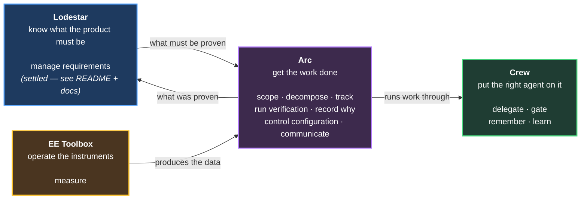

# What the Tools Do

Working document, 2026-08-14.

A plugin plus an AI is a **tool**, and a tool is used to *do* something. This document
lists the things the tool must be able to do. Artifacts appear only as evidence that a
job was done.

Companion to [archive/responsibility-decomposition.md](archive/responsibility-decomposition.md), which
approaches the same material from the artifact side. Where they disagree, this one is
the newer thinking.

**How to read this.** §1 is the whole forest — thirteen jobs, one line each. §2 groups
them and proposes where they live. §3 is the evidence. Detail sits in §4 onward;
nothing below §3 is needed to follow the argument.

---

## 1. The forest — every job, one line each

Named by what the tool *does*. The short name is the handle used everywhere else in
this document.

|#|Job|What the tool actually does|
|---|---|---|
| 1 | **Manage requirements** | Elicits, captures, organizes and presents what the product must do — and says how each requirement will be proven. **This is Lodestar. Settled; see [README](https://github.com/Calyx-Engineering/lodestar/blob/main/README.md) and [docs 01–04](https://github.com/Calyx-Engineering/lodestar/blob/main/docs/01-design-story-driven-requirements.md).** Detail in §4.1 only if needed |
| 2 | **Run verification** | Executes or records the proving, and updates what is proven |
| 3 | **Scope** | Turns a mission into an agreed, bounded piece of work with sign-off |
| 4 | **Decompose** | Breaks agreed scope into ordered, sized chunks with checkpoints |
| 5 | **Track** | Files, links, and closes the issues and branches that carry the work |
| 6 | **Delegate** | Assigns work to the right agent at the right model tier and keeps context lean |
| 7 | **Gate** | Stops and requires a human decision at the moments that matter |
| 8 | **Record why** | Captures decisions and rejected alternatives so reasoning survives |
| 9 | **Remember** | Accumulates project knowledge so the tool does not re-derive it every session |
| 10 | **Control configuration** | Knows exactly what is in a thing at a given revision |
| 11 | **Communicate** | Writes issues, PRs, and reports that another person can act on |
| 12 | **Measure** | Operates the domain tools that produce real engineering data |
| 13 | **Learn** | Mines its own transcripts for recurring corrections, and proposes what to codify (§4.4) |

**Job 1 is one line on purpose.** Requirements management is a decided product with a
written design. Earlier drafts of this document split it into five jobs, which made a
settled thing occupy a third of the page and pulled attention back to territory that
does not need re-deciding. It is one job here, and it stays one job.

**The open territory is jobs 2–13.** That is where the hardware/software divergence
lives, where the extraction candidates are, and where the product boundaries are still
genuinely undecided.

### The one place job 1 still touches this document

**Run verification (job 2) is listed separately from job 1 deliberately.** Deciding
*how* a requirement will be proven is requirements work and belongs to Lodestar.
Actually proving it — running the campaign, recording results — happens weeks later in
hardware, against a physical board, driven by delivery. The seam between them is real
and is the one boundary question job 1 is still involved in (§4.2).

---

## 2. The groupings — which tool does which jobs

Four tools. Each is described by what it lets you do, not by what it contains.

### Lodestar — *"know what the product must be"*

**Job 1, entire.** Turns conversations into a requirement set you can steer by, and
says how each requirement will be proven.

Already designed — [README](https://github.com/Calyx-Engineering/lodestar/blob/main/README.md), [docs 01–04](https://github.com/Calyx-Engineering/lodestar/blob/main/docs/01-design-story-driven-requirements.md).
Not re-derived here.

**Status: invention.** The only tool of the four with nothing working yet (§3).

### Arc — *"get the work done, in order, with a record"*

| Job | Why here |
|---|---|
| **Scope** | The kickoff — an execution concern |
| **Decompose** | Chunking and checkpoints |
| **Track** | Issues and branches are the work's vehicle |
| **Run verification** | The campaign that proves things, which in hardware outlives the arc |
| **Record why** | Decisions made while doing the work |
| **Control configuration** | What a merge or release contains |
| **Communicate** | Writing the issues, PRs, and reports the work produces |

**One line:** takes agreed scope to finished, verified, recorded work.

**Status: extraction plus a hardware mode.** Proven in software (TimeScope), and the
branch pattern is proven in hardware (ROADZ), but the two modes differ in control flow
(§3).

### Crew — *"put the right agent on it, cheaply"*

| Job | Why here |
|---|---|
| **Delegate** | The core job |
| **Gate** | Where the human is required |
| **Remember** | The wiki exists to keep agent context lean — inseparable from delegation |
| **Learn** | Same job as Remember, one level up: Remember captures project facts, Learn captures process facts |

**One line:** runs work through the right agents at the right cost, and stops for you
when it matters.

**Status: extraction, nearly ready.** `agent-process-foundation.md` in TimeScope was
already written to be dropped into other repos.

### EE Toolbox — *"operate the engineering instruments"*

| Job | Why here |
|---|---|
| **Measure** | Domain-total; no shared core with the others |

**One line:** parses schematics, extracts netlists, drives bench instruments.

**Status: extraction; accretes over time.**

### The picture

Each tool is useful alone. **Crew** depends on nothing. **Lodestar** depends on nothing
— which is what lets it be published by itself. Only **Arc** sits downstream, and only
of things that change slowly.

---

## 3. What the evidence says about each job

Counted directly from ROADZ (hardware, four weeks of real work) and TimeScope
(software, mature process infrastructure).

| Job | Works today? | Evidence |
|---|---|---|
| **Manage requirements** | ❌ **Nothing works, in either repo** | TimeScope: 2 stories + 11 admitted placeholders. ROADZ: 2 stories. Test plans hand-written as issues |
| **Run verification** | ⚠️ Ad hoc | Results exist; nothing systematically records them |
| **Scope** | ✅ Works in software | TimeScope's hard scope gate — "a hard STOP" before any branch |
| **Decompose** | ✅ Works in software | Waves, tracks, disjoint-file partitioning |
| **Track** | ⚠️ Works via a trick | ROADZ sets the arc branch as repo default so `gh` auto-links. Not multi-user safe |
| **Delegate** | ✅ **Most mature thing here** | 8 agents, tiers, briefs/packets, worktree waves |
| **Gate** | ✅ Software; ⚠️ hardware | F5 gate works. Hardware's second gate has no home (§4.2) |
| **Record why** | ✅ Software; ❌ hardware | TimeScope 13 dev-logs + arc-log. ROADZ: an empty stub |
| **Remember** | ✅ **Works in both** | ROADZ 11 wiki pages + dated log; TimeScope 6 pages |
| **Control configuration** | ✅ Software free; ❌ hardware | git + semver solve it for software. Hardware has no BOM revision control |
| **Communicate** | ✅ Works | `issue-writing`, `engineering-report`, both portable |
| **Measure** | ✅ Works | `sch_netlist.py`, `amp-load-test` |

### The two findings that matter

**1. What works, works because of a mechanism — not discipline.** Every job that
succeeds has three things: a **trigger** (something says *now*), a **template** (not a
blank page), and **enforcement** (a hook, gate, or mandatory step). Every job that
fails has at most one. This holds across both repos and both domains.

| Job | Trigger | Template | Enforcement | Result |
|---|---|---|---|---|
| Remember | wiki-first rule | six fixed pages | PR-time lint | ✅ works |
| Record why (SW) | plan + PR time | `TEMPLATE.md` | `Stop` hook gate | ✅ 13 logs |
| Record why (HW) | — | — | — | ❌ empty stub |
| Manage requirements | — | template exists | — | ❌ 2 stories |

**This is the design rule for everything built from here.** Any job shipped without all
three produces another empty stub.

**2. Four jobs have no natural moment to hang enforcement on.** Enforcement works today
by binding to a git event — PR time, session stop. Four jobs have no such event:

| Job | What it would have to bind to |
|---|---|
| Manage requirements | A requirement surfacing mid-conversation — any instant |
| Run verification (HW) | A physical board arriving on a desk, weeks after merge |
| Record why (HW, product-level) | A decision that spans arcs and has no PR |
| Gate (HW, second gate) | Post-fabrication test, weeks after the work |

**One root cause, four symptoms.** Three of the four are hardware. A mechanism that
manufactures a moment where none exists pays off four times — and it is the single
biggest unsolved problem across all four tools.

---

## 4. Detail — only if needed

### 4.1 The one thing job 1 needs from this document

Lodestar's design is settled; the internals are not re-derived here. But the evidence
gathered for this document produced one finding its existing design does not yet
account for:

**Requirements capture has to be ambient, and nothing else in this system is.** Every
working mechanism across both repos binds to a discrete event — a PR, a session stop, a
plan step. A requirement surfaces at an arbitrary instant in conversation, so there is
no event to bind to. That is why two repos with templates, a doctrine, and an index
produced two stories each.

Lodestar's design already names the wake-word hook as the trigger. The evidence says
the hook is not a nice-to-have that can ship later — it is **the load-bearing part**,
and the rest of the design is inert without it.

Everything else about job 1 lives in [README](https://github.com/Calyx-Engineering/lodestar/blob/main/README.md) and
[docs 01–04](https://github.com/Calyx-Engineering/lodestar/blob/main/docs/01-design-story-driven-requirements.md).

### 4.2 The Lodestar/Arc seam — why running verification is a separate job

Deciding *how* a requirement gets proven is requirements work (job 1, Lodestar).
Actually proving it is job 2, and it belongs to delivery. In software the two collapse
into one event, which is why they look like one job; in hardware they are separated by
weeks and by kind.

| | At merge | After fabrication |
|---|---|---|
| **Software** | Verification: tests, CI | *(same event)* |
| **Hardware** | **Design review** — human judgement | **Verification** — bench, weeks later |

Hardware merges on a **design review**, with everything still unproven. The board is
fabricated, assembled, then tested — and can fail long after the arc closed.

**Consequences.**

- Run verification has **no branch event to bind to**. Every enforcement mechanism that
  works today hangs off a git moment; this one hangs off physical hardware arriving.
- **Design review is itself unowned.** It has inputs, a human decision, and gates a
  merge — but no job above claims it. It sits between job 1 (evaluating against
  requirements) and **gate** (a human stop). Unresolved.

### 4.3 Where the hardware/software split actually bites

Only four jobs behave differently enough to need a mode, not just vocabulary.

| Job | Hardware | Software |
|---|---|---|
| **Decompose** | Engineer guides every issue; AI assists | Agents run autonomously between touchpoints |
| **Run verification** | Weeks after merge, against physical hardware | Continuous, gates the merge |
| **Communicate** | Few issues, checklist- and table-heavy, human-executed | Many small issues, AI-digestible |
| **Control configuration** | Component versions + BOM control, largely unsolved | git + semver, free by convention |

Everything else differs only in vocabulary — stakeholder emphasis, acceptance-criteria
style, release-marker format. That is a settings difference, not a different tool.

**Note the asymmetry.** Three of the four are *harder* in hardware, and the fourth is
nearly free in software. A software-only view of this problem would have missed most of
it.

### 4.4 Learn — mining transcripts for what to codify

**The evidence.** [friction-log.md](friction-log.md) was produced by reading 28 ROADZ
transcripts, filtering to David's 474 messages, then to 75 carrying a correction. It
corrected three architecture errors in one pass that four rounds of reasoning from
design documents had not.

**The generalization.** Transcripts are the highest-signal record of how a team
actually works, and nothing reads them. Corrections are labeled data about where the
tool is wrong, sitting unused on disk.

**What the job does.**

| Step | |
|---|---|
| Scan | Read transcripts for correction signals — "no", "again", "you missed", "i told you" |
| Cluster | Group by what was being corrected |
| Rank | By recurrence, because recurrence is what a mechanism repays |
| Propose | Suggest the skill, hook, or rule — never write it silently |

**Why it belongs beside Remember.** Both turn what happened into something reusable.
The wiki captures *project* facts so they are not re-derived; Learn captures *process*
facts so corrections are not repeated.

**The feedback loop worth building for.** A correction that arrives *after* a skill
exists means the skill is wrong or missing a case. That makes Learn a maintenance
signal for the plugins themselves — directly addressing David's constraint that plugin
upkeep must not exceed what it saves.

**How it earned its place.** `engineering-report` and `issue-writing` were both
precipitated out of repeated corrections — manually, after roughly a dozen repeats
each. This job does that at three, automatically.

**Open.** Trigger and cadence are undecided. Candidates: on request, at arc close, or
on a counter (the same correction three times). It is not ambient — it is periodic,
which makes it easier than the four jobs in §3 that have no natural moment.

### 4.5 Build order

Set by the evidence in §3, not by preference.

| Order | Tool | Why |
|---|---|---|
| 1 | **Crew** | Already written to be portable. Copying, not inventing. Improves the work of building everything else |
| 2 | **Arc** | Proven in software; hardware branch pattern proven. Needs the hardware mode designed — real but bounded |
| 3 | **Lodestar** | Invention. Highest risk, highest value, and benefits most from the other two existing |
| 4 | **EE Toolbox** | Accretes as EE work happens; no forcing function |

**The uncomfortable part.** Lodestar is the repo this is being written in and the thing
David wants most, and the evidence says build it third — because capture only works
when exercised against live work, which the other two supply.

**Counter-argument.** Momentum is a real asset. Extracting Crew is mostly copying files
and can be fast; going to Lodestar next and leaving Arc for later is defensible.

---

## 5. Still open

| Question | Blocks |
|---|---|
| **How does an ambient job get a trigger?** Requirements capture and three hardware jobs have no discrete event to bind enforcement to. Solve it once, it pays four times | Lodestar's core design; Arc's hardware mode |
| **Does Crew's delegation model survive hardware's gate latency?** Its human gate assumes minutes-to-hours; hardware's second gate is weeks | Arc and Crew's hardware modes |
| **Who owns design review?** It gates the hardware merge and no job claims it | Arc's hardware mode |
| **Is four tools too many for one single-track maintainer?** The real cost of this split | The whole architecture |
| **Does the product-lifetime decision register belong to Lodestar rather than Arc?** A dev-log is archival; a DDR is consulted for years | Arc/Lodestar boundary |
| Names for Arc, Crew, EE Toolbox | Nothing yet |
