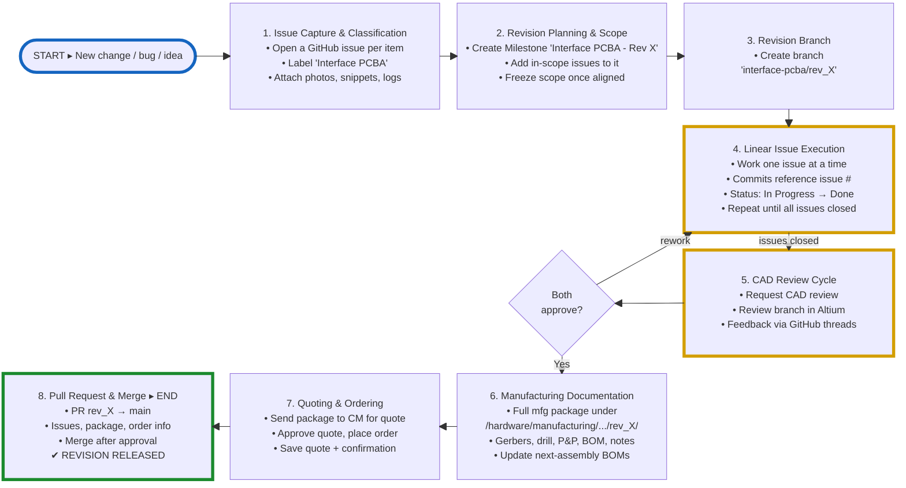

# ROADZ Interface PCBA Revision Workflow
*Proposed Process for Predictable, Traceable Hardware Updates*

This document outlines a recommended workflow for planning, executing, reviewing, and releasing revisions of the **Interface PCBA** within the ROADZ Speaker System project. The goal is to ensure consistent collaboration, clear traceability, and complete manufacturing documentation for every hardware revision.

---

## Process Overview (Quick Reference)

The diagram below summarizes the full workflow. Read the top row left to right, then down through issue execution and CAD review, and the bottom row right to left starting at step 6. Step 4 repeats until every in-scope issue is closed, and the CAD review cycle feeds back into design edits (**rework**) until both contributors approve.



---

## 1. Issue Capture & Classification

All changes, bugs, improvements, and questions should begin as GitHub issues.

**Guidelines:**
- Create a GitHub issue for each item.
  - Focus the issue on missing or erroneous functionality — describe the problem or gap, not a prescribed fix.
  - Hints toward a possible solution and supplemental information (context, constraints, prior attempts) are welcome and encouraged.
  - Avoid presuming the solution in the issue statement except where a solution is critically required (e.g. a fixed interface or regulatory constraint).
  - Scope one issue per function/problem. Sub-steps or implementation details needed to solve it are left to the engineer doing the work and should not be split into separate issues by the reporter.
  - Rationale: splitting a single problem into multiple issues that only make sense together (with the relationship held implicitly by the reporter) has previously overconstrained the solution space and led to lengthy reconciliation discussions. Keeping one issue per problem reduces confusion and review time.
- Apply labels:
  - `Interface PCBA`
- Attach supporting artifacts directly in the issue:
  - Photos
  - Schematic snippets
  - Measurements
  - Logs
  - Notes

**Purpose:**  
This becomes our shared backlog and ensures nothing gets lost in Slack or informal discussions.

---


## 2. Revision Planning & Scope Agreement

Before starting a respin, designer will review all labeled issues.

**Steps:**
- Create a GitHub Milestone for the revision (e.g. `PCBA Rev X`).
- Add all in-scope issues to the milestone.
- Agree on the scope: what is included in Rev_X and what is deferred.
- Freeze the Rev_X milestone once aligned.

**Purpose:**  
Prevents mid‑rev churn and ensures both contributors have a shared understanding of the revision’s goals.

---


## 3. Create a Dedicated Revision Branch

Create a branch specifically for the revision:

```interface-pcba/rev_X```

**Contents of this branch:**
- Schematic edits
- PCB layout changes
- Supporting design files
- Manufacturing outputs (see Section 6)

**Purpose:**  
Keeps the main branch stable and isolates all revision work.

---

## 4. Linear Issue Execution & Traceability

Work through issues one at a time.

**Best practices:**
- Each commit should reference the issue number, for example:  
  ```Fix: updated buck converter footprint (#123)```
- Update issue status as work progresses:
  - In Progress
  - Needs Review
  - Done

**Purpose:**  
Provides perfect traceability between design changes and the reasons behind them.

---

## 5. CAD Review Cycle

Once the design appears complete:

**Steps:**
- Request review from Chad.
- Chad reviews the branch directly in Altium (schematic + PCB).
- Use GitHub comments or issue threads for feedback.
- Iterate until both contributors approve the design.

**Purpose:**  
Ensures asynchronous, documented review and prevents surprises late in the process.

---

## 6. Manufacturing Documentation

When the design is approved, generate the full manufacturing package.

**Recommended folder location (inside the revision branch):**

```/hardware/manufacturing/interface-pcba/rev_X/```

**Include:**
- Schematic PDFs
- PCB PDFs
- Gerbers or ODB++
- Drill files
- Pick‑and‑place files
- BOM
- Assembly notes
- Any CM‑specific documentation
- Update next assembly BOMs

**Purpose:**  
Keeps all manufacturing outputs organized, revision‑scoped, and version‑controlled.

---

## 7. Quoting & Ordering

**Steps:**
- Send the manufacturing package to the CM for quoting.
- Review and approve the quote.
- Place the order.
- Add quote + order confirmation to the revision branch under `/hardware/manufacturing_history/interface-pcba/`.

**Purpose:**  
Maintains procurement traceability tied directly to the revision.

---

## 8. Pull Request & Merge

Open a PR from:

```interface-pcba/rev_X → main```

**PR description should include:**
- Summary of changes
- List of issues addressed
- Link to the manufacturing package folder
- Confirmation that the order has been placed

After approval, merge the PR.

**Purpose:**  
The PR becomes the canonical record of the entire revision — design, documentation, and manufacturing.

---

## Optional Enhancements

- **Revision Checklist:**  
  Add a reusable “PCBA Revision Checklist” to the repo for consistency.


---

## Summary

This workflow provides a predictable, traceable, and collaborative process for Interface PCBA revisions. It ensures that design changes, manufacturing outputs, and procurement steps are all captured in one place and tied directly to the revision branch.
