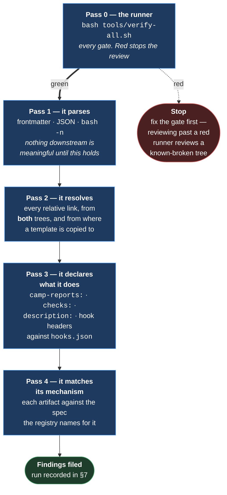
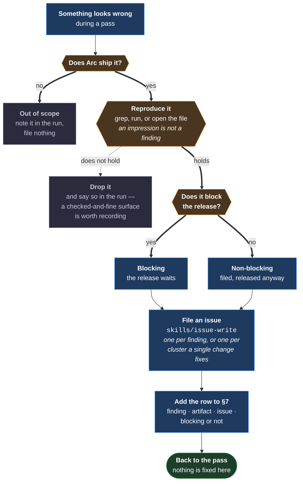

# Pre-release review

> **The process, not a report.** This document is executed. A review run appends its findings
> to [§7](#7-runs) and changes nothing else.

**Run it before every release**, against everything the plugin ships. The first run was
[#119](https://github.com/Calyx-Engineering/arc/issues/119), before `v0.1.0`.

---

## 1 Why this exists at all

**Almost nothing Arc ships has ever run.** `hooks/hooks.json` registers every hook through
`${CLAUDE_PLUGIN_ROOT}`, a path that resolves only for an installed plugin — so no hook has fired
in a live session, and nothing in the repository invokes a skill. Every acceptance criterion
written as runtime behaviour is asserted rather than observed.

**A release is the last cheap moment.** Before it, a defect is a file we own. After it, it is in
someone else's workflow, and fixing it costs a version.

---

## 2 What it covers, and what it cannot

**Read [§2.2](#22-what-a-clean-run-does-not-mean) before reporting a clean run.** A review that
does not state its boundary is read as covering everything.

### 2.1 In scope

| | |
|---|---|
| `skills/*/SKILL.md` | Every shipping skill, **and its copy under `.claude/skills/`** until the local-copy arrangement is deleted |
| `hooks/*` and `hooks/hooks.json` | Every hook, and the registration that fires it |
| `commands/*.md` | Every slash command |
| `templates/*` | Every template, checked **from where it gets copied to**, not from where it lives |
| `.claude-plugin/plugin.json` | Every field, against what an installer displays |
| `tools/*` | Only as the instrument of [pass 0](#41-pass-0--the-runner). The scripts are not the product |

### 2.2 What a clean run does not mean

> **This review establishes that each artifact is internally coherent and consistent with what
> specifies it. It establishes nothing about behaviour.**

| Not established | Why not, and what would |
|---|---|
| **A hook fires** | Nothing here runs Claude Code with the plugin installed. `tools/verify-hook.sh` executes each hook standalone against fixtures — that is the hook's logic, not its registration taking effect. **An install is the only thing that closes this** |
| **A skill is invoked** | Skill selection is the harness reading a `description:` against a live conversation. Nothing in this repository does that. A description can be checked for accuracy and never for whether it triggers |
| **A command loads** | Same. Its frontmatter can be checked; its registration cannot be exercised |
| **The manifest installs** | `plugin.json` can be valid and still describe the plugin wrongly to a marketplace |
| **A skill's rules produce the right behaviour** | Every rule is checked as text: the clause exists, in both trees, saying what its spec asks. Whether a session follows it is unobserved |

**Say this in the run's summary, not only here.** A finding count with no boundary reads as a
verdict on the release.

---

## 3 The instrument

**Run `bash tools/verify-all.sh` first.** It runs every gate this repo has — hooks, tracker
rules, the autonomy arms and skill parity — and it closes several of this review's questions
exactly rather than by eye. Its `--list` prints what it cannot cover — the same boundary as [§2.2](#22-what-a-clean-run-does-not-mean).

> **Never re-check by reading what a script checks by running.** A human pass over a gated
> surface finds nothing and costs the attention the ungated surfaces need.

---

## 4 The passes, in order



**The order is a dependency order, not a preference.** A declaration cannot be checked against a
frontmatter that does not parse, and a mechanism cannot be checked against an artifact whose links
do not resolve to the mechanism.

### 4.1 Pass 0 — the runner

```sh
bash tools/verify-all.sh          # every gate, one exit code
bash tools/verify-all.sh --list   # what it runs, and what it cannot
```

| It closes | Leaving |
|---|---|
| Every hook's own logic, against fixtures | Whether the registration fires it |
| Skill parity — both trees, the registry row, copy link depth | Whether the content is right |
| The autonomy arms — no prohibition without its auto clause | — |
| Tracker title and closing-keyword rules | — |

**A red gate stops the review.** Reviewing past it reviews a tree already known to be broken, and
every later finding is suspect.

### 4.2 Pass 1 — it parses

| Artifact | Check |
|---|---|
| Every `SKILL.md`, both trees | The frontmatter block parses as YAML, and `name:` matches the directory |
| Every `commands/*.md` | Frontmatter parses and carries a `description:` |
| Every `hooks/*` | `bash -n` is clean, **and the first line after the shebang block is the kill switch** — `[ -f "$HOME/.claude/HOOKS_OFF" ] && exit 0` |
| `hooks/hooks.json` · `.claude-plugin/plugin.json` | Valid JSON |

**The colon trap is why this pass exists.** An unquoted colon inside a `description:` made
`skills/camp`'s frontmatter fail to parse, and it shipped — found only when a later change forced
the block to be parsed rather than read.

### 4.3 Pass 2 — it resolves

**Every relative link, from the file's own location.** Three places this goes wrong and one script
does not catch:

| | |
|---|---|
| **A copy under `.claude/skills/`** | Deleted 2026-09-07 by [#142](https://github.com/Calyx-Engineering/arc/issues/142) — Arc is installed in this repository, so a copy shadows the plugin's skill rather than standing in for it. `tools/verify-skill-registry.sh` fails if one reappears |
| **A template** | Is copied somewhere else before anyone follows its links. Copy it to a scratch directory and resolve from **there** — ten template links shipped one directory too shallow because they were only ever checked in place |
| **A spec's anchor links** | `#4-three-relations-not-two` breaks silently when a heading is reworded. A link to a missing anchor renders as a link to the top of the page |

### 4.4 Pass 3 — it declares what it does

**An artifact that declares what it will report is how Arc's operation stays visible.** A wrong
declaration is worse than none: it names a report that never fires.

| Artifact | Check |
|---|---|
| Every skill with `camp-reports:` | Each name corresponds to something the body actually does |
| Every skill with `checks:` | Same, **including checks that always pass** — a list of only the failures makes a silent skill indistinguishable from a working one |
| A skill with **neither** | Deliberate, or an omission? Record which. Not every skill reports |
| Every hook's header block | Its `camp-reports:` / `checks:` / `skips:` comment lines, against what the script does |
| `hooks.json` | Each hook's event and matcher, against what the hook's own header says it is |
| Every command's `description:` | Against what the command body instructs |
| `plugin.json` | `name`, `version`, `description`, `homepage`, `repository`, `license`, `keywords` — each against what it would show an installer |

### 4.5 Pass 4 — it matches its mechanism

**The registry is the map.** [`docs/product-architecture/README.md`](../product-architecture/README.md)'s
artifact table names, for each artifact, the mechanisms it carries. For each pair:

| | |
|---|---|
| **Does the artifact carry what the mechanism assigns it?** | A spec's *Artifacts* table names what each one holds. Grep for it — do not read for a general impression |
| **Does the artifact claim more than the mechanism gives it?** | A skill describing a capability nothing specifies is either an undocumented decision or drift |
| **Do two artifacts contradict each other?** | The most expensive class and the least visible. Two skills right about different units, neither naming its unit, is the shape this repo has now hit twice |

**This is the judgement pass.** The three before it are mechanical and could become scripts; this
one is why a person runs the review.

---

## 5 A finding's route



> **Read, do not repair.** A review that fixes as it reads leaves no record of what was wrong —
> and the next reviewer cannot tell a surface that was always fine from one that was quietly
> mended. **Fixes are separate PRs.**

**The temptation is strongest on one-line fixes**, which is exactly where the record is cheapest
to lose. A typo fixed in place looks like nothing happened.

| Severity | Means |
|---|---|
| **Blocking** | A user installing the release hits it. A hook that cannot run, a skill that cannot parse, a manifest field that misdescribes the plugin |
| **Non-blocking** | Real, and survivable in the released version. Wording, a stale cross-reference, an artifact over its size limit |

**Severity is about the installed experience, not about how wrong it feels.** A whole skill
missing a `checks:` declaration is non-blocking; one unquoted colon is blocking.

---

## 6 Executing this a second time

**The document is the method; §7 is the history.** A second run repeats §4 unchanged and appends
to §7 — it does not rewrite the passes because the artifact list grew.

| | |
|---|---|
| **The passes are defined over kinds, not files** | *Every skill*, *every hook*. A new artifact is covered on the day it is added, with no edit here |
| **Compare against the previous run** | A finding that recurs after being filed and closed is a different and worse fact than a new one |
| **Amend the passes only when a class of defect escaped them** | Not when a single instance did. One missed typo is not a missing pass |

---

## 7 Runs

### 7.1 First run — 2026-08-21, before `v0.1.0`

*Recorded during [#119](https://github.com/Calyx-Engineering/arc/issues/119).*

**Scope:** 13 skills (both trees) · 4 hooks + `hooks.json` · 2 commands · 5 templates + `camp/`'s
three · `plugin.json`.

**Six findings, one blocking.** All filed, none fixed here.

| # | Finding | Where | Issue | |
|---|---|---|---|---|
| 1 | **18 template links resolve to nothing where the template lands** — and half have no correct depth, because they point into `docs/` which a consuming repo does not have | 5 templates | [#122](https://github.com/Calyx-Engineering/arc/issues/122) | **Blocking** |
| 2 | A skill's `references/` directory is not copied, so the copy's link is dead and `--check` passes | `sync-local-skills.sh` — **moot**, deleted with the copies by [#142](https://github.com/Calyx-Engineering/arc/issues/142) | [#123](https://github.com/Calyx-Engineering/arc/issues/123) | |
| 3 | The artifact table lists 11 artifacts that do not exist and omits 4 that do, with nothing marking which | product definition | [#124](https://github.com/Calyx-Engineering/arc/issues/124) | |
| 4 | Nothing reports a skill with no `camp-reports:` / `checks:` declaration. Hooks have such a reporter; skills do not | 3 skills | [#125](https://github.com/Calyx-Engineering/arc/issues/125) | |
| 5 | `camp-session-start` is a `PreToolUse` hook named for a different event. Registration is correct; the name is not | `hooks/` | [#126](https://github.com/Calyx-Engineering/arc/issues/126) | |

**Finding 1 is blocking** because `templates/camp/operating-agreement.md` is the document m43
requires a user to read and approve, and in a consuming repository every one of its eleven spec
references is dead.

> **It is not live in this repository, and that is the interesting part.** `.claude/arc/camp/`'s
> copies use `../../../docs/`, which resolves here — one level deeper than the template they came
> from. **Someone corrected the copies by hand and the template kept the wrong depth**, so every
> reader since has seen a working document and an unread template. A finding that reproduces in
> the repo would have been found years earlier; this one could only be found by resolving from the
> destination.

### Pass by pass

| Pass | Result |
|---|---|
| **0 — the runner** | Green. 8 gates, 112 cases |
| **1 — it parses** | Clean. 26 `SKILL.md` frontmatter blocks across both trees, 2 commands, 2 JSON files, `bash -n` on 4 hooks and the template. **Every hook carries the kill switch and none sets `-e`** |
| **2 — it resolves** | `skills/` source clean. **One broken link in the copies** (finding 2). **18 broken at template destinations** (finding 1) |
| **3 — it declares what it does** | Every hook's `hooks.json` event and matcher matches its own header, all four. No skill skips a check it never declares. **Three skills declare nothing** (finding 4) |
| **4 — it matches its mechanism** | Registry rows checked against the tree (finding 3). `plugin.json`'s description matches the README's six pieces, and `version` matches the release target |

### What this run did not establish

Everything in [§2.2](#22-what-a-clean-run-does-not-mean), and one thing more concrete: **no hook
has fired and no skill has been invoked.** Pass 3 verified that `hooks.json` says what the hooks
say. It did not verify that Claude Code reads it, that `${CLAUDE_PLUGIN_ROOT}` resolves, or that
any `description:` causes a skill to load. **Installing the release is the only thing that does**,
and that is the first thing to do after [#120](https://github.com/Calyx-Engineering/arc/issues/120).

### What the instrument cost, and what to keep

**Passes 1 and 2 were scripts written for this run, and they should not be.** Frontmatter parsing,
link resolution and destination resolution are mechanical, repeatable, and exactly what
`verify-all.sh` exists to hold — [#122](https://github.com/Calyx-Engineering/arc/issues/122) asks
for the destination checker as part of its fix.

**One false positive is worth recording so the next run does not re-chase it.** The first link
checker read `` `[#42](…/issues/42)` `` inside a code span in `chat-response` as a live link. **A
link checker must strip fenced blocks and inline code first** — a skill that documents link syntax
is full of link-shaped text that is not a link.
