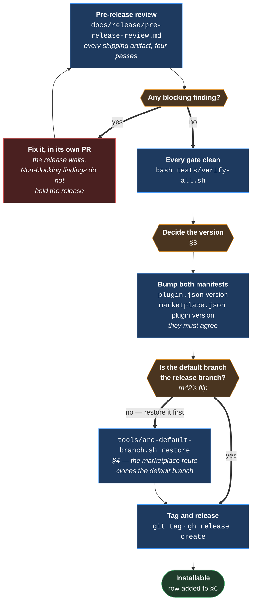
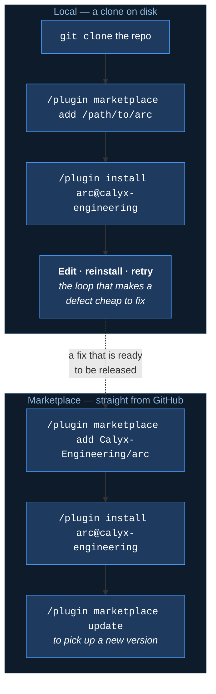

# Release process

> **The process, not a record.** This document is executed. A release appends its row to
> [§6](#6-releases) and changes nothing else.

`v0.1.0` was the first, cut during [#120](https://github.com/Calyx-Engineering/arc/issues/120).

---

## 1 What a release is

**A release is a git tag, and a marketplace entry that points at what the tag contains.** There is
no build step and no artifact to upload — Claude Code installs a plugin by cloning a repository
and reading the files.

| Piece | Where it comes from | |
|---|---|---|
| `.claude-plugin/plugin.json` | The repo | The manifest. `name` is the only required field; `version` is what tells an installed copy an update exists |
| `.claude-plugin/marketplace.json` | The repo | The catalogue. **The repo is both the marketplace and the only plugin in it** — `"source": "./"` means *the plugin is the marketplace root* |
| `skills/` · `commands/` · `hooks/hooks.json` | The repo | **Auto-discovered.** No manifest field names them, and adding one would replace the default rather than extend it |
| The tag | `git tag` | What makes a release referenceable after `main` moves on |
| The GitHub release | `gh release create` | The human-readable half — what changed, and what is known not to work |

**`docs/`, `tools/` and `templates/` ship too**, because a plugin is a whole repository. `docs/`
is what the templates' absolute links point back at.

---

## 2 Before cutting — the gate

| | |
|---|---|
| **The review is the gate, not a courtesy** | A release cut over a known blocking finding is the review not having happened. `pre-release-review.md` §5 defines blocking as *a user installing the release hits it* |
| **Non-blocking findings ship** | They are filed and they land later. Holding a release for every finding means no release |
| **Both manifests carry the version, and they must agree** | `plugin.json`'s is what an installed copy compares against; `marketplace.json`'s entry is what the catalogue advertises. A mismatch means the catalogue offers an update that installs the same thing |

---

## 3 Deciding the version

**Semantic versioning, against what a consumer's session does differently.**

| Change | Bump |
|---|---|
| A skill's rules change what an agent does, a hook denies something new, a command's behaviour changes | **Minor**, pre-1.0 |
| A hook that denied something now allows it, an artifact is removed, a skill is renamed | **Major** — but pre-1.0 this is a minor too, and the release notes must say what broke |
| Wording, a fixed link, a document that no artifact reads | **Patch** |

**Pre-1.0 the promise is that `0.x` may break.** What the release notes owe a reader is *what
changed in their session*, not a diff summary.

> **A version bump is the only signal an installed copy gets.** Claude Code compares
> `plugin.json`'s `version`; if it is unchanged, the update is skipped no matter what else moved.

---

## 4 The default branch decides what a marketplace install gets

**`"source": "./"` means the plugin is whatever the marketplace clone contains** — and
`/plugin marketplace add owner/repo` clones the **default branch**.

[m42](../product-architecture/mechanisms/m42-default-branch-flip.md) points this repository's
default branch at the live arc branch for that arc's lifetime. **While the flip is in force, a
marketplace install gets the arc branch.**

| | |
|---|---|
| **Restore the default branch before announcing a release** | `tools/arc-default-branch.sh restore`. It is already on the arc-log's close checklist; this is the second reason for it |
| **The tag alone does not fix it** | The tag is what `git` resolves; the marketplace route resolves the *default branch* unless the user pins a `ref` when adding the marketplace, which is their setting and not ours to set |
**The order, when a release lands at the end of an arc:**

| | |
|---|---|
| 1 | **Merge the arc into `main`** |
| 2 | **Restore the default branch** — `tools/arc-default-branch.sh restore` |
| 3 | **Tag, on `main`** | 
| 4 | **Announce** |

**Tag after the merge, not before.** A tag cut on the arc branch is reachable from `main` once the
arc merges, so it resolves — but the tag then names a commit that was never the default branch's
tip, and the marketplace route resolves the default branch rather than the tag. Tagging `main`
after the merge makes the two the same thing.

> **A release that is installable only if the installer knows to pin a `ref` is not installable.**

---

## 5 Installing — the two routes

**Both routes add a marketplace. They differ only in where the marketplace comes from.**

| | |
|---|---|
| **Local is documented first, and is not a lesser route** | It is what makes a fix-and-reinstall cycle seconds rather than a release. Anyone changing Arc uses it |
| **The repository is public since 2026-09-20** | Neither route needs credentials. Before that it was private, and `gh auth setup-git` was what made the marketplace route work unattended |
| **If the install summary says `Run /reload-plugins to activate.`, run it** | Otherwise the plugin is installed and not loaded |

---

## 6 Releases

| Version | Date | | |
|---|---|---|---|
| `v0.1.0` | 2026-08-21 | The first. 13 skills, 4 hooks, 2 commands, 5 templates, 9 gates | [#120](https://github.com/Calyx-Engineering/arc/issues/120) |

### What `v0.1.0` is known not to have done

**Nothing in it has run.** It is the release that makes running it possible — no hook had fired
and no skill had been invoked across three arcs when it was cut. Its own pre-release review
([#119](https://github.com/Calyx-Engineering/arc/issues/119)) says so in §2.2, and the five
non-blocking findings it filed —
[#123](https://github.com/Calyx-Engineering/arc/issues/123)–[#126](https://github.com/Calyx-Engineering/arc/issues/126)
— shipped with it.

**Installing it is the next thing, and it belongs to nobody yet.** The first install is what turns
every behavioural acceptance criterion in three arcs from asserted into observed, and it is what
unblocks [#117](https://github.com/Calyx-Engineering/arc/issues/117).

---

## 7 Related

- [`pre-release-review.md`](pre-release-review.md) — the gate this waits on
- [m42](../product-architecture/mechanisms/m42-default-branch-flip.md) — the flip §4 is about
- [`CLAUDE.md`](../../CLAUDE.md) — *Local skill copies*, and why releasing does not delete them
