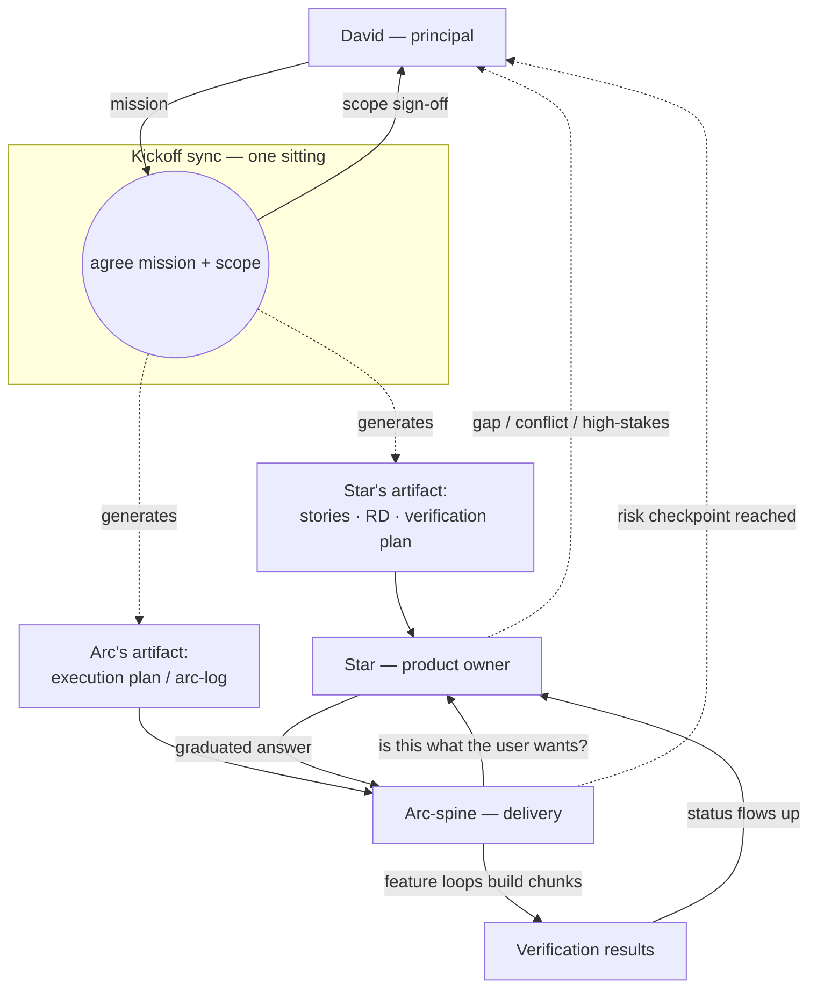

# Arc Execution & the Three-Role Workflow — OPEN DESIGN

> ## ⚠️ Mirrored file — edit both copies
>
> This file exists **identically** in two repos:
>
> - **[lodestar/docs/04-arc-execution-and-roles.md](https://github.com/Calyx-Engineering/lodestar/blob/main/docs/04-arc-execution-and-roles.md)**
> - **[arc/docs/suite-architecture/04-arc-execution-and-roles.md](https://github.com/Calyx-Engineering/arc/blob/main/docs/suite-architecture/04-arc-execution-and-roles.md)**
>
> **A change to one must be made to the other in the same session.** They are not
> allowed to drift.
>
> **Why both:** the design defines Star and the arc-spine *in relation to each other* —
> the three-role table, the kickoff diagram, and the two-artifact split all describe a
> conversation with two sides. Cutting it leaves each repo holding half of a dialogue.
>
> | Repo | Owns | Sections |
> |---|---|---|
> | **Lodestar** | Star — the requirements side | Star's functions and switches · the Star authority ladder · the RD and verification plan as artifacts |
> | **Arc** | The arc-spine — the delivery side | Checkpoints · the kickoff ritual · the execution plan and `arc-log` · failure modes |
>
> **Split it when the design converges**, not before. Splitting an open design doubles
> the places it has to settle.

> **Status: converging, not decided.** Co-developed 2026-07-21 by David and the
> TimeScope **arc-spine** (a Claude window currently running that role live), as a
> follow-on to [reference-timescope/](reference-timescope/). This proposes a second
> Lodestar capability beyond `/req` + `/rd`: an **arc** — an execution/verification
> spine — and reframes **Star** as an addressable product-owner persona. Everything
> here is a proposal to validate, not a commitment.

## The idea in one line

A **kickoff** aligns three parties — David and two agents — on one agreed scope
and generates the two artifacts the agents steer by. Then David (the *principal*,
not an artifact) steps back; **Star** owns product/user-representation and **the
arc-spine** owns delivery, and they run the effort together — pulling David in only
at pre-agreed, risk-weighted checkpoints.

## The three roles

| Actor | Role | Owns | Reference artifact |
| ---------- | ------------------------ | ------------------------------------ | ----------------------------------------------- |
| **David** | Principal / stakeholder | mission, scope sign-off, checkpoints | — (sets the north star, then steps back) |
| **Star** | Product owner / user proxy | *"is this what the user wants?"* | the requirements lens — stories, RD, verification plan |
| **Arc-spine** | Delivery lead | decomposition, sequencing, delegation | the execution plan (arc-log) |

The **kickoff is the load-bearing moment** — it's when drift is cheapest to
prevent. Both artifacts are generated together against one agreed scope; everything
downstream references what was agreed at t=0.

## Two artifacts, two owners, one whole

"Test plan / mission plan / arc-log" is really **two** artifacts — two pieces of a
single *arc definition*, split by owner, never one file:

- **Verification plan (Star's)** — the RVTM: each requirement × configuration ×
  verification method (test / analysis / inspection / demonstration) × status.
  *"What must be proven, and how."* Requirements-space. It is the **fulfillment-axis
  twin of the RD**: RD = definition lens ("what must be true"), verification plan =
  fulfillment lens ("how/when we prove it true").
- **Execution plan (arc-spine's)** — the arc-log: work chunks sized for a single
  [feature loop](reference-timescope/enforcement-and-companion-logs.md) to complete
  reliably, their sequence, the generated/split issues, and the checkpoints.
  *"What we build, in what order."* Delivery-space.

They interlock: the verification plan supplies the **acceptance** for each chunk;
the execution plan sequences the **work**; the **checkpoints are where the two
meet** and status flows back up.

## Star — functions and switches

Star is one persona with three orthogonal switches. The **posture** switch is the
safety-relevant one.

### Switches

1. **Domain** — software / firmware / hardware / product (the
   [domain switch](03-domain-switch.md)). Modulates vocabulary, configurations,
   verification methods, stakeholder emphasis — i.e. *how every function behaves*.
2. **Mode / hat** — which function (below) she is performing.
3. **Posture** — **expansive-discovery ↔ conservative-representation.** In discovery
   (soliciting, decomposing a source) she proposes freely. In representation
   (answering the arc mid-build) she is grounded and graduated — see the authority
   ladder below.

### Functions, by lifecycle phase

| Phase | Function |
| ------------- | ------------------------------------------------------------------------------------------------------------ |
| **Setup** | Init / domain onboarding — detect-or-ask domain, scaffold `docs/stories/`, write the capture-trigger line into the repo's CLAUDE.md. |
| | Question/identify the **stakeholders** for this specific application — the seed vocabulary ([02-stakeholder-taxonomy.md](02-stakeholder-taxonomy.md)) is a starting point, not closed; propose splits (e.g. a fixture table's welder vs. fixture-design engineer) and add classes as they surface. |
| **Discover** | Capture stories conversationally (the [capture trigger](reference-timescope/capture-trigger.md)). |
| | Decompose a **source** (standard / spec / datasheet / regulation) into candidate stories — the top-down seed. |
| | Author acceptance criteria + choose a **verification method** per story. |
| **Aggregate** | Generate/rebuild the **RD** (`/rd`). |
| | Generate the **verification matrix / test plan** (RVTM). |
| | Assemble **stakeholder-filtered views** (e.g. everything a Regulator or Assembler needs). |
| **Guard** | **Coverage / gap audit** — traceability: every clause / objective / issue maps to ≥1 story; flag orphans. |
| | **Consistency lint** — contradictions, duplicate requirements, stale status, dead cross-refs. |
| | **Change / scope triage** — is a change in the agreed scope? what does it supersede or conflict with? |
| **Represent** | **PO-delegate** mid-build — answer "what does the user want?" via the authority ladder. |
| | **Secretary / status keeper** — record verification results, flip matrix cells, retire superseded stories. |
| | **Kickoff facilitator** — co-generate the artifacts and represent the user during scope sign-off. |

## The safety kernel — the Star authority ladder

Star's representation is **graduated, not binary.** A binary "cite an agreed story
or escalate" rule breaks: strict enough to be safe, it either forces an exhaustive
RVTM up front (over-specified, no work saved) or bounces every micro-decision to
David (no delegation value). Three tiers, gated by **stakes × reversibility**:

| Tier | When | What Star does |
| ------------ | ----------------------------------------------------------------- | -------------------------------------------------------------------------------- |
| **Agreed** | grounded in an agreed story | answers with authority |
| **Derived** | a reasonable extrapolation *within the spirit* of agreed stories, **low-stakes & reversible** | answers, marks it **provisional**, logs the derivation + parent story, keeps the arc moving, queues it for **batch ratification** at the next checkpoint |
| **Escalate** | genuine gap, conflicts with an agreed story, **or high-stakes / irreversible** | stops and pulls David in now |

The gate between *derive* and *escalate* is **how expensive it is to be wrong.**
That single gate dissolves both failure modes: no exhaustive up-front spec (agree
the *shape*; Star extrapolates the small stuff on a visible trail), and no
escalate-everything (the middle tier absorbs routine ambiguity; only real gaps,
conflicts, and high-stakes calls reach David — batched at a checkpoint).

**It self-adjusts across domains.** Software is mostly low-stakes/reversible → Star
extrapolates freely and moves fast (not monotone). Hardware has more irreversible
calls (a PCB spin, a safety interlock) → her escalation rate is naturally higher,
which is *correct*, not over-strict. The domain switch just moves the stakes
threshold — same persona, one dial.

**Interpreting ≠ inventing.** Interpretation is *traceable* (cites its parent
story), *provisional* (marked, not `agreed`), and *cheaply reversible* (ratified in
batch). Inventing is none of those. That is the line the posture switch enforces —
Star must never invent a requirement to keep the arc unblocked. At ratification, a
derived interpretation that proves durable is **promoted to an agreed story**
(capture trigger again); trivial ones stay logged, so the requirement set accretes
only what is worth being a requirement.

**Two triggers pull David back automatically:** (1) a **gap** Star can't ground,
and (2) a **Star-vs-arc conflict** — Star says "the user needs X", the plan says "X
is out of the chunk." That disagreement is a *feature*: a cheap early warning that a
real scope decision is hiding there.

## Checkpoints — risk-weighted, not calendar-weighted

The whole value is David stepping back, which removes the corrective signal — so
**checkpoint placement is everything.** Put checkpoints right after the riskiest /
most-ambiguous chunks, not on an even cadence. The arc-spine proposes them, Star
sanity-checks for user-visible risk, David approves them at kickoff. Get this right
and 2–3 arc checkpoints can responsibly replace per-issue human testing — but only
because **traceability coverage is mechanically re-verified at each one** (semantic
completeness stays a human judgement; traceability — no orphans — is the guarantee
that earns the batching).

## The kickoff ritual (draft)

One sitting, produces two artifacts + a scope sign-off:

1. David states the **mission** (top-down: a standard/spec; or bottom-up: a bag of
   issues / a milestone).
2. Star **decomposes / reconciles** into stories and runs a **coverage audit**
   (every clause/issue → a story; gaps surfaced and filled with David).
3. Star drafts the **RD** + **verification plan** from the agreed stories.
4. Arc-spine drafts the **execution plan** — chunks sized for the feature loop,
   sequence, candidate issues (and splits of existing ones), proposed checkpoints.
5. David **signs off scope** and the checkpoints; then delegates Product Owner (PO)→Star, delivery
   →arc-spine, and steps back.

## Failure modes (named on purpose)

- **Star hallucinates requirements** — the whole game. Mitigated by the posture
  switch + the Star authority ladder (interpret with a trail, never invent).
- **Silent drift between checkpoints** — mitigated by risk-weighted checkpoints and
  status flowing up to the verification plan continuously.
- **The two plans diverge** — mitigated by the kickoff sync and re-sync at each
  checkpoint.

## First trial — dogfood small before betting big

Do **not** let the maiden voyage be a MIL-STD-461 campaign. Prove the three-role
loop on one small, fast, cheap-to-fail **software** arc first. Strong candidate:
the next **TimeScope** arc — where the arc-spine role already runs live, and where a
prior multi-issue "wave" was painful and costly. Working hypothesis: that pain came
precisely from the two things this design adds — **a kickoff sync and a standing
PO-proxy.** If so, this workflow is not only a Lodestar feature but the fix for a
known TimeScope process problem.

## Open questions

- Is the **arc** a first-class artifact type in Lodestar (its own frontmatter +
  rollup), or a `campaign`/`milestone` tag + a view? (The verification-plan output
  argues for first-class.)
- ~~How does the arc map to a **GitHub milestone**~~ — **resolved 2026-07-22 for
  this repo:** not a Milestone (its drag-reorder is UI-only, no API-exposed
  order — confirmed by direct test). Instead: `arc` label on every candidate,
  order/status in a GitHub Project (whose item position *is* API-exposed via
  `updateProjectV2ItemPosition`), numbering assigned only when an arc starts,
  sub-issues for in-arc progress. See [CLAUDE.md](../CLAUDE.md#arc-tracking-github-mechanics).
  Still open: whether this generalizes to other repos, or is Lodestar-specific
  tooling — see the "spin off arc-execution" backlog issue.
- How far does **issue-generation** go — propose drafts only, or open issues / set
  the milestone? (Lean: propose drafts, human confirms — same "never silent" stance
  as capture.)
- What is the **minimum traceability guarantee** that lets David step back from
  per-issue testing? (Draft it as an explicit checklist — the "test less often" bet
  rests on it.)
- Does Star's personality need a **defined voice/stance spec**, so her
  representation is consistent across sessions? (The persona is functional — a
  stable user-advocate viewpoint that pushes back — not decoration.)
