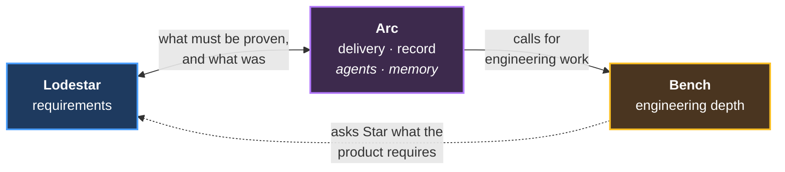

# The Calyx plugin suite

> **The authority on how the three plugins fit together.** What each owns, where the
> boundaries are, and what crosses them. Where another document disagrees about a boundary,
> this one is correct.

Three plugins, built from one retrospective. Each is useful alone, and freezing any one
leaves the others valid — the direct answer to single-track working, where products develop
in sequence with long gaps between.

| Plugin | One line | Nature |
|---|---|---|
| **[Lodestar](https://github.com/Calyx-Engineering/lodestar)** | Know what the product must be | **Invention** — nothing works yet, anywhere |
| **[Arc](../product-architecture/README.md)** | Get the work done, in order, with a record | Extraction, plus an autonomy switch |
| **[Bench](https://github.com/Calyx-Engineering/bench)** | Analyse at real engineering depth, and drive the instruments | Extraction, plus one hard build |

**Not the authority on:** what any single plugin is made of — each repo's own
`product-architecture/`.

---

## Why the suite architecture lives in the Arc repo

Arc's self-improvement piece holds the mechanisms that regenerate this architecture — the
plugin retrospective that produced it, and the transcript mining that feeds it. The
document lives beside the mechanisms that maintain it rather than in the plugin it
describes first.

**Mirrored files also live here.** A document that must exist identically in two repos is
by definition about the boundary between them, which is this folder's subject.

---

## How they fit together

**Arc calls Bench when a task needs engineering depth.** Nothing calls Arc. Lodestar and
Bench each call nothing outward, which is what lets either be published or frozen alone.

**The Arc ↔ Lodestar line is data, not dependency.** Lodestar supplies the acceptance
criteria a chunk of work must meet — what *done* means for a requirement — and receives back
whether it was actually proven, which moves the verification matrix. Arc needs Lodestar;
Lodestar never needs Arc.

**The dotted arrow is the interesting one.** Bench's engineering persona queries **Star**
for requirements rather than reading stories directly, which makes Lodestar an active
participant in delivery rather than a document store. That is a stronger product boundary
than "Arc reads Lodestar's files."

---

## Why three, not five

**The test is always-loaded-together.** Two candidate plugins failed it and were absorbed
into Arc.

### Agent orchestration is a piece of Arc, not a plugin

Scoped as `Crew` — roster, delegation tiers, waves, human gate, the wiki, transcript mining.
It failed in **both** directions:

| | |
|---|---|
| **Arc without it** | Impossible. Arc's decomposition, mining trigger and arc-tree all dispatch agents |
| **It without Arc** | Impossible. Mining is triggered by Arc's PR hook; waves and gates are arc-shaped |
| **The boundary cost was real** | Arc's mining-trigger hook exists only to call a Crew agent — a plugin crossing for one call |
| **The name was also wrong** | Too generic for a marketplace competing with finance and HR plugins |

**What survives:** delegation genuinely is repo-agnostic, and TimeScope's
`agent-process-foundation.md` was written to drop into any repo. That makes it a **portable
file**, not a separate plugin.

### Plugin self-improvement is also a piece of Arc

| | |
|---|---|
| **One agent, two filters** | Splitting by filter rather than by capability is the wrong axis |
| **Improvement happens in two places** | From the plugin repo, and live from a product repo mid-development. A separate plugin would have to load in both |
| **It is agent behavior** | Arc owns how agents work and what they remember. The wiki sets the precedent |
| **Three mechanisms do not justify a plugin** | Per-plugin tax is real; the maintenance unit is the mechanism |

**The case against is genuine:** a separate plugin would let improvement tooling version
independently of delegation. **Revisit if either stops loading with the other.**

---

## Mechanism numbering

Mechanism numbers are **unique across all three plugins.** The original retrospective
issued 1–37; Arc has since taken 38 onward.

| Range | Holder |
|---|---|
| 1–8 | Lodestar |
| 9–33 | Arc |
| 34–37 | Bench |
| 38–46 | Arc |
| **47** | **Next free** |

**Take the next free number, then update this table.** "Highest in my own table, plus one"
is wrong — it collides the moment another plugin claims one.

Numbers are never reused and never renumbered. They resolve across specs, evidence
documents and issue bodies in three repos, and a silent wrong-reference is worse than a gap.

---

## Build order

| # | | Why |
|---|---|---|
| 1 | **Arc** | Mostly extraction of what already runs. Improves the work of building everything else |
| 2 | **Lodestar** | Invention. Highest risk, and it benefits most from Arc existing |
| 3 | **Bench** | Accretes as engineering work happens; no forcing function |

**The uncomfortable part:** Lodestar is the thing most wanted, and the evidence says build
it second — capture mechanisms only work when exercised against live work, which Arc
supplies.

---

## Open questions

| Question | Notes |
|---|---|
| Does `Bench` stay right if the domain-persona pattern generalises beyond EE? | The name commits to hardware |
| Does hardware's gate latency break the human-gate model? | Arc's guided mode assumes minutes-to-hours; hardware's second gate is weeks |
| Does the product-lifetime decision register belong to Lodestar rather than Arc? | A dev-log is archival; a DDR is consulted for years |

---

## Contents

| File | What |
|---|---|
| [04-arc-execution-and-roles.md](04-arc-execution-and-roles.md) | The three-role workflow — David, Star, and the arc-spine. **Mirrored with lodestar; edit both copies in the same session** |
| [domain-engineer-persona.md](domain-engineer-persona.md) | Bench's mechanism 34. Written during the retrospective, held here until Bench's repo has a product definition to take it |
