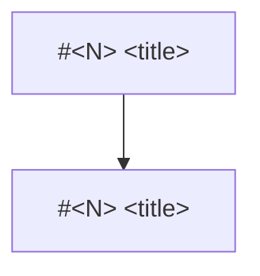

# Arc: &lt;title&gt;

> **Arc log**, not a spec. The spine above the per-issue [dev-logs](../dev-log/) — it holds
> what spans issues. Each issue keeps its own dev-log for its own *why*; this file is the
> shared north star and the live map. Keep it short and diagram-first. Skip any section that
> doesn't apply.

**Milestone:** &lt;link&gt;  ·  **Branch:** `arc/&lt;NN&gt;-&lt;slug&gt;`  ·  **Started:** &lt;YYYY-MM-DD&gt;

## Why this arc exists

The root problem no single issue owns — the reason these issues are one effort rather than a
list. Name the outcomes that drive the sequence.

## Target architecture

A Mermaid diagram of the end state. The north star every issue aims at.

## Load-bearing decisions

The choices that constrain every issue under this arc — what must not be re-litigated
per-issue. Per-issue trade-offs stay in that issue's dev-log.

## The tree

How the arc's scope actually grew. Planned issues are the roots; issues that work
*generated* hang off whatever caused them. Classify by **cause, not subject** — a doc
cleanup found while editing a diagram is spawned by that work, however unrelated it looks.

Generated from issue metadata, so regenerate rather than maintain by hand.

## Status

Live table. Move it as work lands.

| Issue | Dev-log | Status |
| :--- | :--- | :--- |
| [#&lt;N&gt;](&lt;link&gt;) &lt;title&gt; | [issue-&lt;N&gt;-&lt;slug&gt;](../dev-log/issue-&lt;N&gt;-&lt;slug&gt;.md) | not started |

**Order is discovered, not planned.** A guided arc has no waves and no parallel tracks —
build order emerges as understanding does. If a sequence *is* known up front, say so in
Load-bearing decisions rather than adding structure this table doesn't have.

## Related analysis

What K2 material this arc produced, so a fresh session knows what exists without walking the
tree. Links only. (Delete if none.)

- [&lt;topic&gt;](../arc-work/&lt;arc-slug&gt;/&lt;topic&gt;.md)

## Future capabilities — designed for, not in scope

What the architecture must not block but this arc won't build. Name the seams that keep it
cheap later. (Delete if none.)

## At arc close

- [ ] Status table reflects reality
- [ ] Tree regenerated
- [ ] K2 and K3 swept — durable product facts graduated to the wiki, ladder entries replaced
      with links rather than copies
